# Develop secure app for an Azure AD app
## Overview

This sample is a simple Azure Active Directory with web app that links to security resources for developing apps on Azure. The app implements security best practices that can help improve your application and your organization’s security posture when you develop apps on Azure.

The deployment scripts set up the infrastructure. After you run the deployment scripts, you'll need to do some manual configuration in the Azure portal to link the components and services together. 
This sample is targeted toward experienced developers on Azure who work within the retail industry and want to build a secured Azure Active Directory with secure Azure infrastructure. 


In developing and deploying this app, you'll learn how to 
- Create an Azure Key Vault instance, store, and retrieve secrets from it.
- Deploy the Azure Web App, which is dedicated isolated with front-end firewall access. 
- Create and configure an Azure Application Gateway instance with a firewall that uses OWASP Top 10 Ruleset. 
- Enable encryption of data in transit and at rest by using Azure services. 
- Set up Azure Policy and security center to evaluate the compliance. 

After you develop and deploy this app, you will have set up the following sample web app along with the configuration and security measures that are described.

## Architecture
The app is a typical n-tier application with three tiers. The front end, back end, and database layer with monitoring and secret-management components integrated are shown here:

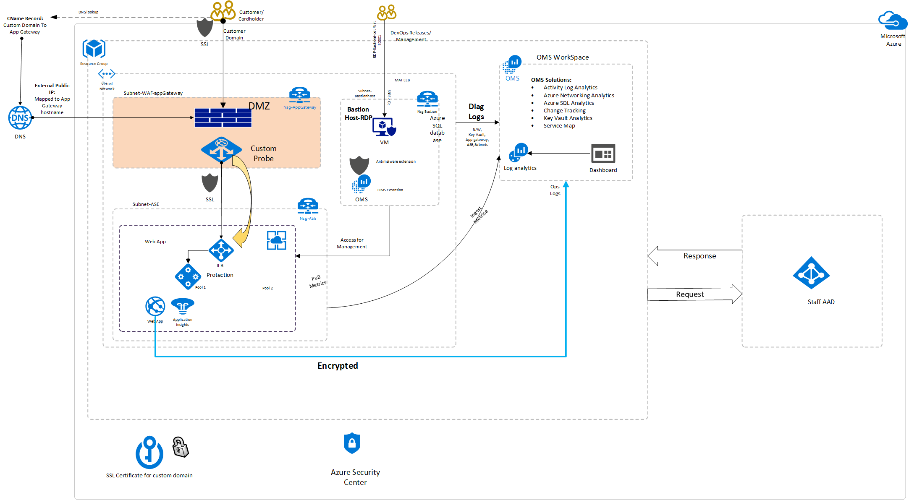

This solution uses the following Azure services. Details of the deployment architecture are in the Deployment Architecture section. 

The architecture consists of these components

- [Azure Application Gateway](../../application-gateway/index.yml). Provides the gateway and firewall for our application architecture.
- [Application Insights](../../azure-monitor/app/app-insights-overview.md). Provides an extensible Application Performance Management (APM) service on multiple platforms.
- [Azure Key Vault](../../key-vault/index.yml). Stores and encrypts our app's secrets and manages the creation of access policies around them.
- [Azure Active Directory](../../active-directory/fundamentals/active-directory-whatis.md).Provides cloud-based identity and access management service, sign in and access resources.
- [Azure Domain Name System](../../dns/dns-overview.md). Provide the service to host the domain.
- [Azure Load Balancer](../../load-balancer/load-balancer-overview.md). Provides to scale your applications and create high availability for your services.
- [Azure Web App](../../app-service/overview.md).  Provides an HTTP-based service for hosting web applications.
- [Azure Security Center](../../security-center/index.yml). provides advanced threat protection across your hybrid workloads in the cloud.
- [Azure Policy](../../governance/policy/overview.md). Provides evaluating your resources for non-compliance with assigned policies.

## Threat model
Threat modeling is the process of identifying potential security threats to your business and application and then ensuring that a proper mitigation plan is in place.

This sample used the [Microsoft Threat Modeling Tool](https://docs.microsoft.com/azure/security/azure-security-threat-modeling-tool) to implement threat modeling for the secure sample app. By diagramming the components and the data flows, you can identify issues and threats early in the development process. Time and money will be saved later by using this.

Here is the threat model for the sample app

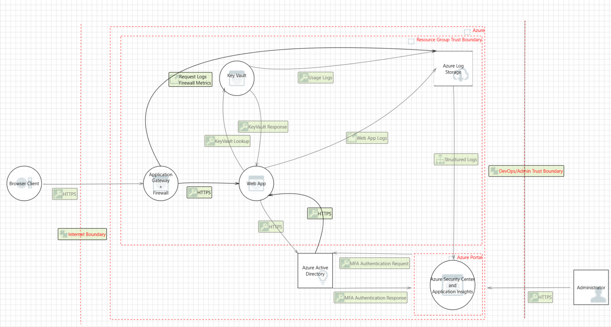

Some sample threats and potential vulnerabilities that the threat modeling tool generates are shown in the following screenshot. The threat model gives an overview of the attack surface exposed and prompts the developers to think about how to mitigate the issues.

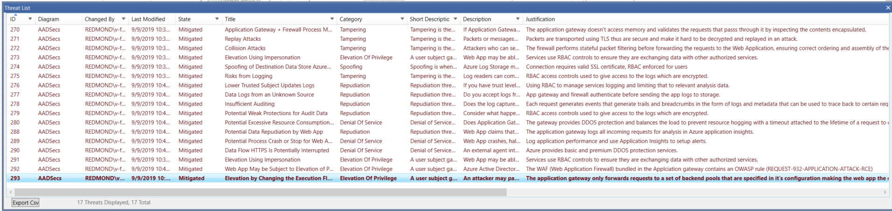

### Prerequisites
To get the application up and running, you need to install these tools:

- A code editor to modify and view the application code.[Visual Studio Code](https://code.visualstudio.com/) is an open-source option.
- [Azure CLI](https://docs.microsoft.com/cli/azure/install-azure-cli?view=azure-cli-latest&viewFallbackFrom=azure-cli-latest,) on your development computer.
- [Git](https://git-scm.com/) on your system. Git is used to clone the source code locally.
- [jq](https://stedolan.github.io/jq/), a UNIX tool for querying JSON in a user-friendly way.

You need an Azure subscription to deploy the sample app's resources. If you don't have an Azure subscription, you can [create a free account](https://azure.microsoft.com/free/) to test the sample app.

After installing these tools, you’re ready to deploy the app on Azure.

### Implementation guidance
The deployment script is one script that can be broken down into four phases. Each phase deploys and configures an Azure resource that's in the [architecture diagram](#architecture).

The four phases are

- Deploy Azure Key Vault.
- Deploy Azure Web Apps.
- Deploy Application Gateway with web application firewall.
- Configure an Azure AD with Deployed App.

Each phase builds upon the preceding one by using configuration from the previously deployed resources.

To complete the implementation steps, make sure you’ve installed the tools listed under [Prerequisites](#prerequisites).

#### Deploy Azure Key Vault
In this section, you create and deploy an Azure Key Vault instance that is used to store secrets and certificates.

After you complete the deployment, you have an Azure Key Vault instance deployed on Azure.

To deploy Azure Key Vault by using Powershell
 
1. Declare the variables for Azure Key Vault.
2. Register the Azure Key Vault provider.
3. Create the resource group for the instance.
4. Create the Azure Key Vault instance in the resource group created in step 3.

#### The below Azure AD user will have admin permissions to the Key Vault
    $keyVaultAdminUsers = @($user1,user2)

#### Register the Az Providers
    Register-AzResourceProvider -ProviderNamespace Microsoft.KeyVault

#### Create the Azure Key Vault instance
    New-AzKeyVault -Name $kvName 
                -ResourceGroupName $ResourceGroup 
                -Location 'East US'
                -EnabledForDiskEncryption

#### Add the Administrator policies to the Key Vault
    foreach ($keyVaultAdminUser in $keyVaultAdminUsers) {
    $UserObjectId = (Get-AzADUser -SearchString $keyVaultAdminUser).Id
    Set-AzKeyVaultAccessPolicy -VaultName $keyVaultName -ResourceGroupName $resourceGroupName -ObjectId $UserObjectId 
    -PermissionsToKeys all -PermissionsToSecrets all -PermissionsToCertificates all
    }

#### To create an access policy to allow a user to get and list cryptographic keys, certificates and secrets if you know the User Principal Name:
    Set-AzKeyVaultAccessPolicy -VaultName $keyVaultName 
                           -ResourceGroupName $resourceGroupName 
                           -UserPrincipalName 'user1@contoso.com 
                           -PermissionsToCertificates list, get 
                           -PermissionsToKeys list, get 
                           -PermissionsToSecrets list, get 

It's a best practice to use managed identities for Azure resources in apps that use Key Vault to access resources. Your security posture increases when access keys to Key Vault aren't stored in code or in configuration.

A root certificate is included in the container. The steps taken to obtain the certificate are

1. Download the certificate file from the [Certificate Authority](https://www.digicert.com/CACerts/BaltimoreCyberTrustRoot.crt).
2. Decode your certificate file:

   ```powershell
   openssl x509 -inform DER -in BaltimoreCyberTrustRoot.crt -text -out root.crt
   ```
This script creates an assigned identity for the App Service instance that can be used with MSI to interact with Azure Key Vault without hard coding secrets in code or configuration.

Go to the Azure Key Vault instance in the portal to authorize the assigned identity on the access policy tab.
Select **Add new access policy**. Under **Select principal**, search for the application name that is similar to the name of the App Service instance created.
A service principal attached to the application should be visible. Select it and save access policy page, as shown in the following screenshot.

Because the application only needs to retrieve keys, select the **Get** permission in the secrets options, allowing access while reducing the privileges granted.

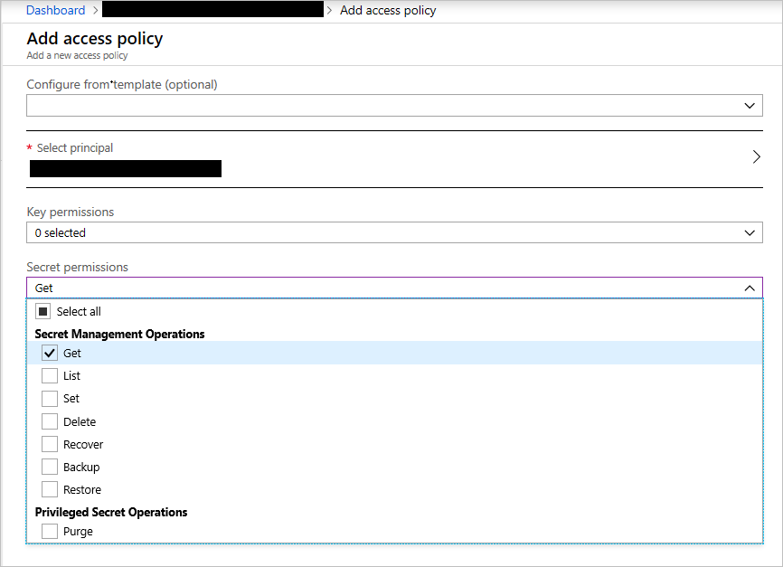

*Create a Key Vault access policy*

Save the access policy and then save the new change on the **Access Policies** tab to update the policies.

#### Deploy Application Gateway with web application firewall enabled
In web apps, it is not recommended that you expose services directly to the outside world on the internet.
Load balancing and firewall rules provide more security and control over the incoming traffic and help you manage it.

To deploy an Application Gateway instance

1. Create the resource group to house the application gateway.
2. Provision a virtual network to attach to the gateway.
3. Create a subnet for the gateway in the virtual network.
4. Provision a public IP address.
5. Provision the application gateway.
6. Enable web application firewall on the gateway.

```
Connect-AzAccount
Select-AzSubscription -SubscriptionId '$SubscriptionId'
New-AzResourceGroup -Name appgw-rg -Location "East US"

#Create a virtual network and a subnet for the application gateway

#Assign an address range for the subnet to be used for the application gateway.

$gwSubnet = New-AzVirtualNetworkSubnetConfig -Name 'appgwsubnet' -AddressPrefix 10.0.0.0/24

#Assign an address range to be used for the back-end address pool.

$nicSubnet = New-AzVirtualNetworkSubnetConfig  -Name 'appsubnet' -AddressPrefix 10.0.2.0/24

#Create a virtual network with the subnets defined in the preceding steps.

$vnet = New-AzvirtualNetwork -Name 'appgwvnet' -ResourceGroupName appgw-rg -Location "East US" -AddressPrefix 10.0.0.0/16 -Subnet $gwSubnet, $nicSubnet

#Retrieve the virtual network resource and subnet resources to be used in the steps that follow.

$vnet = Get-AzvirtualNetwork -Name 'appgwvnet' -ResourceGroupName appgw-rg
$gwSubnet = Get-AzVirtualNetworkSubnetConfig -Name 'appgwsubnet' -VirtualNetwork $vnet
$nicSubnet = Get-AzVirtualNetworkSubnetConfig -Name 'appsubnet' -VirtualNetwork $vnet


#Create a public IP address for the front-end configuration

$publicip = New-AzPublicIpAddress -ResourceGroupName appgw-rg -Name 'publicIP01' -Location "East US" -AllocationMethod Dynamic

#Create an application gateway configuration object

$gipconfig = New-AzApplicationGatewayIPConfiguration -Name 'gwconfig' -Subnet $gwSubnet

#Create a front-end IP configuration

$fipconfig = New-AzApplicationGatewayFrontendIPConfig -Name 'fip01' -PublicIPAddress $publicip

#Configure the back-end IP address pool with the IP addresses of the back-end web servers

$pool = New-AzApplicationGatewayBackendAddressPool -Name 'pool01' -BackendIPAddresses 10.0.3.11

#Configure the front-end IP port for the public IP endpoint

$fp = New-AzApplicationGatewayFrontendPort -Name 'port01'  -Port 443

#Configure the certificate for the application gateway. This certificate is used to decrypt and reencrypt the traffic on the application gateway

$passwd = ConvertTo-SecureString  "P@ssword!1" -AsPlainText -Force 
$cert = New-AzApplicationGatewaySSLCertificate -Name cert01 -CertificateFile "C:\AAD\Securities\Certificates\sslcert.com.cer" -Password $passwd 


#Create the HTTP listener for the application gateway

$listener = New-AzApplicationGatewayHttpListener -Name listener01 -Protocol Https -FrontendIPConfiguration $fipconfig -FrontendPort $fp -SSLCertificate $cert

#Upload the certificate to be used on the TLS/SSL-enabled back-end pool resources

#$authcert = New-AzApplicationGatewayAuthenticationCertificate -Name 'allowlistcert1' -CertificateFile C:\cert.cer

$trustedRootCert01 = New-AzApplicationGatewayTrustedRootCertificate -Name "test1" -CertificateFile "C:\AAD\Securities\Certificates\sslcert.com.cer"

#Configure the HTTP settings for the application gateway back end

$poolSetting01 = New-AzApplicationGatewayBackendHttpSettings -Name "setting01" -Port 443 -Protocol Https -CookieBasedAffinity Disabled -TrustedRootCertificate $trustedRootCert01 -HostName "test1"

#Create a load-balancer routing rule that configures the load balancer

$rule = New-AzApplicationGatewayRequestRoutingRule -Name 'rule01' -RuleType basic -BackendHttpSettings $poolSetting -HttpListener $listener -BackendAddressPool $pool

#Configure the instance size of the application gateway

$sku = New-AzApplicationGatewaySku -Name Standard_Small -Tier Standard -Capacity 2

#Configure the TLS/SSL policy to be used on the application gateway

$SSLPolicy = New-AzApplicationGatewaySSLPolicy -MinProtocolVersion TLSv1_2 -CipherSuite "TLS_ECDHE_ECDSA_WITH_AES_128_GCM_SHA256", "TLS_ECDHE_ECDSA_WITH_AES_256_GCM_SHA384", "TLS_RSA_WITH_AES_128_GCM_SHA256" -PolicyType Custom

$appgw = New-AzApplicationGateway -Name appgateway -SSLCertificates $cert -ResourceGroupName "appgw-rg" -Location "East US" -BackendAddressPools $pool -BackendHttpSettingsCollection $poolSetting01 -FrontendIpConfigurations $fipconfig -GatewayIpConfigurations $gipconfig -FrontendPorts $fp -HttpListeners $listener -RequestRoutingRules $rule -Sku $sku -SSLPolicy $SSLPolicy -TrustedRootCertificate $trustedRootCert01 -Verbose

```

#### Deploy Azure Web Apps
Azure App Service enables you to build and host web apps using the languages like Python, Ruby, C#, and Java. Azure also supports custom containers, which can allow virtually all programming languages to run on the Azure App Service platform.

#### Create an App Service plan in Free tier
    New-AzAppServicePlan -Name $webappname -Location $location -ResourceGroupName $webappname -Tier Free

#### Create a web app
    New-AzWebApp -Name $webappname -Location $location -AppServicePlan $webappname -ResourceGroupName $webappname

    Write-Host "Configure a CNAME record that maps $fqdn to $webappname.azurewebsites.net"
    Read-Host "Press [Enter] key when ready ..."

#### Before continuing, go to your Azure Domain Name System configuration UI for your custom domain and follow the instructions at https://aka.ms/appservicecustomdns to configure a CNAME record for the hostname "www" and point it your web app's default domain name

#### Upgrade App Service plan to Shared tier (minimum required by custom domains)
    Set-AzAppServicePlan -Name $webappname -ResourceGroupName $webappname -Tier Shared

#### Add a custom domain name to the web app
    Set-AzWebApp -Name $webappname -ResourceGroupName $webappname `-HostNames @($fqdn,"$webappname.azurewebsites.net")

## Guidance and recommendations

### Network
After you complete the deployment, you have an application gateway with web application firewall enabled.

The gateway instance exposes port 443 for HTTPS. This configuration ensures that our app is only accessible on port 443 through HTTPS.

Blocking unused ports and limiting the attack surface exposure is a security best practice.

#### Add network security groups to the App Service instance

App Service instances can be integrated with virtual networks. This integration allows them to be configured with network security group policies that manage the
app's incoming and outgoing traffic.

1. To enable this feature, on the Azure App service instance blade, under **Settings**, selects **Networking**. In the right pane, configure under **VNet Integration**.

   

    *New virtual network integration for App Service*
1. On the next page, select **Add VNET (preview)**.

1. On the next menu, select the virtual network created in the deployment that starts with `aad-vnet`. You can either create a new subnet or select an existing one.
   In this case, create a new subnet. Set the **Address range** to **10.0.3.0/24** and name the subnet **app-subnet**.

   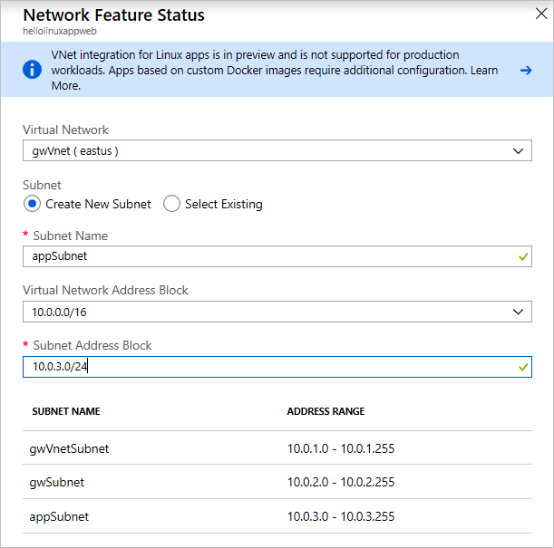

    *Virtual network configuration for App Service*

Now that you've enabled the virtual network integration, you can add network security groups to our app.

1. Use the search box, search for **network security groups**. Select **Network security groups** in the results.

    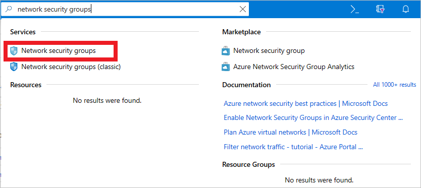

    *Search for network security groups*

2. On the next menu, select **Add**. Enter the **Name** of the NSG and the **Resource group** in which it should be located. This NSG will be applied to the application gateway's subnet.

    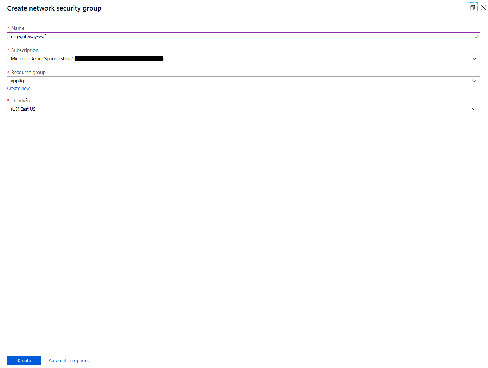

    *Create an NSG*

3. After the NSG is created, select it. In its blade, under **Settings**, select **Inbound Security rules**. Configure these settings to allow connections coming into the application gateway over port 443.

   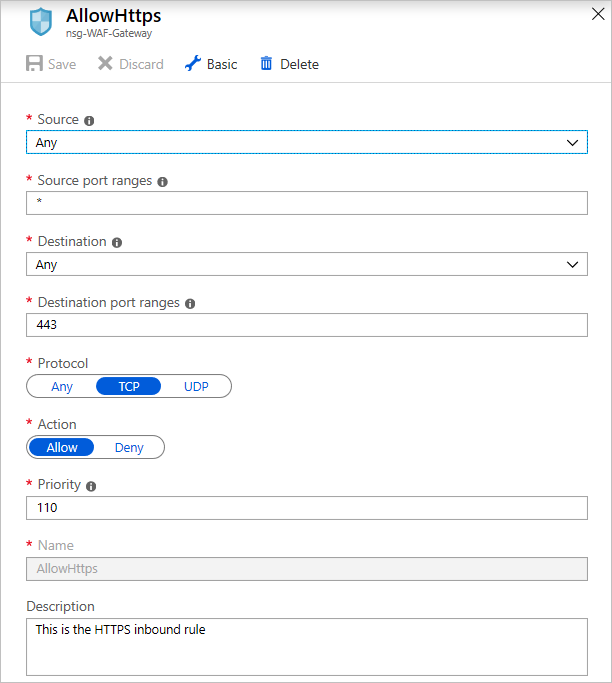

   *Configure the NSG*

4. In the outbound rules for the gateway NSG, add a rule that allows outbound connections to the App Service instance by creating a rule that targets the service tag `AppService`

   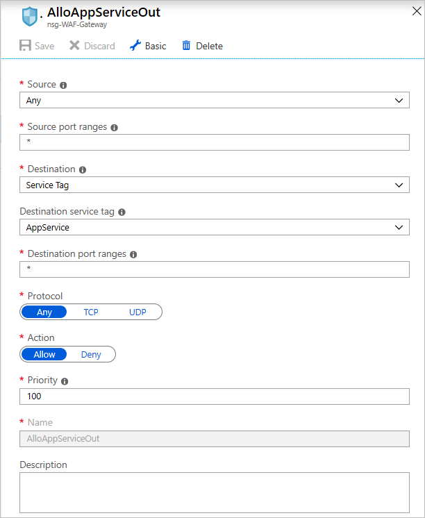

   *Add outbound rules for the NSG*

    Add another outbound rule to allow the gateway to send outbound rules to a virtual network.

   

    *Add another outbound rule*

5. On the subnets blade of the NSG, select **Associate**, select the virtual network created in the deployment, and select the gateway subnet named **gw-subnet**. The NSG is applied to the subnet.

6. Create another NSG as in the earlier step, this time for the App Service instance. Give it a name. Add the inbound rule for port 443 as you did for the application gateway NSG.

   If you have an App Service instance deployed on an App Service Environment instance, which is not the case for this app, you can add inbound rules to allow Azure Service Health probes by opening up
   ports 454-455 on the inbound security groups of your App Service NSG. Here's the configuration:

   

    *Add rules for Azure Service Health probes (App Service Environment only)*

To limit the attack surface, modify the App Service network settings to allow only the application gateway to access the application.
To apply the settings, go to App Service network tab, selecting the **IP Restrictions** tab, and creating an allow rule that allows only the application gateway’s IP to directly access the service. You can retrieve the IP address of the gateway from its overview page. On the **IP Address CIDR** tab, enter the IP address in this format: `<GATEWAY_IP_ADDRESS>/32`.


*Allow only the gateway IP to access the App Service*

### Azure Domain Name System 
The Azure Domain Name System, or Azure Domain Name System, is responsible for translating (or resolving) a website or service name to its IP address. Azure Domain Name System(https://docs.microsoft.com/azure/dns/dns-overview) is a hosting service for Domain Name System domains that provides name resolution using 
Azure infrastructure. By hosting domains in Azure, users can manage Domain Name System records using the same credentials, APIs, tools, and billing as other Azure services. Azure Domain Name System also supports private Domain Name System domains.

### Azure Disk Encryption
Azure Disk Encryption leverages the BitLocker feature of Windows to provide volume encryption for data disks. The solution integrates with Azure Key Vault to help control and manage the disk-encryption keys.

### Identity management
The following technologies provide capabilities to manage access to cardholder data in the Azure environment
- Azure Active Directory is Microsoft's multi-tenant cloud-based directory and identity management service. All users for this solution are created in Azure Active Directory, including users accessing the Azure WebApp.
- Azure role-based access control enables administrators to define fine-grained access permissions to grant only the amount of access that users need to perform their jobs. Instead of giving every user unrestricted permission for Azure resources, administrators can allow only certain actions for accessing cardholder data. Subscription access is limited to the subscription administrator.
- Azure Active Directory Privileged Identity Management enables customers to minimize the number of users who have access to certain information such as cardholder data. Administrators can use Azure Active Directory Privileged Identity Management to discover, restrict, and monitor privileged identities and their access to resources. This functionality can also be used to enforce on-demand, just-in-time administrative access when needed.
- Azure Active Directory Identity Protection detects potential vulnerabilities affecting an organization's identities, configures automated responses to detected suspicious actions related to an organization's identities, and investigates suspicious incidents to take appropriate action to resolve them.
### Secrets management
The solution uses Azure Key Vault for the management of keys and secrets. Azure Key Vault helps safeguard cryptographic keys and secrets used by cloud applications and services. The following Azure Key Vault capabilities help customers protect and access such data
   - Advanced access policies are configured on a need basis.
   - Key Vault access policies are defined with minimum required permissions to keys and secrets.
   - All keys and secrets in Key Vault have expiration dates.
   - All keys in Key Vault are protected by specialized hardware security modules. The key type is a hardware security module (HSM) Protected 2048-bit RSA Key.
   - With Key Vault, you can encrypt keys and secrets (such as authentication keys, storage account keys, data encryption keys, .PFX files, and passwords) by using keys that are   protected by hardware security modules (HSMs). 
   - Use Role-Based Access Control (RBAC) to assign permissions to users, groups, and applications at a certain scope.     
   - Use Key Vault to manage your TLS certificates with autorenewal. 
   - Diagnostics logs for Key Vault are enabled with a retention period of at least 365 days.
   - Permitted cryptographic operations for keys are restricted to the ones required.
### Azure Security Center
With Azure Security Center, customers can centrally apply and manage security policies across workloads, limit exposure to threats, and detect and respond to attacks. Additionally, 
   - Azure Security Center accesses existing configurations of Azure services to provide configuration and service recommendations to help improve security posture and protect data.
   - Azure Security Center uses a variety of detection capabilities to alert customers of potential attacks targeting their environments. These alerts contain valuable information about what triggered the alert, the resources targeted, and the source of the attack. Azure Security Center has a set of predefined security alerts, which are triggered when a threat, or suspicious activity takes place. Custom alert rules in Azure Security Center allow customers to define new security alerts based on data that is already collected from their environment.
   - Azure Security Center provides prioritized security alerts and incidents, making it simpler for customers to discover and address potential security issues. A threat intelligence report is generated for each detected threat to assist incident response teams in investigating and remediating threats.
### Azure Application Gateway 
   The architecture reduces the risk of security vulnerabilities using an Azure Application Gateway with a web application firewall configured, and the OWASP ruleset enabled. Additional capabilities include
   - End-to-end TLS.
   - Disable TLS v1.0 and v1.1.
   - Enable TLSv1.2.
   - Web application firewall (prevention mode).
   - Prevention mode with OWASP 3.0 ruleset.
   - Enable diagnostics logging.
   - Custom health probes.
   - Azure Security Center and an Azure Advisor provide additional protection and notifications. Azure Security Center also provides a reputation system.
### Logging and auditing
Azure services extensively log system and user activity, as well as system health:
   - Activity logs: [Activity logs](https://docs.microsoft.com/azure/monitoring-and-diagnostics/monitoring-overview-activity-logs) provide insight into operations performed on resources in a subscription. Activity logs can help determine an operation's initiator, time of occurrence, and status.
   - Diagnostic logs: [Diagnostic logs](https://docs.microsoft.com/azure/monitoring-and-diagnostics/monitoring-overview-of-diagnostic-logs) include all logs emitted by every resource. These logs include Windows event system logs, Azure Storage logs, Key Vault audit logs, and Application Gateway access and Firewall logs. All diagnostic logs write to a centralized and encrypted Azure storage account for archival. The retention is user-configurable, up to 730 days, to meet organization-specific retention requirements.
### Azure Monitor logs
   These logs are consolidated in [Azure Monitor logs](https://azure.microsoft.com/services/log-analytics/) for processing, storing, and dashboard reporting. Once collected, the data is organized into separate tables for each data type within Log Analytics workspaces, which allows all data to be analyzed together regardless of its original source. Furthermore, Azure Security Center integrates with Azure Monitor logs allowing customers to use Kusto queries to access their security event data and combine it with data from other services.

   The following Azure [monitoring solutions](https://docs.microsoft.com/azure/log-analytics/log-analytics-add-solutions) are included as a part of this architecture

   - [Active Directory Assessment](https://docs.microsoft.com/azure/log-analytics/log-analytics-ad-assessment): The Active Directory Health Check solution assesses the risk and health of server environments on a regular interval and provides a prioritized list of recommendations specific to the deployed server infrastructure.
   - [Agent Health](https://docs.microsoft.com/azure/operations-management-suite/oms-solution-agenthealth): The Agent Health solution reports how many agents are deployed and their geographic distribution, as well as how many agents, which are unresponsive and the number of agents, which are submitting operational data.
   - [Activity Log Analytics](https://docs.microsoft.com/azure/log-analytics/log-analytics-activity): The Activity Log Analytics solution assists with analysis of the Azure activity logs across all Azure subscriptions for a customer.
### Azure Monitor
   [Azure Monitor](https://docs.microsoft.com/azure/monitoring-and-diagnostics/)helps users track performance, maintain security, and identify trends by enabling organizations to audit, create alerts, and archive data, including tracking API calls in their Azure resources.
### Application Insights 
   [Application Insights](https://docs.microsoft.com/azure/application-insights/app-insights-overview) is an extensible Application Performance Management service for web developers on multiple platforms. Application Insights detects performance anomalies and customers can use it to monitor the live web application. It includes powerful analytics tools to help customers diagnose issues and to understand what users actually do with their app. It's designed to help customers continuously improve performance and usability.

### Azure Key Vault
   Create a vault for the organization in which to store keys, and maintain accountability for operational tasks like below

   - Data stored in Key Vault includes   
   - Application insight key
   - Data Storage Access key
   - Connection string
   - Data table name
   - User Credentials
   - Advanced access policies are configured on a need basis
   - Key Vault access policies are defined with minimum required permissions to   keys and secrets
   - All keys and secrets in Key Vault have expiration dates
   - All keys in Key Vault are protected by hardware security module (HSM) [Key Type = hardware security module (HSM) Protected       
     2048-bit RSA Key]
   - All users/identities are granted minimum required permissions using Role-Based Access Control (RBAC)
   - Applications do not share a Key Vault unless they trust each other and they need access to the same secrets at runtime
   - Diagnostics logs for Key Vault are enabled with a retention period of at least 365 days.
   - Permitted cryptographic operations for keys are restricted to the ones required

### VPN and ExpressRoute
   A secure VPN tunnel or [ExpressRoute](https://docs.microsoft.com/azure/expressroute/expressroute-introduction) needed to be configured by securely establishing a connection to the resources deployed as a part of this PaaS web application reference architecture. By appropriately setting up a VPN or ExpressRoute, customers can add a layer of protection for data in transit.

   By implementing a secure VPN tunnel with Azure, a virtual private connection between an on-premises network and an Azure Virtual Network can be created. This connection takes place over the Internet and allows customers to securely "tunnel" information inside an encrypted link between the customer's network and Azure. Site-to-Site VPN is a secure, mature technology that has been deployed by enterprises of all sizes for decades. The IPsec tunnel mode is used in this option as an encryption mechanism.

   Because traffic within the VPN tunnel does traverse the Internet with a site-to-site VPN, Microsoft offers another, even more secure connection option. Azure ExpressRoute is a dedicated WAN link between Azure and an on-premises location or an Exchange hosting provider. As ExpressRoute connections do not go over the Internet, these connections offer more reliability, faster speeds, lower latencies, and higher security than typical connections over the Internet. Furthermore, because this is a direct connection of customer's telecommunication provider, the data does not travel over the Internet and therefore is not exposed to it.

   Best practices for implementing a secure hybrid network that extends an on-premises network to Azure are [available](https://docs.microsoft.com/azure/architecture/reference-architectures/dmz/secure-vnet-hybrid).

#### Implement Azure Active Directory OIDC

1. To clone the source code repository, use this Git command

 ``` git
 git clone https://github.com/Azure-Samples/AAD-Security
   ```
## Update the redirect URLs
1.	Navigate back to the Azure portal. In the left-hand navigation pane, select the Azure Active Directory service, and then select App registrations.
2.	In the resultant screen, select the WebApp-OpenIDConnect-DotNet-code-v2 application.
3.	In the Authentication tab
    o	In the Redirect URIs section, select Web in the combo-box and add the following redirect URIs.
    `https://WebApp-OpenIDConnect-DotNet-code-v2-contoso.azurewebsites.net`
    `https://WebApp-OpenIDConnect-DotNet-code-v2-contoso.azurewebsites.net/signin-oidc`
    o	In the Advanced settings section set Logout URL to `https://WebApp-OpenIDConnect-DotNet-code-v2-contoso.azurewebsites.net/signout-oidc`
4.	In the Branding tab
        o	Update the Home page URL to the address of your app service, for example `https://WebApp-OpenIDConnect-DotNet-code-v2-contoso.azurewebsites.net`.
        o	Save the configuration.
5.	If your application calls a web api, make sure to apply the necessary changes on the project appsettings.json, so it calls the published API URL instead of localhost.
Publishing the sample
    1.	From the Overview tab of the App Service, download the publish profile by clicking the Get publish profile link and save it. Other deployment mechanisms, such as from source control, can also be used.
    2.	Switch to Visual Studio and go to the WebApp-OpenIDConnect-DotNet-code-v2 project. Right click on the project in the Solution Explorer and select Publish. Click Import Profile on the bottom bar, and import the publish profile that you downloaded earlier.
    3.	Click on Configure and in the Connection tab, update the Destination URL so that it is an https in the home page url, for example `https://WebApp-OpenIDConnect-DotNet-code-v2-contoso.azurewebsites.net`. Click Next.
    4.	On the Settings tab, make sure Enable Organizational Authentication is NOT selected. Click Save. Click on Publish on the main screen.
    5.	Visual Studio will publish the project and automatically open a browser to the URL of the project. If you see the default web page of the project, the publication was successful.
#### Implement Multi-Factor Authentication for Azure Active Directory
   Administrators need to ensure that the subscription accounts in the portal are protected. The subscription is vulnerable to attacks because it manages the resources that you created. To protect the subscription, enable Multi-Factor Authentication on the **Azure Active Directory** tab of the subscription.

   An Azure AD operates based on policies that are applied to a user or groups of users that fit a certain criteria.
   Azure creates a default policy specifying that administrators need two-factor authentication to sign in to the portal.
   After enabling this policy, you might be prompted to sign out and sign back in to the Azure portal.

To enable MFA for admin sign-ins

   1. Go to the **Azure Active Directory** tab in the Azure portal
   2. Under the security category, select conditional access. You see this screen

       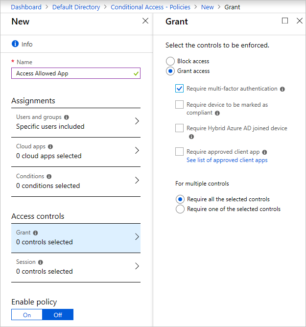

If you can't create a new policy

   1. Go to the **MFA** tab.
   2. Select an Azure AD Premium **Free trial** link to subscribe to the free trial.

   

Return to the conditional access screen.

   1. Select the new policy tab.
   2. Enter the policy name.
   3. Select the users or groups for which you want to enable MFA.
   4. Under **Access controls**, select the **Grant** tab and then select **Require multi-factor authentication** (and other settings if you want).

   

   You can enable the policy by selecting the check box at the top of the screen or do so on the **Conditional Access** tab. When the policy is enabled, users need MFA to sign in to the portal.

   There's a baseline policy that requires MFA for all Azure administrators. You can enable it immediately in the portal. Enabling this policy might invalidate the current session and force you to sign in again.

   If the baseline policy isn't enabled
   1.	Select **Require MFA for admins**.
   2.	Select **Use policy immediately**.

   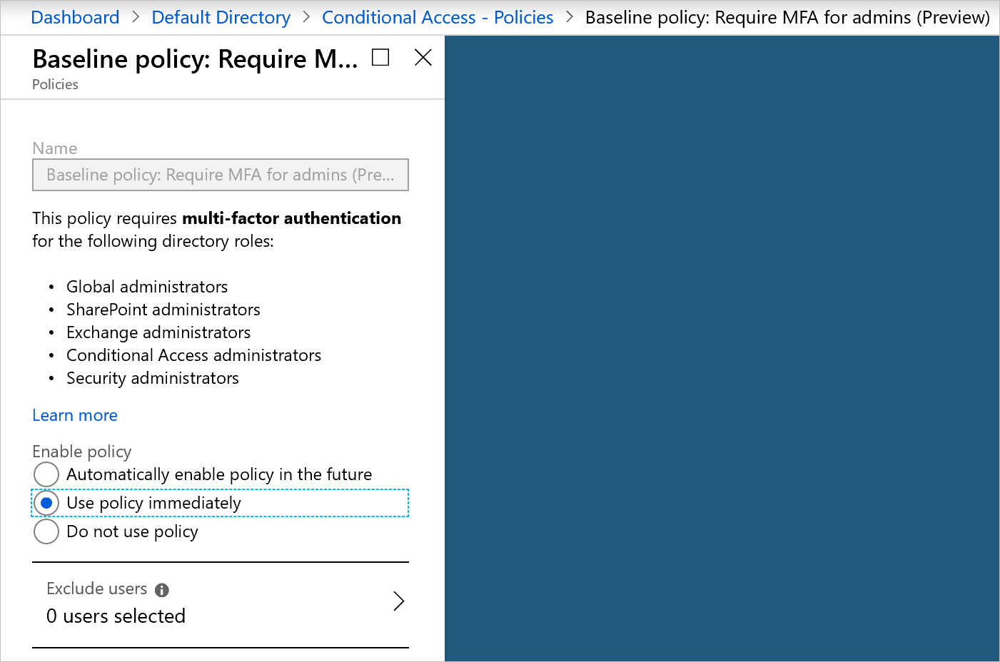

#### Use Azure Sentinel to monitor apps and resources

   As an application grows, it becomes difficult to aggregate all the security signals and metrics received from resources and make them useful in an action-oriented way.

   Azure Sentinel is designed to collect data, detect the types of threats possible, and provide visibility into security incidents.
   While it waits for manual intervention, Azure Sentinel can rely on pre-written playbooks to kick off alerts and incident management processes.

   The sample app is composed of several resources that Azure Sentinel can monitor.
   To set up Azure Sentinel, you first need to create a Log Analytics workspace that stores all the data collected from the various resources.

To create this workspace

   1. In the search box in the Azure portal, search for **Log Analytics**. Select **Log Analytics workspaces**.

   

   *Search for Log Analytics workspaces*

   2. On the next page, select **Add** and then provide a name, resource group, and location for the workspace.
   

   *Create a Log Analytics workspace*

   3. Use the search box to search for **Azure Sentinel**.

   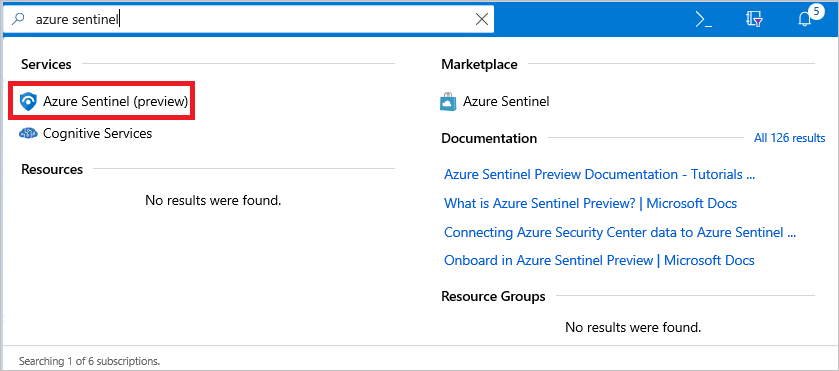

   *Search for Azure Sentinel*

   4. Select **Add** and then select the Log Analytics workspace that you created earlier.

   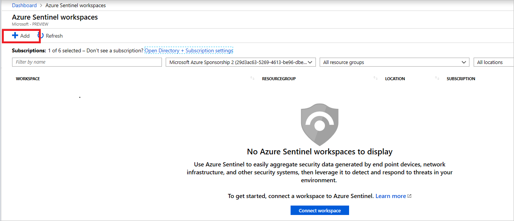

   *Add a Log Analytics workspace*

   5. On the **Azure Sentinel - Data connectors** page, under **Configuration**, select **Data connectors**. You see an array of Azure services that you can link to the Log Analytics storage instance for analysis in Azure Sentinel.

   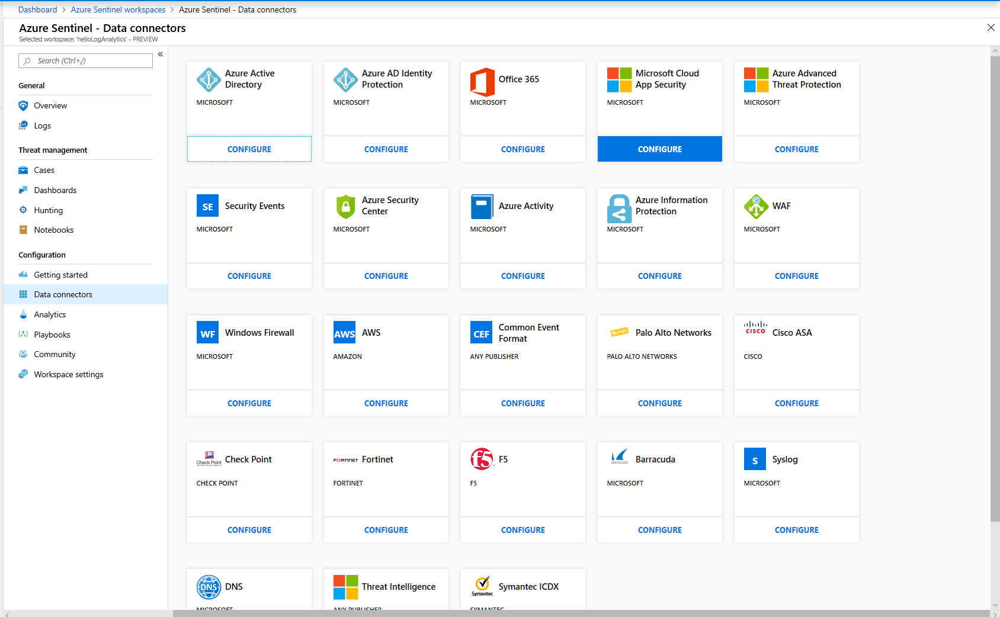

      *Add a data connector to Azure Sentinel*

   For example, to connect the application gateway, take these steps:

   1. Open the Azure Application Gateway instance blade.
   2. Under **Monitoring**, select **Diagnostic settings**.
   3. Select **Add diagnostic setting**.

   
         
   *Add Application Gateway diagnostics*

   4. On the **Diagnostic settings** page, select the Log Analytics workspace that you created and then select all the metrics that you want to collect and send to Azure Sentinel. Select **Save**.

   


## Cost considerations
   If you don't already have an Azure account, you can create a free one. Go to the [free account page](https://azure.microsoft.com/free/) to get started, see what you can do with a free Azure account, and learn which products are free for 12 months.

   To deploy the resources in the sample app with the security features, you need to pay for some premium features. As the app scales and the free tiers and trials offered by Azure need to be upgraded to meet application requirements, your costs might increase. Use the Azure [pricing calculator](https://azure.microsoft.com/pricing/calculator/) to estimate your costs.

## Next steps
   The following articles can help you design, develop, and deploy secure applications.

- [Design](secure-design.md)
- [Develop](secure-develop.md)
- [Deploy](secure-deploy.md)
