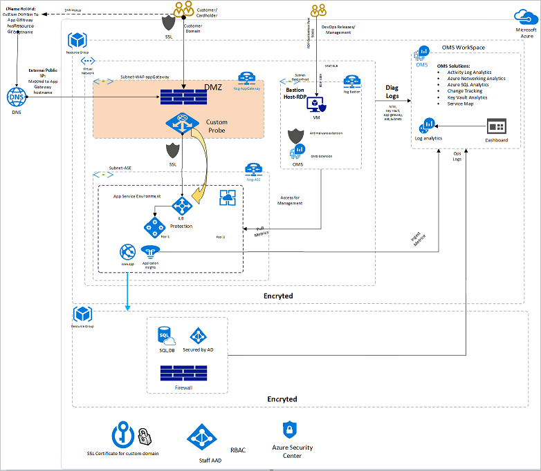
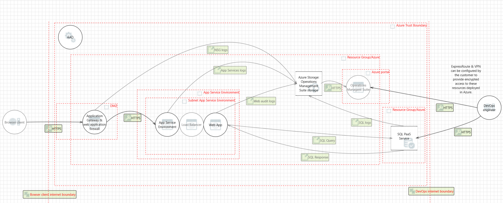
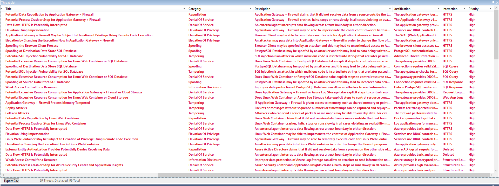
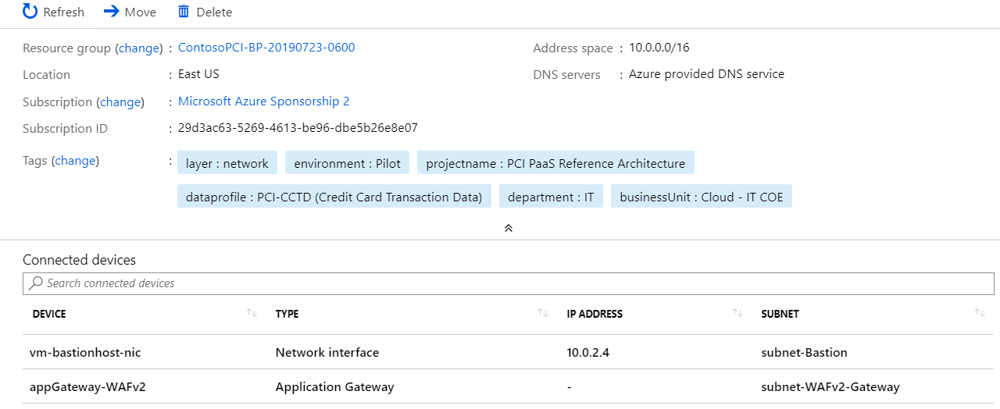
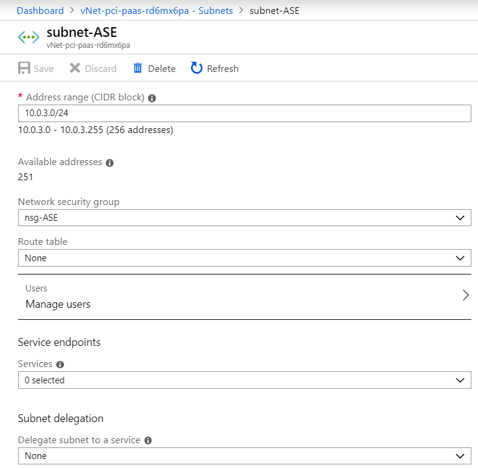
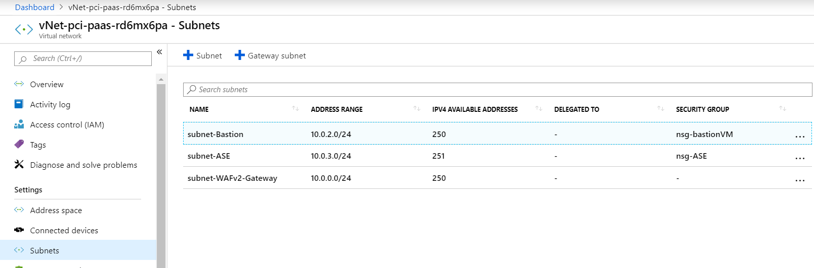

# Develop a secure infrastructure for a PCI app

## Overview

This secure infrastructure for a Payment Card Industry (PCI) app provides guidance for the deployment of a Payment Card Industry platform as a service (PaaS) environment suitable for the collection, storage, and retrieval of cardholder data. This solution automates deployment and configuration of Azure resources for a common reference architecture, demonstrating ways in which customers can meet specific security and compliance requirements and serves as a foundation for customers to build and configure their own solutions on Azure. The solution implements a subset of requirements similar to Payment Card Industry Data Security Standards (PCI DSS 3.2).

This sample automatically deploys a PaaS web application reference architecture with pre-configured security controls to help customers achieve compliance similar to PCI DSS 3.2 requirements. The solution consists of Azure Resource Manager templates and PowerShell scripts that guide resource deployment and configuration.

You should follow the steps described in this article sequentially to ensure that the application components are configured properly. The database, Azure App Service, Azure Key Vault instance, and Azure Application Gateway instance, depend on each other.

The deployment scripts set up the infrastructure. After you run the deployment scripts, you'll need to do some manual configuration in the Azure portal to link the components and services together.

This sample is targeted toward experienced developers on Azure who work within the retail industry and want to build a retail app with secure Azure infrastructure.

> [!NOTE]
> This architecture is intended to serve as a foundation for customers to adjust to their specific requirements and should not be used as-is in a production environment.

Deploying an application into this environment without modification is not sufficient to completely meet the requirements of PCI DSS 3.2. Note the following:

- This architecture provides a baseline to help customers use Azure in a PCI DSS 3.2 compliant manner.
- Customers are responsible for conducting appropriate security and compliance assessment of any solution built using this architecture, as requirements may vary based on the specifics of each customer's implementation.

In developing and deploying this app, you learn how to:

- Create an Azure Key Vault instance and store and retrieve secrets from it.
- Deploy Azure Database for Azure SQL, set up secure data, and authorize access to it.
- Deploy the Azure web app with App Service environment which is a dedicated isolated with front-end firewall access.
- Create and configure an Azure Application Gateway instance with a firewall that uses [OWASP Top 10 Ruleset](https://coreruleset.org/).
- Enable encryption of data in transit and at rest by using Azure services.
- Set up Azure Policy and Azure Blueprints to evaluate the compliance.

After you develop and deploy this app, you will have set up the following sample web app along with the configuration and security measures that are described.

## Architecture diagram and components
The app is a typical n-tier application with three tiers. The front end, back end, and database layer with monitoring and secret-management components integrated are shown here:

The architecture consists of these components:

- [App Service Environment v2](https://docs.microsoft.com/azure/app-service/environment/intro/). Provides the App Service Environment and load balancer for our application architecture.
- [Azure Application Gateway](https://docs.microsoft.com/azure/application-gateway/). Provides the gateway and firewall for our application architecture.
- [Application Insights](https://docs.microsoft.com/azure/azure-monitor/app/app-insights-overview). Provides an extensible Application Performance Management (APM) service on multiple platforms.
- [Azure Key Vault](https://docs.microsoft.com/azure/key-vault/). Stores and encrypts our app's secrets and manages the creation of access policies around them.
- [Azure Active Directory](https://docs.microsoft.com/azure/active-directory/fundamentals/active-directory-whatis/).Provides cloud-based identity and access management service, sign in, and access resources.
- [Azure DNS](https://docs.microsoft.com/azure/dns/dns-overview). Provides the service to host the domain.
- [Azure Load Balancer](https://docs.microsoft.com/azure/load-balancer/load-balancer-overview/). Scales your applications and creates high availability for your services
- [Azure Storage](https://docs.microsoft.com/azure/storage/common/storage-introduction/). Provides solution for modern data storage scenarios.
- [Azure Web App](https://docs.microsoft.com/azure/app-service/overview/).  Provides an HTTP-based service for hosting web applications.
- [Azure Database for AzureSQL](https://docs.microsoft.com/azure/sql-database/sql-database-technical-overview/). Securely stores our app's data.
- [Azure Blueprints](https://docs.microsoft.com/azure/governance/blueprints/overview/). Provides specifications and compliance with certain standards and requirements.
- [Azure Security Center](https://docs.microsoft.com/azure/security-center/)
- [Azure Policy](https://docs.microsoft.com/azure/governance/policy/overview). Evaluates your resources for non-compliance with assigned policies.

## Threat model
Threat modeling is the process of identifying potential security threats to your business and application and then ensuring that a proper mitigation plan is in place.

This sample used the [Microsoft Threat Modeling Tool](https://docs.microsoft.com/azure/security/azure-security-threat-modeling-tool) to implement threat modeling for the secure sample app. By diagramming the components and the data flows, you can identify issues and threats early in the development process. This saves time and money later.

This is the threat model for the sample app:

Some sample threats and potential vulnerabilities that the threat modeling tool generates are shown in the following screenshot. The threat model gives an overview of the attack surface exposed and prompts the developers to think about how to mitigate the issues.

For example, SQL injection in the preceding threat model output is mitigated by sanitizing user inputs and by using stored functions in Azure Database for PostgreSQL. This mitigation prevents arbitrary execution of queries during data reads and writes.

Developers improve the overall security of the system by mitigating each of the threats in the threat model output.

## Deployment
### Prerequisites
To get the application up and running, you need to install these tools:

- A code editor to modify and view the application code. [Visual Studio Code](https://code.visualstudio.com/) is an open-source option.
- [Azure CLI](https://docs.microsoft.com/cli/azure/install-azure-cli?view=azure-cli-latest&viewFallbackFrom=azure-cli-latest) on your development computer.
- [Git](https://git-scm.com/) on your system. Git is used to clone the source code locally.
- [jq](https://stedolan.github.io/jq/), a UNIX tool for querying JSON in a user-friendly way.

This sample is composed of JSON configuration files and PowerShell scripts that are handled by Azure Resource Manager's API service to deploy resources within Azure. Detailed deployment instructions are available [here](https://github.com/Azure-Samples/pci-paas-webapp-ase-sqldb-appgateway-keyvault-oms-AzureRM).

#### Quickstart

1.	Clone or download [this](https://github.com/Azure-Samples/pci-paas-webapp-ase-sqldb-appgateway-keyvault-oms-AzureRM.git) GitHub repository to your local workstation.
2.	Review 0-Setup-AdministrativeAccountAndPermission.md and run the provided commands.
3.	Deploy a test solution with Contoso sample data or pilot an initial production environment.

    This script deploys Azure resources for a demonstration of a web store using Contoso sample data.

In this example you run the deployment script that deploys the web app onto App Service and creates the resources.

There are many ways to deploy apps on Azure, including:

- Azure Resource Manager templates
- PowerShell
- Azure CLI
- Azure portal
- Azure DevOps

## Guidance and recommendations

### Network
The architecture defines a private Virtual Network with an address space of 10.200.0.0/16.
 

### Network security groups
Network security groups(https://docs.microsoft.com/azure/virtual-network/virtual-networks-nsg) contain Access Control Lists (ACLs) that allow or deny traffic within a virtual network. Network security groups can be used to secure traffic at a subnet or individual VM level. The
following network security groups exist:

- 1 network security group for Application Gateway
- 1 network security group for App Service Environment
- 1 network security group for Azure SQL Database
- 1 network security group for bastion host

Each of the Network security groups has specific ports and protocols open so that the solution can work securely and correctly. In addition, the following configurations are enabled for each network security group:

- Diagnostic logs and events(https://docs.microsoft.com/azure/virtual-network/virtual-network-nsg-manage-log) are enabled and stored in a storage account
- Azure Monitor logs are connected to the network security group's diagnostics(https://github.com/krnese/AzureDeploy/blob/master/AzureMgmt/AzureMonitor/nsgWithDiagnostics.json)

### NSG Config
NSG config for App Service Environment should be configured as shown in the image below.

 

Each subnet is associated with its corresponding network security group.

### Config
Subnets are configured as shown in the image below.
 

### Azure DNS
The Domain Name System (DNS) is responsible for translating (or resolving) a website or service name to its IP address. [Azure DNS](https://docs.microsoft.com/azure/dns/dns-overview) is a hosting service for DNS domains that provides name resolution using Azure infrastructure. By hosting domains in Azure, users can manage DNS records using the same credentials, APIs, tools, and billing as other Azure services. Azure DNS also supports private DNS domains.

### Protect data
To help protect data in the cloud, you need to account for the possible states in which your data can occur, and what controls are available for that state. Best practices for Azure data security and encryption relate to the following data states:

- At rest: This includes all information storage objects, containers, and types that exist statically on physical media, whether magnetic or optical disk.
- In transit: When data is being transferred between components, locations, or programs, it’s in transit. Examples are transfer over the network, across a service bus (from on-premises to cloud and vice-versa, including hybrid connections such as ExpressRoute), or during an input/output process.

### Azure Storage
To meet encrypted data at rest requirements, all [Azure Storage](https://azure.microsoft.com/services/storage/) uses Azure Key Vault to maintain control of keys that access and encrypt the data. This helps protect and safeguard cardholder data in support of organizational security commitments and compliance requirements defined by PCI DSS 3.2.

### Azure Disk Encryption
Azure Disk Encryption leverages the BitLocker feature of Windows to provide volume encryption for data disks. The solution integrates with Azure Key Vault to help control and manage the disk-encryption keys.

### Azure SQL Database
The Azure SQL Database instance uses the following database security measures:

- [Active Directory authentication and authorization](https://docs.microsoft.com/azure/sql-database/sql-database-aad-authentication) enables identity management of database users and other Microsoft services in one central location.
- [SQL database auditing](https://docs.microsoft.com/azure/sql-database/sql-database-auditing-get-started/) tracks database events and writes them to an audit log in an Azure storage account.
- Azure SQL Database is configured to use [transparent data encryption](https://docs.microsoft.com/sql/relational-databases/security/encryption/transparent-data-encryption-azure-sql), which performs real-time encryption and decryption of the database, associated backups, and transaction log files to protect information at rest. Transparent data encryption provides assurance that stored data has not been subject to unauthorized access.
- [Firewall rules](https://docs.microsoft.com/azure/sql-database/sql-database-firewall-configure) prevent all access to database servers until proper permissions are granted. The firewall grants access to databases based on the originating IP address of each request.
- [SQL Threat Detection](https://docs.microsoft.com/azure/sql-database/sql-database-threat-detection-get-started) enables the detection and response to potential threats as they occur by providing security alerts for suspicious database activities, potential vulnerabilities, SQL injection attacks, and anomalous database access patterns.
- [Encrypted Columns](https://docs.microsoft.com/azure/sql-database/sql-database-always-encrypted-azure-key-vault) ensure that sensitive data never appears as plaintext inside the database system. After enabling data encryption, only client applications or application servers with access to the keys can access plaintext data.
- [SQL Database dynamic data masking](https://docs.microsoft.com/azure/sql-database/sql-database-dynamic-data-masking-get-started) limits sensitive data exposure by masking the data to non-privileged users or applications. Dynamic data masking can automatically discover potentially sensitive data and suggest the appropriate masks to be applied. This helps to identify and reduce access to data such that it does not exit the database via unauthorized access. Customers are responsible for adjusting dynamic data masking settings to adhere to their database schema.

### Identity management
The following technologies provide capabilities to manage access to cardholder data in the Azure environment:

- Azure Active Directory is Microsoft's multi-tenant cloud-based directory and identity management service. All users for this solution are created in Azure Active Directory, including users accessing the Azure SQL Database.
- Authentication to the application is performed using Azure Active Directory. For more information, see [Integrating applications with Azure Active Directory](https://docs.microsoft.com/azure/active-directory/manage-apps/plan-an-application-integration). Additionally, the database column encryption uses Azure Active Directory to authenticate the application to Azure SQL Database. For more information, see [how to protect sensitive data in Azure SQL Database](https://docs.microsoft.com/azure/sql-database/sql-database-security-overview).
- Azure role-based access control enables administrators to define fine-grained access permissions to grant only the amount of access that users need to perform their jobs. Instead of giving every user unrestricted permission for Azure resources, administrators can allow only certain actions for accessing cardholder data. Subscription access is limited to the subscription administrator.
- Azure Active Directory Privileged Identity Management enables customers to minimize the number of users who have access to certain information such as cardholder data. Administrators can use Azure Active Directory Privileged Identity Management to discover, restrict, and monitor privileged identities and their access to resources. This functionality can also be used to enforce on-demand, just-in-time administrative access when needed.
- Azure Active Directory Identity Protection detects potential vulnerabilities affecting an organization's identities, configures automated responses to detected suspicious actions related to an organization's identities, and investigates suspicious incidents to take appropriate action to resolve them.

### Secrets management
The solution uses Azure Key Vault for the management of keys and secrets. Azure Key Vault helps safeguard cryptographic keys and secrets used by cloud applications and services. The following Azure Key Vault capabilities help customers protect and access such data:

- Advanced access policies are configured on a need basis.
- Key Vault access policies are defined with minimum required permissions to keys and secrets.
- All keys and secrets in Key Vault have expiration dates.
- All keys in Key Vault are protected by specialized hardware security modules. The key type is an HSM Protected 2048-bit RSA Key.
- With Key Vault, you can encrypt keys and secrets (such as authentication keys, storage account keys, data encryption keys, .PFX files, and passwords) by using keys that are protected by hardware security modules (HSMs)
- Use RBAC to assign permissions to users, groups, and applications at a certain scope.
- Use Key Vault to manage your TLS certificates with auto-renewal.
- Diagnostics logs for Key Vault are enabled with a retention period of at least 365 days.
- Permitted cryptographic operations for keys are restricted to the ones required.

### Azure Security Center
With Azure Security Center, customers can centrally apply and manage security policies across workloads, limit exposure to threats, and detect and respond to attacks. Additionally, Azure Security Center accesses existing configurations of Azure services to provide configuration and service recommendations to help improve security posture and protect data.

Azure Security Center uses a variety of detection capabilities to alert customers of potential attacks targeting their environments. These alerts contain valuable information about what triggered the alert, the resources targeted, and the source of the attack. Azure Security Center has a set of predefined security alerts, which are triggered when a threat, or suspicious activity takes place. Custom alert rules in Azure Security Center allow customers to define new security alerts based on data that is already collected from their environment.

Azure Security Center provides prioritized security alerts and incidents, making it simpler for customers to discover and address potential security issues. A threat intelligence report is generated for each detected threat to assist incident response teams in investigating and remediating threats.

### Azure Application Gateway
The architecture reduces the risk of security vulnerabilities using an Azure Application Gateway with a web application firewall configured, and the OWASP ruleset enabled. Additional capabilities include:

- End-to-end-SSL
- Disable TLS v1.0 and v1.1
- Enable TLSv1.2
- Web application firewall (prevention mode)
- Prevention mode with OWASP 3.0 ruleset
- Enable diagnostics logging
- Custom health probes
- Azure Security Center and Azure Advisor provide additional protection and notifications. Azure Security Center also provides a reputation system.

### Logging and auditing
Azure services extensively log system and user activity, as well as system health:

- [Activity logs](https://docs.microsoft.com/azure/monitoring-and-diagnostics/monitoring-overview-activity-logs) provide insight into operations performed on resources in a subscription. Activity logs can help determine an operation's initiator, time of occurrence, and status.
- [Diagnostic logs](https://docs.microsoft.com/azure/monitoring-and-diagnostics/monitoring-overview-of-diagnostic-logs) include all logs emitted by every resource. These logs include Windows event system logs, Azure Storage logs, Key Vault audit logs, and Application Gateway access and Firewall logs. All diagnostic logs write to a centralized and encrypted Azure storage account for archival. The retention is user-configurable, up to 730 days, to meet organization-specific retention requirements.

### Azure Monitor logs
These logs are consolidated in [Azure Monitor logs](https://azure.microsoft.com/services/log-analytics/) for processing, storing, and dashboard reporting. Once collected, the data is organized into separate
tables for each data type within Log Analytics workspaces, which allows all data to be analyzed together regardless of its original source. Furthermore, Azure Security Center integrates with Azure Monitor logs
allowing customers to use Kusto queries to access their security event data and combine it with data from other services.

The following Azure [monitoring solutions](https://docs.microsoft.com/azure/log-analytics/log-analytics-add-solutions) are included as a part of this architecture:

- [Active Directory Assessment](https://docs.microsoft.com/azure/log-analytics/log-analytics-ad-assessment): The Active Directory Health Check solution assesses the risk and health of server environments on a regular interval and provides a prioritized list of recommendations specific to the deployed server infrastructure.
- [SQL Assessment](https://docs.microsoft.com/azure/log-analytics/log-analytics-sql-assessment): The SQL Health Check solution assesses the risk and health of server environments on a regular interval and provides customers with a prioritized list of recommendations specific to the deployed server infrastructure.
- [Agent Health](https://docs.microsoft.com/azure/operations-management-suite/oms-solution-agenthealth): The Agent Health solution reports how many agents are deployed and their geographic distribution, as well as how many agents are unresponsive and the number of agents which are submitting operational data.
- [Activity Log Analytics](https://docs.microsoft.com/azure/log-analytics/log-analytics-activity): The Activity Log Analytics solution assists with analysis of the Azure activity logs across all Azure subscriptions for a customer.

### Azure Monitor
[Azure Monitor](https://docs.microsoft.com/azure/monitoring-and-diagnostics/) helps users track performance, maintain security, and identify trends by enabling organizations to audit, create alerts, and archive data, including tracking API calls in their Azure resources.

### Application Insights
[Application Insights](https://docs.microsoft.com/azure/application-insights/app-insights-overview) is an extensible Application Performance Management service for web developers on multiple platforms. Application Insights detects performance anomalies and customers can use it to monitor the live web application. It includes powerful analytics tools to help customers diagnose issues and to understand what users actually do with their app. It's designed to help customers continuously improve performance and usability.

### Azure Key Vault
Create a vault for the organization in which to store keys, and maintain accountability for operational tasks like below:

- Data stored in Key Vault includes:

   - Application insight key
   - Data Storage Access key
   - Connection string
   - Data table name
   - User Credentials

- Advanced access policies are configured on a need basis
- Key Vault access policies are defined with minimum required permissions to keys and secrets
- All keys and secrets in Key Vault have expiration dates
- All keys in Key Vault are protected by HSM [Key Type = HSM Protected 2048-bit RSA Key]
- All users/identities are granted minimum required permissions using Role-Based Access Control (RBAC)
- Applications do not share a Key Vault unless they trust each other and they need access to the same secrets at runtime
- Diagnostics logs for Key Vault are enabled with a retention period of at least 365 days.
- Permitted cryptographic operations for keys are restricted to the ones required

### VPN and ExpressRoute
A secure VPN tunnel or [ExpressRoute](https://docs.microsoft.com/azure/expressroute/expressroute-introduction) needs to be configured to securely establish a connection to the resources deployed as a part of this PaaS web application reference architecture. By appropriately setting up a VPN or ExpressRoute, customers can add a layer of protection for data in transit.

By implementing a secure VPN tunnel with Azure, a virtual private connection between an on-premises network and an Azure Virtual Network can be created. This connection takes place over the Internet and allows customers to securely "tunnel" information inside an encrypted link between the customer's network and Azure. Site-to-Site VPN is a secure, mature technology that has been deployed by enterprises of all sizes for decades. The IPsec tunnel mode is used in this option as an encryption mechanism.

Because traffic within the VPN tunnel does traverse the Internet with a site-to-site VPN, Microsoft offers another, even more secure connection option. Azure ExpressRoute is a dedicated WAN link between Azure and an on-premises location or an Exchange hosting provider. As ExpressRoute connections do not go over the Internet, these connections offer more reliability, faster speeds, lower latencies, and higher security than typical connections over the Internet. Furthermore, because this is a direct connection of customer's telecommunication provider, the data does not travel over the Internet and therefore is not exposed to it.

Best practices for implementing a secure hybrid network that extends an on-premises network to Azure are [available](https://docs.microsoft.com/azure/architecture/reference-architectures/dmz/secure-vnet-hybrid).

## Cost considerations
If you don't already have an Azure account, you can create a free one. Go to the [free account page](https://azure.microsoft.com/free/) to get started, see what you can do with a free Azure account, and learn which products are free for 12 months.

To deploy the resources in the sample app with the security features, you need to pay for some premium features. As the app scales and the free tiers and trials offered by Azure need to be upgraded to meet application requirements, your costs might increase. Use the Azure [pricing calculator](https://azure.microsoft.com/pricing/calculator/) to estimate your costs.

## Next steps
The following articles can help you design, develop, and deploy secure applications.

- [Design](secure-design.md)
- [Develop](secure-develop.md)
- [Deploy](secure-deploy.md)
