# Develop a secure web app

This sample is a simple Python app that displays a web page containing links to security resources for developing apps on Azure. The app implements security best practices that can help improve your application and your organization's security posture when you develop apps on Azure.

You should follow the steps described in this article sequentially to ensure that the application components are configured properly. The database, Azure App Service, Azure Key Vault instance, and Azure Application Gateway instance, depend on each other.

The deployment scripts set up the infrastructure. After you run the deployment scripts, you'll need to do some manual configuration in the Azure portal to link the components and services together.

The sample app is targeted toward beginners developing applications on Azure who want to implement security measures in their applications.

In developing and deploying this app, you'll learn how to:

- Create an Azure Key Vault instance, store and retrieve secrets from it.
- Deploy Azure Database for PostgreSQL, set up secure passwords and authorize access to it.
- Run an Alpine Linux container on Azure Web Apps for Linux and enable managed identities for Azure resources.
- Create and configure an Azure Application Gateway instance with a firewall that uses [OWASP Top 10 Ruleset](https://coreruleset.org/).
- Enable encryption of data in transit and at rest by using Azure services.

After you develop and deploy this app, you will have set up the following sample web app along with the configuration and security measures that are described.

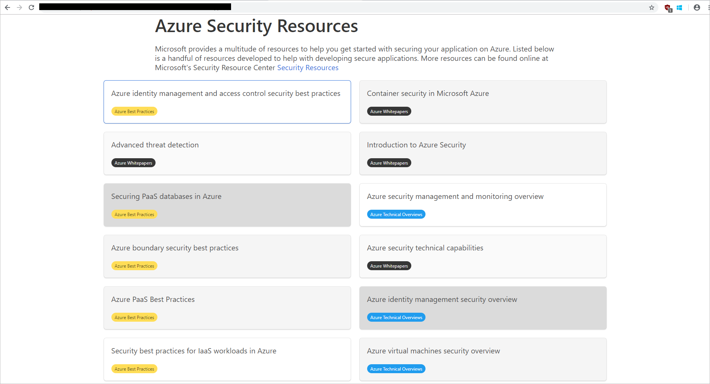

## Architecture

The app is a typical n-tier application with three tiers. The front end, back end, and database layer with monitoring and secret-management components integrated are shown here:

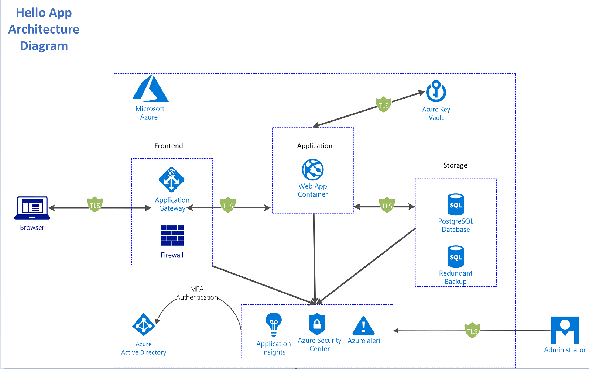

The architecture consists of these components:

- [Azure Application Gateway](../../application-gateway/index.yml). Provides the gateway and firewall for our application architecture.
- [Azure Web Apps on Linux](../../app-service/containers/app-service-linux-intro.md). Provides the container runtime to run the Python app in a Linux environment.
- [Azure Key Vault](../../key-vault/index.yml). Stores and encrypts our app's secrets and manages the creation of access policies around them.
- [Azure Database for PostgreSQL](https://azure.microsoft.com/services/postgresql/). Securely stores our app's data.
- [Azure Security Center](../../security-center/index.yml) and [Azure Application Insights](../../azure-monitor/app/app-insights-overview.md). Provides monitoring and alerts on the operation of our app.

## Threat model

Threat modeling is the process of identifying potential security threats to your business and application and then ensuring that a proper mitigation plan is in place.

This sample used the [Microsoft Threat Modeling Tool](threat-modeling-tool.md) to implement threat modeling for the secure sample app. By diagramming the components and the data flows, you can identify issues and threats early in the development process. This saves time and money later.

This is the threat model for the sample app:

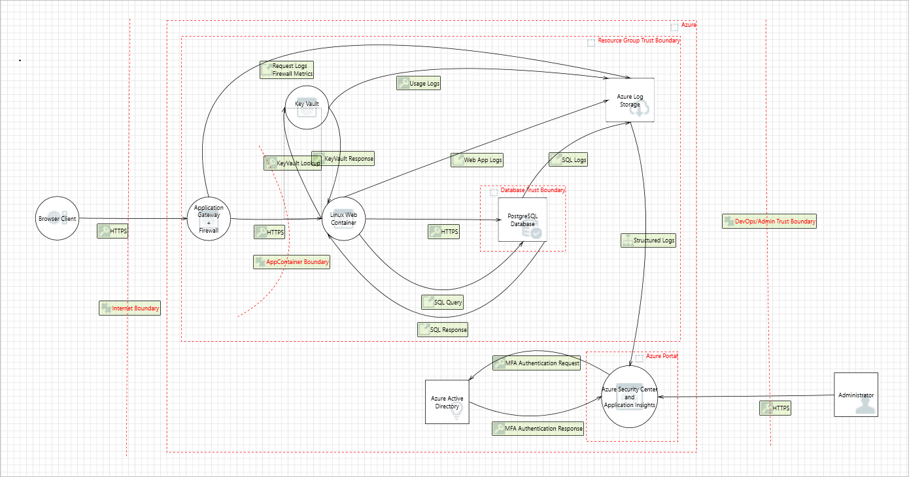

Some sample threats and potential vulnerabilities that the threat modeling tool generates are shown in the following screenshot. The threat model gives an overview of the attack surface exposed and prompts the developers to think about how to mitigate the issues.


For example, SQL injection in the preceding threat model output is mitigated by sanitizing user inputs and by using stored functions in Azure Database for PostgreSQL. This mitigation prevents arbitrary execution of queries during data reads and writes.

Developers improve the overall security of the system by mitigating each of the threats in the threat model output.

## Deployment

The following options let you run Linux on Azure App Service:

- Choose a container from the list of prebuilt Microsoft containers on Azure that have been created with supporting technologies (Python, Ruby, PHP, Java, Node.js, .NET Core).
- Use a custom-built container. Select your own container registries as the source of the image and build upon the many available technologies that support HTTP.

In this example, you'll run the deployment script that'll deploy the webapp onto App Service and create the resources.

The app can use the different deployment models shown below:

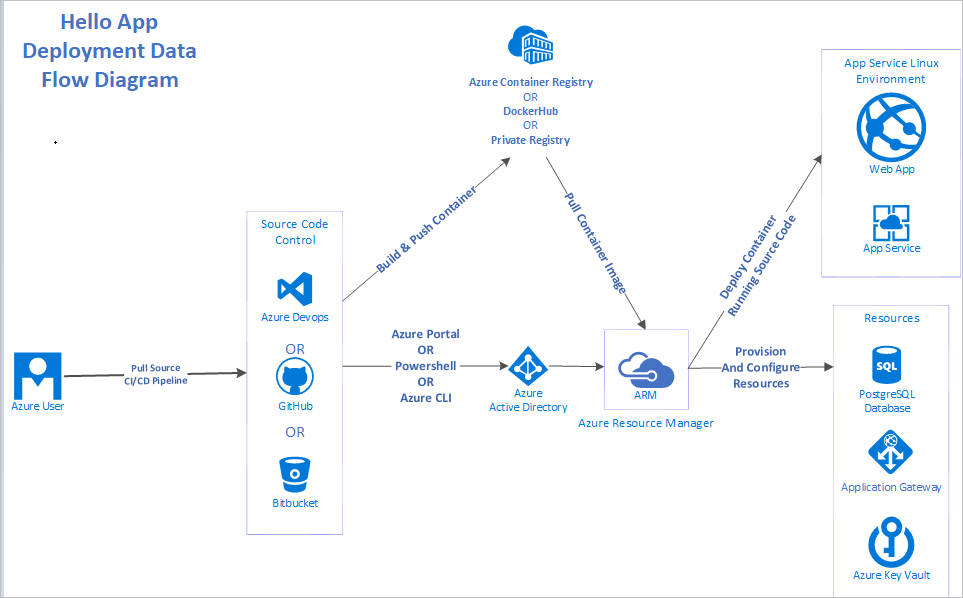

There are many ways to deploy apps on Azure, including:

- Azure Resource Manager templates
- PowerShell
- Azure CLI
- Azure portal
- Azure DevOps

This application used:

- [Docker](https://docs.docker.com/) to create and build the container images.
- [Azure CLI](https://docs.microsoft.com/cli/azure/install-azure-cli?view=azure-cli-latest) for deployment.
- [Docker Hub](https://hub.docker.com/) as the container registry.

## Security considerations

### Network

The sample app uses end-to-end TLS/SSL encryption for in-transit data flowing into and out of the network. The gateway is configured with a self-signed certificate.
> [!IMPORTANT]
> A self-signed certificate is used in this demonstration. In a production environment, you should obtain certificates from a verified Certificate Authority (CA).

The application firewall also inspects incoming traffic and alerts admins when malicious traffic is detected in the network traffic.
Application Gateway mitigates the possibility for DDoS and SQL injection threats discovered in the threat model.

### Identity

To sign in to the portal, the sample app uses Multi-Factor Authentication for Azure Active Directory (Azure AD) administrators who are assigned access to the resources.
The sample app uses managed identities to gain permissions to read and retrieve secrets from Azure Key Vault, ensuring the app doesn't need to hard code credentials and tokens to read the secrets. Azure AD automatically creates the service principals that the app needs to read and modifies the secrets when managed identities are used.

Managed identities for Azure resources and MFA make it harder for adversaries to gain privilege and escalate their privileges in the system. This threat was pointed out in the threat model.
The app uses OAuth, which allows users registered in the OAuth application to sign in to the app.

### Storage

Data in the PostgreSQL database is encrypted at rest automatically by Azure Database for PostgreSQL. The database authorizes the App Service IP addresses so that only the deployed App Service web app can access the database resources with the right authentication credentials.

### Logging and auditing

The app implements logging by using Application Insights to track metrics, logs and exceptions that occur. This logging provides enough app metadata to inform developers and operations team members on the status of the app. It also provides enough data to backtrack in case of security incidents.

## Cost considerations

If you don't already have an Azure account, you can create a free one. Go to the [free account page](https://azure.microsoft.com/free/) to get started, see what you can do with a free Azure account, and learn which products are free for 12 months.

To deploy the resources in the sample app with the security features, you need to pay for some premium features. As the app scales and the free tiers and trials offered by Azure need to be upgraded to meet application requirements, your costs might increase. Use the Azure [pricing calculator](https://azure.microsoft.com/pricing/calculator/) to estimate your costs.

## Deploy the solution

### Prerequisites

To get the application up and running, you need to install these tools:

- A code editor to modify and view the application code.[Visual Studio Code](https://code.visualstudio.com/) is an open source option.
- [Azure CLI](/cli/azure/install-azure-cli) on your development computer.
- [Git](https://git-scm.com/) on your system. Git is used to clone the source code locally.
- [jq](https://stedolan.github.io/jq/), a UNIX tool for querying JSON in a user-friendly way.

You need an Azure subscription to deploy the sample app's resources. If you don't have an Azure subscription, you can [create a free account](https://azure.microsoft.com/free/) to test the sample app.

After installing these tools, you're ready to deploy the app on Azure.

### Environment setup

Run the deployment scripts to set up the environment and subscription:

1. To clone the source code repository, use this Git command:

   ```shell
   git clone https://github.com/Azure-Samples/sample-linux-python-app tutorial-project
   ```

2. To move into the directory, use this command:

   ```shell
   cd tutorial-project/scripts
   ```

3. There are files in the scripts folder that are specific to the platform you're using (Windows or Linux). As the Azure CLI has already been installed, sign in to the Azure account at the command prompt by running this Azure CLI command:

   ```azurecli-interactive
   az login
   ```

The browser will open, sign in with your credentials. After signing in, you can start to deploy the resources from the command prompt.

The deployment scripts `deploy-powershell.ps1` and `deploy-bash.sh` contain code that deploys the entire application.
To deploy the solution:

1. If you are on PowerShell run the `deploy-powershell.ps1` file by typing `./deploy-powershell.ps1 REGION RESOURCE_GROUP_NAME` replacing the region and resource group name with suitable Azure regions and a name for the resource group
2. If you are on Linux run the `deploy-bash.sh` file by typing `/deploy-bash.sh REGION RESOURCE_GROUP_NAME`, you may have to make the file executable by typing `chmod +x deploy-bash.sh`

The following examples showcase snippets of the key components. You can deploy the examples individually or with the rest of the components by running the deploy files.

### Implementation guidance

The deployment script is one script that can be broken down into four phases. Each phase deploys and configures an Azure resource that's in the [architecture diagram](#architecture).

The four phases are:

- Deploy Azure Key Vault.
- Deploy Azure Database for PostgreSQL.
- Deploy Azure Web Apps on Linux.
- Deploy Application Gateway with web application firewall.

Each phase builds upon the preceding one by using configuration from the previously deployed resources.

To complete the implementation steps, make sure you've installed the tools listed under [Prerequisites](#prerequisites).

#### Deploy Azure Key Vault

In this section, you create and deploy an Azure Key Vault instance that is used to store secrets and certificates.

After you complete the deployment, you have an Azure Key Vault instance deployed on Azure.

To deploy Azure Key Vault by using Azure CLI:

1. Declare the variables for Azure Key Vault.
2. Register the Azure Key Vault provider.
3. Create the resource group for the instance.
4. Create the Azure Key Vault instance in the resource group created in step 3.

   ```powershell-interactive

    function Get-Hash() {
        return (New-Guid).Guid.Split('-')[4]
    }

   az provider register -n Microsoft.KeyVault

   # Create the Azure Key Vault instance
   Write-Host "Creating Azure Key Vault instance: $($kvName)"
   az keyvault create --name $kvName `
       --resource-group $ResourceGroup `
       --location $Location `
       --verbose

   # Generate usernames and passwords using system functions and environment variables
   Write-Host "Generating PostgreSQL username and password"
   $pgUsername = "$($env:Username)$(Get-Hash)"
   $pgPassword = (New-Guid).Guid

   # Set the username secret in the Azure Key Vault instance
   Write-Host "Setting PostgreSQL username in KeyVault"
   az keyvault secret set --vault-name $kvName `
       --name PGUSERNAME `
       --value $pgUsername `
       --verbose

   # Set the password secret in the Azure Key Vault instance
   Write-Host "Setting PostgreSQL password in KeyVault"
   az keyvault secret set --vault-name $kvName `
       --name PGPASSWORD `
       --value $pgPassword `
       --verbose

   ```

It's a best practice to use managed identities for Azure resources in apps that use Key Vault to access resources. Your security posture increases when access keys to Key Vault aren't stored in code or in configuration.

#### Deploy Azure Database for PostgreSQL

Azure Database for PostgreSQL works in the following way, first create the database server then create the database on which to store the schema and data.

After you complete the deployment, you have a PostgreSQL server and database running on Azure.

To deploy Azure Database for PostgreSQL by using Azure CLI:

1. Open a terminal with Azure CLI and your Azure subscription setup.
2. Generate a secure user name and password combination that is used to access the database. (These should be stored in Azure Key Vault for apps that use them.)
3. Create the PostgreSQL server instance.
4. Create a database on the server instance that you created in step 3.
5. Run PostgreSQL scripts on the PostgreSQL instance.

The code below relies on the PGUSERNAME and PGPASSWORD secrets stored in Azure KeyVault from the deploying KeyVault step above.

   ```powershell-interactive
   $pgUsername = $(az keyvault secret show --name PGUSERNAME --vault-name $kvName --query value) -replace '"',''
   $pgPassword = $(az keyvault secret show --name PGPASSWORD --vault-name $kvName --query value) -replace '"',''

   # Create an Azure Database for PostgreSQL server
   Write-Host "Creating the PostreSQL server: $($dbServer)"
   az  postgres server create -l $Location `
       --resource-group $ResourceGroup `
       --name $dbServer `
       --admin-user $pgUsername `
       --admin-password $pgPassword `
       --sku-name B_Gen5_1 `
       --verbose

   # Create a database in the server instance created above
   Write-Host "Creating the PostgreSQL database: $($dbName)"
   az postgres db create --resource-group $ResourceGroup `
       --server-name $dbServer `
       --name $dbName `
       --verbose

   # Retrieve the database information above
   $db = (az postgres server show --resource-group $ResourceGroup `
           --name $dbServer)

   $db = $db | ConvertFrom-Json

   # Get the Fully Qualified Domain Name (FQDN) of the database to use in
   # the database connection strings to be stored in Azure Key Vault
   Write-Host "Generating the PostgreSQL connection string"
   $PGCONNECTIONSTRING = "postgresql+psycopg2://${pgUsername}@$($db.fullyQualifiedDomainName):${pgPassword}@$($db.fullyQualifiedDomainName):$dbPort/$($dbName)?sslmode=$($dbSSLMode)"
   $PGCONNECTIONSTRING = $PGCONNECTIONSTRING + '"&"' + "sslrootcert=$($dbRootCertPath)"

   # Set the database connection string above into Azure Key Vault
   Write-Host "Setting the PostgreSQL connection string into KeyVault"
   az keyvault secret set --vault-name $kvName `
       --name PGCONNECTIONSTRING `
       --value $PGCONNECTIONSTRING `
       --verbose
   ```

After you deploy the database, you need to store its credentials and connection string in Azure Key Vault.
In the scripts folder, there's a `functions.sql` file that contains the PL/pgSQL code that creates stored functions when you run it. Running this file parameterizes the inputs to limit SQL injection.

PostgreSQL is bundled with a tool called `psql` that is used to connect to the database. To run `functions.sql`, you need to connect to the Azure Database for PostgreSQL instance from your local machine and run it from there. Installation of the psql tool is included in the default installation for PostgreSQL on each operating system.
For more information, see the [psql Documentation](https://www.postgresql.org/docs/9.3/app-psql.html).

Azure Cloud Shell also includes the `psql` tool. You can use Cloud Shell directly from the Azure portal by selecting the Cloud Shell Icon.

To enable remote access to the PostgreSQL instance, you need to authorize the IP address in PostgreSQL.
You enable this access by going to the **Connection security** tab, selecting **Add client IP**, and saving the new settings.

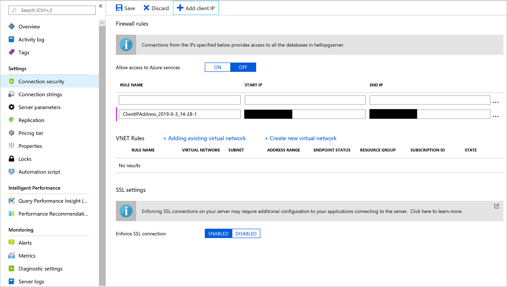

If you're using Cloud Shell instead of the local psql tool, select **Allow access to Azure services** and change its value to **ON** to allow your Cloud Shell access.

Then connect to the instance by running the below psql command with connection string parameters from the **Connection strings** tab of the PostgreSQL instance on the Azure portal.
Replace the empty braces with parameters from the Connection String blade of the database and the password with the password from Azure Key Vault.

```shell
psql "host={} port=5432 dbname=hellodb user={} password=PGPASSWORD sslmode=require"
```

Run the following PL/pgSQL script after you make sure you're connected to the database. The script creates the stored functions used to insert data into the database.

```shell
CREATE OR REPLACE FUNCTION insert_visitor(country VARCHAR(40), browser VARCHAR(40), operating_system VARCHAR(40)) RETURNS void AS $$
BEGIN
    INSERT INTO visitor(
        country,
        browser,
        operating_system,
        date_visited)
    VALUES (
        country,
        browser,
        operating_system,
        NOW()
    );
END;
$$ LANGUAGE PLPGSQL;

CREATE OR REPLACE FUNCTION insert_azure_document(title VARCHAR(40), url VARCHAR(100), category VARCHAR(40)) RETURNS void AS $$
BEGIN
    INSERT INTO azure_document(
        title,
        url,
        category)
    VALUES (
        title,
        url,
        category
    );
END;
$$ LANGUAGE PLPGSQL;
```

For more information on how to setup TLS and Certificate Authority (CA) verification for PostgreSQL, see [Configure TLS connectivity in Azure Database for PostgreSQL](/azure/postgresql/concepts-ssl-connection-security).

A root certificate is included in the container. The steps taken to obtain the certificate are:

1. Download the certificate file from the [Certificate Authority](https://www.digicert.com/CACerts/BaltimoreCyberTrustRoot.crt).
2. [Download and install OpenSSL on your machine](/azure/postgresql/concepts-ssl-connection-security).
3. Decode your certificate file:

   ```shell
   openssl x509 -inform DER -in BaltimoreCyberTrustRoot.crt -text -out root.crt
   ```

Read more on how to configure TLS security for PostgreSQL here [Configure TLS Connection Security](/azure/postgresql/concepts-ssl-connection-security).

#### Deploy Azure Web Apps on Linux

You can easily build Linux services on top of Azure App Service as Azure provides a set of prebuilt containers and images for widely used languages like Python, Ruby, C#, and Java. Azure also supports custom containers, which can allow virtually all programming languages to run on the Azure App Service platform.

The app being deployed is a simple Python app that runs on the latest Ubuntu Linux distribution. It connects to the Azure Key Vault and PostgreSQL instances that were created in the previous sections for credential management and data storage, respectively.

The following Docker file is provided in the root folder of the app:

```dockerfile
# Docker file for the basic web app
# Using the latest Alpine Linux

FROM alpine:latest

# Copy requirements to the container
COPY requirements.txt /tmp/requirements.txt

# Install Python and PostgreSQL dependencies
RUN apk update && \
    apk add --update bash gcc libffi-dev musl-dev  postgresql-dev python3 python3-dev && \
    rm -r /usr/lib/python*/ensurepip && \
    pip3 install --upgrade pip setuptools && \
    if [ ! -e /usr/bin/pip ]; then ln -s pip3 /usr/bin/pip ; fi && \
    if [[ ! -e /usr/bin/python ]]; then ln -sf /usr/bin/python3 /usr/bin/python; fi && \
    pip3 install --no-cache-dir -r /tmp/requirements.txt && \
    rm -rf /.wh /root/.cache /var/cache /tmp/requirements.txt

# Change the working directory inside the container to /hello
WORKDIR /hello

# Copy the application code into the container
COPY . /hello

# Set the FLASK_APP environment variable used by flask migrate
ENV FLASK_APP=app.py

# Copy the init script to the container
COPY init.sh /usr/local/bin/

# Make the init script executable
RUN  chmod u+x /usr/local/bin/init.sh

# Expose the container web service endpoint
EXPOSE 8000

# Run the app with a non root user
RUN addgroup -g 1000 -S appgroup && \
    adduser  -u 1000 -S appuser -G appgroup

# Allow the non root user to access the folder
RUN chown -R appuser:appgroup /hello

# Switch to the non root user
USER appuser

# Set the init script as the file to be run during container startups
ENTRYPOINT ["/usr/local/bin/init.sh"]
```

The Dockerfile above is used to build the container that is hosted on the Azure Container Registry at `mcr.microsoft.com/samples/basic-linux-app`.

The code below:

1. Declares the variables and names for the App Service instance.
2. Creates the resource group for the App Service plan.
3. Provisions an Azure Web Apps on Linux containers instance.
4. Enables logging for the web app container.
5. Sets some app configurations in the container's app settings.

   ```powershell-interactive
   Write-Host "Retrieving the Azure Key Vault URL"
   $kvURI = $(az keyvault show --name $kvName --query properties.vaultUri)

   # Create the App Service plan, using --linux for running containers on Web Apps on Linux
   Write-Host "Creating App Service Plan: $($appName)"
   az appservice plan create --name $appServicePlanName `
       --resource-group $ResourceGroup `
       --location $Location `
       --number-of-workers 1 `
       --sku B1 `
       --is-linux `
       --verbose

   # Create the web app
   Write-Host "Creating Azure Web App for Linux: $($appName)"
   az webapp create --name $appName `
       --resource-group $ResourceGroup `
       --plan $appServicePlanName `
       --deployment-container-image-name $containerName `
       --verbose

   # Assign a system-assigned identity
   # This creates a service principal to be used for managed identities for Azure resources allowing access to Key Vault Secrets without using auth keys/tokens
   Write-Host "Assigning Service Principal Identity to webapp: $($appName)"
   az webapp identity assign --name $appName `
       --resource-group $ResourceGroup `
       --verbose

   # Configure logging for the Docker container on App Service
   Write-Host "Configuring logging for the web app: $($appName)"
   az webapp log config --name $appName `
       --resource-group $ResourceGroup `
       --application-logging true `
       --detailed-error-messages true `
       --docker-container-logging filesystem `
       --verbose

   # Set app configuration settings to be set in the container's environment variables
   Write-Host "Setting app settings for our web app: $($appName)"
   az webapp config appsettings set --name $appName `
       --resource-group $ResourceGroup `
       --settings WEBSITE_TIME_ZONE=$timezone KEY_VAULT_URI=$kvURI `
       --verbose

   # Stop the web app to enable us to first allow the created managed identities for Azure resources service principals access to the Key Vault instance
   az webapp stop --name $appName `
       --resource-group $ResourceGroup `
       --verbose

   # Get all the outbound IPs the App Service instance might use
   Write-Host "Adding outbound Azure App Service IP's to the PostgreSQL database firewall."
   $outboundIps = (az webapp show --resource-group $ResourceGroup `
       --name $appName `
       --query outboundIpAddresses `
       --output tsv)

   # Loop over all the outbound IP addresses and authorize them in the PostgreSQL firewall
   $outboundIps = $outboundIps.Split(',')
   for($i=0; $i -lt $outboundIps.length; $i++) {
       Write-Output "Adding IP Rule $($outboundIps[$i]) on PostgreSQL for App Service"

       az postgres server firewall-rule create --name "OUTBOUND_IP_RULE$i" `
           --resource-group $ResourceGroup `
           --server-name $dbServer `
           --start-ip-address $outboundIps[$i] `
           --end-ip-address $outboundIps[$i] `
           --verbose
   }
   ```

This script creates an assigned identity for the App Service instance that can be used with MSI to interact with Azure Key Vault without hard coding secrets in code or configuration.

Go to the Azure Key Vault instance in the portal to authorize the assigned identity on the access policy tab.
Select **Add new access policy**. Under **Select principal**, search for the application name that is similar to the name of the App Service instance created.
A service principal attached to the application should be visible. Select it and save access policy page, as shown in the following screenshot.

Because the application only needs to retrieve keys, select the **Get** permission in the secrets options, allowing access while reducing the privileges granted.


*Create a Key Vault access policy*

Save the access policy and then save the new change on the **Access Policies** tab to update the policies.

#### Deploy Application Gateway with web application firewall enabled

In web apps, it is not recommended that you expose services directly to the outside world on the internet.
Load balancing and firewall rules provide more security and control over the incoming traffic and help you manage it.

To deploy an Application Gateway instance:

1. Create the resource group to house the application gateway.
2. Provision a virtual network to attach to the gateway.
3. Create a subnet for the gateway in the virtual network.
4. Provision a public IP address.
5. Provision the application gateway.
6. Enable web application firewall on the gateway.

   ```powershell-interactive
   az keyvault certificate create --vault-name $kvName `
       --name $certName `
       --policy `@policy.json `
       --verbose

   az keyvault secret download --file $filePath `
       --encoding base64 `
       --name $certName `
       --vault-name $kvName `
       --verbose

   $pfxFile = Get-PfxData -FilePath $filePath

   $certPassword = Get-Random

   az keyvault secret set --vault-name $kvName `
       --name CERTPASSWORD `
       --value $certPassword `
       --verbose

   $signPassword = ConvertTo-SecureString $certPassword -Force -AsPlainText
   Export-PfxCertificate -PFXData $pfxFile -FilePath $certPath -Password $signPassword
   ```

The preceding script:

1. Creates a new self-signed certificate on Azure.
2. Downloads the self-signed certificate as a base64-encoded file.
3. Generates a password for the self-signed certificate.
4. Exports the certificate as a PFX file signed with the password.
5. Stores the certificate's password in Azure Key Vault.

This section deploys the application gateway:

```powershell-interactive
# Create a virtual network required by the gateway
Write-Host "Creating the Azure Virtual Network: $($vnetName)"
az network vnet create --name $vnetName `
    --resource-group $ResourceGroup `
    --location $Location `
    --address-prefix $vnetAddressPrefix `
    --verbose

# Add a subnet to the virtual network
Write-Host "Creating the Subnet: $($gwSubnet)"
az network vnet subnet create --name $gwSubnet `
    --resource-group $ResourceGroup `
    --vnet-name $vnetName `
    --address-prefix $gatewayAddressPrefix `
    --verbose

# Create a public IP address that will be used by clients to access the application gateway
Write-Host "Creating the Public IP Address: $($publicIpName)"
az network public-ip create --resource-group $ResourceGroup `
    --name $publicIpName `
    --verbose

# Create the application gateway
Write-Host "Creating the Application Gateway: $($gwName)"
az network application-gateway create `
    --name $gwName `
    --resource-group $ResourceGroup `
    --location $Location `
    --vnet-name $vnetName `
    --subnet $gwSubnet `
    --public-ip-address $publicIpName `
    --http-settings-cookie-based-affinity Disabled `
    --frontend-port 443 `
    --http-settings-protocol Https `
    --http-settings-port 443 `
    --capacity 2 `
    --sku WAF_Medium `
    --cert-file $certPath `
    --cert-password $certPassword `
    --verbose

# Enable the firewall with OWASP Ruleset 3.0 on the application gateway
Write-Host "Creating the Application Gateway WAF Configuration"
az network application-gateway waf-config set `
    --enabled true `
    --gateway-name $gwName `
    --resource-group $ResourceGroup `
    --firewall-mode Detection `
    --rule-set-version 3.0 `
    --verbose

# Retrieve the name of the HTTP settings that will be updated below
$gwHTTPSettings = $(az network application-gateway http-settings list --resource-group $ResourceGroup `
    --gateway-name $gwName)

$gwHTTPSettings = $gwHTTPSettings | ConvertFrom-Json
$gwHTTPSettingsName = $gwHTTPSettings.name

# Retrieve the name of the backend address pool that will be updated below
$gwAddressPool = $(az network application-gateway address-pool list --resource-group $ResourceGroup `
    --gateway-name $gwName)

$gwAddressPool = $gwAddressPool | ConvertFrom-Json
$gwAddressPoolName = $gwAddressPool.name

# Update the backend pool with the App Service host name
Write-Host "Updating the Azure Application Gateway backend pool host name: $($appHostName)"
az network application-gateway address-pool update --name $gwAddressPoolName `
    --resource-group $ResourceGroup `
    --gateway-name $gwName `
    --servers $appHostName `
    --verbose

# Create a probe that will check the backend pool's availability
Write-Host "Updating the Azure Application Gateway Probe: $($gwProbe)"
az network application-gateway probe create --gateway-name $gwName `
    --name $gwProbe `
    --resource-group $ResourceGroup `
    --protocol Https `
    --path $gwProbePath `
    --host-name-from-http-settings true `
    --verbose

# Update the app to user https and to pick the host name from the backend settings
Write-Host "Deploying the updated application gateway"
az network application-gateway http-settings update --gateway-name $gwName `
    --resource-group $ResourceGroup `
    --name $gwHTTPSettingsName `
    --connection-draining-timeout 0 `
    --enable-probe true `
    --host-name-from-backend-pool true `
    --probe $gwProbe `
    --protocol Https `
    --port 443 `
    --verbose
```

After you complete the deployment, you have an application gateway with web application firewall enabled.

The gateway instance exposes port 443 for HTTPS. This configuration ensures that our app is only accessible on port 443 through HTTPS.

Blocking unused ports and limiting the attack surface exposure is a security best practice.

#### Add network security groups to the App Service instance

App Service instances can be integrated with virtual networks. This integration allows them to be configured with network security group policies that manage the
app's incoming and outgoing traffic.

1. To enable this feature, on the Azure App service instance blade, under **Settings**, select **Networking**. In the right pane, under **VNet Integration**, select **Click here to configure**.

   

    *New virtual network integration for App Service*

1. On the next page, select **Add VNET (preview)**.

1. On the next menu, select the virtual network created in the deployment that starts with `hello-vnet`. You can either create a new subnet or select an existing one.
   In this case, create a new subnet. Set the **Address range** to **10.0.3.0/24** and name the subnet **app-subnet**.

   

    *Virtual network configuration for App Service*

Now that you've enabled the virtual network integration, you can add network security groups to our app.

1. Use the search box, search for **network security groups**. Select **Network security groups** in the results.

    

    *Search for network security groups*

2. On the next menu, select **Add**. Enter the **Name** of the NSG and the **Resource group** in which it should be located. This NSG will be applied to the application gateway's subnet.

    

    *Create an NSG*

3. After the NSG is created, select it. In its blade, under **Settings**, select **Inbound Security rules**. Configure these settings to allow connections coming into the application gateway over port 443.

   

   *Configure the NSG*

4. In the outbound rules for the gateway NSG, add a rule that allows outbound connections to the App Service instance by creating a rule that targets the service tag `AppService`:

   

   *Add outbound rules for the NSG*

    Add another outbound rule to allow the gateway to send outbound rules to a virtual network.

   

    *Add another outbound rule*

5. On the subnets blade of the NSG, select **Associate**, select the virtual network created in the deployment, and select the gateway subnet named **gw-subnet**. The NSG is applied to the subnet.

6. Create another NSG as in the earlier step, this time for the App Service instance. Give it a name. Add the inbound rule for port 443 as you did for the application gateway NSG.

   If you have an App Service instance deployed on an App Service Environment instance, which is not the case for this app, you can add inbound rules to allow Azure Service Health probes by opening up
   ports 454-455 on the inbound security groups of your App Service NSG. Here's the configuration:

   

    *Add rules for Azure Service Health probes (App Service Environment only)*

7. In the outbound security rules, create a new outbound security rule that allows the App Service instance to communicate with the PostgreSQL database. Configure it like this:

   

   *Add a rule to allow outbound PostgreSQL connections*

To limit the attack surface, modify the App Service network settings to allow only the application gateway to access the application.
You do this by going into the App Service network tab, selecting the **IP Restrictions** tab, and creating an allow rule that allows only the application gateway's IP to directly access the service.

You can retrieve the IP address of the gateway from its overview page. On the **IP Address CIDR** tab, enter the IP address in this format: `<GATEWAY_IP_ADDRESS>/32`.


*Allow only the gateway IP to access the App Service*

#### Implement Azure Active Directory OAuth

The Azure documents distributed on the sample web app page are resources in our app that might need protection. You can use Azure Active Directory (Azure AD) to implement authentication for web, desktop, and mobile apps by using different authentication flows.
The app uses **Login With Microsoft**, that allows the app to read profiles of users who have been added to our single-tenant Azure AD user's list.

In the Azure portal, configure the app to use the required credentials:

1. Select **Azure Active Directory**, or search for it by using the search box.

2. Select **New registration**:

   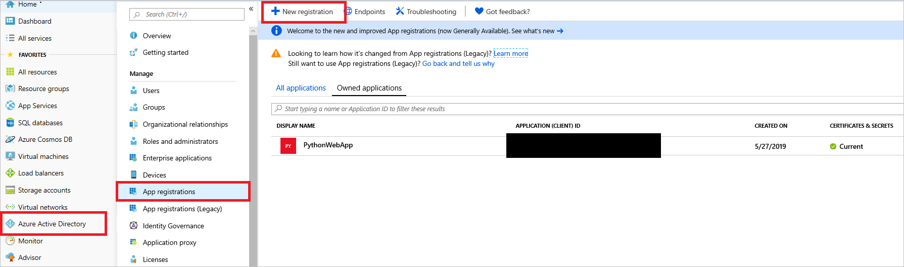

   *Create an Azure AD app registration*

3. On the next page, enter the app name. Under **Supported account types**, select **Accounts in this organizational directory only**.
    Under **Redirect URI**, enter the base domain that the app will be running on plus one with the token endpoint. For example: *GATEWAY_HASH*.cloudapp.net/token.

   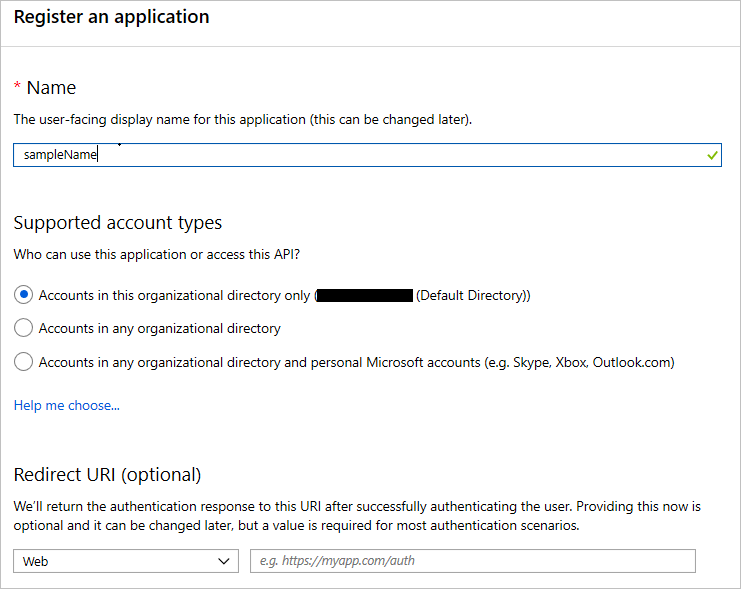

   *Configure Azure AD app registration*

4. You are presented with a screen that shows the registered app and its information. You need to add this information into the Azure Key Vault instance.
   1. Copy the application (client) ID and save it in Key Vault as `CLIENTID`.
   2. Copy the redirect URI that you entered in the previous step and save it as `REDIRECTURI`.
   3. Copy the Azure AD default directory name, which has the format *name*.microsoftonline.com, and save it in Key Vault as `TENANT`.
   4. Go to the **Certificates & secrets** tab of the Azure AD app that you created previously and select **New client secret**, as shown in the following screenshot. Set an expiration date, and then copy the generated value and save it in Key Vault as `CLIENTSECRET`.

      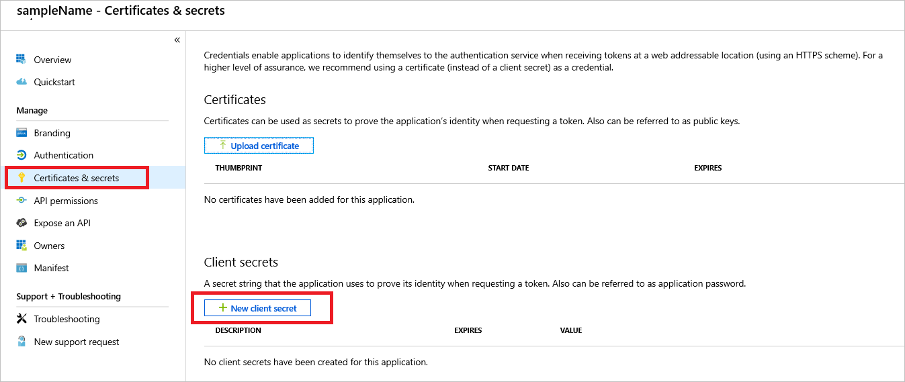

      *Azure AD authorization secret*

   5. Generate a secure random secret key by using any command-line/online tool. Save it into Key Vault as `FLASKSECRETKEY`. The application framework uses this key to create sessions.
        To learn how to generate a secret key, see [Flask Sessions](http://flask.pocoo.org/docs/1.0/quickstart/#sessions).

5. After you configure the sign-in, you need to add users to the Azure AD link to allow them to sign in to the resource. To add them, go to the **Users** tab in Azure AD, select **All users**, and then select **New user** or **New guest user**. For testing, you can add a guest user and invite the user into the directory. Or you can add a new user if the domain the app is running on has been validated. In this example, only users registered in the Azure AD tenant can be registered for access. For information about multitenant sign-in access, see the documentation.

   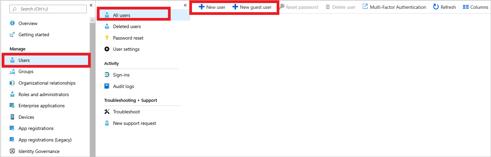

   *Add users to the default Azure Active Directory domain*

After you add the Azure AD configuration and secrets to Key Vault, users can be authenticated into the app by using Azure OAuth authentication.
In the app code, this is handled by the Azure Active Directory Authentication Library (ADAL).

After the secrets are in Key Vault and the application has access to the secrets and the database, the application service can be reached through the gateway's
application URL (https:\//GATEWAY_HASH.cloudapp.net), which you can get from its blade.

If, when you sign in to Azure AD, you get an error that says "User is not registered in the directory you're trying to log into," you need to add the user. To add the user, go to the **Users** tab of Azure AD and add the user manually by entering their details or invite the user by entering their email address as a guest user to Azure AD in the **Invite Guest** blade.

#### Deploy Application Insights
Now that the app is deployed and working, you need to handle errors that occur within the app along with logging and trace data collection.
Logging and trace data collection provides a view into audit events that happen in the app.

Application Insights is a service that collects logs that can be generated by users or by the system.

To create an Application Insights instance:

1. Search for **Application Insights** by using the search box in the Azure portal.
2. Select **Application Insights**. Provide the details shown here to create an instance.

   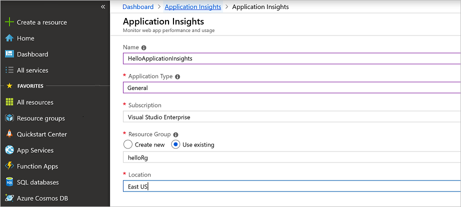

After the deployment is complete, you have an Application Insights instance.

After you create the Applications Insights instance, you need to make the app aware of the instrumentation key that allows it to send logs to the cloud. You do this by retrieving the Application Insights key and using it within the application libraries that Azure provides for Application Insights. The best practice is to store keys and secrets in Azure Key Vault to keep them secure.

For the basic sample app, after you create the Applications Insights instance, you need to make the app aware of the instrumentation key that allows it to send logs to the cloud.
In Key Vault, set a `APPINSIGHTSKEY` secret and set its value as the instrumentation key. Doing so allows the app to send logs and metrics to Application Insights.

#### Implement Multi-Factor Authentication for Azure Active Directory

Administrators need to ensure that the subscription accounts in the portal are protected. The subscription is vulnerable to attacks because it manages the resources that you created. To protect the subscription, enable Multi-Factor Authentication on the **Azure Active Directory** tab of the subscription.

Azure AD operates based on policies that are applied to a user or groups of users that fit a certain criteria.
Azure creates a default policy specifying that administrators need two-factor authentication to sign in to the portal.
After enabling this policy, you might be prompted to sign out and sign back in to the Azure portal.

To enable MFA for admin sign-ins:

1. Go to the **Azure Active Directory** tab in the Azure portal
2. Under the security category, select conditional access. You see this screen:

   

If you can't create a new policy:

1. Go to the **MFA** tab.
2. Select the Azure AD Premium **Free trial** link to subscribe to the free trial.

   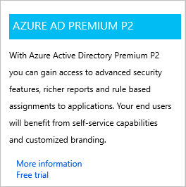

Return to the conditional access screen.

1. Select the new policy tab.
2. Enter the policy name.
3. Select the users or groups for which you want to enable MFA.
4. Under **Access controls**, select the **Grant** tab and then select **Require multi-factor authentication** (and other settings if you want).

   

You can enable the policy by selecting the check box at the top of the screen or do so on the **Conditional Access** tab. When the policy is enabled, users need MFA to sign in to the portal.

There's a baseline policy that requires MFA for all Azure administrators. You can enable it immediately in the portal. Enabling this policy might invalidate the current session and force you to sign in again.

If the baseline policy isn't enabled:

1. Select **Require MFA for admins**.
2. Select **Use policy immediately**.

   

#### Use Azure Sentinel to monitor apps and resources

As an application grows, it becomes difficult to aggregate all the security signals and metrics received from resources and make them useful in an action-oriented way.

Azure Sentinel is designed to collect data, detect the types of threats possible, and provide visibility into security incidents.
While it waits for manual intervention, Azure Sentinel can rely on pre-written playbooks to kick off alerts and incident management processes.

The sample app is composed of several resources that Azure Sentinel can monitor.
To set up Azure Sentinel, you first need to create a Log Analytics workspace that stores all the data collected from the various resources.

To create this workspace:

1. In the search box in the Azure portal, search for **Log Analytics**. Select **Log Analytics workspaces**.

   

    *Search for Log Analytics workspaces*

2. On the next page, select **Add** and then provide a name, resource group, and location for the workspace.
   

   *Create a Log Analytics workspace*

3. Use the search box to search for **Azure Sentinel**.

   

    *Search for Azure Sentinel*

4. Select **Add** and then select the Log Analytics workspace that you created earlier.

   

    *Add a Log Analytics workspace*

5. On the **Azure Sentinel - Data connectors** page, under **Configuration**, select **Data connectors**. You see an array of Azure services that you can link to the Log Analytics storage instance for analysis in Azure Sentinel.

   

    *Add a data connector to Azure Sentinel*

   For example, to connect the application gateway, take these steps:

   1. Open the Azure Application Gateway instance blade.
   2. Under **Monitoring**, select **Diagnostic settings**.
   3. Select **Add diagnostic setting**.

      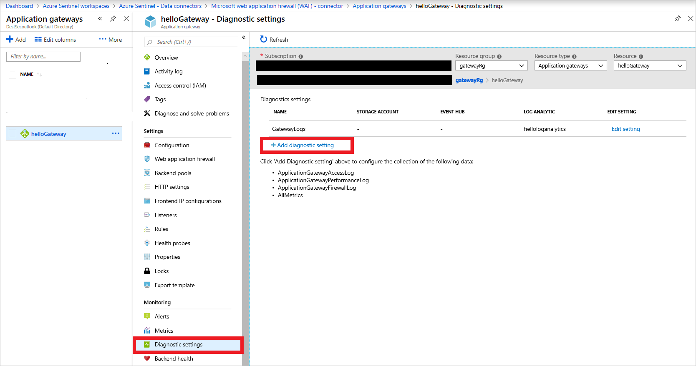

      *Add Application Gateway diagnostics*

   4. On the **Diagnostic settings** page, select the Log Analytics workspace that you created and then select all the metrics that you want to collect and send to Azure Sentinel. Select **Save**.

        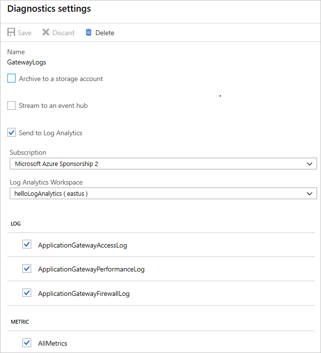

        *Azure Sentinel connector settings*

  The metrics from the resource are in Azure Sentinel, where you can query and investigate them.

   Add the same metrics in diagnostic settings for Azure Key Vault, the public IP address, Azure Database for PostgreSQL, and any services that support diagnostic logs in your account.

After you set up the metrics, Azure Sentinel has data to analyze.

## Evaluate and verify

After you develop and deploy the architecture, you need to ensure that the code and the deployed services meet security standards. These are some steps that you can take to verify the software:

- Static code analysis
- Vulnerability scanning
- Finding and fixing vulnerabilities in application dependencies

These are the basic building blocks for best practices in secure development.

### Static code analysis

For the sample app, verification with static analysis tools involves finding vulnerabilities in the app code by using techniques like taint checking and data-flow analysis. Python static analysis tools give you more confidence that your app is secure.

**Linting**

PyFlakes, a Python linting library, helps you remove dead code and unused functions from apps, as shown here:

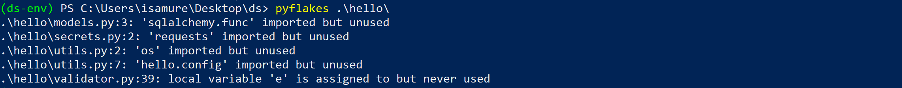

Linting provides hints and possible changes that can make your code cleaner and less error prone during runtime.

**PyLint**

PyLint provided the most value for this project. It performs code-standard checks, error checking, and refactoring tips to ensure that the code running on the server is safe. By using PyLint to update your code, you can eliminate bugs and improve the PyLint rating, as the following images show.

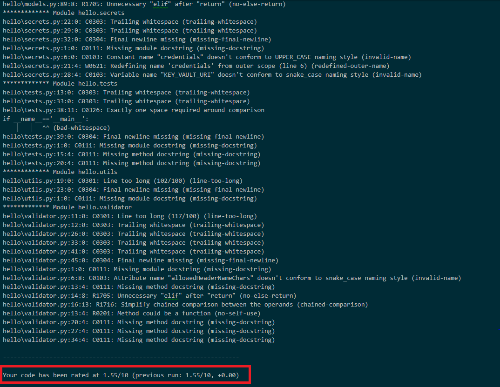

*Before PyLint*

After you fix some of the code errors found by the linting tools, you have more confidence that the code isn't prone to errors. Fixing the errors significantly reduces the security risks that can occur when the code is deployed to production environments.

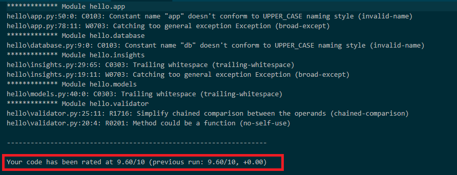

*After PyLint*

### Vulnerability scanning

[OWASP's ZAP](https://www.zaproxy.org/) tool is an open-source web application vulnerability scanner that you can use to check the sample app for vulnerabilities. Running the tool on the sample app reveals some possible errors and attack vectors.

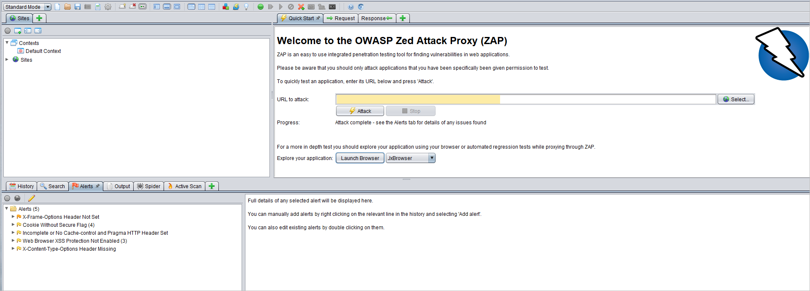

*ZAP tool*

### Find and fix vulnerabilities in app dependencies

To find and fix application dependencies, you can use [OWASP's Dependency Check](https://owasp.org/www-project-dependency-check/).

Safety is a similar application that checks dependencies. You can find it on [GitHub](https://github.com/pyupio/safety). Safety scans for vulnerabilities found in well-known vulnerability databases.

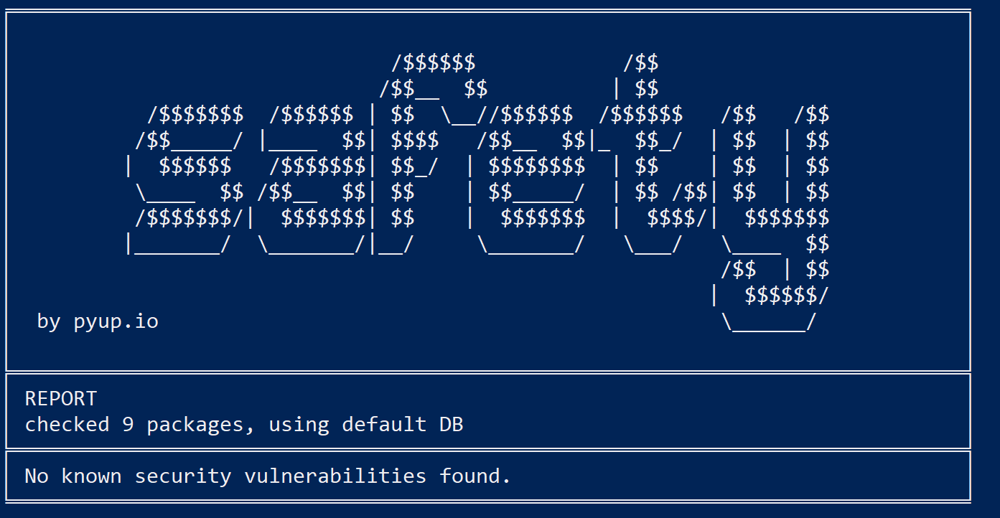

*Safety*

## Next steps

The following articles can help you design, develop, and deploy secure applications.

- [Design](secure-design.md)
- [Develop](secure-develop.md)
- [Deploy](secure-deploy.md)
