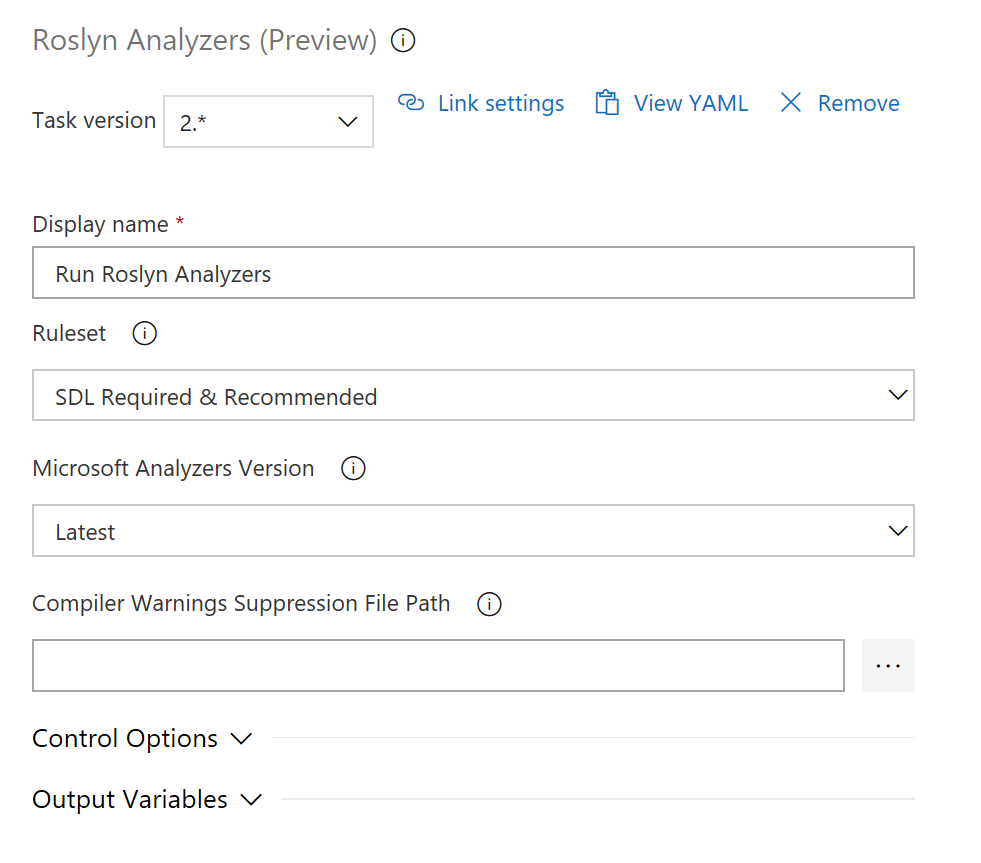
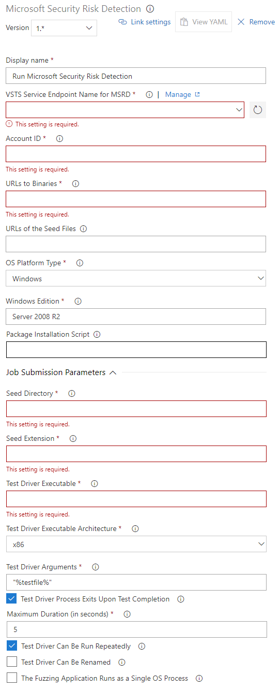
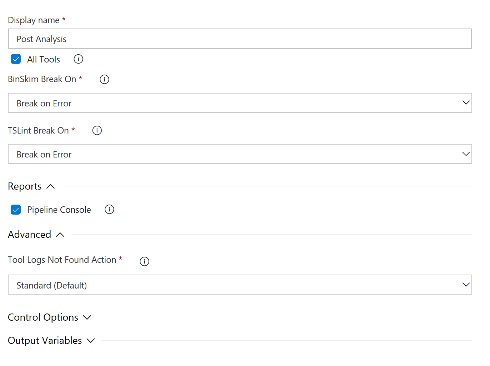

# Steps to Customize various build tasks

This section describes the various customizable options and additional resources for each task.

## Customizing the CredScan Build Task
1. Click the task **Run CredScan** to see the different options available within. 

2. Available options include 
   - **Output Format** – TSV/ CSV/ SARIF/ PREfast
   - **Tool Version** (Recommended: Latest)
   - **Scan Folder** – The folder in your repository to scan
   - **Searchers File Type** - Options to locate the searchers file used for scanning.
   - **Suppressions File** – A [JSON](https://json.org/) file can be used for suppressing issues in the output log (more details in the Resources section). 
   - (New) **Verbose Output** - self-explanatory 
   - **Batch Size** - The number of concurrent threads used to run Credential Scanners in parallel. Defaults to 20 (Value must be in the range of 1 to 2147483647).
   - (New) **Match Timeout** - The amount of time to spend attempting a searcher match before abandoning the check. 
   - (New) **File Scan Read Buffer Size** - Buffer size while reading content in bytes. (Defaults to 524288) 
   - (New) **Maximum File Scan Read Bytes** - Maximum number of bytes to read from a given file during content analysis. (Defaults to 104857600) 
   - **Run this task** (under **Control Options**) - Specifies when the task should run. Choose "Custom conditions" to specify more complex conditions. 
   - **Version** - Build task version within Azure DevOps. Not frequently used. 

### Additional Resources for CredScan task

#### Local suppressions scenarios and examples 
Two of the most common suppression scenarios are detailed below:
##### Suppress all occurrences of a given secret within the specified path 
The hash key of the secret from the CredScan output file is required as shown in the sample below
   
        {
            "tool": "Credential Scanner",
            "suppressions": [
            {
                "hash": "CLgYxl2FcQE8XZgha9/UbKLTkJkUh3Vakkxh2CAdhtY=",
                "_justification": "Secret used by MSDN sample, it is fake."
            }
          ]
        }

>[!WARNING]
> The hash key is generated by a portion of the matching value or file content. Any source code revision could change the hash key and disable the suppression rule. 

##### To suppress all secrets in a specified file (or to suppress the secrets file itself) 
The file expression could be a file name or any postfix portion of the full file path/name. Wildcards are not supported. 

**Example** 

File to be suppressed: [InputPath]\src\JS\lib\angular.js 

Valid Suppression Rules: 
- [InputPath]\src\JS\lib\angular.js -- suppress the file in the specified path
- \src\JS\lib\angular.js
- \JS\lib\angular.js
- \lib\angular.js
- angular.js -- suppress any file with the same name

        {
            "tool": "Credential Scanner",
            "suppressions": [
            {
                "file": "\\files\\AdditonalSearcher.xml", 
                "_justification": "Additional CredScan searcher specific to my team"
            },
            {
                "file": "\\files\\unittest.pfx", 
                "_justification": "Legitimate UT certificate file with private key"
            }
          ]
        }      

>[!WARNING] 
> All future secrets added to the file will also get suppressed automatically. 

#### Secrets management guidelines 
While detecting hard coded secrets in a timely manner and mitigating the risks is helpful, it is even better if one could prevent secrets from getting checked in altogether. In this regard, Microsoft has released CredScan Code Analyzer as part of [Microsoft DevLabs extension](https://marketplace.visualstudio.com/items?itemName=VSIDEDevOpsMSFT.ContinuousDeliveryToolsforVisualStudio) for Visual Studio. While in early preview, it provides developers an inline experience for detecting potential secrets in their code, giving them the opportunity to fix those issues in real-time. For more information, please refer to [this](https://devblogs.microsoft.com/visualstudio/managing-secrets-securely-in-the-cloud/) blog on Managing Secrets Securely in the Cloud. 
Below are few additional resources to help you manage secrets and access sensitive information from within your applications in a secure manner: 
 - [Azure Key Vault](https://docs.microsoft.com/azure/key-vault/)
 - [Azure Active Directory](https://docs.microsoft.com/azure/sql-database/sql-database-aad-authentication)
 - [Azure AD Managed Service Identity](https://azure.microsoft.com/blog/keep-credentials-out-of-code-introducing-azure-ad-managed-service-identity/)
 - [Managed Service Identity (MSI) for Azure resources](https://docs.microsoft.com/azure/active-directory/managed-identities-azure-resources/overview)
 - [Azure Managed Service Identity](https://docs.microsoft.com/azure/app-service/overview-managed-identity)
 - [AppAuthentication Library](https://docs.microsoft.com/azure/key-vault/service-to-service-authentication)

#### Extending search capabilities

CredScan relies on a set of content searchers commonly defined in the **buildsearchers.xml** file. The file contains an array of XML serialized objects that represent a ContentSearcher object. The program is distributed with a set of searchers that have been well tested but it does allow you to implement your own custom searchers too. 

A content searcher is defined as follows: 

- **Name** – The descriptive searcher name to be used in CredScan output file. It is recommended to use camel case naming convention for searcher names. 
- **RuleId** – The stable opaque ID of the searcher. 
    - CredScan default searchers are assigned with RuleIds like CSCAN0010, CSCAN0020, CSCAN0030, etc. The last digit is reserved for potential searcher regex group merging or division.
    - RuleId for customized searchers should have its own namespace in the format of: CSCAN-{Namespace}0010, CSCAN-{Namespace}0020, CSCAN-{Namespace}0030, etc.
    - The fully qualified searcher name is the combination of the RuleId and the searcher name, e.g. CSCAN0010.KeyStoreFiles, CSCAN0020.Base64EncodedCertificate, etc.
- **ResourceMatchPattern** – Regex of file extensions to check against searcher
- **ContentSearchPatterns** – Array of strings containing Regex statements to match. If no search patterns are defined, all files matching the resource match pattern will be returned.
- **ContentSearchFilters** – Array of strings containing Regex statements to filter searcher specific false positives.
- **Matchdetails** – A descriptive message and/or mitigation instructions to be added for each match of the searcher.
- **Recommendation** – Provides the suggestions field content for a match using PREfast report format.
- **Severity** – An integer to reflect the severity of the issue (Highest = 1).

## Customizing the BinSkim Build Task

> [!NOTE]
> As a prerequisite to run the BinSkim task, your build should meet one of the below conditions.
>    - Your build produces binary artifacts from managed code>   
>    - You have binary artifacts committed you would like to analyze with BinSkim.
>

1. Click the **BinSkim** task to see the different options available within. 
  
2. Set the build configuration to Debug to produce ***.pdb** debug files. They are used by BinSkim to map issues found in the output binary back to source code. 
3. Choose Type = **Basic** & Function = **Analyze** to avoid researching and creating your own command line. 
4. **Target** - One or more specifiers to a file, directory, or filter pattern that resolves to one or more binaries to analyze. 
  - Multiple targets should be separated by a **semicolon(;)**. 
  - Can be a single file or contain wildcards.
  - Directories should always end with \*
  - Examples:

        *.dll;*.exe
        $(BUILD_STAGINGDIRECTORY)\*
        $(BUILD_STAGINGDIRECTORY)\*.dll;$(BUILD_STAGINGDIRECTORY)\*.exe;
5. If you select Type = **Command Line**, 
  - Make sure the first argument to **BinSkim.exe** is the verb **analyze** using full paths, or paths relative to the source directory.
  - For **Command Line** input, multiple targets should be separated by a space.
  - You can omit the **/o** or **/output** file parameter; it will be added for you or replaced. 
  - **Standard Command Line Configuration** 

         analyze $(Build.StagingDirectory)\* --recurse --verbose
         analyze *.dll *.exe --recurse --verbose
         Note that the trailing \* is very important when specifying a directory or directories for the target. 

## Customizing the Roslyn Analyzers Build Task
> [!NOTE]
> As a prerequisite to run the Roslyn Analyzer task, your build should meet the following conditions.
>  - Your build definition includes the built-in MSBuild or VSBuild build task to compile C# (or VB) code. This task relies on the input and output of that specific build task to rerun the MSBuild compilation with Roslyn analyzers enabled.
>  - The build agent running this build task has Visual Studio 2017 v15.5 or later installed (compiler version 2.6.x).
>

1. Click the task **Run Roslyn Analyzers** to see the different options available. 

2. Available options include 
- **Ruleset** - SDL Required, SDL Recommended, or you can use a custom ruleset of your own.
- **Analyzers Version** (Recommended: Latest)
- **Compiler Warnings Suppressions File** - A text file with a list of warnings IDs that should be suppressed. 
- **Run this task** (under **Control Options**) - Specifies when the task should run. Choose "**Custom conditions**" to specify more complex conditions. 

> [!NOTE]
> - Roslyn analyzers are compiler-integrated and can only be run as part of CSC.exe compilation. Hence, this task requires replaying/rerunning the compiler command that ran earlier in the build. This is done by querying VSTS for the MSBuild build task logs (there is no other way for the task to reliably get the MSBuild compilation command line from the build definition; we did consider adding a freeform textbox to allow users to enter their command lines, but it would be hard to keep these up-to-date and in sync with the main build). Custom builds require replaying the entire set of commands, not just compiler commands, and it is not trivial/reliable to enable Roslyn analyzers in these cases. 
> - Roslyn analyzers are integrated with the compiler and requires the compilation to be invoked. This build task is implemented by recompiling C# projects that were already built using only the MSBuild/VSBuild build task, in the same build / build definition, but in this case, with the Analyzers enabled. If this build task runs on the same agent as the original build task, the output of the original MSBuild/VSBuild build task will be overwritten in the 's' sources folder, by the output of this build task. The build output will be the same, but it is advised that you run MSBuild, copy output to the the artifacts staging directory, and then run Roslyn.
>

### Additional Resources for Roslyn Analyzers Task

  - [Roslyn Analyzers on Microsoft Docs](https://docs.microsoft.com/dotnet/standard/analyzers/)

  - [The analyzer package](https://www.nuget.org/packages/Microsoft.CodeAnalysis.FxCopAnalyzers) installed and used by this build task.

### Troubleshooting issues with Roslyn Analyzers build task

|Error|Resolution|
|----|------|
|Error : The project was restored using Microsoft.NETCore.App version x.x.x, but with current settings, version y.y.y would be used instead. To resolve this issue, make sure the same settings are used for restore and for subsequent operations such as build or publish. |Typically this issue can occur if the RuntimeIdentifier property is set during build or publish but not during restore. Roslyn analyzers run as part of compilation, so the source tree on the build machine needs to be in a buildable state. A step (probably "dotnet.exe publish") between your main build and Roslyn analyzers may have put the source tree in an unbuildable state. Perhaps duplicating the step that does a Nuget Restore, just before the Roslyn Analyzers step, will put the source tree back in a buildable state.|
|"csc.exe" exited with error code 1 -- An instance of analyzer AAAA cannot be created from C:\BBBB.dll : Could not load file or assembly 'Microsoft.CodeAnalysis, Version=X.X.X.X, Culture=neutral, PublicKeyToken=31bf3856ad364e35' or one of its dependencies. The system cannot find the file specified. |Ensure your compiler supports Roslyn analyzers. "csc.exe /version" should report at least v2.6.x. In some cases, individual .csproj files can override the build machine's Visual Studio installation, by referencing a package from Microsoft.Net.Compilers. If using a specific version of the compiler was unintended, remove references to Microsoft.Net.Compilers. Otherwise, make sure the referenced package is also at least v2.6.x. Try to get the error log, which you can find in the /errorlog: parameter from the csc.exe command line (found in the Roslyn build task's log).                                                           It may look something like: /errorlog:F:\ts-services-123\_work\456\s\Some\Project\Code\Code.csproj.sarif|
|The C# compiler is not recent enough (it must be >= 2.6) |The latest versions of the C# compiler are released [here](https://www.nuget.org/packages/Microsoft.Net.Compilers) To get the installed version you are using, run below command from command prompt                                                           `C:\>csc.exe /version`                                                                                   Ensure that you do not have any reference to a Microsoft.Net.Compilers NuGet package that is < v2.6.|
|MSBuild/VSBuild Logs Not Found | Because of how the task works, this task needs to query Azure DevOps for the MSBuild log from the MSBuild build task. If this task runs immediately after the MSBuild build task, the log will not yet be available; Place other build tasks, including SecDevTools build tasks, like Binskim, Antimalware Scan, and others), between the MSBuild build task and the Roslyn Analyzers build task.|

## Customizing the Risk Detection Build Task
> [!NOTE]
> You have to create and configure an account with the Risk Detection service as a prerequisite to be able to use this task. This service requires a separate onboarding process; it is not 'plug-and-play' as most of the other tasks in this extension. Please refer to [Microsoft Security Risk Detection](https://aka.ms/msrddocs) and [Microsoft Security Risk Detection: How To](https://docs.microsoft.com/security-risk-detection/how-to/) for instructions.

1. Click the newly added task to see the different options available. 

2. Enter the required data; each option has hover text help. 
    - **Azure DevOps Service Endpoint Name for MSRD**: If you have created a Generic type of Azure DevOps Service Endpoint to store the MSRD instance URL (you have onboarded to) and the REST API access token, then you can choose that service endpoint. If not, click the Manage link to create and configure a new service endpoint for this MSRD task. 
    - **Account ID**: It is a GUID that can be retrieved from the MSRD account URL.
    - **URLs to Binaries**: A semicolon delimited list of publicly available URLs (to be used by the fuzzing machine to download the binaries).
    - **URLs of the Seed Files**: A semicolon delimited list of publicly available URLs (to be used by the fuzzing machine to download the seeds). This field is optional if the seed files are downloaded together with the binaries.
    - **OS Platform Type**: The OS platform type (Windows, or Linux) of machines to run the fuzzing job on.
    - **Windows Edition / Linux Edition**: The OS edition of machines to run the fuzzing job on. You can overwrite the default value if your machines have a different OS edition.
    - **Package Installation Script**: Provide your script to be run on a test machine to install the test target program and its dependencies before submission of the fuzzing job.
    - **Job Submission Parameters**:
       - **Seed Directory**: Path to the directory on the fuzzing machine containing the seeds.
       - **Seed Extension**: The file extension of the seeds
       - **Test Driver Executable**: Path to the target executable on the fuzzing machine.
       - **Test Driver Executable Architecture**: The target executable file architecture (x86 or amd64).
       - **Test Driver Arguments**: The command-line arguments passed to the test target executable. Note that the "%testfile%" symbol, including the double quotes, will be automatically be replaced with the full path to the target file the test driver is expected to parse, and is required.
       - **Test Driver Process Exits Upon Test Completion**: Check if the test driver terminates itself upon completion; Un-check if the test driver needs to be forcibly closed.
       - **Maximum Duration (in seconds)**: Provide an estimation of the longest reasonably-expected time required for the target program to parse an input file. The more accurate this estimation, the more efficient the fuzzing run.
       - **Test Driver Can Be Run Repeatedly**: Check if the test driver can be run repeatedly without depending on a persisted/shared global state.
       - **Test Driver Can Be Renamed**: Check if the test driver executable can be renamed and can still work correctly.
       - **The Fuzzing Application Runs as a Single OS Process**: Check if the test driver runs under a single OS process; Un-check if the test driver spawns additional processes.

## Customizing the Anti-Malware Scanner Build Task

> [!NOTE]
> The Anti-Malware build task requires a build agent with Windows Defender enabled, which is true on "Hosted VS2017" build agents. (It will not run on the legacy/VS2015 "Hosted" agent.)Signatures cannot be updated on these agents, but the signature should always be relatively current, less than 3 hours old.

1. Click the newly added task to see the different options available. 
2. Settings for Type = **Basic**:

 

3. With Type = **Custom**, command line arguments can be provided to customize the scan.

### Additional resources for Anti-Malware Scanner Build Task

#### Windows Defender error codes

Windows Defender uses the Windows Update client to download and install signatures. If signature update fails on your build agent, the HRESULT error code is likely coming from Windows Update. 
   - The error code itself is cryptic, a 32-bit hexadecimal number.
   - There are many sites that document many Windows Update errors but, but no single site has a comprehensive list.
   - This [page](https://social.technet.microsoft.com/wiki/contents/articles/15260.windows-update-agent-error-codes.aspx) has the most comprehensive list of error codes and links to other pages with more codes

We're also putting together the following table as a good reference for more actionable information

|Error code|Explanation|
|----|--------|
|80004004 |Operation aborted. Some of possible factors that could cause it: 1) Incomplete program installation/un-installation; 2) Corrupt registry files; 3) Unreliable/Unsteady Internet connection |
|800106BA |Windows Defender application failed to initialize |
|80070002 |Some files in the Windows Update might be missing. Refer to [this](https://support.microsoft.com/help/910336/windows-update-error-0x80070002-or-0x80070003) for a possible fix |
|80070070 |Out of Disk Space |
|80070422 |SelfUpdate check failed. Unable to startup the Windows Update service |
|80070490 |A file (CBS Manifest) that's needed to install updates is corrupt. To correct this problem, you'll need to repair Windows |
|800704E8 |The remote server is not reachable, or a manual Windows Defender update is being done at the same time when the automatic updating takes place |
|80070643 |A generic error is encountered by Windows Installer |
|80070652 |Another program installation is in progress, or a previous installation has not been completed successfully (in which case restarting computer generally fixes this issue) |
|80072EE2 |Connection Timeout |
|80072F8F |A general cause is the date and time settings being in error |
|8024001E |Operation did not complete because the service or system was being shut down |
|80240022 |Windows updates failed. Some of possible factors that could cause it: 1) Corrupted system files; 2) Out-of-date certificate of your computer |
|8024002E |Access to an unmanaged server is not allowed |
|8024402F |External cab file processing completed with some errors |
|80248014 |This error probably occurred because of corrupted update files |

## Customizing the Publish Security Analysis Logs Build Task
1. Click the Publish Security Analysis Logs task to see the different options available. 
  
2. **Artifact name** -can be any String Identifier
3. **Artifact Type** - you can publish logs to the Azure-DevOps server or to a file share that is accessible to the build agent. 
4. **Tools** - You can choose to preserve logs for individual/specific tools, or select **All Tools** to preserve all logs. 

## Customizing the Security Report Build Task
1. Click the **Security Analysis** task to see the different options available.  
 
2. **Reports** - Choose Report files to create; one will be created in each format **Console**, **TSV**, and/or **HTML** 
3. **Tools** - Select the tools in your build definition for which you would like a summary of issues detected. For each tool selected, there may be an option to select whether you would like to see Errors only or both Errors and Warnings in the report. 
4. **Advanced Options** - You can choose to log a warning or an error (and fail the task) in case there are no logs for one of the tools selected.
You can customize the base logs folder where logs are to be found, but this is not a typical scenario. 

## Customizing the Post-Analysis Build Task
1. Click the **Post-Analysis** task to see the different options available. 
 
2. **Tools** - Select the tools in your build definition for which you would like to inject a build break based on its findings. For each tool selected, there may be an option to select whether you would like to break on Errors only or both Errors and Warnings. 
3. **Report** - You can optionally write the results that are found and causing the build break to the Azure DevOps console window and log file. 
4. **Advanced Options** - You can choose to log a warning or an error (and fail the task) in case there are no logs for one of the tools selected.

## Next steps

If you have further questions about the extension and the tools offered, [check our FAQs page](security-code-analysis-faq.md)

