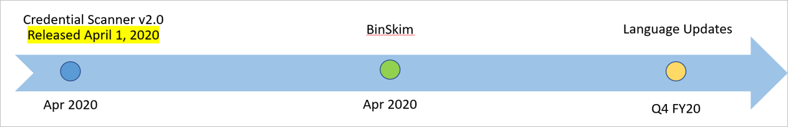

# Microsoft Security Code Analysis releases and roadmap

Microsoft Security Code Analysis team in partnership with Developer Support is proud to announce recent and upcoming enhancements to our MSCA extension. Please see Roadmap below.

## Credential Scanner v2.0: Released in April 2020

### Innovations & Improvements

- **Core Engine**

   - Average performance upgrade of 25% with near linear run times
   - Context/evidence based searching and ranking for increased accuracy
   - Improvements to general password detections and matching logic for obvious placeholders (for example, fakePassword)

- **Coverage** - Support for 25+ secret types including the following top requested:

   - Fabric account certificate Passphrase
   - Client Secret/API Key
   - HTTP authorization header
   - Amazon S3 Client Secret Access Key
   - Azure Active Directory Client Access Token
   - Azure Function Master/API Key
   - Power BI Access Key
   - Azure Resource Manager template password pattern

- **Outputs**

   - Support for SARIF 2.1 and CSV file output file formats

## BinSkim v1.6.0: Released in April 2020

### Improvements

- FEATURE: Update to final SARIF v2 (version 2.1.16). This enables results caching when passing --hashes on the command-line, a significant performance improvement when recursively analyzing directories with multiple copies of scan targets.
- BUG FIX: Fix typo in BA2021.DoNotMarkWritableSectionsAsExecutable output.
- PERFORMANCE: Eliminate PDB loading for all non-mixed-mode for managed assemblies, including IL Library (ahead of time compiled) binaries.
- FALSE NEGATIVE FIX: Verify that a PDB placed alongside a binary actually matches the binary under analysis
- FEATURE: Provide --local-symbol-directories argument to specify additional (local, non-symbol-server) PDB look-up locations
- FALSE POSITIVE FIX: Skip PDB-driven analysis for the generated .NET core native bootstrap exe (which is not user-controllable code).

## What's next in FY20?

- Java Security Analysis tool
- Python Security Analysis tool
- ES Lint to replace TS Lint for TypeScript and JavaScript

## Next steps

For instructions on how to onboard and install Microsoft Security Code Analysis, refer to our [Onboarding and installation guide](security-code-analysis-onboard.md).

If you have more questions about the extension and the tools offered, check out our [FAQ page](security-code-analysis-faq.md).
