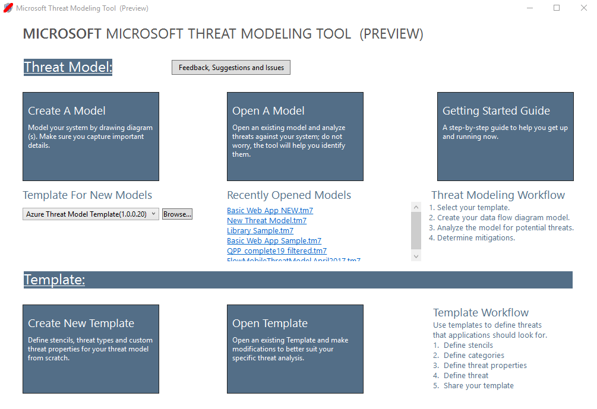
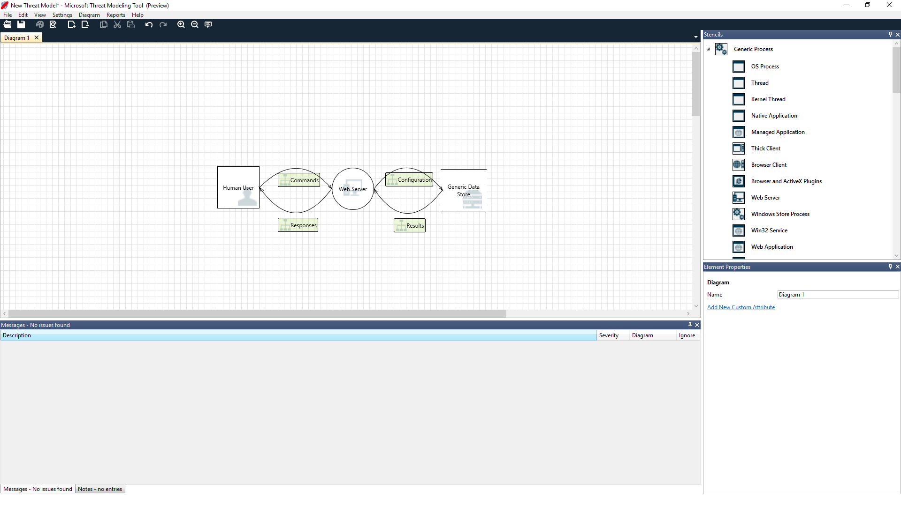
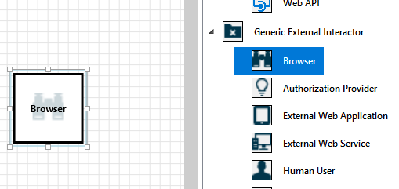
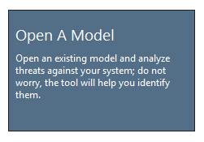
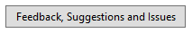
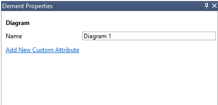
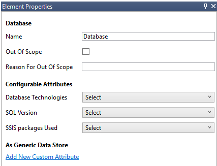
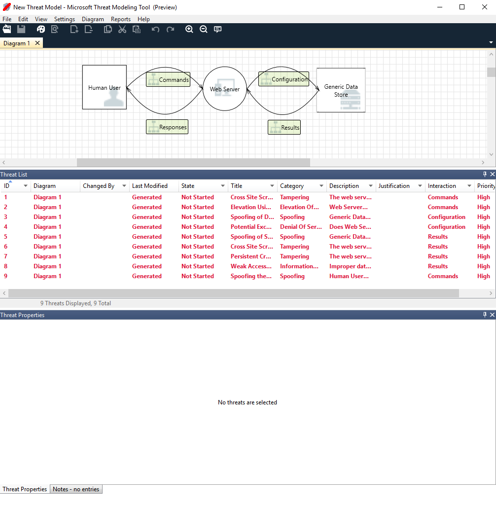
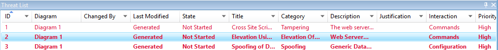
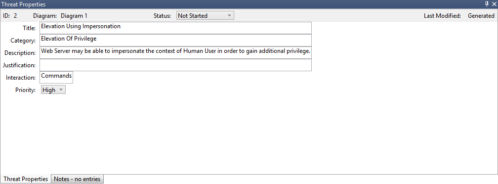

# Threat Modeling Tool feature overview

The Threat Modeling Tool can help you with your threat modeling needs. For a basic introduction to the tool, see [Get started with the Threat Modeling Tool](threat-modeling-tool-getting-started.md).

> [!NOTE]
>The Threat Modeling Tool is updated frequently, so check this guide often to see our latest features and improvements.

To open a blank page, select **Create A Model**.

To see the features currently available in the tool, use the threat model created by our team in the [Get started](threat-modeling-tool-getting-started.md) example.

## Navigation

Before we discuss the built-in features, let's review the main components found in the tool.

### Menu items

The experience is similar to other Microsoft products. Let's review the top-level menu items.

| Label                               | Details      |
| --------------------------------------- | ------------ |
| **File** | <ul><li>Open, save, and close files</li><li>Sign in and sign out of OneDrive accounts.</li><li>Share links (view and edit).</li><li>View file information.</li><li>Apply a new template to existing models.</li></ul> |
| **Edit** | Undo and redo actions, as well as copy, paste, and delete. |
| **View** | <ul><li>Switch between **Analysis** and **Design** views.</li><li>Open closed windows (for example, stencils, element properties, and messages).</li><li>Reset layout to default settings.</li></ul> |
| **Diagram** | Add and delete diagrams, and move through tabs of diagrams. |
| **Reports** | Create HTML reports to share with others. |
| **Help** | Find guides to help you use the tool. |

The symbols are shortcuts for the top-level menus:

| Symbol                               | Details      |
| --------------------------------------- | ------------ |
| **Open** | Opens a new file. |
| **Save** | Saves the current file. |
| **Design** | Opens the **Design** view, where you can create models. |
| **Analyze** | Shows generated threats and their properties. |
| **Add diagram** | Adds a new diagram (similar to new tabs in Excel). |
| **Delete diagram** | Deletes the current diagram. |
| **Copy/Cut/Paste** | Copies, cuts, and pastes elements. |
| **Undo/Redo** | Undoes and redoes actions. |
| **Zoom in/Zoom out** | Zooms in and out of the diagram for a better view. |
| **Feedback** | Opens the MSDN Forum. |

### Canvas

The canvas is the space where you drag and drop elements. Drag and drop is the quickest and most efficient way to build models. You can also right-click and select items from the menu to add generic versions of elements, as shown:

#### Drop the stencil on the canvas

#### Select the stencil

### Stencils

Based on the template you select, you can find all the stencils available to use. If you can't find the right elements, use another template. Or you can modify a template to fit your needs. Generally, you can find a combination of categories like these:

| Stencil name                               | Details      |
| --------------------------------------- | ------------ |
| **Process** | Applications, browser plug-ins, threads, virtual machines |
| **External interactor** | Authentication providers, browsers, users, web applications |
| **Data store** | Cache, storage, configuration files, databases, registry |
| **Data flow** | Binary, ALPC, HTTP, HTTPS/TLS/SSL, IOCTL, IPSec, named pipe, RPC/DCOM, SMB, UDP |
| **Trust line/Border boundary** | Corporate networks, internet, machine, sandbox, user/kernel mode |

### Notes/messages

| Component                               | Details      |
| --------------------------------------- | ------------ |
| **Messages** | Internal tool logic that alerts users whenever there's an error, such as no data flows between elements. |
| **Notes** | Manual notes are added to the file by engineering teams throughout the design and review process. |

### Element properties

Element properties vary by the elements you select. Apart from trust boundaries, all other elements contain three general selections:

| Element property                               | Details      |
| --------------------------------------- | ------------ |
| **Name** | Useful for naming your processes, stores, interactors, and flows so that they're easily recognized. |
| **Out of scope** | If selected, the element is taken out of the threat-generation matrix (not recommended). |
| **Reason for out of scope** | Justification field to let users know why out of scope was selected. |

Properties are changed under each element category. Select each element to inspect the available options. Or you can open the template to learn more. Let's review the features.

## Welcome screen

When you open the app, you see the **Welcome** screen.

### Open a model

Hover over **Open A Model** to reveal two options: **Open From This Computer** and **Open From OneDrive**. The first option opens the **File Open** screen. The second option takes you through the sign-in process for OneDrive. After successful authentication, you can select folders and files.

### Feedback, suggestions, and issues

When you select **Feedback, Suggestions and Issues**, you go to the MSDN Forum for SDL Tools. You can read what other people are saying about the tool, including workarounds and new ideas.

## Design view

When you open or create a new model, the **Design** view opens.

### Add elements

You can add elements on the grid in two ways:

- **Drag and drop**: Drag the desired element to the grid. Then use the element properties to provide additional information.
- **Right-click**: Right-click anywhere on the grid, and select items from the drop-down menu. A generic representation of the element you select appears on the screen.

### Connect elements

You can connect elements in two ways:

- **Drag and drop**: Drag the desired dataflow to the grid, and connect both ends to the appropriate elements.
- **Click + Shift**: Click the first element (sending data), press and hold the Shift key, and then select the second element (receiving data). Right-click, and select **Connect**. If you use a bi-directional data flow, the order is not as important.

### Properties

 To see the properties that can be modified on the stencils, select the stencil and the information populates accordingly. The following example shows before and after a **Database** stencil is dragged onto the diagram:

#### Before

#### After

### Messages

If you create a threat model and forget to connect data flows to elements, you get a notification. You can ignore the message, or you can follow the instructions to fix the issue. 

### Notes

To add notes to your diagram, switch from the **Messages** tab to the **Notes** tab.

## Analysis view

After you build your diagram, select the **Analysis** symbol (the magnifying glass) on the shortcuts toolbar to switch to the **Analysis** view.

### Generated threat selection

When you select a threat, you can use three distinct functions:

| Feature                               | Information      |
| --------------------------------------- | ------------ |
| **Read indicator** | 
The threat is marked as read, which helps you keep track of the items you reviewed.

 |
| **Interaction focus** | 
Interaction in the diagram that belongs to a threat is highlighted.

 |
| **Threat properties** | 
Additional information about the threat appears in the **Threat Properties** window.

 |

### Priority change

You can change the priority level of each generated threat. Different colors make it easy to identify high-, medium-, and low-priority threats.

### Threat properties editable fields

As seen in the preceding image, you can change the information generated by the tool. You can also add information to certain fields, such as justification. These fields are generated by the template. If you need more information for each threat, you can make modifications.

## Reports

After you finish changing priorities and updating the status of each generated threat, you can save the file and/or print out a report. Go to **Report** > **Create Full Report**. Name the report, and you should see something similar to the following image:

## Next steps

- Send your questions, comments and concerns to tmtextsupport@microsoft.com. **[Download](https://aka.ms/threatmodelingtool)** the Threat Modeling Tool to get started.
- To contribute a template for the community, go to our [GitHub](https://github.com/Microsoft/threat-modeling-templates) page.