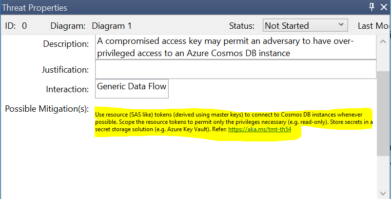
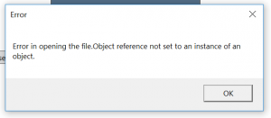
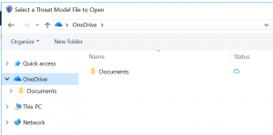

# Threat Modeling Tool GA release 7.1.50911.2 - 9/12/2018

We are excited to announce the Microsoft Threat Modeling Tool is now available to download as a supported generally available (GA) release. This release contains important privacy and security updates as well as bug fixes, feature updates, and stability improvements. Existing users of the 2017 Preview version will be prompted to update to the latest release through the ClickOnce technology upon opening the client. For new users of the tool, you can [download the client](https://aka.ms/threatmodelingtool).

With this release, we are ending support for the 2017 Preview and recommend all users of the Preview update to the GA release. On or after October 15 2018, we will set the minimum required ClickOnce version for the Threat Modeling Tool, and all Preview clients will be required to upgrade.

The Microsoft Threat Modeling Tool 2016, which is available from the [Microsoft Download Center](https://www.microsoft.com/en-us/download/details.aspx?id=49168), remains supported until October 1 2019 for critical security fixes only.

## Feature changes

### Azure stencil updates

Additional Azure stencils and their associated threats and mitigations have been added to the stencil set shipping with this release. Significant changes were made in the focus areas of “Azure App Services”, “Azure Database Offerings”, and “Azure Storage.”

### OneDrive integration feature removed

The “Save To OneDrive”, “Open From OneDrive”, and “Share a Link” features of the Preview have been removed. Users of OneDrive are encouraged to use Microsoft’s [OneDrive for Windows](https://onedrive.live.com/about/en-us/download/) client to access their files stored on OneDrive through the standard file save and open dialogs.

## Notable fixed bugs reported by customers

### In TMT Preview, the tool crashes when using the standard template

- When a Generic stencil (for example “Generic Data Flow”) is added to the drawing surface and generates threats, the tool may crash. This issue has been fixed.

### In TMT Preview, when I save a report or copy the threats, the risk levels are incorrect

- If a user modifies the Risk level of specific threats and then saves a report or copies the risks, the risk level may revert to “High”. This issue has been fixed.

## Known issues and FAQ

### Users of high-resolution screens may experience small text in the threat properties

#### Issue

In the Analysis View of the tool, if the user has a high-resolution screen that is set by default to magnify for readability in Windows, the “Possible Mitigation(s)” section of a threat may appear with small text.

#### Workaround

The user can click on the mitigation text and use the standard Windows zoom control (Crtl-Mouse Wheel Up) to increase the magnification of that section.

### Files in the “Recently Opened Models” section of the main window may fail to open

#### Issue

The “Open From OneDrive” feature of the Preview release has been removed. Users with “Recently Opened Models” that were saved to OneDrive will receive the following error.

#### Workaround

Users of OneDrive are encouraged to use Microsoft’s [OneDrive for Windows](https://onedrive.live.com/about/en-us/download/) client to access their files stored on OneDrive through the standard and “Open a model” dialog.

### My organization uses the 2016 version of the tool, can I use the Azure stencil set?

Yes, you can! The [Azure stencil set is available on GitHub](https://github.com/Microsoft/threat-modeling-templates/), and can be loaded in the 2016 version of the tool. To create a new model with the Azure stencil set, use the “Template For New Models” dialog on the main menu screen. TMT 2016 cannot render the links found in the “Possible Mitigations” fields of the Azure stencil set, therefore you may see links displayed as HTML tags.

## System requirements

- Supported Operating Systems
  - Microsoft Windows 10
- .NET Version Required
  - .NET 3.5.2
- Additional Requirements
  - An Internet connection is required to receive updates to the tool as well as templates.

## Documentation and feedback

- Documentation for the Threat Modeling Tool is located on [docs.microsoft.com](threat-modeling-tool.md), and includes information [about using the tool](threat-modeling-tool-getting-started.md).

## Next steps

Download the latest version of the [Microsoft Threat Modeling Tool](https://aka.ms/threatmodelingtool).
