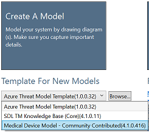

# Threat Modeling Tool update release 7.1.60702.1 - 7/2/2019

Version 7.1.60702.1 of the Microsoft Threat Modeling Tool (TMT) was released on July 2, 2019 and contains the following changes:

- Accessibility improvements
- Bug fixes
- Inclusion of an open-source community provided stencil set

## Feature changes

### A new medical devices stencil set provided by the open-source community is available

The open-source community has contributed a stencil set for modeling medical devices. After updating, the new stencil set will appear in the template selection drop-down menu. For information about contributing stencils or content to templates, review the information on the project's [GitHub page](https://github.com/Microsoft/threat-modeling-templates).

## System requirements

- Supported Operating Systems
  - [Microsoft Windows 10 Anniversary Update](https://blogs.windows.com/windowsexperience/2016/08/02/how-to-get-the-windows-10-anniversary-update/#HTkoK5Zdv0g2F2Zq.97) or later
- .NET Version Required
  - [.NET Framework 4.7.1](https://dotnet.microsoft.com/download/dotnet-framework) or later
- Additional Requirements
  - An Internet connection is required to receive updates to the tool and templates.

## Documentation and feedback

- Documentation for the Threat Modeling Tool is [located](threat-modeling-tool.md), and includes information [about using the tool](threat-modeling-tool-getting-started.md).

## Next steps

Download the latest version of the [Microsoft Threat Modeling Tool](https://aka.ms/threatmodelingtool).
