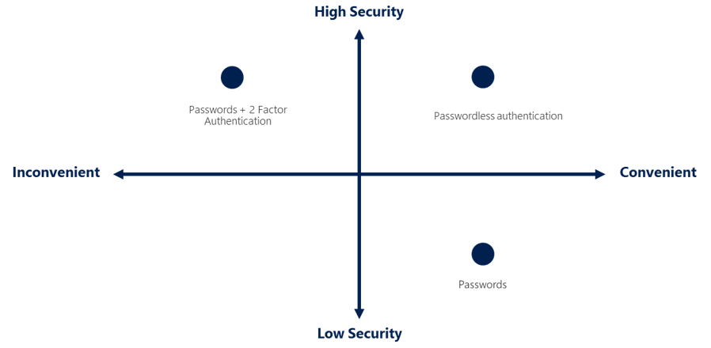
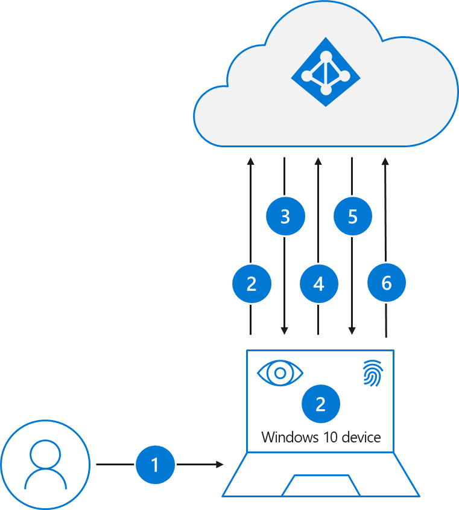
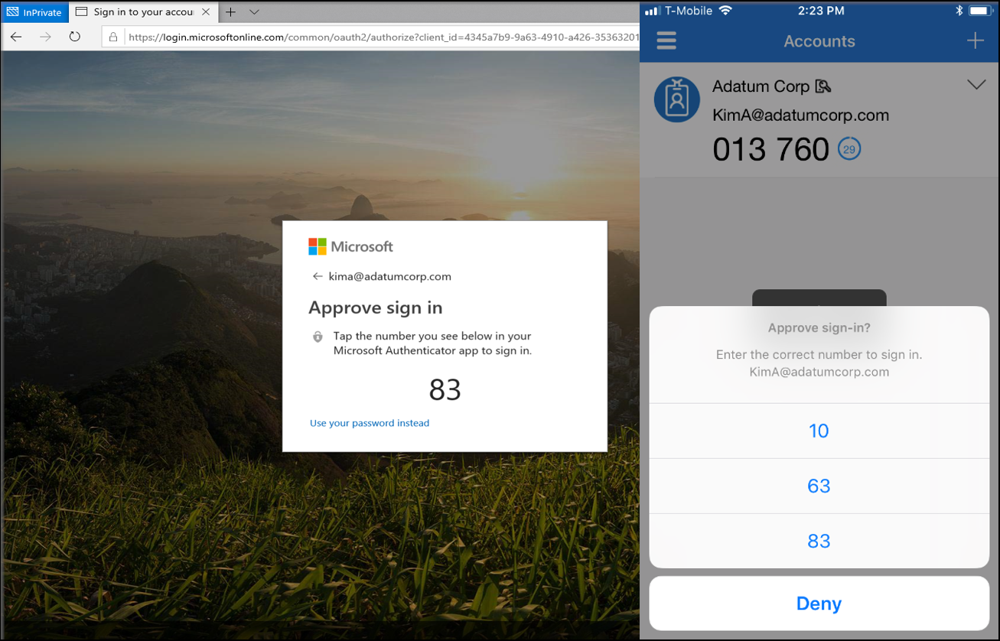
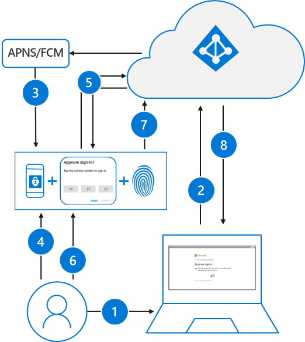
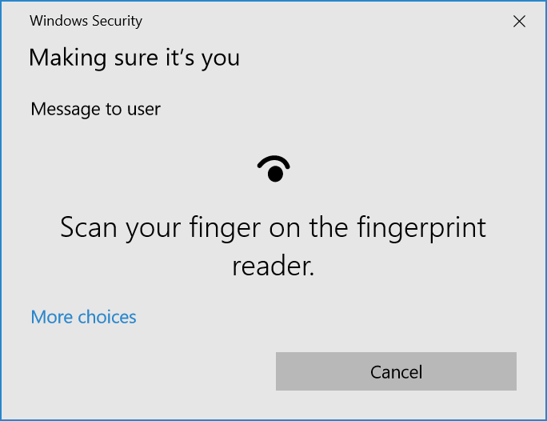
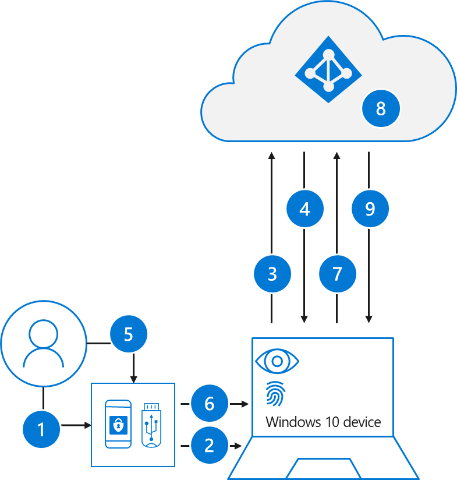

# A world without passwords with Azure Active Directory

It is time to break up your relationship with passwords. Passwords have been good to us in the past, but in today's digital workplace they have become a relatively easy attack vector for hackers. Hackers love passwords and it's not difficult to see why when you consider that most commonly rejected passwords in Azure Active Directory (Azure AD) include terms like the year, the month, the season, or a local sports team. Furthermore, [research has shown](https://aka.ms/passwordguidance) that traditional recommendations for password management such as length requirements, complexity requirements, and change frequencies are counterproductive for a variety of reasons related to human nature.

Three types of attacks commonly used to compromise user accounts are password spray, phishing, and breach replay. Azure AD features such as [smart lockout](../../active-directory/authentication/howto-password-smart-lockout.md), [banned passwords](../../active-directory/authentication/concept-password-ban-bad-on-premises.md), and [password protection](../../active-directory/authentication/concept-password-ban-bad-on-premises.md) can help protect against these kinds of attacks. Likewise, implementing [multi-factor authentication](../../active-directory/authentication/concept-mfa-howitworks.md) (MFA), or two-step verification, provides additional security by requiring a second form of authentication. But in the long run, a passwordless solution is the best solution for ensuring the most secure method of authentication.

This article is the beginning of your journey to help you understand and implement Microsoft's passwordless solutions and help you choose between one or more of the following options:

* **Windows Hello for Business**. In Windows 10, Windows Hello for Business replaces passwords with strong two-factor authentication on PCs and mobile devices. This authentication consists of a new type of user credential that is tied to a device and uses a biometric recognition or PIN.

* **Passwordless sign-in with Microsoft Authenticator**. The Microsoft Authenticator app can be used to sign in to an Azure AD account without using a password. Similar to the technology of Windows Hello for Business, the Microsoft Authenticator uses key-based authentication to enable a user credential that is tied to a device and uses a biometric or PIN.

* **FIDO2 security keys**. FIDO2 provides cryptographic login credentials that are unique across every website and are stored on a local device like Windows Hello or external security keys. These security keys are resistant to the risks of phishing, password theft, and replay attacks. Combined with user verification via biometrics or PIN, the solution is two factor verification meeting modern security needs.

## The future of passwordless authentication

These days, banks, credit card companies, and other organizations and online services often protect your account by requiring you to verify your identity twice: once by using your password, then again by phone, text, or an app. While multi-factor authentication addresses the security issue of passwords being shared, stolen, or guessed, it does not address the inconvenience factor of trying to remember them. What users and organizations want in today's cloud era is passwordless authentication methods that are highly secure *and* convenient.

Windows Hello for Business, passwordless sign-in with Microsoft Authenticator, and FIDO2 security keys all share a simple, common architecture that provide users with an authentication method that is both highly secure and convenient to use. All three are based on public/private-key technology, need a local gesture such as a biometric or PIN, and private-keys bound to a single device and securely stored and never shared.

## Windows Hello for Business

In Windows 10, Windows Hello for Business replaces passwords with strong two-factor authentication on PCs and devices. The authentication consists of a new type of user credential that is tied to a device and uses a biometric gesture or PIN that enables users to authenticate to Azure AD as well as an on-premises Active Directory. Simply signing into a device using Windows Hello for Business is easy. You either use a PIN or biometric gesture such as a fingerprint or facial recognition.

### Windows Hello for Business scenarios

Windows Hello for Business is ideal for information workers who have their own designated Windows PC. The biometric and credentials are directly tied to the user's PC, which prevents access from anyone other than the owner. With PKI integration and built-in support for single sign-on (SSO), Windows Hello for Business provides a simple and convenient method for seamlessly accessing corporate resources on-premises and in the cloud.

### Windows Hello for Business deployment considerations

Windows Hello for Business is a distributed system that uses several components to accomplish device registration, provisioning, and authentication. Therefore, deployment requires proper planning across multiple teams within the organization. The Windows Hello for Business [planning guide](https://docs.microsoft.com/windows/security/identity-protection/hello-for-business/hello-planning-guide) can be used to help you make decisions on the type of Windows Hello for Business deployment and the options you'll need to consider.

There are many options from which you can choose when deploying Windows Hello for Business. Providing multiple options ensures nearly every organization can deploy Windows Hello for Business. Consider the following types of deployments that are supported:

* [Hybrid Azure AD Joined Key Trust Deployment](https://docs.microsoft.com/windows/security/identity-protection/hello-for-business/hello-hybrid-key-trust)

* [Hybrid Azure AD Joined Certificate Trust Deployment](https://docs.microsoft.com/windows/security/identity-protection/hello-for-business/hello-hybrid-cert-trust)

* [Azure AD Join Single Sign-on Deployment Guides](https://docs.microsoft.com/windows/security/identity-protection/hello-for-business/hello-hybrid-aadj-sso)

* [On Premises Key Trust Deployment](https://docs.microsoft.com/windows/security/identity-protection/hello-for-business/hello-deployment-key-trust)

* [On Premises Certificate Trust Deployment](https://docs.microsoft.com/windows/security/identity-protection/hello-for-business/hello-deployment-cert-trust)

Providing many options makes the deployment appear complex. However, most organizations will likely determine that they've already implemented most of the infrastructure on which the Windows Hello for Business deployment depends. Regardless, it is important to understand that Windows Hello for Business is a distributed system and proper planning is recommended.

We recommend that you read [Planning a Windows Hello for Business Deployment](https://docs.microsoft.com/windows/security/identity-protection/hello-for-business/hello-planning-guide) to help you decide on the deployment model best suited for your particular organization. Then, based on the planning you make, refer to the [Windows Hello for Business Deployment Guide](https://docs.microsoft.com/windows/security/identity-protection/hello-for-business/hello-deployment-guide) to help ensure a successful deployment of Windows Hello for Business in your existing environment.

### How Windows Hello for Business works

#### User sets up Windows Hello for Business

After an initial two-step verification of the user during enrollment, Windows Hello is set up on the user's device and Windows asks the user to set a gesture, which can be a biometric, such as a fingerprint or facial recognition, or a PIN. Once set, the user provides the gesture to verify their identity. Windows then uses Windows Hello to authenticate users.

Based on the capabilities of your Windows 10 device, you will either have a built-in secure enclave, known as a hardware trusted platform module (TPM), or a software TPM. The TPM stores the private key, which requires either your face, fingerprint, or PIN to unlock it. The biometric data doesn't roam and is never sent to external devices or servers. There's no single collection point an attacker can compromise to steal biometric data, because Windows Hello only stores biometric identification data on the device.

> [!TIP]
> On the surface, a PIN feels like a password, but it's actually more secure. An important difference between a password and a PIN is that the PIN is tied to the specific device on which it was set up. Someone who steals your password can sign into your account from anywhere. But if they steal your PIN, they'd have to steal your physical device too! Furthermore, since a PIN is local to the device, it isn't transmitted anywhere so it can't be intercepted in transmission or stolen from a server.

#### User using Windows Hello for Business for sign-in

Windows Hello for Business biometrics and PINs use asymmetric (public/private key) encryption for authentication. During authentication, the encryption is tied to the TLS session key, which secures the authentication process so that a man-in-the-middle (MiTM) attack cannot steal the resulting security token or artifact and replay it from other places.

Windows Hello for Business provides a convenient sign-in experience that authenticates the user to Azure AD and Active Directory resources. Azure AD-joined devices authenticate to Azure during sign-in and can optionally authenticate to Active Directory. Hybrid Azure Active Directory joined devices authenticate to Active Directory during sign-in and authenticate to Azure Active Directory in the background.

The following steps illustrate the sign-in authentication to Azure Active Directory.

1. User signs into Windows using biometric or PIN gesture. The gesture unlocks the Windows Hello for Business private key and is sent to the Cloud Authentication security support provider, referred to as the Cloud AP provider.

2. The Cloud AP provider requests a nonce from Azure Active Directory.

3. Azure AD returns a nonce that is valid for 5 minutes.

4. The Cloud AP provider signs the nonce using the user's private key and returns the signed nonce to the Azure Active Directory.

5. Azure Active Directory validates the signed nonce using the user's securely registered public key against the nonce signature. After validating the signature, Azure AD then validates the returned signed nonce. After validating the nonce, Azure AD creates a PRT with session key that is encrypted to the device's transport key and returns it to the Cloud AP provider.

6. The Cloud AP provider receives the encrypted PRT with session key. Using the device's private transport key, the Cloud AP provider decrypts the session key and protects the session key using the device's TPM.

7. The Cloud AP provider returns a successful authentication response to Windows after which the user is able to access Windows as well as cloud and on-premises applications without the need of authenticating again (SSO).

For a deeper look at the authentication process in other scenarios involving Windows Hello for Business, see [Windows Hello for Business and Authentication](https://docs.microsoft.com/windows/security/identity-protection/hello-for-business/hello-how-it-works-authentication#azure-ad-join-authentication-to-active-directory-using-a-key).

#### User manages their Windows Hello for Business credentials

The [Microsoft PIN reset services](/windows/security/identity-protection/hello-for-business/hello-feature-pin-reset) is a feature in Azure AD that enables users to reset their PIN if needed. Using group policy, Microsoft Intune or a compatible MDM, an administrator can configure Windows 10 devices to securely use the Microsoft PIN reset service that enables users to reset their forgotten PIN through settings or above the lock screen without requiring re-enrollment.

Sometimes users have to fall back to using passwords. [Self-service password reset](../../active-directory/authentication/howto-sspr-deployment.md) (SSPR) is another Azure AD feature that enables users to reset their passwords without needing to contact IT staff. Users must register for or be registered for self-service password reset before using the service. During registration, the user chooses one or more authentication methods enabled by their organization. SSPR enables users to quickly get unblocked and continue working no matter where they are or the time of day. By allowing users to unblock themselves, your organization can reduce the non-productive time and high support costs for most common password-related issues.

## Passwordless sign-in with Microsoft Authenticator

Passwordless sign-in with Microsoft Authenticator is another passwordless solution that can be used to sign in to Azure AD accounts using phone sign-in. You must still verify your identity by providing something you know and something you have, but phone sign-in lets you skip entering your password and performs all your identity verification on your mobile device using your fingerprint, face, or PIN.

### Microsoft Authenticator passwordless scenarios

The Microsoft Authenticator app enables users to verify their identity and authenticate to their work or personal account. It can also be used to augment a password with a one-time passcode or push notification or replace the need for a password altogether. Instead of using a password, users confirm their identity using their mobile phone through fingerprint scan, facial or iris recognition, or PIN. Built on secure technology similar to what Windows Hello uses, this tool is packaged into a simple app on a mobile device making it a convenient option for users. The Microsoft Authenticator app is available for Android and iOS.

### Microsoft Authenticator deployment considerations

Prerequisites for using the Microsoft Authenticator app to do passwordless sign in to Azure AD include the following:

* End users are enabled for Azure Multi-Factor Authentication

* It is recommended users enroll their devices using Microsoft Intune or a third-party mobile device management (MDM) solution to ease the deployment of the app

Assuming these requirements are met, administrators enable passwordless phone sign-in in the tenant by using [Windows PowerShell.](../../active-directory/authentication/howto-authentication-passwordless-phone.md) Once phone sign-in is enabled in the tenant, end users may opt to sign-in using their phone by selecting their work or school account on the **Accounts** screen of the app, then selecting **Enable phone sign-in**.

Assuming passwordless sign-in is enabled by an administrator, end users will need to meet the following requirements:

* Enrolled in Azure Multi-Factor Authentication

* Latest version of Microsoft Authenticator installed on devices running iOS 8.0 or greater, or Android 6.0 or greater

* Work or school account with push notifications added to the app

To avoid the potential of getting locked out of your account or having to recreate accounts on a new device, it is recommended that you use Microsoft Authenticator to [backup your account credentials](../../active-directory/user-help/user-help-auth-app-backup-recovery.md) to the cloud. After backup, you can also use the app to recover your information on a new device, potentially avoiding getting locked out or having to recreate accounts.

Since most users are accustomed to using only passwords to authenticate, it is important that your organization educates users regarding this process. Awareness can reduce the likelihood that users call your help desk for any [issues](../../active-directory/authentication/howto-authentication-passwordless-phone.md) related to signing in using the Microsoft Authenticator app.

> [!NOTE]
> A potential point of failure for this solution is when a roaming user is in a location where there is no Internet connectivity. FIDO2 security keys and Windows Hello for Business are not subject to the same limitation.

### How passwordless sign-in with Microsoft Authenticator works

#### User sets up passwordless sign-in with Microsoft Authenticator

Before the Microsoft Authenticator app can be used as a passwordless solution to sign in to an Azure AD account, steps must be performed by both an administrator and the end users.

First, an administrator will need to [enable use of the app as a credential](../../active-directory/authentication/howto-authentication-passwordless-phone.md) in the tenant using Windows PowerShell. The administrator will also need to enable end users for Azure Multi-Factor Authentication (Azure MFA) and configure the Microsoft Authenticator app as one of the [verification methods](../../active-directory/authentication/howto-mfa-mfasettings.md#verification-methods).

End users will need to [download and install](../../active-directory/user-help/user-help-auth-app-download-install.md) the Microsoft Authenticator app and [set up their account](../../active-directory/user-help/security-info-setup-auth-app.md) to use the Microsoft Authenticator app as one of the verification methods.

> [!VIDEO https://www.youtube.com/embed/uWbkLuI4g30]

#### User using Microsoft Authenticator for passwordless sign-in

The Microsoft Authenticator app can be used to sign in to any Azure AD account without using a password. While the Windows 10 lock screen doesn't include the Microsoft Authenticator app as a sign-in option, users can still enter their username and then receive a push notification on their mobile device to verify presence. Users confirm their presence by matching a number on the sign-in screen, then providing a face scan, fingerprint, or PIN to unlock the private key and complete the authentication. This multi-factor verification method is more secure than a password and more convenient than entering a password and a code.

Passwordless authentication using Microsoft Authenticator follows the same basic pattern as Windows Hello for Business but is a little more complicated since the user needs to be identified so that Azure AD can find the Microsoft Authenticator app version being used.

1. The user enters their username.

2. Azure AD detects that the user has a strong credential and starts the Strong Credential flow.

3. Notification is sent to the app via Apple Push Notification Service (APNS) on iOS devices, or via Firebase Cloud Messaging (FCM) on Android devices.

4. The user receives the push notification and opens the app.

5. The app calls Azure AD and receives a proof-of-presence challenge and nonce.

6. The user completes the challenge by entering their biometric or PIN to unlock private key.

7. The nonce is signed with the private key and sent back to Azure AD.

8. Azure AD performs public/private key validation and returns a token.

#### User manages their passwordless sign-in with Microsoft Authenticator credentials

With [combined registration](../../active-directory/authentication/concept-registration-mfa-sspr-combined.md), users can register and get the benefits of both Azure Multi-Factor Authentication and self-service password reset. Users register and manage these settings by navigating to their [My Profile page](https://aka.ms/mysecurityinfo). In addition to enabling SSPR, combined registration supports multiple authentication methods and actions.

## FIDO2 security keys

FIDO2 is the latest version of FIDO Alliance standard and has two components - W3C's Web Authentication (WebAuthN) standard and the corresponding FIDO Alliance Client-to-Authenticator Protocol (CTAP2). The FIDO2 standards enable users to leverage hardware-, mobile-, and biometrics-based authenticators to easily authenticate with many apps and websites in mobile and desktop environments.

Microsoft and industry partners have been working together on FIDO2 security devices for Windows Hello to enable easy and secure authentication on shared devices. FIDO2 security keys allow you to carry your credential with you and safely authenticate to an [Azure AD](https://aka.ms/azuread418)-joined Windows 10 device that's part of your organization.

WebAuthN defines an API that enables the development and implementation of strong, passwordless authentication by web apps and services. The CTAP protocol enables external devices such as FIDO-compliant security keys to work with WebAuthN and serve as authenticators. With Web Authentication, users can sign in to online services with their face, fingerprint, PIN, or portable FIDO2 security keys, leveraging strong public-key credentials instead of passwords. Currently WebAuthN is supported in Microsoft Edge and support for Chrome and Firefox is in development.

Devices and tokens that adhere to FIDO2, WebAuthN, and CTAP protocols bring about a cross-platform solution of strong authentication without using passwords. Microsoft partners are working on a variety of security key form factors, such as USB security keys and NFC-enabled smart cards.

### FIDO2 security keys scenarios

FIDO2 security keys can be used to sign in to Azure AD by choosing the security key as the credential provider at the Windows 10 lock screen. A username or password is not required which makes it an ideal solution for first line workers who share PCs among multiple users. They are also an excellent authentication option when corporate policies dictate that a user's credentials must be physically separate from their device. Users can also choose to sign in to web sites by using their FIDO2 security key inside of the Microsoft Edge browser on Windows 10 version 1809 or higher.

### FIDO2 security keys deployment considerations

Administrators can enable FIDO2 support in Azure AD and assign the capability to users or groups. Polices can also be created for how keys are provisioned and configure restrictions such as allowing or blocking a specific set of hardware security keys. Keys must be physically distributed to end users.

**The requirements for enabling passwordless sign in to Azure AD and web sites using FIDO2 security keys include the following:**

* Azure AD

* Azure Multi-Factor Authentication

* Combined registration preview

* FIDO2 security key preview requires a compatible FIDO2 security key

* Web authentication (WebAuthN) requires Microsoft Edge on Windows 10 version 1809 or higher

* FIDO2 based Windows sign in requires Azure AD joined Windows 10 version 1809 or higher (the best experience is on Windows 10 version 1903 or higher)

FIDO2-compliant form factors include USB, NFC, and Bluetooth devices. We recommend you choose the form factor that meets your specific needs since some platforms and browsers are not yet FIDO2-compliant.

We also recommend that each organization create a protocol for users and administrators to follow should a security key be lost or stolen. Users should report the lost or stolen key so that administrators or the user can delete their security keys from the user's profile and provision a new one.

### How FIDO2 security keys works

#### User sets up FIDO2 security key

While administrators can [manually provision keys](https://docs.microsoft.com/azure/active-directory/authentication/concept-authentication-passwordless) and distribute them to end users, provisioning and enabling the FIDO2 credential provider on the Windows 10 lock screen will be supported through [Intune](https://docs.microsoft.com/intune/windows-enrollment-methods). Administrators will also need to use the [Azure portal](https://portal.azure.com/) to enable hardware token devices as a passwordless authentication method.

Deploying FIDO2 security keys also requires that users register their keys using [combined registration](../../active-directory/authentication/concept-registration-mfa-sspr-combined.md). With combined registration, users register once and get the benefits of both Azure Multi-Factor Authentication and single sign-on password reset (SSPR).

In addition to selecting the hardware token as the default multi-factor authentication method, it is recommended that you also select an additional verification option.

* Microsoft Authenticator -- notification

* Authenticator app or hardware token -- code

* Phone call

* Text message

#### User using FIDO2 security key for sign-in

FIDO2 provides an abstraction layer between the form factor being used as the authenticator and public/private-key cryptography to enable built-in platform authenticators such as Windows Hello and security keys to resolve to a private-key and deliver a public key that can be used as an identifier to access external resources. FIDO2 security keys are equipped with their own built-in secure enclave that stores the private key and requires the biometric or PIN to unlock it. Credentials cannot be reused, replayed, or shared across services, and are not subject to phishing and MiTM attacks or server breaches.

FIDO2 security keys provide secure authentication, independent of the form factor. The security key holds the credential and should be protected with an additional second factor like a fingerprint (integrated into the security key) or a PIN to be entered at the Windows sign-in. Microsoft partners are working on a variety of security key form factors. Some examples include USB security keys, and NFC enabled smart cards.

> [!NOTE]
> A security key MUST implement certain features and extensions from the FIDO2 CTAP protocol to be [Microsoft-compatible](https://aka.ms/fido2securitykeys). Microsoft has tested these solutions for compatibility with Windows 10 and Azure Active Directory.

1. The user plugs the FIDO2 device into the computer.

2. Windows detects the FIDO2 security key.

3. Windows sends an authentication request.

4. Azure AD sends back a nonce.

5. The user completes their gesture to unlock the private key stored in the FIDO2 security key's secure enclave.

6. The FIDO2 security key signs the nonce with the private key.

7. The PRT token request with signed nonce is sent to Azure AD.

8. Azure AD verifies the signed nonce using the FIDO2 public key.

9. Azure AD returns PRT to enable access to on-premises resources.

#### User manages their FIDO2 security key credentials

Similar to the Microsoft Authenticator app, credential management for FIDO2 security keys relies on combined registration experience for end users.

## Deciding a passwordless method

Choosing between these three passwordless options depends on your company's security, platform, and app requirements.

Here are some factors for you to consider when choosing Microsoft password-less technology:

||**Windows Hello for Business**|**Passwordless sign-in with the Microsoft Authenticator app**|**FIDO2 security keys**|
|:-|:-|:-|:-|
|**Pre-requisite**| Windows 10, version 1809 or later Azure Active Directory| Microsoft Authenticator app Phone (iOS and Android devices running Android 6.0 or above.)|Windows 10, version 1809 or later Azure Active Directory|
|**Mode**|Platform|Software|Hardware|
|**Systems and devices**|PC with a built-in Trusted Platform Module (TPM) PIN and biometrics recognition |PIN and biometrics recognition on phone|FIDO2 security devices that are Microsoft compatible|
|**User experience**|Sign in using a PIN or biometric recognition (facial, iris, or fingerprint) with Windows devices. Windows Hello authentication is tied to the device; the user needs both the device and a sign-in component such as a PIN or biometric factor to access corporate resources.|Sign in using a mobile phone with fingerprint scan, facial or iris recognition, or PIN. Users sign in to work or personal account from their PC or mobile phone.|Sign in using FIDO2 security device (biometrics, PIN, and NFC) User can access device based on organization controls and authenticate based on PIN, biometrics using devices such as USB security keys and NFC-enabled smartcards, keys, or wearables.|
|**Enabled scenarios**| Password-less experience with Windows device. Applicable for dedicated work PC with ability for single sign-on to device and applications.|Password-less anywhere solution using mobile phone. Applicable for accessing work or personal applications on the web from any device.|Password-less experience for workers using biometrics, PIN, and NFC. Applicable for shared PCs and where a mobile phone is not a viable option (such as for help desk personnel, public kiosk, or hospital team)|

Use the following table to choose which method will support your requirements and users.

|Persona|Scenario|Environment|Passwordless technology|
|:-|:-|:-|:-|
|**Admin**|Secure access to a device for management tasks|Assigned Windows 10 device|Windows Hello for Business and/or FIDO2 security key|
|**Admin**|Management tasks on non-Windows devices| Mobile or non-windows device|Passwordless sign-in with the Microsoft Authenticator app|
|**Information worker**|Productivity work|Assigned Windows 10 device|Windows Hello for Business and/or FIDO2 security key|
|**Information worker**|Productivity work| Mobile or non-windows device|Passwordless sign-in with the Microsoft Authenticator app|
|**Frontline worker**|Kiosks in a factory, plant, retail, or data entry|Shared Windows 10 devices|FIDO2 Security keys|

## Getting started

Passwordless authentication is the wave of the future and the path to a more secure environment. It is recommended that organizations begin planning for this change and reducing their dependencies on passwords. To get started, consider the following goals:

* Enable users for MFA + Microsoft Authenticator app + Conditional Access.

* Rollout Azure AD Password Protection + update policies.

* Enable users for SSPR with combined registration.

* Deploy Microsoft Authenticator App for mobility.

* Deploy Windows Hello for Business (1909: stay current).

* Deploy FIDO2 devices for users who can't use phones.

* When possible, disable password-based authentication.

To achieve these goals, we recommend the following approach:

1. Enable Azure Active Directory to take full advantage of features such as Azure MFA and Conditional Access.

2. Enable multi-factor authentication to provide additional protection.

3. Enable Self-Service Password Reset in the event users need to fall back to using a password.

4. Deploy Microsoft Authenticator phone sign-in for added mobility.

5. Deploy Windows Hello for Business to all your Windows 10 devices.

6. Prepare for FIDO2 security keys.

> [!NOTE]
> Refer to the Azure Active Directory [licensing page](https://azure.microsoft.com/pricing/details/active-directory/) for details on the licensing requirements for passwordless methods.

## Conclusion

Over the past few years, Microsoft has continued their commitment to enabling a world without passwords. With Windows 10, Microsoft introduced Windows Hello for Business, a strong, hardware protected two-factor credential that enables single-sign on to Azure Active Directory and Active Directory. Similar to the technology of Windows Hello for Business, the Microsoft Authenticator app uses key-based authentication to enable a user credential that is tied to a mobile device and uses a biometric or PIN. Now FIDO2 security keys allow you to carry your credential with you and sign in to Azure AD by choosing the security key as the credential provider at the Windows 10 lock screen. All three of these passwordless solutions reduce the risk of phishing, password spray and replay attacks and provide users with a highly secure and convenient way to sign in and access data from anywhere.

The adoption of modern multi-factor authentication technologies such as biometrics and public key cryptography in widely accessible devices is one of the most impactful steps that can meaningfully reduce a company's identity risk. Going passwordless is a long-term approach for secure authentication, and it's still evolving. Given emerging requirements, organizations can prepare themselves by making a plan to start moving to passwordless technologies.

## Next steps

* An overview of [what is passwordless?](../../active-directory/authentication/concept-authentication-passwordless.md)
* [How to enable passwordless in Azure AD](https://docs.microsoft.com/azure/active-directory/authentication/concept-authentication-passwordless)
