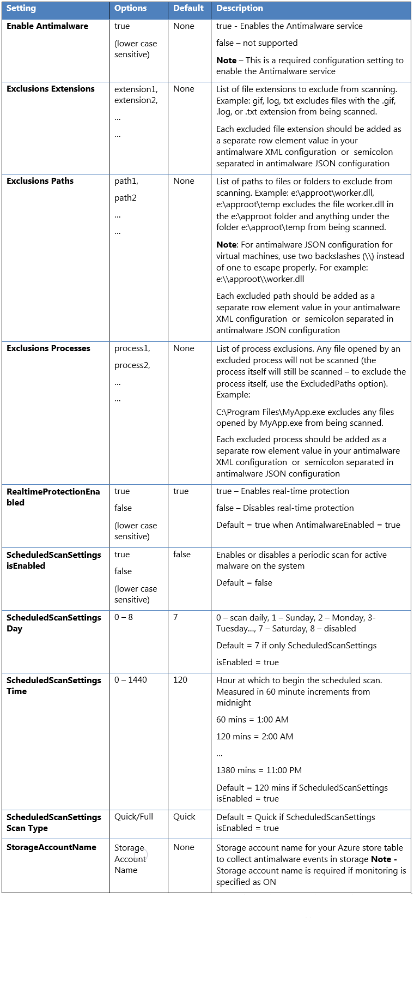

# Microsoft Antimalware for Azure Cloud Services and Virtual Machines (VMs)

Microsoft Antimalware for Azure is a free real-time protection that helps identify and remove viruses, spyware, and other malicious software. It generates alerts when known malicious or unwanted software tries to install itself or run on your Azure systems.

The solution is built on the same antimalware platform as Microsoft Security Essentials (MSE), Microsoft Forefront Endpoint Protection, Microsoft System Center Endpoint Protection, Microsoft Intune, and Microsoft Defender for Cloud. Microsoft Antimalware for Azure is a single-agent solution for applications and tenant environments, designed to run in the background without human intervention. Protection can be deployed based on the needs of application workloads, with either basic secure-by-default or advanced custom configuration, including antimalware monitoring.

When you deploy and enable Microsoft Antimalware for Azure for your applications, the following core features are available:

* **Real-time protection** - monitors activity in Cloud Services and on Virtual Machines to detect and block malware execution.
* **Scheduled scanning** - Scans periodically to detect malware, including actively running programs.
* **Malware remediation** - automatically takes action on detected malware, such as deleting or quarantining malicious files and cleaning up malicious registry entries.
* **Signature updates** - automatically installs the latest protection signatures (virus definitions) to ensure protection is up-to-date on a predetermined frequency.
* **Antimalware Engine updates** - automatically updates the Microsoft Antimalware engine.
* **Antimalware Platform updates** - automatically updates the Microsoft Antimalware platform.
* **Active protection** - reports telemetry metadata about detected threats and suspicious resources to Microsoft Azure to ensure rapid response to the evolving threat landscape and enables real-time synchronous signature delivery through the Microsoft Active Protection System (MAPS).
* **Samples reporting** - provides and reports samples to the Microsoft Antimalware service to help refine the service and enable troubleshooting.
* **Exclusions** - allows application and service administrators to configure exclusions for files, processes, and drives.  
* **Antimalware event collection** - records the antimalware service health, suspicious activities, and remediation actions taken in the operating system event log and collects them into the customer's Azure Storage account.

> [!NOTE]
> Microsoft Antimalware can also be deployed using Microsoft Defender for Cloud. Read [Install Endpoint Protection in Microsoft Defender for Cloud](/azure/defender-for-cloud/integration-defender-for-endpoint) for more information.

## Architecture

Microsoft Antimalware for Azure consists of several components:
- The Microsoft Antimalware Client and Service
- Antimalware classic deployment model
- Antimalware PowerShell cmdlets
- Azure Diagnostics Extension

### Platform Support and Deployment

**Virtual Machines:**
- Not installed by default
- Available as an optional security extension through the Azure portal or Visual Studio Virtual Machine configuration
- Supported on Windows Server 2008 R2, Windows Server 2012, and Windows Server 2012 R2
- Not supported on Windows Server 2008 and Linux operating systems

**Cloud Services:**
- Installed by default in a disabled state on all supported Azure guest operating systems
- Requires explicit activation to protect your cloud service

**Azure App Service:**
- Enabled on the underlying service hosting Windows-based web apps
- Limited to protecting Azure App Service infrastructure only, not customer content
- Not sufficient for complete web application security (implement more security controls as outlined in the [Azure Web Application Security Best Practices](/azure/app-service/security-baseline))

> [!NOTE]
> Microsoft Defender Antivirus is the built-in Antimalware enabled in Windows Server 2016 and above.
> The Azure VM Antimalware extension can still be added to a Windows Server 2016 and above Azure VM with Microsoft Defender Antivirus. In this scenario, the extension applies any optional [configuration policies](antimalware.md#default-and-custom-antimalware-configuration) to be used by Microsoft Defender Antivirus. The extension does not deploy any other antimalware services.
> For more information about Microsoft Defender Antivirus, see [Code samples to enable and configure Microsoft Antimalware for Azure](antimalware-code-samples.md).

### Microsoft antimalware workflow

The Azure service administrator can enable Antimalware for Azure with a default or custom configuration for your Virtual Machines and Cloud Services using the following options:

* Virtual Machines - In the Azure portal, under **Security Extensions**
* Virtual Machines - Using the Visual Studio virtual machines configuration in Server Explorer
* Virtual Machines and Cloud Services - Using the Antimalware [classic deployment model](/previous-versions/azure/ee460799(v=azure.100))
* Virtual Machines and Cloud Services - Using Antimalware PowerShell cmdlets

The Azure portal or PowerShell cmdlets push the Antimalware extension package file to the Azure system at a predetermined fixed location. The Azure Guest Agent (or the Fabric Agent) launches the Antimalware Extension, applying the Antimalware configuration settings supplied as input. This step enables the Antimalware service with either default or custom configuration settings. If no custom configuration is provided, then the antimalware service is enabled with the default configuration settings. For more information about Antimalware configuration, see [Code samples to enable and configure Microsoft Antimalware for Azure](antimalware-code-samples.md).

After initialization, the Microsoft Antimalware client automatically retrieves the latest protection engine and signature definitions from the Internet and applies them to your Azure system. The service logs all activity to the operating system event log under the "Microsoft Antimalware" event source. These logs include information about:

* Client health status
* Protection and remediation activities
* Configuration changes
* Engine and signature definition updates
* Other operational events

You can enable Antimalware monitoring for your Cloud Service or Virtual Machine to have the Antimalware event log events written as they're produced to your Azure storage account. The Antimalware Service uses the Azure Diagnostics extension to collect Antimalware events from the Azure system into tables in the customer's Azure Storage account.

The deployment workflow including configuration steps and options supported for the above scenarios are documented in [Antimalware deployment scenarios](#antimalware-deployment-scenarios) section of this document.

> [!NOTE]
> You can however use PowerShell/APIs and Azure Resource Manager templates to deploy Virtual Machine Scale Sets with the Microsoft Anti-Malware extension. For installing an extension on an already running Virtual Machine, you can use the sample Python script [vmssextn.py](https://github.com/gbowerman/vmsstools#vmssextn). This script gets the existing extension config on the Scale Set and adds an extension to the list of existing extensions on the Azure Virtual Machines Scale Sets.

### Default and Custom Antimalware Configuration

The default configuration settings are applied to enable Antimalware for Azure Cloud Services or Virtual Machines when you don't provide custom configuration settings. The default configuration settings are preoptimized for running in the Azure environment. Optionally, you can customize these default configuration settings as required for your Azure application or service deployment and apply them for other deployment scenarios.

The following table summarizes the configuration settings available for the Antimalware service. The default configuration settings are marked under the column labeled "Default."

## Antimalware Deployment Scenarios

The scenarios to enable and configure antimalware, including monitoring for Azure Cloud Services and Virtual Machines, are discussed in this section.

### Virtual machines - enable and configure antimalware

#### Deployment While creating a VM using the Azure portal

Follow these steps to enable and configure Microsoft Antimalware for Azure Virtual Machines using the Azure portal while provisioning a Virtual Machine:

1. Sign in to the [Azure portal](https://portal.azure.com).
2. To create a new virtual machine, navigate to **Virtual machines**, select **Add**, and choose **Windows Server**.
3. Select the version of Windows server that you would like to use.
4. Select **Create**.
    
5. Provide a **Name**, **Username**, **Password**, and create a new resource group or choose an existing resource group.
6. Select **Ok**.
7. Choose a vm size.
8. In the next section, make the appropriate choices for your needs select the **Extensions** section.
9. Select **Add extension**
10. Under **New resource**, choose **Microsoft Antimalware**.
11. Select **Create**
12. In the **Install extension** section file, locations, and process exclusions can be configured as well as other scan options. Choose **Ok**.
13. Choose **Ok**.
14. Back in the **Settings** section, choose **Ok**.
15. In the **Create** screen, choose **Ok**.

See this [Azure Resource Manager template](https://github.com/Azure/azure-quickstart-templates/blob/master/demos/anti-malware-extension-windows-vm/azuredeploy.json#L259) for deployment of Antimalware VM extension for Windows.

#### Deployment using the Visual Studio virtual machine configuration

To enable and configure the Microsoft Antimalware service using Visual Studio:

1. Connect to Microsoft Azure in Visual Studio.

2. Choose your Virtual Machine in the **Virtual Machines** node in **Server Explorer**

   

3. Right-click **configure** to view the Virtual Machine configuration page

4. Select **Microsoft Antimalware** extension from the dropdown list under **Installed Extensions** and select **Add** to configure with default antimalware configuration.
    
5. To customize the default Antimalware configuration, select (highlight) the Antimalware extension in the installed extensions list and select **Configure**.

6. Replace the default Antimalware configuration with your custom configuration in supported JSON format in the **public configuration** textbox and select OK.

7. Select the **Update** button to push the configuration updates to your Virtual Machine.

    

> [!NOTE]
> The Visual Studio Virtual Machines configuration for Antimalware supports only JSON format configuration. For more information about sample configurations, see [Code samples to enable and configure Microsoft Antimalware for Azure](antimalware-code-samples.md).

#### Deployment Using PowerShell cmdlets

An Azure application or service can enable and configure Microsoft Antimalware for Azure Virtual Machines using PowerShell cmdlets.

To enable and configure Microsoft Antimalware using PowerShell cmdlets:

1. Set up your PowerShell environment - Refer to the documentation at <https://github.com/Azure/azure-powershell>
2. Use the [Set-AzureVMMicrosoftAntimalwareExtension](/powershell/module/servicemanagement/azure/set-azurevmmicrosoftantimalwareextension) cmdlet to enable and configure Microsoft Antimalware for your Virtual Machine.

> [!NOTE]
>The Azure Virtual Machines configuration for Antimalware supports only JSON format configuration. For more information about sample configurations, see [Code samples to enable and configure Microsoft Antimalware for Azure](antimalware-code-samples.md).

### Enable and Configure Antimalware Using PowerShell cmdlets

An Azure application or service can enable and configure Microsoft Antimalware for Azure Cloud Services using PowerShell cmdlets. Microsoft Antimalware is installed in a disabled state in the Cloud Services platform and requires an action by an Azure application to enable it.

To enable and configure Microsoft Antimalware using PowerShell cmdlets:

1. Set up your PowerShell environment - Refer to the documentation at <https://github.com/Azure/azure-powershell>
2. Use the [Set-AzureServiceExtension](/powershell/module/servicemanagement/azure/set-azureserviceextension) cmdlet to enable and configure Microsoft Antimalware for your Cloud Service.

For more information about sample PowerShell commands, see [Code samples to enable and configure Microsoft Antimalware for Azure](antimalware-code-samples.md).

### Cloud Services and Virtual Machines - Configuration Using PowerShell cmdlets

An Azure application or service can retrieve the Microsoft Antimalware configuration for Cloud Services and Virtual Machines using PowerShell cmdlets.

To retrieve the Microsoft Antimalware configuration using PowerShell cmdlets:

1. Set up your PowerShell environment - Refer to the documentation at <https://github.com/Azure/azure-powershell>
2. **For Virtual Machines**: Use the [Get-AzureVMMicrosoftAntimalwareExtension](/powershell/module/servicemanagement/azure/get-azurevmmicrosoftantimalwareextension) cmdlet to get the antimalware configuration.
3. **For Cloud Services**: Use the [Get-AzureServiceExtension](/powershell/module/servicemanagement/azure/get-azureserviceextension) cmdlet to get the Antimalware configuration.

## Samples

### Remove Antimalware Configuration Using PowerShell cmdlets

An Azure application or service can completely remove Microsoft Antimalware protection by uninstalling the relevant extensions from your Cloud Services or Virtual Machines. This process removes both the antimalware protection and associated monitoring settings, completely discontinuing malware protection and event collection for the specified resources.

To remove Microsoft Antimalware using PowerShell cmdlets:

1. Set up your PowerShell environment - Refer to the documentation at <https://github.com/Azure/azure-powershell>
2. **For Virtual Machines**: Use the [Remove-AzureVMMicrosoftAntimalwareExtension](/powershell/module/servicemanagement/azure/remove-azurevmmicrosoftantimalwareextension) cmdlet.
3. **For Cloud Services:** Use the [Remove-AzureServiceExtension](/powershell/module/servicemanagement/azure/remove-azureserviceextension) cmdlet.

To **enable** antimalware event collection for a virtual machine using the Azure Preview Portal:

1. Select any part of the Monitoring section in the Virtual Machine details page.
2. Select the Diagnostics command in the Metrics section.
3. Select **Status** ON and check the option for Windows event system.
4. You can choose to uncheck all other options in the list, or leave them enabled per your application service needs.
5. The Antimalware event categories "Error", "Warning", "Informational", etc., are captured in your Azure Storage account.

Antimalware events are collected from the Windows event system logs to your Azure Storage account. You can configure the Storage Account for your Virtual Machine to collect Antimalware events by selecting the appropriate storage account.

### Enable and configure Antimalware using PowerShell cmdlets for Azure Resource Manager VMs

To enable and configure Microsoft Antimalware for Azure Resource Manager VMs using PowerShell cmdlets:

1. Set up your PowerShell environment using this [documentation](https://github.com/Azure/azure-powershell) on GitHub.
2. Use the [Set-AzVMExtension](/powershell/module/az.compute/set-azvmextension) cmdlet to enable and configure Microsoft Antimalware for your VM.

The following code samples are available:

- [Deploy Microsoft Antimalware on ARM template VMs](antimalware-code-samples.md#deploy-microsoft-antimalware-on-azure-resource-manager-vms)
- [Add Microsoft Antimalware to Azure Service Fabric Clusters](antimalware-code-samples.md#add-microsoft-antimalware-to-azure-service-fabric-clusters)

### Enable and configure Antimalware to Azure Cloud Service Extended Support (CS-ES) using PowerShell cmdlets

To enable and configure Microsoft Antimalware using PowerShell cmdlets:

1. Set up your PowerShell environment - Refer to the documentation at <https://github.com/Azure/azure-powershell>
2. Use the [New-AzCloudServiceExtensionObject](/powershell/module/az.cloudservice/new-azcloudserviceextensionobject) cmdlet to enable and configure Microsoft Antimalware for your Cloud Service VM.

The following code sample is available:

- [Add Microsoft Antimalware to Azure Cloud Service using Extended Support(CS-ES)](antimalware-code-samples.md#add-microsoft-antimalware-to-azure-cloud-service-using-extended-support)

### Enable and configure Antimalware using PowerShell cmdlets for Azure Arc-enabled servers

To enable and configure Microsoft Antimalware for Azure Arc-enabled servers using PowerShell cmdlets:

1. Set up your PowerShell environment using this [documentation](https://github.com/Azure/azure-powershell) on GitHub.
2. Use the [New-AzConnectedMachineExtension](/azure/azure-arc/servers/manage-vm-extensions-powershell) cmdlet to enable and configure Microsoft Antimalware for your Arc-enabled servers.

The following code samples are available:

- [Add Microsoft Antimalware for Azure Arc-enabled servers](antimalware-code-samples.md#add-microsoft-antimalware-for-azure-arc-enabled-servers)

## Next steps

- [Code samples to enable and configure Microsoft Antimalware for Azure](antimalware-code-samples.md)
- [Microsoft Defender for Cloud](/azure/defender-for-cloud/)

