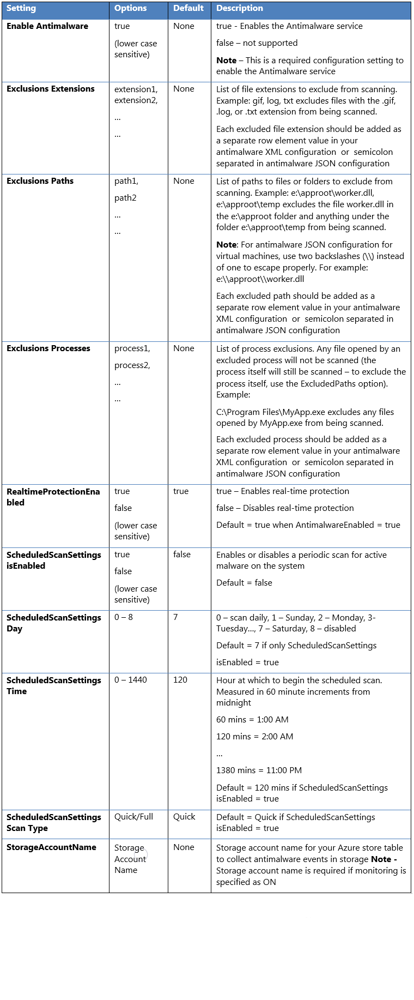

# Microsoft Antimalware for Azure Cloud Services and Virtual Machines (VMs)

Microsoft Antimalware for Azure is a free real-time protection solution that helps identify and remove viruses, spyware, and other malicious software. It generates alerts when known malicious or unwanted software tries to install itself or run on your Azure systems.

This solution uses the same antimalware platform as Microsoft Security Essentials (MSE), Microsoft Forefront Endpoint Protection, Microsoft System Center Endpoint Protection, Microsoft Intune, and Microsoft Defender for Cloud. Microsoft Antimalware for Azure is a single-agent solution for applications and tenant environments, designed to run in the background without human intervention. You can deploy protection based on the needs of application workloads, with either basic secure-by-default or advanced custom configuration, including antimalware monitoring.

When you deploy and enable Microsoft Antimalware for Azure for your applications, the following core features are available:

* **Real-time protection** - monitors activity in Cloud Services and on Virtual Machines to detect and block malware execution.
* **Scheduled scanning** - Scans periodically to detect malware, including actively running programs.
* **Malware remediation** - automatically takes action on detected malware, such as deleting or quarantining malicious files and cleaning up malicious registry entries.
* **Signature updates** - automatically installs the latest protection signatures (virus definitions) to ensure protection is up-to-date on a predetermined frequency.
* **Antimalware Engine updates** - automatically updates the Microsoft Antimalware engine.
* **Antimalware Platform updates** - automatically updates the Microsoft Antimalware platform.
* **Active protection** - reports telemetry metadata about detected threats and suspicious resources to Microsoft Azure to ensure rapid response to the evolving threat landscape and enables real-time synchronous signature delivery through the Microsoft Active Protection System (MAPS).
* **Samples reporting** - provides and reports samples to the Microsoft Antimalware service to help refine the service and enable troubleshooting.
* **Exclusions** - allows application and service administrators to configure exclusions for files, processes, and drives.
* **Antimalware event collection** - records the antimalware service health, suspicious activities, and remediation actions taken in the operating system event log and collects them into the customer's Azure Storage account.

> [!NOTE]
> You can also deploy Microsoft Antimalware by using Microsoft Defender for Cloud. For more information, see [Install Endpoint Protection in Microsoft Defender for Cloud](/azure/defender-for-cloud/integration-defender-for-endpoint).

## Architecture

Microsoft Antimalware for Azure consists of several components:
- The Microsoft Antimalware Client and Service
- Antimalware classic deployment model
- Antimalware PowerShell cmdlets
- Azure Diagnostics Extension

### Platform support and deployment

**Virtual machines:**
- Not installed by default
- Available as an optional security extension through the Azure portal or Visual Studio Virtual Machine configuration
- Supported on Windows Server 2008 R2, Windows Server 2012, and Windows Server 2012 R2
- Not supported on Windows Server 2008 and Linux operating systems

**Cloud Services:**
- Installed by default in a disabled state on all supported Azure guest operating systems
- Requires explicit activation to protect your cloud service

**Azure App Service:**
- Enabled on the underlying service hosting Windows-based web apps
- Limited to protecting Azure App Service infrastructure only, not customer content
- Not sufficient for complete web application security (implement more security controls as outlined in the [Azure Web Application Security Best Practices](/azure/app-service/security-baseline))

> [!NOTE]
> Microsoft Defender Antivirus is the built-in Antimalware enabled in Windows Server 2016 and above.
> You can still add the Azure VM Antimalware extension to a Windows Server 2016 and later Azure VM with Microsoft Defender Antivirus. In this scenario, the extension applies any optional [configuration policies](antimalware.md#default-and-custom-antimalware-configuration) for Microsoft Defender Antivirus to use. The extension doesn't deploy any other antimalware services.
> For more information about Microsoft Defender Antivirus, see [Code samples to enable and configure Microsoft Antimalware for Azure](antimalware-code-samples.md).

### Microsoft Antimalware workflow

The Azure service administrator can enable Antimalware for Azure with a default or custom configuration for your virtual machines and cloud services by using the following options:

* Virtual machines - In the Azure portal, under **Security Extensions**
* Virtual machines - Using the Visual Studio virtual machines configuration in Server Explorer
* Virtual machines and cloud services - Using the Antimalware [classic deployment model](/previous-versions/azure/ee460799(v=azure.100))
* Virtual machines and cloud services - Using Antimalware PowerShell cmdlets

The Azure portal or PowerShell cmdlets push the Antimalware extension package file to the Azure system at a predetermined fixed location. The Azure Guest Agent (or the Fabric Agent) launches the Antimalware Extension, applying the Antimalware configuration settings supplied as input. This step enables the Antimalware service with either default or custom configuration settings. If you provide no custom configuration, the antimalware service is enabled with the default configuration settings. For more information about Antimalware configuration, see [Code samples to enable and configure Microsoft Antimalware for Azure](antimalware-code-samples.md).

After initialization, the Microsoft Antimalware client automatically retrieves the latest protection engine and signature definitions from the Internet and applies them to your Azure system. The service logs all activity to the operating system event log under the "Microsoft Antimalware" event source. These logs include information about:

* Client health status
* Protection and remediation activities
* Configuration changes
* Engine and signature definition updates
* Other operational events

You can enable Antimalware monitoring for your cloud service or virtual machine to have the Antimalware event log events written as they're produced to your Azure storage account. The Antimalware service uses the Azure Diagnostics extension to collect Antimalware events from the Azure system into tables in your Azure Storage account.

The [Antimalware deployment scenarios](#antimalware-deployment-scenarios) section documents the deployment workflow, configuration steps, and supported options for these scenarios.

> [!NOTE]
> However, you can use PowerShell or APIs and Azure Resource Manager templates to deploy Virtual Machine Scale Sets with the Microsoft Antimalware extension. To install an extension on an already running virtual machine, use the sample Python script [vmssextn.py](https://github.com/gbowerman/vmsstools#vmssextn). This script gets the existing extension config on the scale set and adds an extension to the list of existing extensions on the Azure Virtual Machines Scale Sets.

### Default and custom antimalware configuration

When you don't provide custom configuration settings, the default configuration settings enable Antimalware for Azure Cloud Services or Virtual Machines. The default configuration settings are preoptimized for running in the Azure environment. You can customize these default configuration settings as required for your Azure application or service deployment and apply them for other deployment scenarios.

The following table summarizes the configuration settings available for the Antimalware service. The default configuration settings are marked under the column labeled "Default."

> [!WARNING]
> Deploying or updating the Microsoft Antimalware extension replaces existing Microsoft Defender Antivirus settings, including exclusions.

## Antimalware deployment scenarios

The scenarios to enable and configure antimalware, including monitoring for Azure Cloud Services and Virtual Machines, are discussed in this section.

### Virtual machines - enable and configure antimalware

#### Deployment while creating a VM by using the Azure portal

Follow these steps to enable and configure Microsoft Antimalware for Azure Virtual Machines by using the Azure portal while provisioning a Virtual Machine:

1. Sign in to the [Azure portal](https://portal.azure.com).
1. To create a new virtual machine, go to **Virtual machines**, select **Add**, and choose **Windows Server**.
1. Select the version of Windows server that you want to use.
1. Select **Create**.
    
1. Enter a **Name**, **Username**, and **Password**. Create a new resource group or choose an existing resource group.
1. Select **OK**.
1. Choose a VM size.
1. In the next section, make the appropriate choices for your needs, and then select the **Extensions** section.
1. Select **Add extension**.
1. Under **New resource**, choose **Microsoft Antimalware**.
1. Select **Create**.
1. In the **Install extension** section, you can configure file, location, and process exclusions and other scan options. Select **OK**.
1. Choose **OK**.
1. Back in the **Settings** section, choose **OK**.
1. In the **Create** screen, choose **OK**.

To deploy the Antimalware VM extension for Windows, see the [Azure Resource Manager template](https://github.com/Azure/azure-quickstart-templates/blob/master/demos/anti-malware-extension-windows-vm/azuredeploy.json#L259).

#### Deployment by using the Visual Studio virtual machine configuration

To enable and configure the Microsoft Antimalware service by using Visual Studio:

1. Connect to Microsoft Azure in Visual Studio.

1. Choose your Virtual Machine in the **Virtual Machines** node in **Server Explorer**.

   

1. Right-click **Configure** to view the Virtual Machine configuration page.

1. Select the **Microsoft Antimalware** extension from the drop-down list under **Installed Extensions**. Then select **Add** to configure the default antimalware configuration.
    
1. To customize the default Antimalware configuration, select the Antimalware extension in the installed extensions list and select **Configure**.

1. Replace the default Antimalware configuration with your custom configuration in supported JSON format in the **public configuration** textbox and select **OK**.

1. Select the **Update** button to push the configuration updates to your Virtual Machine.

    

> [!NOTE]
> The Visual Studio Virtual Machines configuration for Antimalware supports only JSON format configuration. For more information about sample configurations, see [Code samples to enable and configure Microsoft Antimalware for Azure](antimalware-code-samples.md).

#### Deployment by using PowerShell cmdlets

An Azure application or service can enable and configure Microsoft Antimalware for Azure Virtual Machines by using PowerShell cmdlets.

To enable and configure Microsoft Antimalware by using PowerShell cmdlets:

1. Set up your PowerShell environment. For more information, see the [Azure PowerShell documentation](https://github.com/Azure/azure-powershell).
1. Use the `Set-AzureVMMicrosoftAntimalwareExtension` cmdlet to enable and configure Microsoft Antimalware for your Virtual Machine.

> [!NOTE]
> The Azure Virtual Machines configuration for Antimalware supports only JSON format configuration. For more information about sample configurations, see [Code samples to enable and configure Microsoft Antimalware for Azure](antimalware-code-samples.md).

### Enable and configure antimalware by using PowerShell cmdlets

An Azure application or service can enable and configure Microsoft Antimalware for Azure Cloud Services by using PowerShell cmdlets. The Cloud Services platform installs Microsoft Antimalware in a disabled state, so an Azure application needs to enable it.

To enable and configure Microsoft Antimalware by using PowerShell cmdlets:

1. Set up your PowerShell environment. For more information, see the [Azure PowerShell documentation](https://github.com/Azure/azure-powershell).
1. Use the `Set-AzureServiceExtension` cmdlet to enable and configure Microsoft Antimalware for your Cloud Service.

For more information about sample PowerShell commands, see [Code samples to enable and configure Microsoft Antimalware for Azure](antimalware-code-samples.md).

### Cloud Services and Virtual Machines - configuration by using PowerShell cmdlets

An Azure application or service can retrieve the Microsoft Antimalware configuration for Cloud Services and Virtual Machines by using PowerShell cmdlets.

To retrieve the Microsoft Antimalware configuration by using PowerShell cmdlets:

1. Set up your PowerShell environment. For more information, see the [Azure PowerShell documentation](https://github.com/Azure/azure-powershell).
1. **For Virtual Machines**: Use the `Get-AzureVMMicrosoftAntimalwareExtension` cmdlet to get the antimalware configuration.
1. **For Cloud Services**: Use the `Get-AzureServiceExtension` cmdlet to get the Antimalware configuration.

## Samples

### Remove antimalware configuration by using PowerShell cmdlets

An Azure application or service can completely remove Microsoft Antimalware protection by uninstalling the relevant extensions from your Cloud Services or Virtual Machines. This process removes both the antimalware protection and associated monitoring settings, completely discontinuing malware protection and event collection for the specified resources.

To remove Microsoft Antimalware by using PowerShell cmdlets:

1. Set up your PowerShell environment. For more information, see the [Azure PowerShell documentation](https://github.com/Azure/azure-powershell).
1. **For Virtual Machines**: Use the `Remove-AzureVMMicrosoftAntimalwareExtension` cmdlet.
1. **For Cloud Services:** Use the `Remove-AzureServiceExtension` cmdlet.

To **enable** antimalware event collection for a virtual machine by using the Azure portal:

1. Select any part of the Monitoring section in the Virtual Machine details page.
1. Select the Diagnostics command in the Metrics section.
1. Select **Status** ON and check the option for Windows event system.
1. You can clear all other options in the list or leave them enabled according to your application service needs.
1. The Antimalware event categories **Error**, **Warning**, and **Informational** are captured in your Azure Storage account.

Antimalware events are collected from the Windows event system logs to your Azure Storage account. You can configure the storage account for your virtual machine to collect Antimalware events by selecting the appropriate storage account.

### Enable and configure antimalware by using PowerShell cmdlets for Azure Resource Manager VMs

To enable and configure Microsoft Antimalware for Azure Resource Manager VMs by using PowerShell cmdlets:

1. Set up your PowerShell environment. For more information, see the [Azure PowerShell documentation](https://github.com/Azure/azure-powershell).
1. Use the [Set-AzVMExtension](/powershell/module/az.compute/set-azvmextension) cmdlet to enable and configure Microsoft Antimalware for your VM.

The following code samples are available:

- [Deploy Microsoft Antimalware on ARM template VMs](antimalware-code-samples.md#deploy-microsoft-antimalware-on-azure-resource-manager-vms)
- [Add Microsoft Antimalware to Azure Service Fabric clusters](antimalware-code-samples.md#add-microsoft-antimalware-to-azure-service-fabric-clusters)

### Enable and configure antimalware for Azure Cloud Services extended support (CS-ES) by using PowerShell cmdlets

To enable and configure Microsoft Antimalware by using PowerShell cmdlets:

1. Set up your PowerShell environment. For more information, see the [Azure PowerShell documentation](https://github.com/Azure/azure-powershell).
1. Use the [New-AzCloudServiceExtensionObject](/powershell/module/az.cloudservice/new-azcloudserviceextensionobject) cmdlet to enable and configure Microsoft Antimalware for your Cloud Services VM.

The following code sample is available:

- [Add Microsoft Antimalware to Azure Cloud Services by using extended support (CS-ES)](antimalware-code-samples.md#add-microsoft-antimalware-to-azure-cloud-services-by-using-extended-support)

### Enable and configure antimalware by using PowerShell cmdlets for Azure Arc-enabled servers

To enable and configure Microsoft Antimalware for Azure Arc-enabled servers by using PowerShell cmdlets:

1. Set up your PowerShell environment. For more information, see the [Azure PowerShell documentation](https://github.com/Azure/azure-powershell).
1. Use the [New-AzConnectedMachineExtension](/azure/azure-arc/servers/manage-vm-extensions-powershell) cmdlet to enable and configure Microsoft Antimalware for your Arc-enabled servers.

The following code samples are available:

- [Add Microsoft Antimalware for Azure Arc-enabled servers](antimalware-code-samples.md#add-microsoft-antimalware-for-azure-arc-enabled-servers)

## Next steps

- [Code samples to enable and configure Microsoft Antimalware for Azure](antimalware-code-samples.md)
- [Microsoft Defender for Cloud](/azure/defender-for-cloud/)

