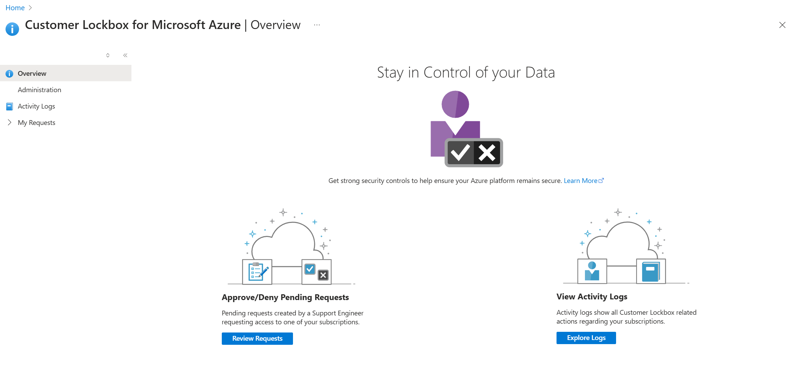

# Customer Lockbox for Microsoft Azure

> [!NOTE]
> To use this feature, your organization must have an [Azure support plan](https://azure.microsoft.com/support/plans/) with a minimal level of **Developer**.

Most operations, support, and troubleshooting performed by Microsoft personnel and sub-processors do not require access to customer data. In those rare circumstances where such access is required,  Customer Lockbox for Microsoft Azure provides an interface for customers to review and approve or reject customer data access requests. It is used in cases where a Microsoft engineer needs to access customer data, whether in response to a customer-initiated support ticket or a problem identified by Microsoft.

This article covers how to enable Customer Lockbox and how Lockbox requests are initiated, tracked, and stored for later reviews and audits.

## Supported services and scenarios

### General Availability

The following services are generally available for Customer Lockbox:

- Azure API Management
- Azure App Service
- Azure Cognitive Search
- Azure AI services
- Azure Container Registry
- Azure Data Box
- Azure Data Explorer
- Azure Data Factory
- Azure Database for MySQL
- Azure Database for MySQL Flexible Server
- Azure Database for PostgreSQL
- Azure Databricks
- Azure Edge Zone Platform Storage
- Azure Functions
- Azure HDInsight
- Azure Health Bot
- Azure Intelligent Recommendations
- Azure Kubernetes Service
- Azure Logic Apps
- Azure Monitor
- Azure OpenAI
- Azure Spring Apps
- Azure SQL Database
- Azure SQL managed Instance
- Azure Storage
- Azure subscription transfers
- Azure Synapse Analytics
- Azure Unified Vision Service
- Microsoft Azure Attestation
- Azure Data Manager for Energy Preview
- Virtual machines in Azure (covering remote desktop access, access to memory dumps, and managed disks)

### Public Preview
The following services are currently in preview for Customer Lockbox:

- Azure Machine Learning
- Azure Batch

## Enable Customer Lockbox

You can now enable Customer Lockbox from the [Administration module](https://aka.ms/customerlockbox/administration) in the Customer Lockbox blade.  

> [!NOTE]
> To enable Customer Lockbox, the user account needs to have the [Global Administrator role assigned](../../active-directory/roles/manage-roles-portal.md).

## Workflow

The following steps outline a typical workflow for a Customer Lockbox request.

1. Someone at an organization has an issue with their Azure workload.
1. After this person troubleshoots the issue, but can't fix it, they open a support ticket from the [Azure portal](https://portal.azure.com/signin/index/?feature.settingsportalinstance=mpac). The ticket is assigned to an Azure Customer Support Engineer.
1. An Azure Support Engineer reviews the service request and determines the next steps to resolve the issue.
1. If the support engineer can't troubleshoot the issue by using standard tools and service generated data, the next step is to request elevated permissions by using a Just-In-Time (JIT) access service. This request can be from the original support engineer or from a different engineer because the problem is escalated to the Azure DevOps team.
1. After the access request is submitted by the Azure Engineer, Just-In-Time service evaluates the request taking into account factors such as:
    - The scope of the resource
    - Whether the requester is an isolated identity or using multi-factor authentication
    - Permissions levels
    Based on the JIT rule, this request may also include an approval from Internal Microsoft Approvers. For example, the approver might be the Customer support lead or the DevOps Manager.
1. When the request requires direct access to customer data, a Customer Lockbox request is initiated. For example, remote desktop access to a customer's virtual machine.
    
    The request is now in a **Customer Notified** state, waiting for the customer's approval before granting access.
1. The approver(s) at the customer organization for a given Lockbox request are determined as follows: 
    - For Subscription scoped requests (requests to access specific resources contained within a subscription), users who have been assigned the Owner role on the associated subscription. 
    - For Tenant scope requests (requests to access the Azure Active Directory Tenant), users who have been assigned the Global Administrator role on the Tenant. 
    > [!NOTE]
    > Role assignments must be in place before Lockbox starts to process a request. Any role assignments made after Lockbox starts to process a given request will not be recognized by Lockbox.  Because of this, to use PIM eligible assignments for the Subscription Owner role, users are required to activate the role before the Customer Lockbox request is initiated. Refer to [Activate Azure AD roles in PIM](../../active-directory/privileged-identity-management/pim-how-to-activate-role.md) / [Activate Azure resource roles in PIM](../../active-directory/privileged-identity-management/pim-resource-roles-activate-your-roles.md#activate-a-role) for more information on activating PIM eligible roles.
    > 
    > **Role assignments scoped to management groups are not supported in Lockbox at this time.**
1. At the customer organization, designated lockbox approvers ([Azure Subscription Owner](../../role-based-access-control/rbac-and-directory-admin-roles.md#azure-roles)/[Azure AD Global admin](../../role-based-access-control/rbac-and-directory-admin-roles.md#azure-ad-roles) receive an email from Microsoft to notify them about the pending access request.  
    
    Example email:
    
    
1. The email notification provides a link to the **Customer Lockbox** blade in the Administration module. Using this link, the designated approver signs in to the Azure portal to view any pending requests that their organization has for Customer Lockbox:
    
   The request remains in the customer queue for four days. After this time, the access request automatically expires and no access is granted to Microsoft engineers.
1. To get the details of the pending request, the designated approver can select the lockbox request from **Pending Requests**:
    
1. The designated approver can also select the **SERVICE REQUEST ID** to view the support ticket request that was created by the original user. This information provides context for why Microsoft Support is engaged, and the history of the reported problem. For example:
    
1. After reviewing the request, the designated approver selects **Approve** or **Deny**:
    
    As a result of the selection:
    - **Approve**:  Access is granted to the Microsoft engineer. The access is granted for a default period of eight hours.
    - **Deny**: The elevated access request by the Microsoft engineer is rejected and no further action is taken.
    
    For auditing purposes, the actions taken in this workflow are logged in [Customer Lockbox request logs](#auditing-logs).

## Auditing logs

Customer Lockbox logs are stored in activity logs. In the Azure portal, select **Activity Logs** to view auditing information related to Customer Lockbox requests. You can filter for specific actions, such as:
- **Deny Lockbox Request**
- **Create Lockbox Request**
- **Approve Lockbox Request**
- **Lockbox Request Expiry**

As an example:

## Customer Lockbox integration with the Microsoft cloud security benchmark

We've introduced a new baseline control ([PA-8: Determine access process for cloud provider support](/security/benchmark/azure/mcsb-privileged-access#pa-8-determine-access-process-for-cloud-provider-support)) in the Microsoft cloud security benchmark that covers Customer Lockbox applicability. Customers can now leverage the benchmark to review Customer Lockbox applicability for a service.

## Exclusions

Customer Lockbox requests are not triggered in the following engineering support scenarios:

- Emergency scenarios that fall outside of standard operating procedures. For example, a major service outage requires immediate attention to recover or restore services in an unexpected or unpredictable scenario. These “break glass” events are rare and, in most instances, do not require any access to customer data to resolve.
- A Microsoft engineer accesses the Azure platform as part of troubleshooting and is inadvertently exposed to customer data. For example, the Azure Network Team performs troubleshooting that results in a packet capture on a network device. It is rare that such scenarios would result in access to meaningful quantities of customer data. Customers can further protect their data through use of in transit and at rest encryption.

Customer Lockbox requests are also not triggered by external legal demands for data. For details, see the discussion of [government requests for data](https://www.microsoft.com/trust-center/) on the Microsoft Trust Center.

## Next steps

Customer Lockbox is available for all customers who have an [Azure support plan](https://azure.microsoft.com/support/plans/) with a minimal level of **Developer**. You can enable Customer Lockbox from the [Administration module](https://aka.ms/customerlockbox/administration) in the Customer Lockbox blade.

Customer Lockbox requests are initiated by a Microsoft engineer if this action is needed to progress a support case.
