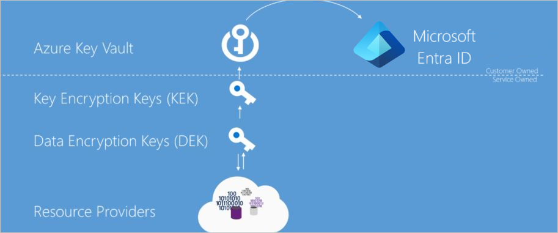

# Azure Data Encryption at rest

Microsoft Azure includes tools to safeguard data according to your company's security and compliance needs. This paper focuses on:

- How data is protected at rest across Microsoft Azure
- Discusses the various components taking part in the data protection implementation,
- Reviews pros and cons of the different key management protection approaches.

Encryption at Rest is a common security requirement. In Azure, organizations can encrypt data at rest without the risk or cost of a custom key management solution. Organizations have the option of letting Azure completely manage Encryption at Rest. Additionally, organizations have various options to closely manage encryption or encryption keys.

## What is encryption at rest?

Encryption is the secure encoding of data used to protect confidentiality of data. The Encryption at Rest designs in Azure use symmetric encryption to encrypt and decrypt large amounts of data quickly according to a simple conceptual model:

- A symmetric encryption key is used to encrypt data as it is written to storage.
- The same encryption key is used to decrypt that data as it is readied for use in memory.
- Data may be partitioned, and different keys may be used for each partition.
- Keys must be stored in a secure location with identity-based access control and audit policies. Data encryption keys which are stored outside of secure locations are encrypted with a key encryption key kept in a secure location.

In practice, key management and control scenarios, as well as scale and availability assurances, require additional constructs. Microsoft Azure Encryption at Rest concepts and components are described below.

## The purpose of encryption at rest

Encryption at rest provides data protection for stored data (at rest). Attacks against data at-rest include attempts to obtain physical access to the hardware on which the data is stored, and then compromise the contained data. In such an attack, a server's hard drive may have been mishandled during maintenance allowing an attacker to remove the hard drive. Later the attacker would put the hard drive into a computer under their control to attempt to access the data.

Encryption at rest is designed to prevent the attacker from accessing the unencrypted data by ensuring the data is encrypted when on disk. If an attacker obtains a hard drive with encrypted data but not the encryption keys, the attacker must defeat the encryption to read the data. This attack is much more complex and resource consuming than accessing unencrypted data on a hard drive. For this reason, encryption at rest is highly recommended and is a high priority requirement for many organizations.

Encryption at rest may also be required by an organization's need for data governance and compliance efforts. Industry and government regulations such as HIPAA, PCI and FedRAMP, lay out specific safeguards regarding data protection and encryption requirements. Encryption at rest is a mandatory measure required for compliance with some of those regulations. For more information on Microsoft's approach to FIPS 140-2 validation, see [Federal Information Processing Standard (FIPS) Publication 140-2](/microsoft-365/compliance/offering-fips-140-2).

In addition to satisfying compliance and regulatory requirements, encryption at rest provides defense-in-depth protection. Microsoft Azure provides a compliant platform for services, applications, and data. It also provides comprehensive facility and physical security, data access control, and auditing. However, it's important to provide additional "overlapping" security measures in case one of the other security measures fails and encryption at rest provides such a security measure.

Microsoft is committed to encryption at rest options across cloud services and giving customers control of encryption keys and logs of key use. Additionally, Microsoft is working towards encrypting all customer data at rest by default.

## Azure Encryption at Rest Components

As described previously, the goal of encryption at rest is that data that is persisted on disk is encrypted with a secret encryption key. To achieve that goal secure key creation, storage, access control, and management of the encryption keys must be provided. Though details may vary, Azure services Encryption at Rest implementations can be described in terms illustrated in the following diagram.

### Azure Key Vault

The storage location of the encryption keys and access control to those keys is central to an encryption at rest model. The keys need to be highly secured but manageable by specified users and available to specific services. For Azure services, Azure Key Vault is the recommended key storage solution and provides a common management experience across services. Keys are stored and managed in key vaults, and access to a key vault can be given to users or services. Azure Key Vault supports customer creation of keys or import of customer keys for use in customer-managed encryption key scenarios.

### Azure Active Directory

Permissions to use the keys stored in Azure Key Vault, either to manage or to access them for Encryption at Rest encryption and decryption, can be given to Azure Active Directory accounts.

### Envelope Encryption with a Key Hierarchy

More than one encryption key is used in an encryption at rest implementation. Storing an encryption key in Azure Key Vault ensures secure key access and central management of keys. However, service local access to encryption keys is more efficient for bulk encryption and decryption than interacting with Key Vault for every data operation, allowing for stronger encryption and better performance. Limiting the use of a single encryption key decreases the risk that the key will be compromised and the cost of re-encryption when a key must be replaced. Azure encryption at rest models use envelope encryption, where a key encryption key encrypts a data encryption key. This model forms a key hierarchy which is better able to address performance and security requirements:

- **Data Encryption Key (DEK)** – A symmetric AES256 key used to encrypt a partition or block of data, sometimes also referred to as simply a Data Key.  A single resource may have many partitions and many Data Encryption Keys. Encrypting each block of data with a different key makes crypto analysis attacks more difficult. And keeping DEKs local to the service encrypting and decrypting data maximizes performance.
- **Key Encryption Key (KEK)** – An encryption key used to encrypt the Data Encryption Keys using envelope encryption, also referred to as wrapping. Use of a Key Encryption Key that never leaves Key Vault allows the data encryption keys themselves to be encrypted and controlled. The entity that has access to the KEK may be different than the entity that requires the DEK. An entity may broker access to the DEK to limit the access of each DEK to a specific partition. Since the KEK is required to decrypt the DEKs, customers can cryptographically erase DEKs and data by disabling of the KEK.

Resource providers and application instances store the encrypted Data Encryption Keys as metadata. Only an entity with access to the Key Encryption Key can decrypt these Data Encryption Keys. Different models of key storage are supported. For more information, see [data encryption models](encryption-models.md).

## Encryption at rest in Microsoft cloud services

Microsoft Cloud services are used in all three cloud models: IaaS, PaaS, SaaS. Below you have examples of how they fit on each model:

- Software services, referred to as Software as a Service or SaaS, which have applications provided by the cloud such as Microsoft 365.
- Platform services in which customers use the cloud for things like storage, analytics, and service bus functionality in their applications.
- Infrastructure services, or Infrastructure as a Service (IaaS) in which customer deploys operating systems and applications that are hosted in the cloud and possibly leveraging other cloud services.

### Encryption at rest for SaaS customers

Software as a Service (SaaS) customers typically have encryption at rest enabled or available in each service. Microsoft 365 has several options for customers to verify or enable encryption at rest. For information about Microsoft 365 services, see [Encryption in Microsoft 365](/microsoft-365/compliance/encryption).

### Encryption at rest for PaaS customers

Platform as a Service (PaaS) customer's data typically resides in a storage service such as Blob Storage but may also be cached or stored in the application execution environment, such as a virtual machine. To see the encryption at rest options available to you, examine the [Data encryption models: supporting services table](encryption-models.md#supporting-services) for the storage and application platforms that you use.

### Encryption at rest for IaaS customers

Infrastructure as a Service (IaaS) customers can have a variety of services and applications in use. IaaS services can enable encryption at rest in their Azure hosted virtual machines and VHDs using Azure Disk Encryption.

#### Encrypted storage

Like PaaS, IaaS solutions can leverage other Azure services that store data encrypted at rest. In these cases, you can enable the Encryption at Rest support as provided by each consumed Azure service. The [Data encryption models: supporting services table](encryption-models.md#supporting-services) enumerates the major storage, services, and application platforms and the model of Encryption at Rest supported.

#### Encrypted compute

All Managed Disks, Snapshots, and Images are encrypted using Storage Service Encryption using a service-managed key. A more complete Encryption at Rest solution ensures that the data is never persisted in unencrypted form. While processing the data on a virtual machine, data can be persisted to the Windows page file or Linux swap file, a crash dump, or to an application log. To ensure this data is encrypted at rest, IaaS applications can use Azure Disk Encryption on an Azure IaaS virtual machine (Windows or Linux) and virtual disk.

#### Custom encryption at rest

It is recommended that whenever possible, IaaS applications leverage Azure Disk Encryption and Encryption at Rest options provided by any consumed Azure services. In some cases, such as irregular encryption requirements or non-Azure based storage, a developer of an IaaS application may need to implement encryption at rest themselves. Developers of IaaS solutions can better integrate with Azure management and customer expectations by leveraging certain Azure components. Specifically, developers should use the Azure Key Vault service to provide secure key storage as well as provide their customers with consistent key management options with that of most Azure platform services. Additionally, custom solutions should use Azure managed service identities to enable service accounts to access encryption keys. For developer information on Azure Key Vault and Managed Service Identities, see their respective SDKs.

## Azure resource providers encryption model support

Microsoft Azure Services each support one or more of the encryption at rest models. For some services, however, one or more of the encryption models may not be applicable. For services that support customer-managed key scenarios, they may support only a subset of the key types that Azure Key Vault supports for key encryption keys. Additionally, services may release support for these scenarios and key types at different schedules. This section describes the encryption at rest support at the time of this writing for each of the major Azure data storage services.

### Azure disk encryption

Any customer using Azure Infrastructure as a Service (IaaS) features can achieve encryption at rest for their IaaS VMs and disks through Azure Disk Encryption. For more information on Azure Disk encryption, see [Azure Disk Encryption for Linux VMs](../../virtual-machines/linux/disk-encryption-overview.md) or [Azure Disk Encryption for Windows VMs](../../virtual-machines/windows/disk-encryption-overview.md).

#### Azure storage

All Azure Storage services (Blob storage, Queue storage, Table storage, and Azure Files) support server-side encryption at rest; some services additionally support customer-managed keys and client-side encryption.

- Server-side: All Azure Storage Services enable server-side encryption by default using service-managed keys, which is transparent to the application. For more information, see [Azure Storage Service Encryption for Data at Rest](../../storage/common/storage-service-encryption.md). Azure Blob storage and Azure Files also support RSA 2048-bit customer-managed keys in Azure Key Vault. For more information, see [Storage Service Encryption using customer-managed keys in Azure Key Vault](../../storage/common/customer-managed-keys-configure-key-vault.md).
- Client-side: Azure Blobs, Tables, and Queues support client-side encryption. When using client-side encryption, customers encrypt the data and upload the data as an encrypted blob. Key management is done by the customer. For more information, see [Client-Side Encryption and Azure Key Vault for Microsoft Azure Storage](../../storage/common/storage-client-side-encryption.md).

#### Azure SQL Database

Azure SQL Database currently supports encryption at rest for Microsoft-managed service side and client-side encryption scenarios.

Support for server encryption is currently provided through the SQL feature called Transparent Data Encryption. Once an Azure SQL Database customer enables TDE key are automatically created and managed for them. Encryption at rest can be enabled at the database and server levels. As of June 2017, [Transparent Data Encryption (TDE)](/sql/relational-databases/security/encryption/transparent-data-encryption) is enabled by default on newly created databases. Azure SQL Database supports RSA 2048-bit customer-managed keys in Azure Key Vault. For more information, see [Transparent Data Encryption with Bring Your Own Key support for Azure SQL Database and Data Warehouse](/sql/relational-databases/security/encryption/transparent-data-encryption-byok-azure-sql).

Client-side encryption of Azure SQL Database data is supported through the [Always Encrypted](/sql/relational-databases/security/encryption/always-encrypted-database-engine) feature. Always Encrypted uses a key that created and stored by the client. Customers can store the master key in a Windows certificate store, Azure Key Vault, or a local Hardware Security Module. Using SQL Server Management Studio, SQL users choose what key they'd like to use to encrypt which column.

## Conclusion

Protection of customer data stored within Azure Services is of paramount importance to Microsoft. All Azure hosted services are committed to providing Encryption at Rest options. Azure services support either service-managed keys, customer-managed keys, or client-side encryption. Azure services are broadly enhancing Encryption at Rest availability and new options are planned for preview and general availability in the upcoming months.

## Next steps

- See [data encryption models](encryption-models.md) to learn more about service-managed keys and customer-managed keys.
- Learn how Azure uses [double encryption](double-encryption.md) to mitigate threats that come with encrypting data.
- Learn what Microsoft does to ensure [platform integrity and security](platform.md) of hosts traversing the hardware and firmware build-out, integration, operationalization, and repair pipelines.
