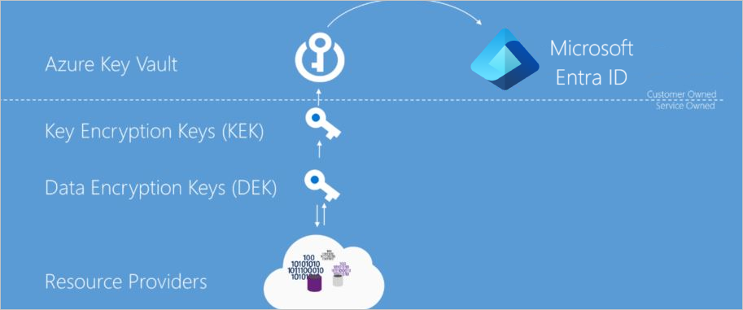

# Azure data encryption at rest

Microsoft Azure includes tools to safeguard data according to your company's security and compliance needs. This article focuses on:

- How data is protected at rest across Microsoft Azure.
- The various components that take part in the data protection implementation.
- The benefits and tradeoffs of different key management protection approaches.

Encryption at rest is a common security requirement. Azure encrypts data at rest by default by using platform-managed keys. This approach provides organizations with automatic encryption without the risk or cost of a custom key management solution. Organizations can rely on Azure to manage encryption at rest by using platform-managed keys, or they can use customer-managed keys when they need extra control over encryption keys and key management policies.

## What is encryption at rest?

Encryption is the secure encoding of data used to protect the confidentiality of data. The encryption at rest designs in Azure use symmetric encryption to encrypt and decrypt large amounts of data quickly according to a simple conceptual model:

- A symmetric encryption key encrypts data as it's written to storage.
- The same encryption key decrypts that data as it's prepared for use in memory.
- Different partitions can use different keys.
- Store keys in a secure location with identity-based access control and audit policies. If data encryption keys are stored outside of secure locations, encrypt them by using a key encryption key that's kept in a secure location.

In practice, key management and control scenarios, as well as scale and availability assurances, require extra constructs. The following sections describe Microsoft Azure encryption at rest concepts and components.

## Purpose of encryption at rest

Encryption at rest protects stored data. Attacks against data at rest include attempts to obtain physical access to the hardware that stores the data and then compromise the contained data. In such an attack, a server's hard drive might be mishandled during maintenance, which allows an attacker to remove the hard drive. The attacker later puts the hard drive into a computer under their control to attempt to access the data.

Encryption at rest helps prevent an attacker from accessing unencrypted data by ensuring that data is encrypted on disk. If an attacker obtains a hard drive with encrypted data but not the encryption keys, the attacker must defeat the encryption to read the data. This attack is much more complex and resource-consuming than accessing unencrypted data on a hard drive. For this reason, many organizations make encryption at rest a high-priority requirement.

An organization's data governance and compliance efforts might also require encryption at rest. Industry and government regulations such as HIPAA, PCI, and FedRAMP lay out specific safeguards for data protection and encryption requirements. Some of those regulations require encryption at rest. For more information about Microsoft's approach to FIPS 140 validation, see [Federal Information Processing Standard (FIPS) 140](/azure/compliance/offerings/offering-fips-140-2).

In addition to satisfying compliance and regulatory requirements, encryption at rest provides defense-in-depth protection. Microsoft Azure provides a compliant platform for services, applications, and data. The platform also provides comprehensive facility and physical security, data access control, and auditing. However, it's important to provide extra "overlapping" security measures in case one of the other security measures fails. Encryption at rest provides such a security measure.

Microsoft provides encryption at rest options across cloud services and gives you control of encryption keys and logs of key use. Microsoft is also working toward encrypting all customer data at rest by default.

## Key management options

Azure provides two primary approaches for managing encryption keys:

**Platform-managed keys (default)** (also sometimes called service-managed keys): Azure automatically handles all aspects of encryption key management, including key generation, storage, rotation, and backup. This approach provides encryption at rest with zero configuration, and Azure enables it by default across Azure services. Platform-managed keys offer the highest level of convenience and require no extra cost or management overhead.

**Customer-managed keys (optional)**: Organizations that require greater control over their encryption keys can choose to manage their own keys by using Azure Key Vault or Azure Key Vault Managed HSM. This approach allows you to control key lifecycles, access policies, and cryptographic operations. Customer-managed keys provide extra control at the cost of increased management responsibility and complexity. For organizations with regulatory or contractual requirements that mandate key material physically reside outside Microsoft infrastructure, Azure Key Vault Managed HSM also supports [external key management (preview)](/azure/key-vault/managed-hsm/external-key-management-overview), which keeps the key encryption key (KEK) in a customer-operated hardware security module (HSM) entirely outside Azure.

The choice between these approaches depends on your organization's security requirements, compliance needs, and operational preferences. Most organizations can rely on platform-managed keys for strong encryption protection, while organizations with specific regulatory or security requirements might opt for customer-managed keys.

## Azure encryption at rest components

As described previously, encryption at rest keeps data persisted on disk encrypted by using a secret encryption key. To achieve that goal, Azure services need secure key creation, storage, access control, and encryption key management. Though details might vary, Azure services encryption at rest implementations use the terms illustrated in the following diagram.

### Azure Key Vault

The storage location of the encryption keys and access control to those keys is central to an encryption at rest model. You need to highly secure the keys but make them manageable by specified users and available to specific services. For Azure services, Azure Key Vault (Premium tier) or Azure Key Vault Managed HSM is the recommended key storage solution and provides a common management experience across services. You store and manage keys in key vaults, and you can give users or services access to a key vault. Azure Key Vault supports customer-created keys and imported customer keys for use in customer-managed encryption key scenarios.

### Microsoft Entra ID

You can give Microsoft Entra accounts permissions to use the keys stored in Azure Key Vault, either to manage them or to access them for encryption and decryption operations.

### Envelope encryption with a key hierarchy

You use more than one encryption key in an encryption at rest implementation. Storing an encryption key in Azure Key Vault ensures secure key access and central key management. However, service-local access to encryption keys is more efficient for bulk encryption and decryption than interacting with Key Vault for every data operation. This approach allows for stronger encryption and better performance. Limiting the use of a single encryption key decreases the risk that the key is compromised and the cost of re-encryption when a key must be replaced. Azure encryption at rest models use envelope encryption, where a KEK encrypts a data encryption key (DEK). This model forms a key hierarchy that better addresses performance and security requirements:

- **Data encryption key (DEK)** - A symmetric AES-256 key that encrypts a partition or block of data, sometimes also referred to as a data key. A single resource can have many partitions and many DEKs. Encrypting each block of data with a different key makes cryptanalysis attacks more difficult. Keeping DEKs local to the service that encrypts and decrypts data maximizes performance.
- **Key encryption key (KEK)** - An encryption key that encrypts the DEKs by using envelope encryption, also referred to as wrapping. By using a KEK that never leaves Key Vault, you can encrypt and control the DEKs. The entity that has access to the KEK can be different from the entity that requires the DEK. An entity can broker access to the DEK to limit the access of each DEK to a specific partition. Because decrypting the DEKs requires the KEK, you can cryptographically erase DEKs and data by disabling the KEK. Disabling a KEK makes all dependent services inaccessible, such as Azure SQL Transparent Data Encryption (TDE) databases, Azure Storage accounts with customer-managed keys, and Azure Disk Encryption-protected VMs. Disabling also affects only the vault where that key resides. If the key was backed up and restored to another vault, the restored copy remains fully functional and the disable operation doesn't affect it. For more information, see [Backup security considerations](/azure/key-vault/general/backup#security-considerations).

Resource providers and application instances store the encrypted DEKs as metadata. Only an entity with access to the KEK can decrypt these DEKs. Azure supports different models of key storage. For more information, see [data encryption models](encryption-models.md).

When services cache DEKs locally for active cryptographic operations, Azure platform security controls protect the cached keys, including [host-level compute isolation](isolation-choices.md) and process-level protections. Cached operational keys are an availability and performance mechanism - the KEK in Key Vault remains the root of trust, and key revocation governs access to encrypted data.

## Encryption at rest in Microsoft cloud services

You use Microsoft cloud services in all three cloud models: infrastructure as a service (IaaS), platform as a service (PaaS), and software as a service (SaaS). The following examples show how they fit in each model:

- Software services, or SaaS, provide cloud-hosted applications such as Microsoft 365.
- Platform services, or PaaS, provide cloud capabilities such as storage, analytics, and service bus functionality for customer applications.
- Infrastructure services, or IaaS, host customer-deployed operating systems and applications that can also use other cloud services.

### Encryption at rest for SaaS organizations

Software as a service (SaaS) organizations typically enable encryption at rest or make it available in each service. Microsoft 365 offers several options to verify or enable encryption at rest. For information about Microsoft 365 services, see [Encryption in Microsoft 365](/microsoft-365/compliance/encryption).

### Encryption at rest for PaaS organizations

Platform as a service (PaaS) organizations typically store their data in a storage service such as Blob Storage. However, the data might also be cached or stored in the application execution environment, such as a virtual machine. To see the encryption at rest options available to you, examine the [Data encryption models](encryption-models.md) for the storage and application platforms that you use.

### Encryption at rest for IaaS organizations

Infrastructure as a service (IaaS) organizations can use a variety of services and applications. IaaS services can enable encryption at rest in their Azure-hosted virtual machines by using encryption at host.

#### Encrypted storage

Like PaaS, IaaS solutions can use other Azure services that store data encrypted at rest. In these cases, you can enable the encryption at rest support that each consumed Azure service provides. [Data encryption models](encryption-models.md) lists the major storage, services, and application platforms and the model of encryption at rest supported.

#### Encrypted compute

Azure managed disks, snapshots, and images are encrypted by default by using Azure Storage Service Encryption and platform-managed keys. This default encryption requires no customer configuration or extra cost. A more comprehensive encryption solution ensures that the VM host doesn't persist data in unencrypted form. While processing data on a virtual machine, the system can persist data to the Windows page file or Linux swap file, a crash dump, or an application log. To ensure this data is also encrypted at rest, IaaS applications can use encryption at host on an Azure IaaS virtual machine. By default, encryption at host uses platform-managed keys, but you can optionally configure customer-managed keys for extra control.

#### Custom encryption at rest

Whenever possible, IaaS applications should use encryption at host and encryption at rest options provided by any consumed Azure services. In some cases, such as irregular encryption requirements or non-Azure-based storage, a developer of an IaaS application might need to implement encryption at rest. Developers of IaaS solutions can better integrate with Azure management and customer expectations by using certain Azure components. Specifically, developers should use Azure Key Vault to provide secure key storage and provide their users with key management options that are consistent with Azure platform services. Custom solutions should also use Azure managed identities to allow service accounts to access encryption keys. For developer information, see [Azure Key Vault developer's guide](/azure/key-vault/general/developers-guide) and [managed identities for Azure resources](/entra/identity/managed-identities-azure-resources/overview).

## Azure resource providers encryption model support

Microsoft Azure services each support one or more of the encryption at rest models. For some services, however, one or more of the encryption models might not apply. Services that support customer-managed key scenarios might support only a subset of the key types that Azure Key Vault supports for key encryption keys. Services might also release support for these scenarios and key types at different schedules. This section describes the current encryption at rest support for each major Azure data storage service.

### Azure VM disk encryption

Organizations that use Azure infrastructure as a service (IaaS) features can encrypt their IaaS VM disks at rest through encryption at host. For more information, see [Encryption at host - End-to-end encryption for your VM](/azure/virtual-machines/disk-encryption#encryption-at-host---end-to-end-encryption-for-your-vm-data).

### Azure Storage

All Azure Storage services (Blob Storage, Queue Storage, Table Storage, and Azure Files) support server-side encryption at rest. Blob Storage and Queue Storage also support current client-side encryption.

- **Server-side (default)**: All Azure Storage services automatically enable server-side encryption by default by using platform-managed keys. This encryption is transparent to the application and requires no configuration. For more information, see [Azure Storage encryption for data at rest](../../storage/common/storage-service-encryption.md#about-azure-storage-service-side-encryption). You can optionally choose customer-managed keys in Azure Key Vault for extra control. For more information, see [Customer-managed keys for Azure Storage encryption](../../storage/common/customer-managed-keys-overview.md).
- **Client-side (optional)**: Blob Storage and Queue Storage client libraries support client-side encryption for organizations that need to encrypt data before it reaches Azure. When you use client-side encryption, you encrypt the data and upload it as encrypted data. You manage the keys. For more information, see [Client-side encryption for blobs](../../storage/blobs/client-side-encryption.md) and [Client-side encryption for queues](../../storage/queues/client-side-encryption.md).

### Azure SQL Database

Azure SQL Database supports encryption at rest for service-side encryption by using platform-managed keys and for client-side encryption scenarios.

Azure SQL provides server-side encryption through Transparent Data Encryption (TDE). For service-managed TDE, Azure automatically creates and manages the keys. You can enable encryption at rest at the database and server levels. [Transparent Data Encryption (TDE)](/sql/relational-databases/security/encryption/transparent-data-encryption) is enabled by default on newly created databases. Azure SQL supports asymmetric RSA or RSA-HSM 2048-bit and 3072-bit customer-managed TDE protectors in Azure Key Vault or Azure Key Vault Managed HSM. For more information, see [Azure SQL transparent data encryption with customer-managed key](/azure/azure-sql/database/transparent-data-encryption-byok-overview).

Azure SQL Database supports client-side encryption through the [Always Encrypted](/sql/relational-databases/security/encryption/always-encrypted-database-engine) feature. Always Encrypted uses a key that the client creates and stores. You can store the master key in a Windows certificate store, Azure Key Vault, or a local HSM. SQL users can use SQL Server Management Studio to choose the key that encrypts each column.

## Conclusion

Protecting customer data stored within Azure services is important to Microsoft. Azure-hosted services provide encryption at rest options. Azure services support platform-managed keys, customer-managed keys, or client-side encryption. Azure services continue to enhance encryption at rest availability.

## Next steps

- See [data encryption models](encryption-models.md) to learn more about platform-managed keys and customer-managed keys.
- Learn how Azure uses [double encryption](double-encryption.md) to mitigate threats that come with encrypting data.
- Learn what Microsoft does to ensure [platform integrity and security](platform.md) of hosts traversing the hardware and firmware build-out, integration, operationalization, and repair pipelines.
