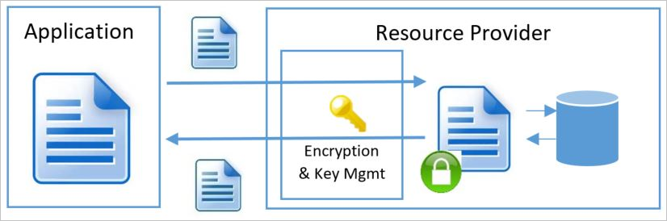

# Data encryption models

An understanding of the various encryption models and their pros and cons is essential for understanding how the various resource providers in Azure implement encryption at Rest. These definitions are shared across all resource providers in Azure to ensure common language and taxonomy.

There are three scenarios for server-side encryption:

- Server-side encryption using Service-Managed keys
  - Azure Resource Providers perform the encryption and decryption operations
  - Microsoft manages the keys
  - Full cloud functionality

- Server-side encryption using customer-managed keys in Azure Key Vault
  - Azure Resource Providers perform the encryption and decryption operations
  - Customer controls keys via Azure Key Vault
  - Full cloud functionality

- Server-side encryption using customer-managed keys on customer-controlled hardware
  - Azure Resource Providers perform the encryption and decryption operations
  - Customer controls keys on customer-controlled hardware
  - Full cloud functionality

Server-side Encryption models refer to encryption that is performed by the Azure service. In that model, the Resource Provider performs the encrypt and decrypt operations. For example, Azure Storage may receive data in plain text operations and will perform the encryption and decryption internally. The Resource Provider might use encryption keys that are managed by Microsoft or by the customer depending on the provided configuration.

Each of the server-side encryption at rest models implies distinctive characteristics of key management. This includes where and how encryption keys are created, and stored as well as the access models and the key rotation procedures.  

For client-side encryption, consider the following:

- Azure services cannot see decrypted data
- Customers manage and store keys on-premises (or in other secure stores). Keys are not available to Azure services
- Reduced cloud functionality

The supported encryption models in Azure split into two main groups: "Client Encryption" and "Server-side Encryption" as mentioned previously. Independent of the encryption at rest model used, Azure services always recommend the use of a secure transport such as TLS or HTTPS. Therefore, encryption in transport should be addressed by the transport protocol and should not be a major factor in determining which encryption at rest model to use.

## Client encryption model

Client Encryption model refers to encryption that is performed outside of the Resource Provider or Azure by the service or calling application. The encryption can be performed by the service application in Azure, or by an application running in the customer data center. In either case, when leveraging this encryption model, the Azure Resource Provider receives an encrypted blob of data without the ability to decrypt the data in any way or have access to the encryption keys. In this model, the key management is done by the calling service/application and is opaque to the Azure service.

## Server-side encryption using service-managed keys

For many customers, the essential requirement is to ensure that the data is encrypted whenever it is at rest. Server-side encryption using service-managed Keys enables this model by allowing customers to mark the specific resource (Storage Account, SQL DB, etc.) for encryption and leaving all key management aspects such as key issuance, rotation, and backup to Microsoft. Most Azure services that support encryption at rest typically support this model of offloading the management of the encryption keys to Azure. The Azure resource provider creates the keys, places them in secure  storage, and retrieves them when needed. This means that the service has full access to the keys and the service has full control over the credential lifecycle management.

Server-side encryption using service-managed keys therefore quickly addresses the need to have encryption at rest with low overhead to the customer. When available a customer typically opens the Azure portal for the target subscription and resource provider and checks a box indicating, they would like the data to be encrypted. In some Resource Managers server-side encryption with service-managed keys is on by default.

Server-side encryption with Microsoft-managed keys does imply the service has full access to store and manage the keys. While some customers may want to manage the keys because they feel they gain greater security, the cost and risk associated with a custom key storage solution should be considered when evaluating this model. In many cases, an organization may determine that resource constraints or risks of an on-premises solution may be greater than the risk of cloud management of the encryption at rest keys.  However, this model might not be sufficient for organizations that have requirements to control the creation or lifecycle of the encryption keys or to have different personnel manage a service's encryption keys than those managing the service (that is, segregation of key management from the overall management model for the service).

### Key access

When Server-side encryption with service-managed keys is used, the key creation, storage, and service access are all managed by the service. Typically, the foundational Azure resource providers will store the Data Encryption Keys in a store that is close to the data and quickly available and accessible while the Key Encryption Keys are stored in a secure internal store.

**Advantages**

- Simple setup
- Microsoft manages key rotation, backup, and redundancy
- Customer does not have the cost associated with implementation or the risk of a custom key management scheme.

**Disadvantages**

- No customer control over the encryption keys (key specification, lifecycle, revocation, etc.)
- No ability to segregate key management from overall management model for the service

## Server-side encryption using customer-managed keys in Azure Key Vault

For scenarios where the requirement is to encrypt the data at rest and control the encryption keys customers can use server-side encryption using customer-managed Keys in Key Vault. Some services may store only the root Key Encryption Key in Azure Key Vault and store the encrypted Data Encryption Key in an internal location closer to the data. In that scenario customers can bring their own keys to Key Vault (BYOK – Bring Your Own Key), or generate new ones, and use them to encrypt the desired resources. While the Resource Provider performs the encryption and decryption operations, it uses the configured key encryption key as the root key for all encryption operations.

Loss of key encryption keys means loss of data. For this reason, keys should not be deleted. Keys should be backed up whenever created or rotated. [Soft-Delete](../../key-vault/general/soft-delete-overview.md) should be enabled on any vault storing key encryption keys. Instead of deleting a key, set enabled to false or set the expiry date.

### Key Access

The server-side encryption model with customer-managed keys in Azure Key Vault involves the service accessing the keys to encrypt and decrypt as needed. Encryption at rest keys are made accessible to a service through an access control policy. This policy grants the service identity access to receive the key. An Azure service running on behalf of an associated subscription can be configured with an identity in that subscription. The service can perform Azure Active Directory authentication and receive an authentication token identifying itself as that service acting on behalf of the subscription. That token can then be presented to Key Vault to obtain a key it has been given access to.

For operations using encryption keys, a service identity can be granted access to any of the following operations: decrypt, encrypt, unwrapKey, wrapKey, verify, sign, get, list, update, create, import, delete, backup, and restore.

To obtain a key for use in encrypting or decrypting data at rest the service identity that the Resource Manager service instance will run as must have UnwrapKey (to get the key for decryption) and WrapKey (to insert a key into key vault when creating a new key).

>[!NOTE]
>For more detail on Key Vault authorization see the secure your key vault page in the [Azure Key Vault documentation](../../key-vault/general/security-overview.md).

**Advantages**

- Full control over the keys used – encryption keys are managed in the customer's Key Vault under the customer's control.
- Ability to encrypt multiple services to one master
- Can segregate key management from overall management model for the service
- Can define service and key location across regions

**Disadvantages**

- Customer has full responsibility for key access management
- Customer has full responsibility for key lifecycle management
- Additional Setup & configuration overhead

## Server-side encryption using customer-managed keys in customer-controlled hardware

Some Azure services enable the Host Your Own Key (HYOK) key management model. This management mode is useful in scenarios where there is a need to encrypt the data at rest and manage the keys in a proprietary repository outside of Microsoft's control. In this model, the service must retrieve the key from an external site. Performance and availability guarantees are impacted, and configuration is more complex. Additionally, since the service does have access to the DEK during the encryption and decryption operations the overall security guarantees of this model are similar to when the keys are customer-managed in Azure Key Vault.  As a result, this model is not appropriate for most organizations unless they have specific key management requirements. Due to these limitations, most Azure services do not support server-side encryption using server-managed keys in customer-controlled hardware.

### Key Access

When server-side encryption using service-managed keys in customer-controlled hardware is used, the keys are maintained on a system configured by the customer. Azure services that support this model provide a means of establishing a secure connection to a customer supplied key store.

**Advantages**

- Full control over the root key used – encryption keys are managed by a customer provided store
- Ability to encrypt multiple services to one master
- Can segregate key management from overall management model for the service
- Can define service and key location across regions

**Disadvantages**

- Full responsibility for key storage, security, performance, and availability
- Full responsibility for key access management
- Full responsibility for key lifecycle management
- Significant setup, configuration, and ongoing maintenance costs
- Increased dependency on network availability between the customer datacenter and Azure datacenters.

## Supporting services
The Azure services that support each encryption model:

| Product, Feature, or Service | Server-Side Using Service-Managed Key   | Server-Side Using Customer-Managed Key | Client-Side Using Client-Managed Key  |
|----------------------------------|--------------------|-----------------------------------------|--------------------|
| **AI and Machine Learning**      |                    |                    |                    |
| Azure Cognitive Search           | Yes                | Yes                | -                  |
| Azure Cognitive Services         | Yes                | Yes                | -                  |
| Azure Machine Learning           | Yes                | Yes                | -                  |
| Azure Machine Learning Studio (classic) | Yes         | Preview, RSA 2048-bit | -               |
| Content Moderator                | Yes                | Yes                | -                  |
| Face                             | Yes                | Yes                | -                  |
| Language Understanding           | Yes                | Yes                | -                  |
| Personalizer                     | Yes                | Yes                | -                  |
| QnA Maker                        | Yes                | Yes                | -                  |
| Speech Services                  | Yes                | Yes                | -                  |
| Translator Text                  | Yes                | Yes                | -                  |
| Power BI                         | Yes                | Yes, RSA 4096-bit  | -                  |
| **Analytics**                    |                    |                    |                    |
| Azure Stream Analytics           | Yes                | Yes\*\*            | -                  |
| Event Hubs                       | Yes                | Yes                | -                  |
| Functions                        | Yes                | Yes                | -                  |
| Azure Analysis Services          | Yes                | -                  | -                  |
| Azure Data Catalog               | Yes                | -                  | -                  |
| Azure HDInsight                  | Yes                | All                | -                  |
| Azure Monitor Application Insights | Yes                | Yes                | -                  |
| Azure Monitor Log Analytics      | Yes                | Yes                | -                  |
| Azure Data Explorer              | Yes                | Yes                | -                  |
| Azure Data Factory               | Yes                | Yes                | -                  |
| Azure Data Lake Store            | Yes                | Yes, RSA 2048-bit  | -                  |
| **Containers**                   |                    |                    |                    |
| Azure Kubernetes Service         | Yes                | Yes                | -                  |
| Container Instances              | Yes                | Yes                | -                  |
| Container Registry               | Yes                | Yes                | -                  |
| **Compute**                      |                    |                    |                    |
| Virtual Machines                 | Yes                | Yes                | -                  |
| Virtual Machine Scale Set        | Yes                | Yes                | -                  |
| SAP HANA                         | Yes                | Yes                | -                  |
| App Service                      | Yes                | Yes\*\*            | -                  |
| Automation                       | Yes                | Yes\*\*            | -                  |
| Azure Functions                  | Yes                | Yes\*\*            | -                  |
| Azure portal                     | Yes                | Yes\*\*            | -                  |
| Logic Apps                       | Yes                | Yes                | -                  |
| Azure-managed applications       | Yes                | Yes\*\*            | -                  |
| Service Bus                      | Yes                | Yes                | -                  |
| Site Recovery                    | Yes                | Yes                | -                  |
| **Databases**                    |                    |                    |                    |
| SQL Server on Virtual Machines   | Yes                | Yes                | Yes                |
| Azure SQL Database               | Yes                | Yes, RSA 3072-bit  | Yes                |
| Azure SQL Database for MariaDB   | Yes                | -                  | -                  |
| Azure SQL Database for MySQL     | Yes                | Yes                | -                  |
| Azure SQL Database for PostgreSQL | Yes               | Yes                | -                  |
| Azure Synapse Analytics          | Yes                | Yes, RSA 3072-bit  | -                  |
| SQL Server Stretch Database      | Yes                | Yes, RSA 3072-bit  | Yes                |
| Table Storage                    | Yes                | Yes                | Yes                |
| Azure Cosmos DB                  | Yes                | Yes                | -                  |
| Azure Databricks                 | Yes                | Yes                | -                  |
| Azure Database Migration Service | Yes                | N/A\*              | -                  |
| **DevOps**                       |                    |                    |                    |
| Azure DevOps Services            | Yes                | -                  | -                  |
| Azure Repos                      | Yes                | -                  | -                  |
| **Identity**                     |                    |                    |                    |
| Azure Active Directory           | Yes                | -                  | -                  |
| Azure Active Directory Domain Services | Yes          | Yes                | -                  |
| **Integration**                  |                    |                    |                    |
| Service Bus                      | Yes                | Yes                | Yes                |
| Event Grid                       | Yes                | -                  | -                  |
| API Management                   | Yes                | -                  | -                  |
| **IoT Services**                 |                    |                    |                    |
| IoT Hub                          | Yes                | Yes                | Yes                |
| IoT Hub Device Provisioning      | Yes                | Yes                | -                  |
| **Management and Governance**    |                    |                    |                    |
| Azure Site Recovery              | Yes                | -                  | -                  |
| Azure Migrate                    | Yes                | Yes                | -                  |
| **Media**                        |                    |                    |                    |
| Media Services                   | Yes                | Yes                | Yes                |
| **Security**                     |                    |                    |                    |
| Azure Security Center for IoT    | Yes                | Yes                | -                  |
| Azure Sentinel                   | Yes                | Yes                | -                  |
| **Storage**                      |                    |                    |                    |
| Blob Storage                     | Yes                | Yes                | Yes                |
| Premium Blob Storage             | Yes                | Yes                | Yes                |
| Disk Storage                     | Yes                | Yes                | -                  |
| Ultra Disk Storage               | Yes                | Yes                | -                  |
| Managed Disk Storage             | Yes                | Yes                | -                  |
| File Storage                     | Yes                | Yes                | -                  |
| File Premium Storage             | Yes                | Yes                | -                  |
| File Sync                        | Yes                | Yes                | -                  |
| Queue Storage                    | Yes                | Yes                | Yes                |
| Avere vFXT                       | Yes                | -                  | -                  |
| Azure Cache for Redis            | Yes                | N/A\*              | -                  |
| Azure NetApp Files               | Yes                | Yes                | -                  |
| Archive Storage                  | Yes                | Yes                | -                  |
| StorSimple                       | Yes                | Yes                | Yes                |
| Azure Backup                     | Yes                | Yes                | Yes                |
| Data Box                         | Yes                | -                  | Yes                |
| Data Box Edge                    | Yes                | Yes                | -                  |

\* This service doesn't persist data. Transient caches, if any, are encrypted with a Microsoft key.

\*\* This service supports storing data in your own Key Vault, Storage Account, or other data persisting service that already supports Server-Side Encryption with Customer-Managed Key.

## Next steps

- Learn how [encryption is used in Azure](encryption-overview.md).
- Learn how Azure uses [double encryption](double-encryption.md) to mitigate threats that come with encrypting data.
