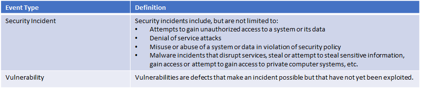

# How to Log a Security Event Support Ticket

1. Navigate to [Publisher Support](https://support.microsoft.com/en-us/getsupport?wf=0&tenant=ClassicCommercial&oaspworkflow=start_1.0.0.0&locale=en-us&supportregion=en-us&pesid=16230&ccsid=636450758943226673) and sign in with your Microsoft credentials.
2. Select "Security Event" as the Problem Type and choose between the "Security Incident" and "Vulnerability" categories.

    

3. After you select the Problem Type and Category, click the '**Start request**' button. Provide the following information to help us better understand the issue.

    i. What is the problem and/or vulnerability?

    ii. For vulnerabilities, please provide the CVE (mitre.org) or the filled out CVSS3 v3 calculator (https://www.first.org/cvss/calculator/3.0).

    iii. Is there a resolution or mitigation? If yes, then please provide the remediation steps.

    iv. Do you have a message that you want to send to customers? We will work with you to craft an appropriate message if applicable.

4. Submission confirmation - Once you have submitted your issue, we will acknowledge receipt within one business day and assign your issue a priority and severity.

    - If you need to communicate with us about your issue, use the confirmation number in all correspondence.
    - You can view progress on your issue at any time.

5. What happens next? Depending on the issue and severity, the following steps may be taken:

    - We will communicate the outcome of our assessment to you. Depending on the outcome, we may remove or request that you modify your offering. In this event, we will work with you to ensure that disruption to impacted customers is minimized.
    - We will work with you to help mitigate the impact of the incident/vulnerability for our mutual customers.

