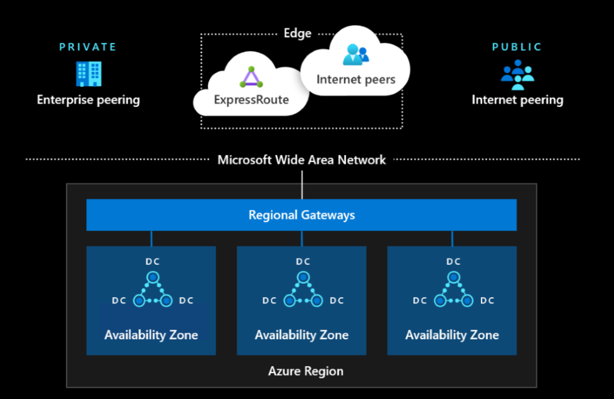
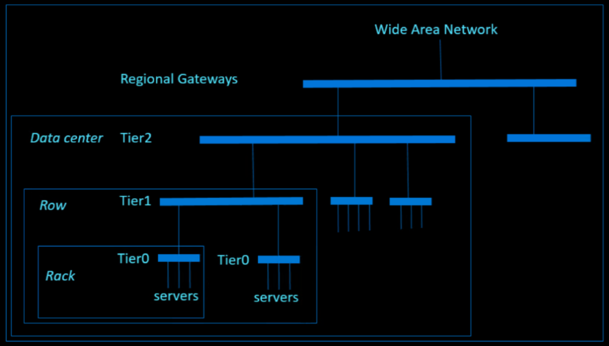

# Azure network architecture
The Azure network architecture provides connectivity from the Internet to the Azure datacenters. Any workload deployed (IaaS, PaaS, and SaaS) on Azure is leveraging the Azure datacenter network.

## Network topology
The network architecture of an Azure datacenter consists of the following components:

- Edge network
- Wide area network
- Regional gateways network
- Datacenter network

## Network components
A brief description of the network components.

- Edge network

   - Demarcation point between Microsoft networking and other networks (for example, Internet, Enterprise network)
   - Provides Internet and [ExpressRoute](../../expressroute/expressroute-introduction.md) peering into Azure

- Wide area network

   - Microsoft intelligent backbone network covering the globe
   - Provides connectivity between [Azure regions](https://azure.microsoft.com/global-infrastructure/geographies/)

- Regional gateway

   - Point of aggregation for all of the datacenters in an Azure region
   - Provides massive connectivity between datacenters within an Azure region (for example, multi hundred terabits per datacenter)

- Datacenter network

   - Provides connectivity between servers within the datacenter with low oversubscribed bandwidth

The above network components are designed to provide maximum availability to support always-on, always-available cloud business. The redundancy is designed and built into the network from the physical aspect all the way up to control protocol.

## Datacenter network resiliency
Let’s illustrate the resiliency design principle using datacenter network.

The datacenter network is a modified version of a [Clos network](https://en.wikipedia.org/wiki/Clos_network), providing high bi-sectional bandwidth for cloud scale traffic. The network is constructed using a large number of commodity devices to reduce the impact caused by individual hardware failure. These devices are strategically located in different physical locations with separate power and cooling domain to reduce impact of an environment event.  On the control plane, all network devices are running as OSI model Layer 3 routing mode, which eliminates the historical issue of traffic loop. All paths between different tiers are active to provide high redundancy and bandwidth using Equal-Cost Multi-Path (ECMP) Routing.

The following diagram demonstrates that the datacenter network is constructed by different tiers of network devices. The bars in the diagram represent groups of network devices which provide redundancy and high bandwidth connectivity.

## Next steps
To learn more about what Microsoft does to help secure the Azure infrastructure, see:

- [Azure facilities, premises, and physical security](physical-security.md)
- [Azure infrastructure availability](infrastructure-availability.md)
- [Azure information system components and boundaries](infrastructure-components.md)
- [Azure production network](production-network.md)
- [Azure SQL Database security features](infrastructure-sql.md)
- [Azure production operations and management](infrastructure-operations.md)
- [Azure infrastructure monitoring](infrastructure-monitoring.md)
- [Azure infrastructure integrity](infrastructure-integrity.md)
- [Azure customer data protection](protection-customer-data.md)
