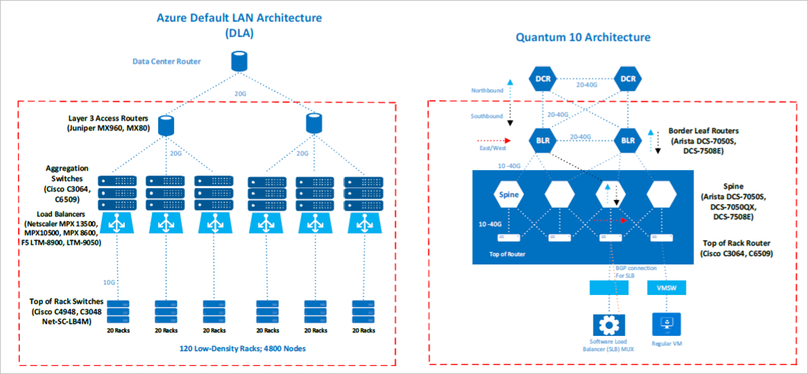
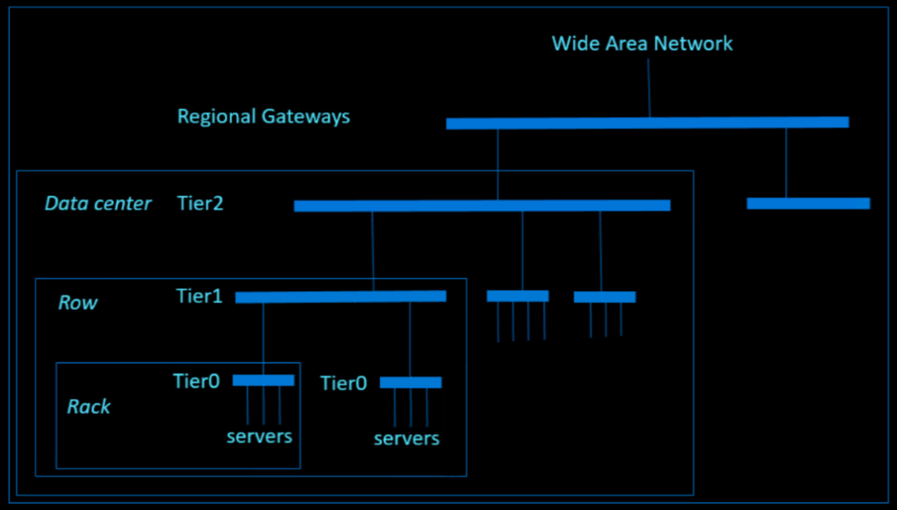

# Azure network architecture
The Azure network architecture provides connectivity from the internet to the Azure datacenters. Any workload deployed on Azure, including infrastructure as a service (IaaS), platform as a service (PaaS), and software as a service (SaaS), uses the Azure datacenter network.

## Network topology
The network architecture of an Azure datacenter consists of the following components:

- Edge network
- Wide area network
- Regional gateways network
- Datacenter network

## Network components
The following list briefly describes the network components:

- Edge network

   - Demarcation point between Microsoft networking and other networks, such as the internet and enterprise network
   - Provides internet and [ExpressRoute](../../expressroute/expressroute-introduction.md) peering into Azure

- Wide area network

   - Microsoft intelligent backbone network covering the globe
   - Provides connectivity between [Azure regions](/azure/reliability/regions-overview)

- Regional gateway

   - Point of aggregation for all of the datacenters in an Azure region
      - Provides massive connectivity between datacenters within an Azure region, such as hundreds of terabits per datacenter

- Datacenter network

   - Provides connectivity between servers within the datacenter with low oversubscribed bandwidth

Microsoft designs these network components to provide maximum availability to support always-on, always-available cloud business. Microsoft designs and builds redundancy into the network from the physical layer through the control protocol.

## Datacenter network resiliency
This section illustrates the resiliency design principle through the datacenter network.

The datacenter network is a modified version of a [Clos network](https://en.wikipedia.org/wiki/Clos_network), providing high bisectional bandwidth for cloud-scale traffic. Microsoft constructs the network by using many commodity devices to reduce the impact of individual hardware failure. The network uses devices that are strategically located in different physical locations with separate power and cooling domains to reduce the impact of an environmental event. On the control plane, all network devices run in OSI model Layer 3 routing mode, which eliminates the historical problem of traffic loops. All paths between different tiers are active to provide high redundancy and bandwidth by using equal-cost multipath (ECMP) routing.

The following diagram demonstrates how different tiers of network devices construct the datacenter network. The bars in the diagram represent groups of network devices that provide redundancy and high bandwidth connectivity.

## Next steps
To learn more about what Microsoft does to help secure the Azure infrastructure, see:

- [Azure facilities, premises, and physical security](physical-security.md)
- [Azure infrastructure availability](infrastructure-availability.md)
- [Azure information system components and boundaries](infrastructure-components.md)
- [Azure production network](production-network.md)
- [Azure SQL Database security features](infrastructure-sql.md)
- [Azure production operations and management](infrastructure-operations.md)
- [Azure infrastructure monitoring](infrastructure-monitoring.md)
- [Azure infrastructure integrity](infrastructure-integrity.md)
- [Azure customer data protection](protection-customer-data.md)
