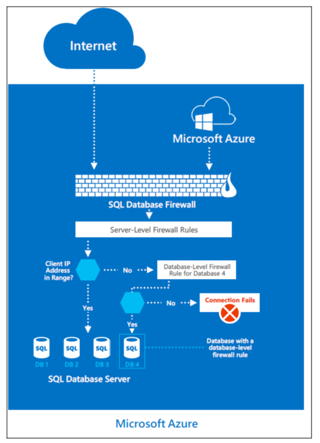

# Azure SQL Database security features    
Azure SQL Database provides a relational database service in Azure. To protect customer data and provide strong security features that customers expect from a relational database service, SQL Database has its own sets of security capabilities. These capabilities build upon the controls that are inherited from Azure.

## Security capabilities

### Usage of the TDS protocol
Azure SQL Database supports only the tabular data stream (TDS) protocol, which requires the database to be accessible over only the default port of TCP/1433.

### Azure SQL Database firewall
To help protect customer data, Azure SQL Database includes a firewall functionality, which by default prevents all access to SQL Database.

The gateway firewall can limit addresses, which allows customers granular control to specify ranges of acceptable IP addresses. The firewall grants access based on the originating IP address of each request.

Customers can achieve firewall configuration by using a management portal or programmatically using the Azure SQL Database Management REST API. The Azure SQL Database gateway firewall by default prevents all customer TDS access to Azure SQL Database. Customers must configure access by using access-control lists (ACLs) to permit Azure SQL Database connections by source and destination internet addresses, protocols, and port numbers.

### DoSGuard
DosGuard, a SQL Database gateway service, reduces denial of service (DoS) attacks. DoSGuard actively tracks failed logins from IP addresses. If there are multiple failed logins from an IP address within a period of time, the IP address is blocked from accessing any resources in the service for a predefined time period.

In addition, the Azure SQL Database gateway performs:

- Secure channel capability negotiations to implement TDS FIPS 140-2 validated encrypted connections when it connects to the database servers.
- Stateful TDS packet inspection while it accepts connections from clients. The gateway validates the connection information. The gateway passes on the TDS packets to the appropriate physical server based on the database name that's specified in the connection string.

The overarching principle for network security of the Azure SQL Database offering is to allow only the connection and communication that is necessary to allow the service to operate. All other ports, protocols, and connections are blocked by default. Virtual local area networks (VLANs) and ACLs are used to restrict network communications by source and destination networks, protocols, and port numbers.

Mechanisms that are approved to implement network-based ACLs include ACLs on routers and load balancers. These mechanisms are managed by Azure networking, guest VM firewall, and Azure SQL Database gateway firewall rules configured by the customer.

## Data segregation and customer isolation
The Azure production network is structured such that publicly accessible system components are segregated from internal resources. Physical and logical boundaries exist between web servers that provide access to the public-facing Azure portal and the underlying Azure virtual infrastructure, where customer application instances and customer data reside.

All publicly accessible information is managed within the Azure production network. The production network is:

- Subject to two-factor authentication and boundary protection mechanisms
- Uses the firewall and security feature set described in the previous section
- Uses data isolation functions noted in the next sections

### Unauthorized systems and isolation of the FC
Because the fabric controller (FC) is the central orchestrator of the Azure fabric, significant controls are in place to mitigate threats to it, especially from potentially compromised FAs within customer applications. The FC doesn't recognize any hardware whose device information (for example, MAC address) isn't preloaded within the FC. The DHCP servers on the FC have configured lists of MAC addresses of the nodes they're willing to boot. Even if unauthorized systems are connected, they're not incorporated into fabric inventory, and therefore not connected or authorized to communicate with any system within the fabric inventory. This reduces the risk of unauthorized systems' communicating with the FC and gaining access to the VLAN and Azure.

### VLAN isolation
The Azure production network is logically segregated into three primary VLANs:

- The main VLAN: Interconnects untrusted customer nodes.
- The FC VLAN: Contains trusted FCs and supporting systems.
- The device VLAN: Contains trusted network and other infrastructure devices.

### Packet filtering
The IPFilter and the software firewalls that are implemented on the root OS and guest OS of the nodes enforce connectivity restrictions and prevent unauthorized traffic between VMs.

### Hypervisor, root OS, and guest VMs
The hypervisor and the root OS manages the isolation of the root OS from the guest VMs and the guest VMs from one another.

### Types of rules on firewalls
A rule is defined as:

{Src IP, Src Port, Destination IP, Destination Port, Destination Protocol, In/Out, Stateful/Stateless, Stateful Flow Timeout}.

Synchronous idle character (SYN) packets are allowed in or out only if any one of the rules permits it. For TCP, Azure uses stateless rules where the principle is that it allows only all non-SYN packets into or out of the VM. The security premise is that any host stack is resilient of ignoring a non-SYN if it hasn't seen a SYN packet previously. The TCP protocol itself is stateful, and in combination with the stateless SYN-based rule achieves an overall behavior of a stateful implementation.

For User Datagram Protocol (UDP), Azure uses a stateful rule. Every time a UDP packet matches a rule, a reverse flow is created in the other direction. This flow has a built-in timeout.

Customers are responsible for setting up their own firewalls on top of what Azure provides. Here, customers are able to define the rules for inbound and outbound traffic.

### Production configuration management
Standard secure configurations are maintained by respective operations teams in Azure and Azure SQL Database. All configuration changes to production systems are documented and tracked through a central tracking system. Software and hardware changes are tracked through the central tracking system. Networking changes that relate to ACL are tracked using an ACL management service.

All configuration changes to Azure are developed and tested in the staging environment, and they're thereafter deployed in production environment. Software builds are reviewed as part of testing. Security and privacy checks are reviewed as part of entry checklist criteria. Changes are deployed on scheduled intervals by the respective deployment team. Releases are reviewed and signed off by the respective deployment team personnel before they're deployed into production.

Changes are monitored for success. On a failure scenario, the change is rolled back to its previous state or a hotfix is deployed to address the failure with approval of the designated personnel. Source Depot, Git, TFS, Master Data Services (MDS), runners, Azure security monitoring, the FC, and the WinFabric platform are used to centrally manage, apply, and verify the configuration settings in the Azure virtual environment.

Similarly, hardware and network changes have established validation steps to evaluate their adherence to the build requirements. The releases are reviewed and authorized through a coordinated change advisory board (CAB) of respective groups across the stack.

## Next steps
To learn more about what Microsoft does to secure the Azure infrastructure, see:

- [Azure facilities, premises, and physical security](physical-security.md)
- [Azure infrastructure availability](infrastructure-availability.md)
- [Azure information system components and boundaries](infrastructure-components.md)
- [Azure network architecture](infrastructure-network.md)
- [Azure production network](production-network.md)
- [Azure production operations and management](infrastructure-operations.md)
- [Azure infrastructure monitoring](infrastructure-monitoring.md)
- [Azure infrastructure integrity](infrastructure-integrity.md)
- [Azure customer data protection](protection-customer-data.md)
