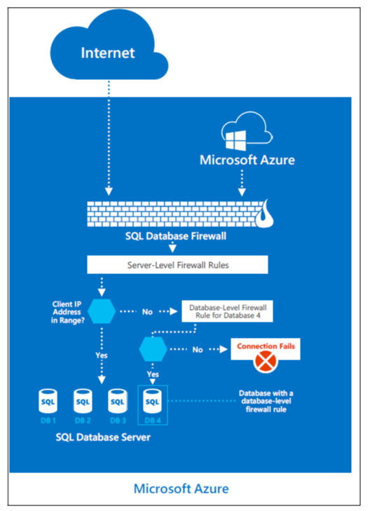

# Azure SQL Database security features
Azure SQL Database provides a relational database service in Azure. To protect customer data and provide strong security features that you expect from a relational database service, SQL Database has its own set of security capabilities. These capabilities build on the controls that Azure provides.

## Security capabilities

### Usage of the TDS protocol
Azure SQL Database supports only the tabular data stream (TDS) protocol, which requires the database to be accessible only over the default port of TCP/1433.

### Azure SQL Database firewall
To help protect customer data, Azure SQL Database includes firewall functionality that, by default, prevents all access to SQL Database.

The gateway firewall can limit addresses, which gives you granular control to specify acceptable IP address ranges. The firewall grants access based on the originating IP address of each request.

You can configure the firewall by using a management portal or programmatically by using the Azure SQL Database Management REST API. The Azure SQL Database gateway firewall by default prevents all customer TDS access to Azure SQL Database. You must configure access by using access-control lists (ACLs) to permit Azure SQL Database connections by source and destination internet addresses, protocols, and port numbers.

### DoSGuard
DosGuard, a SQL Database gateway service, reduces denial of service (DoS) attacks. DoSGuard actively tracks failed logins from IP addresses. If multiple failed sign-in attempts occur from an IP address within a time period, DoSGuard blocks the IP address from accessing any resources in the service for a predefined time period.

The Azure SQL Database gateway also performs these actions:

- Negotiates secure channel capabilities to implement TDS FIPS 140-2 validated encrypted connections when it connects to the database servers
- Inspects stateful TDS packets while it accepts connections from clients. The gateway validates the connection information and passes on the TDS packets to the appropriate physical server based on the database name that's specified in the connection string

The overarching principle for Azure SQL Database network security is to allow only the connections and communication that the service needs to operate. Azure blocks all other ports, protocols, and connections by default. Azure uses virtual local area networks (VLANs) and ACLs to restrict network communications by source and destination networks, protocols, and port numbers.

Approved mechanisms to implement network-based ACLs include ACLs on routers and load balancers. Azure networking, the guest VM firewall, and customer-configured Azure SQL Database gateway firewall rules manage these mechanisms.

## Data segregation and customer isolation
Azure structures the production network to segregate publicly accessible system components from internal resources. Physical and logical boundaries exist between web servers that provide access to the public-facing Azure portal and the underlying Azure virtual infrastructure, where customer application instances and customer data reside.

Azure manages all publicly accessible information within the Azure production network. The production network is:

- Subject to two-factor authentication and boundary protection mechanisms
- Uses the firewall and security feature set described in the previous section
- Uses data isolation functions noted in the next sections

### Unauthorized systems and isolation of the FC
Because the fabric controller (FC) is the central orchestrator of the Azure fabric, significant controls are in place to mitigate threats to it, especially from potentially compromised FAs within customer applications. The FC doesn't recognize any hardware whose device information (for example, MAC address) isn't preloaded within the FC. The DHCP servers on the FC maintain configured lists of MAC addresses of the nodes they're willing to boot. Even if unauthorized systems connect, the FC doesn't incorporate them into fabric inventory and doesn't connect or authorize them to communicate with any system within the fabric inventory. This restriction reduces the risk of unauthorized systems communicating with the FC and gaining access to the VLAN and Azure.

### VLAN isolation
The Azure production network is logically segregated into three primary VLANs:

- The main VLAN: Interconnects untrusted customer nodes.
- The FC VLAN: Contains trusted FCs and supporting systems.
- The device VLAN: Contains trusted network and other infrastructure devices.

### Packet filtering
The IPFilter and the software firewalls on the root OS and guest OS of the nodes enforce connectivity restrictions and prevent unauthorized traffic between VMs.

### Hypervisor, root OS, and guest VMs
The hypervisor and the root OS manage the isolation of the root OS from the guest VMs and the guest VMs from one another.

### Types of rules on firewalls
Azure defines a rule as:

{Src IP, Src Port, Destination IP, Destination Port, Destination Protocol, In/Out, Stateful/Stateless, Stateful Flow Timeout}.

Rules allow synchronous idle character (SYN) packets in or out only if one of the rules permits it. For TCP, Azure uses stateless rules where the principle allows only non-SYN packets into or out of the VM. The security premise is that any host stack is resilient to ignoring a non-SYN if it hasn't seen a SYN packet previously. The TCP protocol itself is stateful, and in combination with the stateless SYN-based rule achieves an overall behavior of a stateful implementation.

For User Datagram Protocol (UDP), Azure uses a stateful rule. Every time a UDP packet matches a rule, Azure creates a reverse flow in the other direction. This flow has a built-in timeout.

You're responsible for setting up your own firewalls on top of what Azure provides. You can define the rules for inbound and outbound traffic.

### Production configuration management
Respective operations teams in Azure and Azure SQL Database maintain standard secure configurations. A central tracking system documents and tracks all configuration changes to production systems. The central tracking system tracks software and hardware changes. An ACL management service tracks networking changes that relate to ACL.

Teams develop and test all configuration changes to Azure in the staging environment, and then deploy them in the production environment. Teams review software builds as part of testing. Teams review security and privacy checks as part of entry checklist criteria. The respective deployment team deploys changes on scheduled intervals. The respective deployment team personnel review and sign off releases before deployment into production.

Teams monitor changes for success. In a failure scenario, teams roll back the change to its previous state or deploy a hotfix to address the failure with approval of the designated personnel. Source Depot, Git, TFS, Master Data Services (MDS), runners, Azure security monitoring, the FC, and the WinFabric platform centrally manage, apply, and verify the configuration settings in the Azure virtual environment.

Similarly, established validation steps evaluate hardware and network changes for adherence to the build requirements. A coordinated change advisory board (CAB) of respective groups across the stack reviews and authorizes the releases.

## Next steps
To learn more about what Microsoft does to secure the Azure infrastructure, see:

- [Azure facilities, premises, and physical security](physical-security.md)
- [Azure infrastructure availability](infrastructure-availability.md)
- [Azure information system components and boundaries](infrastructure-components.md)
- [Azure network architecture](infrastructure-network.md)
- [Azure production network](production-network.md)
- [Azure production operations and management](infrastructure-operations.md)
- [Azure infrastructure monitoring](infrastructure-monitoring.md)
- [Azure infrastructure integrity](infrastructure-integrity.md)
- [Azure customer data protection](protection-customer-data.md)
