# Isolation in the Azure public cloud

Azure helps you run applications and virtual machines (VMs) on shared physical infrastructure. One of the main economic benefits of running applications in a cloud environment is the ability to distribute the cost of shared resources among multiple tenants. This multitenancy practice improves efficiency by multiplexing resources among different tenants at low costs. However, it also introduces the risk of sharing physical servers and other infrastructure resources to run your sensitive applications and VMs that might belong to an arbitrary and potentially malicious user.

This article describes how Azure provides isolation against both malicious and non-malicious users. It serves as a guide for architecting cloud solutions by offering several isolation choices to architects.

## Tenant level isolation

One of the primary benefits of cloud computing is the concept of shared, common infrastructure across numerous tenants simultaneously, leading to economies of scale. This concept is called multitenancy. Microsoft works continuously to ensure that the multitenant architecture of Microsoft Azure supports security, confidentiality, privacy, integrity, and availability standards.

In the cloud-enabled workplace, a tenant is a client or organization that owns and manages a specific instance of that cloud service. In the identity platform provided by Microsoft Azure, a tenant is a dedicated instance of Microsoft Entra ID that your organization receives and owns when it signs up for a Microsoft cloud service.

Each Microsoft Entra directory is distinct and separate from other Microsoft Entra directories. Like a corporate office building, a Microsoft Entra directory is a secure asset for use by only your organization. The Microsoft Entra architecture isolates customer data and identity information from co-mingling. This isolation means that users and administrators of one Microsoft Entra directory can't accidentally or maliciously access data in another directory.

### Azure tenancy

Azure tenancy (Azure subscription) refers to a customer and billing relationship and a unique [tenant](/entra/identity-platform/quickstart-create-new-tenant) in [Microsoft Entra ID](/entra/fundamentals/what-is-entra). Microsoft Entra ID and its [Azure role-based access control](../../role-based-access-control/overview.md) provide tenant-level isolation in Microsoft Azure. Each Azure subscription is associated with one Microsoft Entra directory.

Users, groups, and applications from that directory can manage resources in the Azure subscription. Assign these access rights by using the Azure portal, Azure command-line tools, and Azure Management APIs. Security boundaries logically isolate a Microsoft Entra tenant so that no customer can access or compromise co-tenants, either maliciously or accidentally. Microsoft Entra ID runs on "bare metal" servers isolated on a segregated network segment, where host-level packet filtering and Windows Firewall block unwanted connections and traffic.

:::image type="content" source="media/isolation-choices/azure-isolation-fig-1.svg" alt-text="Azure tenancy architecture diagram." border="false":::

- Access to data in Microsoft Entra ID requires user authentication through a security token service (STS). The authorization system uses information on the user's existence, enabled state, and role to determine whether this user has authorized access to the target tenant in this session.

- Tenants are discrete containers and there's no relationship between these containers.

- No access exists across tenants unless a tenant admin grants it through federation or by provisioning user accounts from other tenants.

- Microsoft restricts physical access to servers that make up the Microsoft Entra service and direct access to Microsoft Entra ID's back-end systems.

- Microsoft Entra users have no access to physical assets or locations, so they can't bypass the logical Azure RBAC policy checks stated following.

For diagnostics and maintenance needs, use an operational model that employs a just-in-time privilege elevation system. Microsoft Entra Privileged Identity Management (PIM) introduces the concept of an eligible admin. [Eligible admins](/entra/id-governance/privileged-identity-management/pim-configure) are users who need privileged access occasionally, but not every day. The role is inactive until the user needs access. The user then completes an activation process and becomes an active admin for a predetermined amount of time.

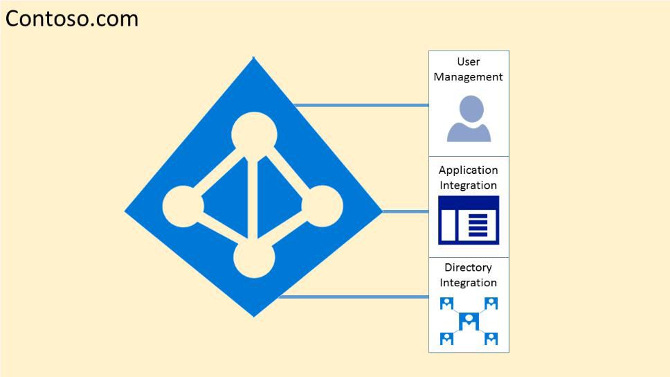

Microsoft Entra ID hosts each tenant in its own protected container, with policies and permissions to and within the container solely owned and managed by the tenant.

The concept of tenant containers is deeply ingrained in the directory service at all layers, from portals all the way to persistent storage.

Even when metadata from multiple Microsoft Entra tenants is stored on the same physical disk, there's no relationship between the containers other than what the directory service defines, which in turn is dictated by the tenant administrator.

### Azure role-based access control (Azure RBAC)

[Azure role-based access control (Azure RBAC)](../../role-based-access-control/overview.md) helps you share several components available within an Azure subscription by providing fine-grained access management for Azure. Azure RBAC enables you to segregate duties within your organization and grant access based on what users need to perform their jobs. Instead of giving everyone unrestricted permissions in an Azure subscription or resources, you can allow only certain actions.

Azure RBAC has three basic roles that apply to all resource types:

- **Owner** has full access to all resources including the right to delegate access to others.

- **Contributor** can create and manage all types of Azure resources but can't grant access to others.

- **Reader** can view existing Azure resources.

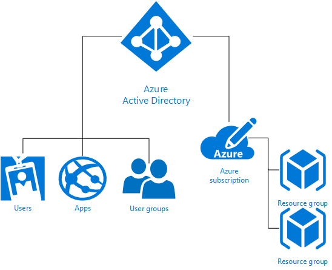

The rest of the Azure roles in Azure allow management of specific Azure resources. For example, the Virtual Machine Contributor role allows the user to create and manage virtual machines. It doesn't give them access to the Azure Virtual Network or the subnet that the virtual machine connects to.

[Azure built-in roles](../../role-based-access-control/built-in-roles.md) list the roles available in Azure. They specify the operations and scope that each built-in role grants to users. If you're looking to define your own roles for even more control, see how to build [Custom roles in Azure RBAC](../../role-based-access-control/custom-roles.md).

Some other capabilities for Microsoft Entra ID include:

- Microsoft Entra ID enables SSO to SaaS applications, regardless of where they're hosted. Some applications are federated with Microsoft Entra ID, and others use password SSO. Federated applications can also support user provisioning and [password vaulting](/entra/identity/enterprise-apps/configure-password-single-sign-on-non-gallery-applications).

- Microsoft Entra ID provides Identity as a Service through federation by using [Active Directory Federation Services](/windows-server/identity/ad-fs/deployment/how-to-connect-fed-azure-adfs), synchronization, and replication with on-premises directories.

- [Microsoft Entra multifactor authentication](/entra/identity/authentication/concept-mfa-howitworks) requires users to verify sign-ins by using a mobile app, phone call, or text message. Use it with Microsoft Entra ID to help secure on-premises resources by using the Multi-Factor Authentication Server, and also with custom applications and directories by using the SDK.

- [Microsoft Entra Domain Services](https://azure.microsoft.com/products/microsoft-entra-ds/) helps you join Azure virtual machines to an Active Directory domain without deploying domain controllers. You can sign in to these virtual machines with your corporate Active Directory credentials and administer domain-joined virtual machines by using Group Policy to enforce security baselines on all your Azure virtual machines.

- [Microsoft Entra External ID](/entra/external-id/external-identities-overview) is a highly available global-identity management service for consumer-facing applications that scales to hundreds of millions of identities. You can integrate it across mobile and web platforms. Your consumers can sign in to all your applications through customizable experiences by using their existing social accounts or by creating credentials.

### Isolation from Microsoft administrators and data deletion

Microsoft takes strong measures to protect your data from inappropriate access or use by unauthorized persons. The [Online Services Terms](https://aka.ms/Online-Services-Terms) offer contractual commitments that govern access to your data and back these operational processes and controls.

- Microsoft engineers don't have default access to your data in the cloud. Instead, they're granted access, under management oversight, only when necessary. That access is carefully controlled and logged, and revoked when it's no longer needed.
- Microsoft may hire other companies to provide limited services on its behalf. Subcontractors may access customer data only to deliver the services for which Microsoft hired them, and they're prohibited from using it for any other purpose. Further, they're contractually bound to maintain the confidentiality of customers’ information.

Microsoft and accredited audit firms regularly verify business services with audited certifications such as ISO/IEC 27001. These auditors perform sample audits to attest that access is only for legitimate business purposes. You can always access your own customer data at any time and for any reason.

If you delete any data, Microsoft Azure deletes the data, including any cached or backup copies. For in-scope services, that deletion occurs within 90 days after the end of the retention period. (The Data Processing Terms section of the [Online Services Terms](https://aka.ms/Online-Services-Terms) defines in-scope services.)

If a disk drive used for storage suffers a hardware failure, Microsoft securely [erases or destroys](https://microsoft.com/trustcenter/privacy/you-own-your-data) the drive before it returns the drive to the manufacturer for replacement or repair. Microsoft overwrites the data on the drive to ensure that no one can recover the data by any means.

## Compute isolation

Microsoft Azure provides various cloud-based computing services that include a wide selection of compute instances and services that can scale up and down automatically to meet the needs of your application or enterprise. These compute instances and services offer isolation at multiple levels to secure data without sacrificing the configuration flexibility that organizations demand.

### Isolated virtual machine sizes

Azure Compute offers virtual machine sizes that are isolated to a specific hardware type and dedicated to a single customer. The isolated sizes operate on specific hardware generations. Azure deprecates these sizes when the hardware generation retires or new hardware generation is available.

Isolated virtual machine sizes are best suited for workloads that require a high degree of isolation from other tenants' workloads. This isolation is sometimes required to meet compliance and regulatory requirements. Using an isolated size guarantees that your virtual machine is the only one running on that specific server instance.

Because isolated size VMs are large, you can choose to subdivide their resources by using [Azure support for nested virtual machines](https://azure.microsoft.com/blog/nested-virtualization-in-azure/).

The current isolated virtual machine offerings include:

- `Standard_E192is_v6`
- `Standard_E192ids_v6`
- `Standard_E104i_v5`
- `Standard_E104id_v5`
- `Standard_E104is_v5`
- `Standard_E104ids_v5`
- `Standard_E112ias_v5`
- `Standard_E112iads_v5`
- `Standard_E80is_v4`
- `Standard_E80ids_v4`
- `Standard_E96ias_v4`
- `Standard_E112ibs_v5`
- `Standard_E112ibds_v5`
- `Standard_EC96ias_v5`
- `Standard_EC96iads_v5`
- `Standard_HB120rs_v3`
- `Standard_HB176rs_v4`
- `Standard_HB368rs_v5`
- `Standard_HX176rs`
- `Standard_M832is_16_v3`
- `Standard_M832ids_16_v3`
- `Standard_M192is_v2`
- `Standard_M192ids_v2`
- `Standard_M192ims_v2`
- `Standard_M192idms_v2`
- `Standard_NC64as_T4_v3`
- `Standard_NC96ads_A100_v4`
- `Standard_NC80adis_H100_v5`
- `Standard_ND128isr_NDR_GB200_v6`
- `Standard_ND128isr_NDR_GB300_v6`
- `Standard_ND96isr_H100_v5`
- `Standard_ND96isr_H200_v5`
- `Standard_ND96isr_MI300X_v5`
- `Standard_NG32ads_V620_v1`
- `Standard_NG32adms_V620_v1`
- `Standard_NV72ads_A10_v5`

> [!NOTE]
> Isolated VM sizes have a limited lifespan due to hardware deprecation.

#### Deprecation of isolated VM sizes

Isolated VM sizes have a hardware-limited lifespan. Azure issues reminders 12 months in advance of the official deprecation date of the sizes and provides an updated isolated offering for your consideration. Azure announced the following sizes for retirement.

| Size | Isolation Retirement Date |
| --- | --- |
| `Standard_DS15_v2` | May 15, 2020      |
| `Standard_D15_v2` | May 15, 2020      |
| `Standard_G5` | February 28, 2022 |
| `Standard_GS5` | February 28, 2022 |
| `Standard_E64i_v3` | February 28, 2022 |
| `Standard_E64is_v3` | February 28, 2022 |
| `Standard_M192is_v2` | March 31, 2027    |
| `Standard_M192ims_v2` | March 31, 2027   |
| `Standard_M192ids_v2` | March 31, 2027   |
| `Standard_M192idms_v2` | March 31, 2027  |

To further subdivide the resources of these isolated virtual machines, see [Azure support for nested virtual machines](https://azure.microsoft.com/blog/nested-virtualization-in-azure/).

### Dedicated hosts

In addition to the isolated hosts described in the preceding section, Azure also offers dedicated hosts. Azure Dedicated Host is a service that provides physical servers that can host one or more virtual machines and are dedicated to a single Azure subscription. Dedicated hosts provide hardware isolation at the physical server level. No other VMs are placed on your hosts. You deploy dedicated hosts in the same datacenters and they share the same network and underlying storage infrastructure as other, non-isolated hosts. For more information, see the detailed overview of [Azure dedicated hosts](/azure/virtual-machines/dedicated-hosts).

### Hyper-V and root OS isolation between root VM and guest VMs

Azure's compute platform is based on machine virtualization. All customer code runs in a Hyper-V virtual machine. On each Azure node (or network endpoint), a hypervisor runs directly over the hardware and divides the node into a variable number of guest virtual machines (VMs).

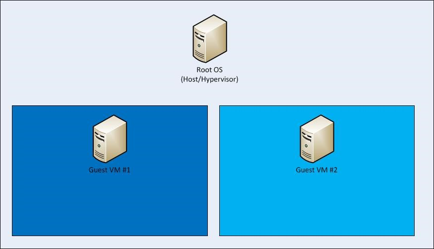

Each node also has one special root VM that runs the host operating system. The hypervisor and root operating system manage the isolation of the root VM from the guest VMs and the isolation of the guest VMs from one another. This hypervisor and root operating system pairing uses Microsoft's decades of operating system security experience and more recent learning from Microsoft's Hyper-V to provide strong isolation of guest VMs.

The Azure platform uses a virtualized environment. User instances operate as standalone virtual machines that don't have access to a physical host server.

The Azure hypervisor acts like a microkernel. It passes all hardware access requests from guest virtual machines to the host for processing by using a shared-memory interface called VM Bus. This architecture prevents users from obtaining raw read, write, or execute access to the system and mitigates the risk of sharing system resources.

### Advanced VM placement algorithm and protection from side-channel attacks

Any cross-VM attack involves two steps: placing an adversary-controlled VM on the same host as one of the victim VMs, and then breaching the isolation boundary to either steal sensitive victim information or affect its performance for resource theft or disruption. Microsoft Azure provides protection at both steps by using an advanced VM placement algorithm and protection from all known side channel attacks, including noisy neighbor VMs.

### The Azure fabric controller

The Azure Fabric Controller allocates infrastructure resources to tenant workloads and manages unidirectional communications from the host to virtual machines. The VM placement algorithm is highly sophisticated and nearly impossible to predict at the physical host level.

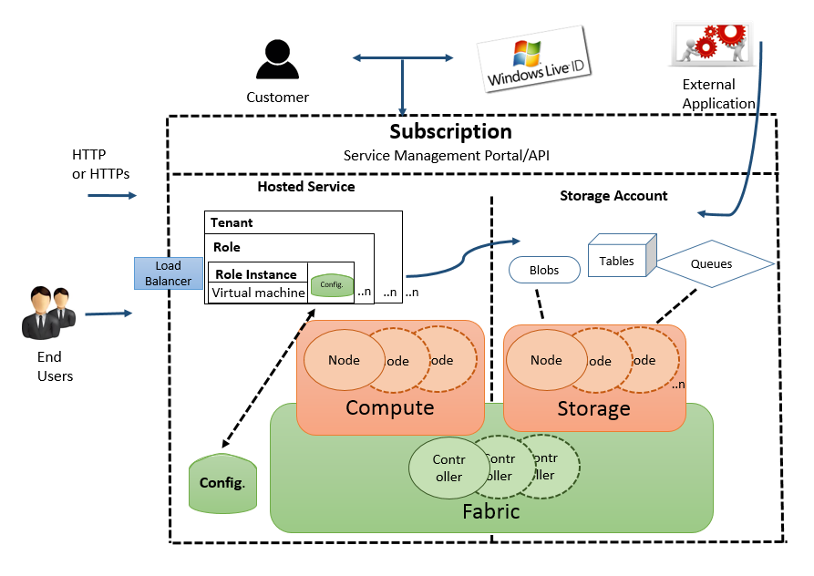

In Azure, the root VM runs a hardened operating system called the root OS that hosts a fabric agent (FA). FAs manage guest agents (GA) within guest operating systems on customer VMs and also manage storage nodes.

The collection of Azure hypervisor, root OS/FA, and customer VMs/GAs comprises a compute node. A fabric controller (FC) manages FAs. The FC exists outside of compute and storage nodes. Separate FCs manage compute and storage clusters. If a customer updates their application’s configuration file while it’s running, the FC communicates with the FA. The FA contacts GAs, which notify the application of the configuration change. In the event of a hardware failure, the FC automatically finds available hardware and restarts the VM there.

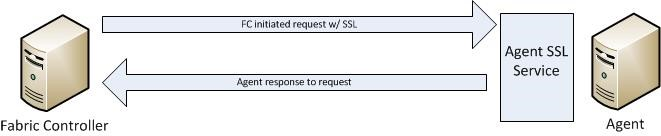

Communication from a fabric controller to an agent is unidirectional. The agent implements an SSL-protected service that only responds to requests from the controller. The agent can't initiate connections to the controller or other privileged internal nodes. The FC treats all responses as if they were untrusted.

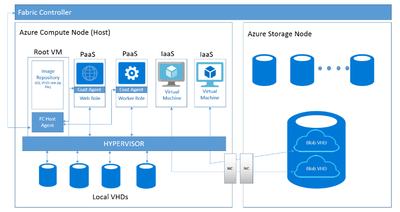

Isolation extends from the root VM to guest VMs, and from one guest VM to another. Compute nodes are also isolated from storage nodes for increased protection.

The hypervisor and the host OS provide network packet filters. These filters help ensure that untrusted virtual machines can't generate spoofed traffic or receive traffic not addressed to them. They direct traffic to protected infrastructure endpoints and prevent sending or receiving inappropriate broadcast traffic.

### Other rules configured by fabric controller agent to isolate VM

By default, Azure blocks all traffic when you create a virtual machine. Then, the fabric controller agent configures the packet filter to add rules and exceptions to allow authorized traffic.

The fabric controller agent programs two categories of rules:

- **Machine configuration or infrastructure rules:** By default, Azure blocks all communication. Add exceptions to allow a virtual machine to send and receive DHCP and DNS traffic. Virtual machines can also send traffic to the "public" internet and send traffic to other virtual machines within the same Azure Virtual Network and the OS activation server. The list of allowed outgoing destinations for virtual machines doesn't include Azure router subnets, Azure management, and other Microsoft properties.
- **Role configuration file:** This file defines the inbound Access Control Lists (ACLs) based on the tenant's service model.

### VLAN isolation

Each cluster contains three VLANs:

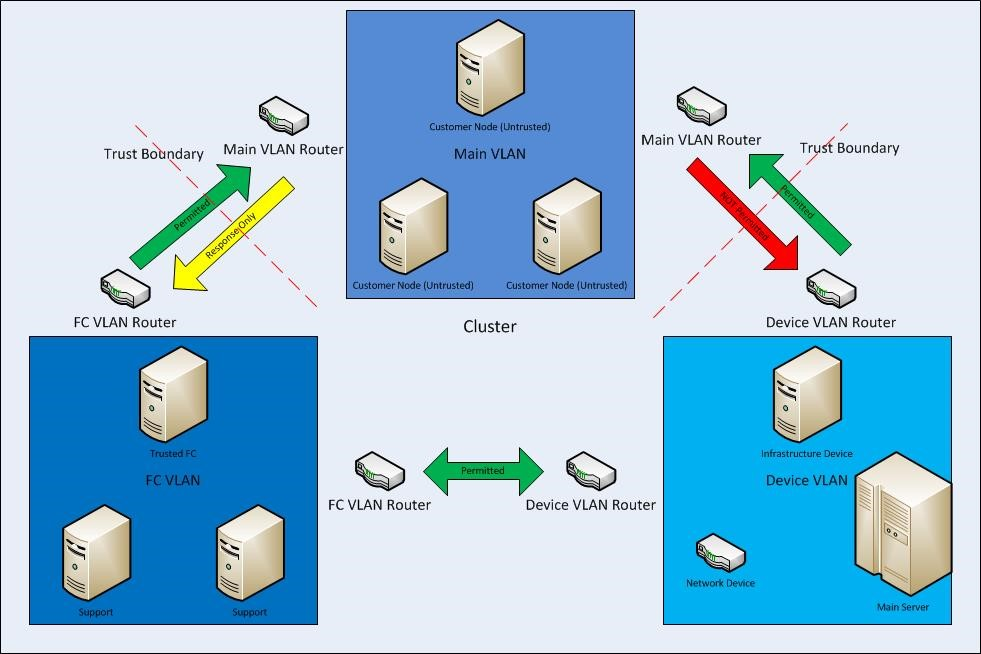

- The main VLAN: Interconnects untrusted customer nodes.
- The FC VLAN: Contains trusted FCs and supporting systems.
- The device VLAN: Contains trusted network and other infrastructure devices.

The FC VLAN can communicate with the main VLAN, but the main VLAN can't initiate communication with the FC VLAN. The main VLAN also can't communicate with the device VLAN. This VLAN architecture ensures that even if a node running customer code is compromised, it can't attack nodes on either the FC or device VLANs.

## Storage isolation

### Logical isolation between compute and storage

As part of its fundamental design, Microsoft Azure separates VM-based computation from storage. This design enables computation and storage to scale independently, making it easier to provide multitenancy and isolation.

Therefore, Azure Storage runs on separate hardware with no network connectivity to Azure Compute except logical connectivity. This storage design means that when you create a virtual disk, the system doesn't allocate disk space for its entire capacity. Instead, the system creates a table that maps addresses on the virtual disk to areas on the physical disk. This table is initially empty. **The first time you write data on the virtual disk, the system allocates space on the physical disk and places a pointer to it in the table.**

### Isolation by using storage access control

**Access control in Azure Storage** uses a simple access control model. Each Azure subscription can create one or more storage accounts. Each storage account has a single secret key that you use to control access to all data in that storage account.

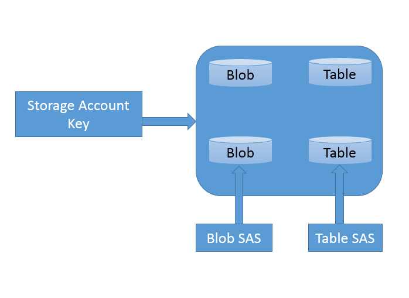

You can control **access to Azure Storage data (including Tables)** through a [SAS (Shared Access Signature)](../../storage/common/storage-sas-overview.md) token, which grants scoped access. You create the SAS through a query template (URL) and sign it with the [SAK (Storage Account Key)](/previous-versions/azure/reference/ee460785(v=azure.100)). You can give the [signed URL](../../storage/common/storage-sas-overview.md) to another process (delegated). The delegated process can then fill in the details of the query and make the request of the storage service. By using a SAS, you can grant time-based access to clients without revealing the storage account’s secret key.

With the SAS, you can grant a client limited permissions to objects in your storage account for a specified period of time and a specified set of permissions. You grant these limited permissions without having to share your account access keys.

### IP level storage isolation

You can establish firewalls and define an IP address range for your trusted clients. By using an IP address range, only clients that have an IP address within the defined range can connect to [Azure Storage](../../storage/blobs/security-recommendations.md).

Use a networking mechanism that allocates a dedicated tunnel of traffic to IP storage to protect IP storage data from unauthorized users.

### Encryption

Azure offers the following types of encryption to protect data:

- Encryption in transit
- Encryption at rest

#### Encryption in transit

Encryption in transit protects data when it's transmitted across networks. By using Azure Storage, you can secure data by using:

- [Transport-level encryption](../../storage/blobs/security-recommendations.md), such as HTTPS when you transfer data into or out of Azure Storage.
- [Wire encryption](../../storage/blobs/security-recommendations.md), such as SMB 3.0 encryption for Azure File shares.
- [Client-side encryption](../../storage/blobs/security-recommendations.md), to encrypt the data before it's transferred into storage and to decrypt the data after it's transferred out of storage.

#### Encryption at rest

For many organizations, data encryption at rest is a mandatory step toward data privacy, compliance, and data sovereignty. Azure features that provide encryption of data at rest include:

- [Storage service encryption](../../storage/blobs/security-recommendations.md) automatically encrypts data when writing it to Azure Storage.
- [Client-side encryption](../../storage/blobs/security-recommendations.md) encrypts data before it's transferred into storage.
- [Encryption at host](/azure/virtual-machines/disk-encryption) provides end-to-end encryption for VM data.

##### Encryption at host

[!INCLUDE [Azure Disk Encryption retirement notice](~/reusable-content/ce-skilling/azure/includes/security/azure-disk-encryption-retirement.md)]

[Encryption at host](/azure/virtual-machines/disk-encryption#encryption-at-host---end-to-end-encryption-for-your-vm-data) provides end-to-end encryption for your VM data by encrypting data at the VM host level. By default, it uses platform-managed keys, but you can optionally use customer-managed keys stored in [Azure Key Vault or Azure Key Vault Managed HSM](key-management.md) when you need greater control.

Encryption at host provides server-side encryption at the VM host level by using AES 256 encryption, which is FIPS 140-2 compliant. This encryption occurs without consuming VM CPU resources and provides end-to-end encryption for:

- Temporary disks
- OS and data disk caches
- Data flows to Azure Storage

Key benefits of encryption at host:

- **No performance impact**: Encryption occurs at the host level without using VM CPU resources.
- **Broad VM support**: Supported on most VM series and sizes.
- **Customer-managed keys**: Optional integration with Azure Key Vault or Managed HSM for key control.
- **Platform-managed keys by default**: No extra configuration required for encryption.

For more information, see [Encryption at host](/azure/virtual-machines/disk-encryption#encryption-at-host---end-to-end-encryption-for-your-vm-data) and [Overview of managed disk encryption options](/azure/virtual-machines/disk-encryption-overview).

## SQL Database isolation

[Azure SQL Database](/azure/azure-sql/database/single-database-create-quickstart) is a cloud-based relational database service built on the Microsoft SQL Server engine. Azure SQL Database is a highly available, scalable, multitenant database service with predictable data isolation at the account, geography, region, and network levels. The service provides this database isolation with near-zero administration.

### SQL Database application model

From an application perspective, SQL Database provides the following hierarchy, where each level has one-to-many containment of levels below.

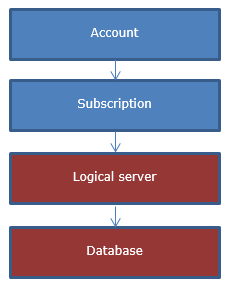

The account and subscription are Microsoft Azure platform concepts to associate billing and management.

Logical SQL servers and databases are SQL Database-specific concepts. You manage them by using SQL Database-provided OData and T-SQL interfaces or the Azure portal.

Servers in SQL Database aren't physical or VM instances. Instead, they're collections of databases that share management and security policies stored in a so-called logical master database.

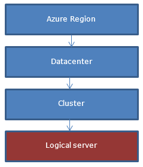

Logical master databases include:

- SQL logins used to connect to the server
- Firewall rules

Billing and usage-related information for databases from the same server isn't guaranteed to be on the same physical instance in the cluster. Applications must provide the target database name when connecting.

From your perspective, you create a server in a geographical region, but Azure creates the server in one of the clusters in that region.

### Isolation through network topology

When you create a server and register its DNS name, the DNS name points to the **Gateway VIP** address in the specific data center where you place the server.  

Behind the VIP (virtual IP address), there's a collection of stateless gateway services. In general, gateways get involved when coordination is needed between multiple data sources (master database, user database, and so on). Gateway services implement the following functions:

- **TDS connection proxying.** This function includes locating the user database in the backend cluster, implementing the authentication sequence, and then forwarding the TDS packets to the backend and back.
- **Database management.** This function includes implementing a collection of workflows to handle CREATE, ALTER, and DROP database operations. The service can invoke database operations by either sniffing TDS packets or explicit OData APIs.
- CREATE, ALTER, and DROP authentication and user operations
- Server management operations through OData API

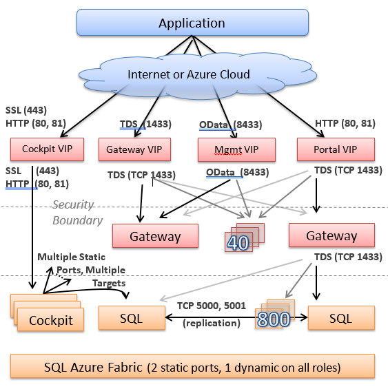

The tier behind the gateways is called **back-end**. The back-end tier stores all the data in a highly available fashion. Each piece of data belongs to a **partition** or **failover unit**, and each partition has at least three replicas. The SQL Server engine stores and replicates replicas, and a failover system often referred to as **fabric** manages them.

Generally, the back-end system doesn't communicate outbound to other systems as a security precaution. Azure reserves outbound communication to the systems in the front-end (gateway) tier. The gateway tier machines hold limited privileges on the back-end machines. This constraint minimizes the attack surface as a defense-in-depth mechanism.

### Isolation by machine function and access

SQL Database comprises services running on different machine functions. SQL Database divides these services into **back-end** cloud database and **front-end** gateway and management environments, with the general principle of traffic only going into back-end and not out. The front-end environment can communicate to the outside world of other services and, in general, has only limited permissions in the back-end (enough to call the entry points it needs to invoke).

## Networking isolation

Azure deployments have multiple layers of network isolation. The following diagram shows various layers of network isolation Azure provides. These layers include native Azure platform features and customer-defined features. Inbound from the internet, Azure DDoS protection provides isolation against large-scale attacks against Azure. The next layer of isolation is customer-defined public IP addresses (endpoints), which you use to determine which traffic can pass through the cloud service to the virtual network. Native Azure virtual network isolation ensures complete isolation from all other networks. Traffic flows only through user-configured paths and methods. These paths and methods are the next layer, where NSGs, UDR, and you can use network virtual appliances to create isolation boundaries to protect the application deployments in the protected network.

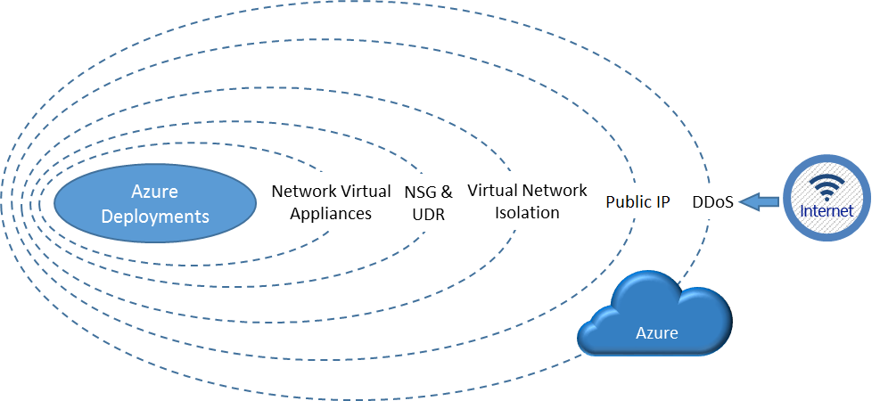

**Traffic isolation:** A [virtual network](../../virtual-network/virtual-networks-overview.md) is the traffic isolation boundary on the Azure platform. Virtual machines (VMs) in one virtual network can't communicate directly to VMs in a different virtual network, even if both virtual networks are created by the same customer. Isolation is a critical property that ensures customer VMs and communications remain private within a virtual network.

[A subnet](../../virtual-network/virtual-networks-overview.md) provides another layer of isolation within a virtual network based on IP range. You can divide a virtual network into multiple subnets for organization and security. VMs and PaaS role instances deployed to subnets (same or different) within a virtual network can communicate with each other without any extra configuration. You can also configure [network security groups (NSGs)](../../virtual-network/network-security-groups-overview.md) to allow or deny network traffic to a VM instance based on security rules. You can associate NSGs with either subnets or individual network interfaces attached to VMs. When you associate an NSG with a subnet, the security rules apply to all the VM instances in that subnet.

## Next steps

- Learn about [network security groups](../../virtual-network/network-security-groups-overview.md). Network security groups filter network traffic between Azure resources in a virtual network. You can restrict traffic to subnets or virtual machines based on source, destination, port, and protocol by using security rules.

- Learn about [virtual machine isolation in Azure](/azure/virtual-machines/isolation). Azure Compute offers virtual machine sizes that are isolated to a specific hardware type and dedicated to a single customer.
