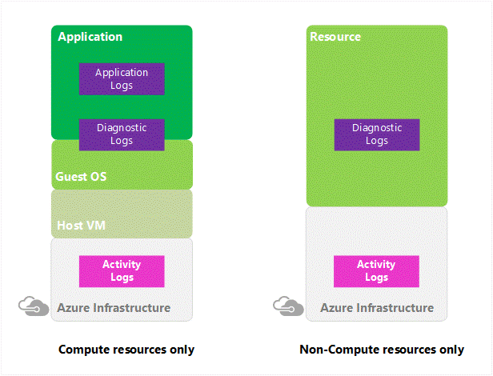
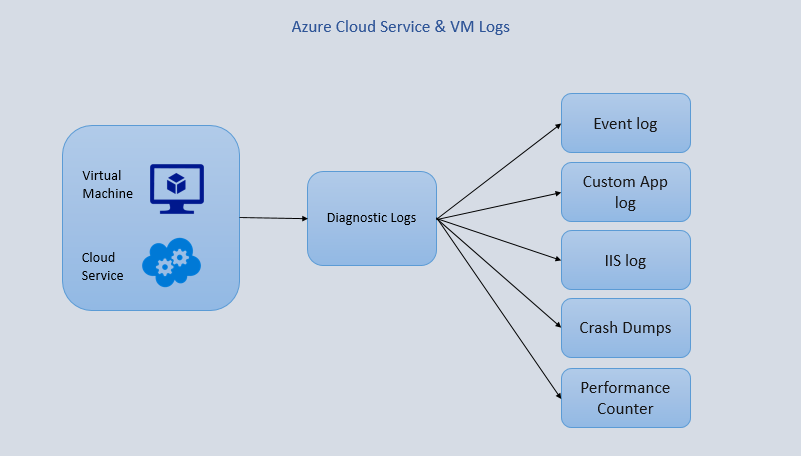
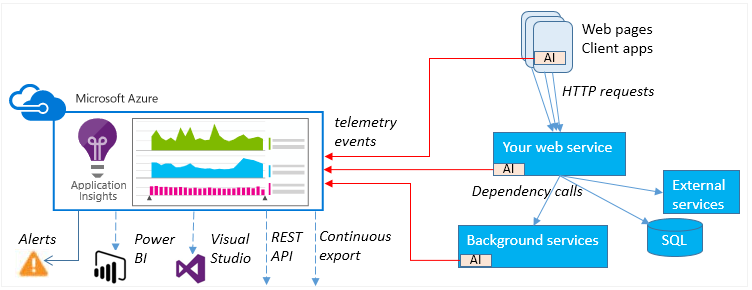
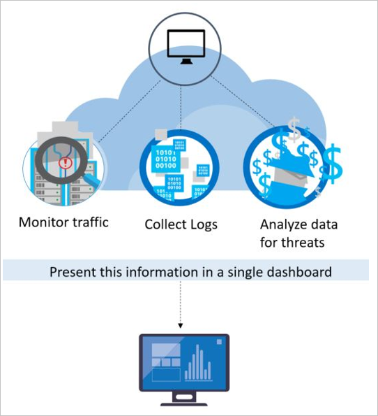

---

title: Azure logging and auditing | Microsoft Docs
description: Learn about how you can use logging data to gain deep insights about your application.
services: security
documentationcenter: na
author: UnifyCloud
manager: barbkess
editor: TomSh

ms.assetid: 
ms.service: security
ms.subservice: security-fundamentals
ms.devlang: na
ms.topic: article
ms.tgt_pltfrm: na
ms.workload: na
ms.date: 01/14/2019
ms.author: TomSh

---
# Azure logging and auditing

Azure provides a wide array of configurable security auditing and logging options to help you identify gaps in your security policies and mechanisms. This article discusses generating, collecting, and analyzing security logs from services hosted on Azure.

> [!Note]
> Certain recommendations in this article might result in increased data, network, or compute resource usage, and increase your license or subscription costs.

## Types of logs in Azure

Cloud applications are complex, with many moving parts. Logs provide data to help keep your applications up and running. Logs help you troubleshoot past problems or prevent potential ones. And they can help improve application performance or maintainability, or automate actions that would otherwise require manual intervention.

Azure logs are categorized into the following types:
* **Control/management logs** provide information about Azure Resource Manager CREATE, UPDATE, and DELETE operations. For more information, see [Azure activity logs](../../azure-monitor/platform/activity-logs-overview.md).

* **Data plane logs** provide information about events raised as part Azure resource usage. Examples of this type of log are the Windows event system, security, and application logs in a virtual machine (VM) and the [diagnostics logs](../../azure-monitor/platform/diagnostic-logs-overview.md) that are configured through Azure Monitor.

* **Processed events** provide information about analyzed events/alerts that have been processed on your behalf. Examples of this type are [Azure Security Center alerts](../../security-center/security-center-managing-and-responding-alerts.md) where [Azure Security Center](../../security-center/security-center-intro.md) has processed and analyzed your subscription and provides concise security alerts.

The following table lists the most important types of logs available in Azure:

| Log category | Log type | Usage | Integration |
| ------------ | -------- | ------ | ----------- |
|[Activity logs](../../azure-monitor/platform/activity-logs-overview.md)|Control-plane events on Azure Resource Manager resources|	Provides insight into the operations that were performed on resources in your subscription.|	Rest API, [Azure Monitor](../../azure-monitor/platform/activity-logs-overview.md)|
|[Azure diagnostics logs](../../azure-monitor/platform/diagnostic-logs-overview.md)|Frequent data about the operation of Azure Resource Manager resources in subscription|	Provides insight into operations that your resource itself performed.| Azure Monitor, [Stream](../../azure-monitor/platform/diagnostic-logs-overview.md)|
|[Azure AD reporting](../../active-directory/reports-monitoring/overview-reports.md)|Logs and reports | Reports user sign-in activities and system activity information about users and group management.|[Graph API](../../active-directory/develop/active-directory-graph-api-quickstart.md)|
|[Virtual machines and cloud services](../../azure-monitor/learn/quick-collect-azurevm.md)|Windows Event Log service and Linux Syslog|	Captures system data and logging data on the virtual machines and transfers that data into a storage account of your choice.|	Windows (using Windows Azure Diagnostics [[WAD](../../monitoring-and-diagnostics/azure-diagnostics.md)] storage) and Linux in Azure Monitor|
|[Azure Storage Analytics](https://docs.microsoft.com/rest/api/storageservices/fileservices/storage-analytics)|Storage logging, provides metrics data for a storage account|Provides insight into trace requests, analyzes usage trends, and diagnoses issues with your storage account.|	REST API or the [client library](https://msdn.microsoft.com/library/azure/mt347887.aspx)|
|[Network Security Group (NSG) flow logs](../../network-watcher/network-watcher-nsg-flow-logging-overview.md)|JSON format, shows outbound and inbound flows on a per-rule basis|Displays information about ingress and egress IP traffic through a Network Security Group.|[Azure Network Watcher](../../network-watcher/network-watcher-monitoring-overview.md)|
|[Application insight](../../azure-monitor/app/app-insights-overview.md)|Logs, exceptions, and custom diagnostics|	Provides an application performance monitoring (APM) service for web developers on multiple platforms.|	REST API, [Power BI](https://powerbi.microsoft.com/documentation/powerbi-azure-and-power-bi/)|
|Process data / security alerts|	Azure Security Center alerts, Azure Monitor logs alerts|	Provides security information and alerts.| 	REST APIs, JSON|

### Activity logs

[Azure activity logs](../../azure-monitor/platform/activity-logs-overview.md) provide insight into the operations that were performed on resources in your subscription. Activity logs were previously known as “audit logs” or “operational logs,” because they report [control-plane events](https://driftboatdave.com/2016/10/13/azure-auditing-options-for-your-custom-reporting-needs/) for your subscriptions. 

Activity logs help you determine the “what, who, and when” for write operations (that is, PUT, POST, or DELETE). Activity logs also help you understand the status of the operation and other relevant properties. Activity logs do not include read (GET) operations.

In this article, PUT, POST, and DELETE refer to all the write operations that an activity log contains on the resources. For example, you can use the activity logs to find an error when you're troubleshooting issues or to monitor how a user in your organization modified a resource.

You can retrieve events from an activity log by using the Azure portal, [Azure CLI](../../storage/common/storage-azure-cli.md), PowerShell cmdlets, and [Azure Monitor REST API](../../azure-monitor/platform/rest-api-walkthrough.md). Activity logs have 90-day data-retention period.

Integration scenarios for an activity log event:

* [Create an email or webhook alert that's triggered by an activity log event](../../monitoring-and-diagnostics/monitor-alerts-unified-log-webhook.md).

* [Stream it to an event hub](../../azure-monitor/platform/activity-logs-stream-event-hubs.md) for ingestion by a third-party service or custom analytics solution such as PowerBI.

* Analyze it in PowerBI by using the [PowerBI content pack](https://powerbi.microsoft.com/documentation/powerbi-content-pack-azure-audit-logs/).

* [Save it to a storage account for archival or manual inspection](../../azure-monitor/platform/archive-activity-log.md). You can specify the retention time (in days) by using log profiles.

* Query and view it in the Azure portal.

* Query it via PowerShell cmdlet, Azure CLI, or REST API.

* Export the activity log with log profiles to [Azure Monitor logs](../../log-analytics/log-analytics-queries.md).

You can use a storage account or [event hub namespace](../../event-hubs/event-hubs-resource-manager-namespace-event-hub-enable-capture.md) that is not in the same subscription as the one that's emitting the log. Whoever configures the setting must have the appropriate [role-based access control (RBAC)](../../role-based-access-control/role-assignments-portal.md) access to both subscriptions.

### Azure diagnostics logs

Azure diagnostics logs are emitted by a resource that provides rich, frequent data about the operation of that resource. The content of these logs varies by resource type. For example, [Windows event system logs](../../azure-monitor/platform/data-sources-windows-events.md) are a category of diagnostics logs for VMs, and [blob, table, and queue logs](../../storage/common/storage-monitor-storage-account.md) are categories of diagnostics logs for storage accounts. Diagnostics logs differ from activity logs, which provide insight into the operations that were performed on resources in your subscription.

Azure diagnostics logs offer multiple configuration options, such as the Azure portal, PowerShell, Azure CLI, and the REST API.

**Integration scenarios**

* Save them to a [storage account](../../azure-monitor/platform/archive-diagnostic-logs.md) for auditing or manual inspection. You can specify the retention time (in days) by using the diagnostics settings.

* [Stream them to event hubs](../../azure-monitor/platform/diagnostic-logs-stream-event-hubs.md) for ingestion by a third-party service or custom analytics solution, such as [PowerBI](https://powerbi.microsoft.com/documentation/powerbi-azure-and-power-bi/).

* Analyze them with [Azure Monitor logs](../../log-analytics/log-analytics-queries.md).

**Supported services, schema for diagnostics logs and supported log categories per resource type**

| Service | Schema and documentation | Resource type | Category |
| ------- | ------------- | ------------- | -------- |
|Azure Load Balancer| [Azure Monitor logs for Load Balancer (Preview)](../../load-balancer/load-balancer-monitor-log.md)|Microsoft.Network/loadBalancers Microsoft.Network/loadBalancers|	LoadBalancerAlertEvent LoadBalancerProbeHealthStatus|
|Network Security Groups|[Azure Monitor logs for Network Security Groups](../../virtual-network/virtual-network-nsg-manage-log.md)|Microsoft.Network/networksecuritygroups Microsoft.Network/networksecuritygroups|NetworkSecurityGroupEvent NetworkSecurityGroupRuleCounter|
|Azure Application Gateway|[Diagnostics logging for Application Gateway](../../application-gateway/application-gateway-diagnostics.md)|Microsoft.Network/applicationGateways Microsoft.Network/applicationGateways Microsoft.Network/applicationGateways|ApplicationGatewayAccessLog ApplicationGatewayPerformanceLog ApplicationGatewayFirewallLog|
|Azure Key Vault|[Key Vault logs](../../key-vault/key-vault-logging.md)|Microsoft.KeyVault/vaults|AuditEvent|
|Azure Search|[Enabling and using Search Traffic Analytics](../../search/search-traffic-analytics.md)|Microsoft.Search/searchServices|OperationLogs|
|Azure Data Lake Store|[Access diagnostics logs for Data Lake Store](../../data-lake-store/data-lake-store-diagnostic-logs.md)|Microsoft.DataLakeStore/accounts Microsoft.DataLakeStore/accounts|Audit Requests|
|Azure Data Lake Analytics|[Access diagnostics logs for Data Lake Analytics](../../data-lake-analytics/data-lake-analytics-diagnostic-logs.md)|Microsoft.DataLakeAnalytics/accounts Microsoft.DataLakeAnalytics/accounts|Audit Requests|
|Azure Logic Apps|[Logic Apps B2B custom tracking schema](../../logic-apps/logic-apps-track-integration-account-custom-tracking-schema.md)|Microsoft.Logic/workflows Microsoft.Logic/integrationAccounts|WorkflowRuntime IntegrationAccountTrackingEvents|
|Azure Batch|[Azure Batch diagnostics logs](../../batch/batch-diagnostics.md)|Microsoft.Batch/batchAccounts|ServiceLog|
|Azure Automation|[Azure Monitor logs for Azure Automation](../../automation/automation-manage-send-joblogs-log-analytics.md)|Microsoft.Automation/automationAccounts Microsoft.Automation/automationAccounts|JobLogs JobStreams|
|Azure Event Hubs|[Event Hubs diagnostics logs](../../event-hubs/event-hubs-diagnostic-logs.md)|Microsoft.EventHub/namespaces Microsoft.EventHub/namespaces|ArchiveLogs OperationalLogs|
|Azure Stream Analytics|[Job diagnostics logs](../../stream-analytics/stream-analytics-job-diagnostic-logs.md)|Microsoft.StreamAnalytics/streamingjobs Microsoft.StreamAnalytics/streamingjobs|Execution Authoring|
|Azure Service Bus|[Service Bus diagnostics logs](../../service-bus-messaging/service-bus-diagnostic-logs.md)|Microsoft.ServiceBus/namespaces|OperationalLogs|

### Azure Active Directory reporting

Azure Active Directory (Azure AD) includes security, activity, and audit reports for a user's directory. The [Azure AD audit report](../../active-directory/active-directory-reporting-azure-portal.md) helps you identify privileged actions that occurred in the user's Azure AD instance. Privileged actions include elevation changes (for example, role creation or password resets), changing policy configurations (for example, password policies), or changes to the directory configuration (for example, changes to domain federation settings).

The reports provide the audit record for the event name, the user who performed the action, the target resource affected by the change, and the date and time (in UTC). Users can retrieve the list of audit events for Azure AD via the [Azure portal](https://portal.azure.com/), as described in [View your audit logs](../../active-directory/reports-monitoring/overview-reports.md). 

The included reports are listed in the following table:

| Security reports | Activity reports | Audit reports |
| :--------------- | :--------------- | :------------ |
|Sign-ins from unknown sources|	Application usage: summary|	Directory audit report|
|Sign-ins after multiple failures|	Application usage: detailed||
|Sign-ins from multiple geographies|	Application dashboard||
|Sign-ins from IP addresses with suspicious activity|	Account provisioning errors||
|Irregular sign-in activity|	Individual user devices||
|Sign-ins from possibly infected devices|	Individual user activity||
|Users with anomalous sign-in activity|	Groups activity report||
||Password reset registration activity report||
||Password reset activity||

The data in these reports can be useful to your applications, such as Security Information and Event Management (SIEM) systems, audit, and business intelligence tools. The Azure AD reporting APIs provide programmatic access to the data through a set of REST-based APIs. You can call these [APIs](../../active-directory/active-directory-reporting-api-getting-started-azure-portal.md) from various programming languages and tools.

The event retention in the Azure AD Audit report varies between 7-90 days depending on the type of license associated with the tenant. 

> [!Note]
> For more information about report retention, see [Azure AD report retention policies](../../active-directory/reports-monitoring/reference-reports-data-retention.md).

If you're interested in retaining your audit events longer, use the Reporting API to regularly pull [audit events](../../active-directory/active-directory-reporting-activity-audit-logs.md) into a separate data store.

### Virtual machine logs that use Azure Diagnostics

[Azure Diagnostics](../../monitoring-and-diagnostics/azure-diagnostics.md) is the capability within Azure that enables the collection of diagnostics data on a deployed application. You can use the diagnostics extension from any of several sources. Currently supported are [Azure cloud service web and worker roles](../../cloud-services/cloud-services-choose-me.md).

### [Azure virtual machines](/learn/paths/deploy-a-website-with-azure-virtual-machines/) that are running Microsoft Windows and [Service Fabric](../../service-fabric/service-fabric-overview.md)

You can enable Azure Diagnostics on a virtual machine by doing any of the following:

* [Use Visual Studio to trace Azure virtual machines](/visualstudio/azure/vs-azure-tools-debug-cloud-services-virtual-machines)

* [Set up Azure Diagnostics remotely on an Azure virtual machine](../../virtual-machines/virtual-machines-dotnet-diagnostics.md)

* [Use PowerShell to set up diagnostics on Azure virtual machines](https://docs.microsoft.com/azure/virtual-machines/virtual-machines-windows-ps-extensions-diagnostics?toc=%2fazure%2fvirtual-machines%2fwindows%2ftoc.json)

* [Create a Windows virtual machine with monitoring and diagnostics by using an Azure Resource Manager template](../../virtual-machines/windows/extensions-diagnostics-template.md?toc=%2fazure%2fvirtual-machines%2fwindows%2ftoc.json)

### Storage Analytics

[Azure Storage Analytics](https://docs.microsoft.com/rest/api/storageservices/fileservices/storage-analytics) logs and provides metrics data for a storage account. You can use this data to trace requests, analyze usage trends, and diagnose issues with your storage account. Storage Analytics logging is available for the [Azure Blob, Azure Queue, and Azure Table storage services](../../storage/common/storage-introduction.md). Storage Analytics logs detailed information about successful and failed requests to a storage service.

You can use this information to monitor individual requests and to diagnose issues with a storage service. Requests are logged on a best-effort basis. Log entries are created only if there are requests made against the service endpoint. For example, if a storage account has activity in its blob endpoint but not in its table or queue endpoints, only logs that pertain to the Blob storage service are created.

To use Storage Analytics, enable it individually for each service you want to monitor. You can enable it in the [Azure portal](https://portal.azure.com/). For more information, see [Monitor a storage account in the Azure portal](../../storage/common/storage-monitor-storage-account.md). You can also enable Storage Analytics programmatically via the REST API or the client library. Use the Set Service Properties operation to enable Storage Analytics individually for each service.

The aggregated data is stored in a well-known blob (for logging) and in well-known tables (for metrics), which you can access by using the Blob storage service and Table storage service APIs.

Storage Analytics has a 20-terabyte (TB) limit on the amount of stored data that is independent of the total limit for your storage account. All logs are stored in [block blobs](../../storage/common/storage-analytics.md) in a container named $logs, which is automatically created when you enable Storage Analytics for a storage account.

> [!Note]
> * For more information about billing and data retention policies, see [Storage Analytics and billing](https://docs.microsoft.com/rest/api/storageservices/fileservices/storage-analytics-and-billing).
> * For more information about storage account limits, see [Azure Storage scalability and performance targets](../../storage/common/storage-scalability-targets.md).

Storage Analytics logs the following types of authenticated and anonymous requests:

| Authenticated  | Anonymous|
| :------------- | :-------------|
| Successful requests | Successful requests |
|Failed requests, including timeout, throttling, network, authorization, and other errors | Requests using a shared access signature, including failed and successful requests |
| Requests using a shared access signature, including failed and successful requests |Time-out errors for both client and server |
| 	Requests to analytics data | 	Failed GET requests with error code 304 (not modified) |
| Requests made by Storage Analytics itself, such as log creation or deletion, are not logged. A full list of the logged data is documented in [Storage Analytics logged operations and status messages](https://docs.microsoft.com/rest/api/storageservices/fileservices/storage-analytics-logged-operations-and-status-messages) and [Storage Analytics log format](https://docs.microsoft.com/rest/api/storageservices/fileservices/storage-analytics-log-format). | All other failed anonymous requests are not logged. A full list of the logged data is documented in [Storage Analytics logged operations and status messages](https://docs.microsoft.com/rest/api/storageservices/fileservices/storage-analytics-logged-operations-and-status-messages) and [Storage Analytics log format](https://docs.microsoft.com/rest/api/storageservices/fileservices/storage-analytics-log-format). |

### Azure networking logs

Network logging and monitoring in Azure is comprehensive and covers two broad categories:

* [Network Watcher](../../network-watcher/network-watcher-monitoring-overview.md): Scenario-based network monitoring is provided with the features in Network Watcher. This service includes packet capture, next hop, IP flow verify, security group view, NSG flow logs. Scenario level monitoring provides an end to end view of network resources in contrast to individual network resource monitoring.

* [Resource monitoring](../../network-watcher/network-watcher-monitoring-overview.md): Resource level monitoring comprises four features, diagnostics logs, metrics, troubleshooting, and resource health. All these features are built at the network resource level.

Network Watcher is a regional service that enables you to monitor and diagnose conditions at a network scenario level in, to, and from Azure. Network diagnostics and visualization tools available with Network Watcher help you understand, diagnose, and gain insights to your network in Azure.

### Network Security Group flow logging

[NSG flow logs](../../network-watcher/network-watcher-nsg-flow-logging-overview.md) are a feature of Network Watcher that you can use to view information about ingress and egress IP traffic through an NSG. These flow logs are written in JSON format and show:
* Outbound and inbound flows on a per-rule basis.
* The NIC that the flow applies to.
* 5-tuple information about the flow: the source or destination IP, the source or destination port, and the protocol.
* Whether the traffic was allowed or denied.

Although flow logs target NSGs, they are not displayed in the same way as the other logs. Flow logs are stored only within a storage account.

The same retention policies that are seen on other logs apply to flow logs. Logs have a retention policy that you can set from 1 day to 365 days. If a retention policy is not set, the logs are maintained forever.

**Diagnostics logs**

Periodic and spontaneous events are created by network resources and logged in storage accounts, and sent to an event hub or Azure Monitor logs. The logs provide insights into the health of a resource. They can be viewed in tools such as Power BI and Azure Monitor logs. To learn how to view diagnostics logs, see [Azure Monitor logs](../../azure-monitor/insights/azure-networking-analytics.md).

Diagnostics logs are available for [Load Balancer](../../load-balancer/load-balancer-monitor-log.md), [Network Security Groups](../../virtual-network/virtual-network-nsg-manage-log.md), Routes, and [Application Gateway](../../application-gateway/application-gateway-diagnostics.md).

Network Watcher provides a diagnostics logs view. This view contains all networking resources that support diagnostics logging. From this view, you can enable and disable networking resources conveniently and quickly.

In addition to the previously mentioned logging capabilities, Network Watcher currently has the following capabilities:
- [Topology](../../network-watcher/view-network-topology.md): Provides a network-level view that shows the various interconnections and associations between network resources in a resource group.

- [Variable packet capture](../../network-watcher/network-watcher-packet-capture-overview.md): Captures packet data in and out of a virtual machine. Advanced filtering options and fine-tuning controls, such as time- and size-limitation settings, provide versatility. The packet data can be stored in a blob store or on the local disk in *.cap* file format.

- [IP flow verification](../../network-watcher/network-watcher-ip-flow-verify-overview.md): Checks to see whether a packet is allowed or denied based on flow information 5-tuple packet parameters (that is, destination IP, source IP, destination port, source port, and protocol). If the packet is denied by a security group, the rule and group that denied the packet is returned.

- [Next hop](../../network-watcher/network-watcher-next-hop-overview.md): Determines the next hop for packets being routed in the Azure network fabric, so that you can diagnose any misconfigured user-defined routes.

- [Security group view](../../network-watcher/network-watcher-security-group-view-overview.md): Gets the effective and applied security rules that are applied on a VM.

- [Virtual network gateway and connection troubleshooting](../../network-watcher/network-watcher-troubleshoot-manage-rest.md): Helps you troubleshoot virtual network gateways and connections.

- [Network subscription limits](../../network-watcher/network-watcher-monitoring-overview.md): Enables you to view network resource usage against limits.

### Application Insights

[Azure Application Insights](../../azure-monitor/app/app-insights-overview.md) is an extensible APM service for web developers on multiple platforms. Use it to monitor live web applications. It automatically detects performance anomalies. It includes powerful analytics tools to help you diagnose issues and to understand what users actually do with your app.

Application Insights is designed to help you continuously improve performance and usability.

It works for apps on a wide variety of platforms, including .NET, Node.js, and Java EE, whether they're hosted on-premises or in the cloud. It integrates with your DevOps process and has connection points with various development tools.

Application Insights is aimed at the development team, to help you understand how your app is performing and how it's being used. It monitors:

* **Request rates, response times, and failure rates**: Find out which pages are most popular, at what times of day, and where your users are. See which pages perform best. If your response times and failure rates go high when there are more requests, you might have a resourcing problem.

* **Dependency rates, response times, and failure rates**: Find out whether external services are slowing you down.

* **Exceptions**: Analyze the aggregated statistics, or pick specific instances and drill into the stack trace and related requests. Both server and browser exceptions are reported.

* **Page views and load performance**: Get reports from your users' browsers.

* **AJAX calls**: Get webpage rates, response times, and failure rates.

* **User and session counts**.

* **Performance counters**: Get data from your Windows or Linux server machines, such as CPU, memory, and network usage.

* **Host diagnostics**: Get data from Docker or Azure.

* **Diagnostics trace logs**: Get data from your app, so that you can correlate trace events with requests.

* **Custom events and metrics**: Get data that you write yourself in the client or server code, to track business events such as items sold or games won.

The following table lists and describes integration scenarios:

| Integration scenario | Description |
| --------------------- | :---------- |
|[Application map](../../azure-monitor/app/app-map.md)|The components of your app, with key metrics and alerts.|
|[Diagnostics search for instance data](../../azure-monitor/app/diagnostic-search.md)| Search and filter events such as requests, exceptions, dependency calls, log traces, and page views.|
|[Metrics Explorer for aggregated data](../../azure-monitor/app/metrics-explorer.md)|Explore, filter, and segment aggregated data such as rates of requests, failures, and exceptions; response times, page load times.|
|[Dashboards](../../azure-monitor/app/overview-dashboard.md)|Mash up data from multiple resources and share with others. Great for multi-component applications, and for continuous display in the team room.|
|[Live Metrics Stream](../../azure-monitor/app/live-stream.md)|When you deploy a new build, watch these near-real-time performance indicators to make sure everything works as expected.|
|[Analytics](../../azure-monitor/app/analytics.md)|Answer tough questions about your app's performance and usage by using this powerful query language.|
|[Automatic and manual alerts](../../azure-monitor/app/alerts.md)|Automatic alerts adapt to your app's normal patterns of telemetry and are triggered when there's something outside the usual pattern. You can also set alerts on particular levels of custom or standard metrics.|
|[Visual Studio](../../azure-monitor/app/visual-studio.md)|View performance data in the code. Go to code from stack traces.|
|[Power BI](../../azure-monitor/app/export-power-bi.md)|Integrate usage metrics with other business intelligence.|
|[REST API](https://dev.applicationinsights.io/)|Write code to run queries over your metrics and raw data.|
|[Continuous export](../../azure-monitor/app/export-telemetry.md)|Bulk export of raw data to storage when it arrives.|

### Azure Security Center alerts

Azure Security Center threat detection works by automatically collecting security information from your Azure resources, the network, and connected partner solutions. It analyzes this information, often correlating information from multiple sources, to identify threats. Security alerts are prioritized in Security Center along with recommendations on how to remediate the threat. For more information, see [Azure Security Center](../../security-center/security-center-intro.md).

Security Center employs advanced security analytics, which go far beyond signature-based approaches. It applies breakthroughs in large data and [machine learning](https://azure.microsoft.com/blog/machine-learning-in-azure-security-center/) technologies to evaluate events across the entire cloud fabric. In this way, it detects threats that would be impossible to identify by using manual approaches and predicting the evolution of attacks. These security analytics include:

* **Integrated threat intelligence**: Looks for known bad actors by applying global threat intelligence from Microsoft products and services, the Microsoft Digital Crimes Unit (DCU), the Microsoft Security Response Center (MSRC), and external feeds.

* **Behavioral analytics**: Applies known patterns to discover malicious behavior.

* **Anomaly detection**: Uses statistical profiling to build a historical baseline. It alerts on deviations from established baselines that conform to a potential attack vector.

Many security operations and incident response teams rely on a SIEM solution as the starting point for triaging and investigating security alerts. With Azure Log Integration, you can sync Security Center alerts and virtual machine security events, collected by Azure diagnostics and audit logs, with your Azure Monitor logs or SIEM solution in near real time.

## Azure Monitor logs

Azure Monitor logs is a service in Azure that helps you collect and analyze data that's generated by resources in your cloud and on-premises environments. It gives you real-time insights by using integrated search and custom dashboards to readily analyze millions of records across all your workloads and servers, regardless of their physical location.

At the center of Azure Monitor logs is the Log Analytics workspace, which is hosted in Azure. Azure Monitor logs collects data in the workspace from connected sources by configuring data sources and adding solutions to your subscription. Data sources and solutions each create different record types, each with its own set of properties. But sources and solutions can still be analyzed together in queries to the workspace. This capability allows you to use the same tools and methods to work with a variety of data collected by a variety of sources.

[!INCLUDE [azure-monitor-log-analytics-rebrand](../../../includes/azure-monitor-log-analytics-rebrand.md)]

Connected sources are the computers and other resources that generate the data that's collected by Azure Monitor logs. Sources can include agents that are installed on [Windows](../../log-analytics/log-analytics-agent-windows.md) and [Linux](../../log-analytics/log-analytics-quick-collect-linux-computer.md) computers that connect directly, or agents in [a connected System Center Operations Manager management group](../../azure-monitor/platform/om-agents.md). Azure Monitor logs can also collect data from an [Azure storage account](../../azure-monitor/platform/diagnostic-logs-stream-log-store.md).

[Data sources](../../azure-monitor/platform/agent-data-sources.md) are the various kinds of data that's collected from each connected source. Sources include events and [performance data](../../azure-monitor/platform/data-sources-performance-counters.md) from [Windows](../../azure-monitor/platform/data-sources-windows-events.md) and Linux agents, in addition to sources such as [IIS logs](../../azure-monitor/platform/data-sources-iis-logs.md) and [custom text logs](../../azure-monitor/platform/data-sources-custom-logs.md). You configure each data source that you want to collect, and the configuration is automatically delivered to each connected source.

There are four ways to [collect logs and metrics for Azure services](../../azure-monitor/platform/diagnostic-logs-stream-log-store.md):

* Azure Diagnostics direct to Azure Monitor logs (**Diagnostics** in the following table)

* Azure Diagnostics to Azure storage to Azure Monitor logs (**Storage** in the following table)

* Connectors for Azure services (**Connector** in the following table)

* Scripts to collect and then post data into Azure Monitor logs (blank cells in the following table and for services that are not listed)

| Service | Resource type | Logs | Metrics | Solution |
| :------ | :------------ | :--- | :------ | :------- |
|Azure Application Gateway|	Microsoft.Network/ applicationGateways|	Diagnostics|Diagnostics|	[Azure Application](../../azure-monitor/insights/azure-networking-analytics.md) [Gateway Analytics](../../azure-monitor/insights/azure-networking-analytics.md#azure-application-gateway-analytics-solution-in-azure-monitor)|
|Application Insights||	 	Connector|	Connector|	[Application Insights](https://blogs.technet.microsoft.com/msoms/2016/09/26/application-insights-connector-in-oms/) [Connector (Preview)](https://blogs.technet.microsoft.com/msoms/2016/09/26/application-insights-connector-in-oms/)|
|Azure Automation accounts|	Microsoft.Automation/ AutomationAccounts|	Diagnostics||	 	[More information](../../automation/automation-manage-send-joblogs-log-analytics.md)|
|Azure Batch accounts|	Microsoft.Batch/ batchAccounts|	Diagnostics|	Diagnostics||
|Classic cloud services||	 	Storage||	 	[More information](../../azure-monitor/platform/azure-storage-iis-table.md)|
|Cognitive Services|	Microsoft.CognitiveServices/ accounts|	 	Diagnostics|||
|Azure Data Lake Analytics|	Microsoft.DataLakeAnalytics/ accounts|	Diagnostics|||
|Azure Data Lake Store|	Microsoft.DataLakeStore/ accounts|	Diagnostics|||
|Azure Event Hub namespace|	Microsoft.EventHub/ namespaces|	Diagnostics|	Diagnostics||
|Azure IoT Hub|	Microsoft.Devices/ IotHubs||	 	Diagnostics||
|Azure Key Vault|	Microsoft.KeyVault/ vaults|	Diagnostics	 ||	[Key Vault Analytics](../../azure-monitor/insights/azure-key-vault.md)|
|Azure Load Balancer|	Microsoft.Network/ loadBalancers|	Diagnostics|||
|Azure Logic Apps|	Microsoft.Logic/ workflows| 	Diagnostics|	Diagnostics||
||Microsoft.Logic/ integrationAccounts||||
|Network Security Groups|	Microsoft.Network/ networksecuritygroups|Diagnostics|| 	[Azure Network Security Group analytics](../../azure-monitor/insights/azure-networking-analytics.md#azure-application-gateway-and-network-security-group-analytics)|
|Recovery vaults|	Microsoft.RecoveryServices/ vaults|||[Azure Recovery Services Analytics (Preview)](https://github.com/krnese/AzureDeploy/blob/master/OMS/MSOMS/Solutions/recoveryservices/)|
|Search services|	Microsoft.Search/ searchServices|	Diagnostics|	Diagnostics||
|Service Bus namespace|	Microsoft.ServiceBus/ namespaces|	Diagnostics|Diagnostics|	[Service Bus Analytics (Preview)](https://github.com/Azure/azure-quickstart-templates/tree/master/oms-servicebus-solution)|
|Service Fabric||	 	Storage||	 [Service Fabric Analytics (Preview)](../../service-fabric/service-fabric-diagnostics-oms-setup.md)|
|SQL (v12)|	Microsoft.Sql/ servers/ databases|| 	 	Diagnostics||
||Microsoft.Sql/ servers/ elasticPools||||
|Storage|||	 	 	Script|	[Azure Storage Analytics (Preview)](https://github.com/Azure/azure-quickstart-templates/tree/master/oms-azure-storage-analytics-solution)|
|Azure Virtual Machines|	Microsoft.Compute/ virtualMachines|	Extension|	Extension||
||||Diagnostics||
|Virtual machine scale sets|	Microsoft.Compute/ virtualMachines 	 ||Diagnostics||
||Microsoft.Compute/ virtualMachineScaleSets/ virtualMachines||||
|Web server farms|Microsoft.Web/ serverfarms|| 	Diagnostics
|Websites|	Microsoft.Web/ sites ||	 	Diagnostics|	[More information](https://github.com/Azure/azure-quickstart-templates/tree/master/101-webappazure-oms-monitoring)|
||Microsoft.Web/ sites/ slots||||

## Log Integration with on-premises SIEM systems

With Azure Log Integration you can integrate raw logs from your Azure resources with your on-premises SIEM system (Security information and event management system). AzLog downloads were disabled on Jun 27, 2018. For guidance on what to do moving forward review the post [Use Azure monitor to integrate with SIEM tools](https://azure.microsoft.com/blog/use-azure-monitor-to-integrate-with-siem-tools/)

Log Integration collects Azure diagnostics from your Windows virtual machines, Azure activity logs, Azure Security Center alerts, and Azure resource provider logs. This integration provides a unified dashboard for all your assets, whether they're on-premises or in the cloud, so that you can aggregate, correlate, analyze, and alert for security events.

Log Integration currently supports the integration of Azure activity logs, Windows event logs from Windows virtual machines with your Azure subscription, Azure Security Center alerts, Azure diagnostics logs, and Azure AD audit logs.

| Log type | Azure Monitor logs supporting JSON (Splunk, ArcSight, and IBM QRadar) |
| :------- | :-------------------------------------------------------- |
|Azure AD audit logs|	Yes|
|Activity logs|	Yes|
|Security Center alerts	|Yes|
|Diagnostics logs (resource logs)|	Yes|
|VM logs|	Yes, via forwarded events and not through JSON|

[Get started with Azure Log Integration](azure-log-integration-get-started.md): This tutorial walks you through installing Azure Log Integration and integrating logs from Azure storage, Azure activity logs, Azure Security Center alerts, and Azure AD audit logs.

Integration scenarios for SIEM:

* [Partner configuration steps](https://blogs.msdn.microsoft.com/azuresecurity/2016/08/23/azure-log-siem-configuration-steps/): This blog post shows you how to configure Azure Log Integration to work with partner solutions Splunk, HP ArcSight, and IBM QRadar.

* [Azure Log Integration FAQ](azure-log-integration-faq.md): This article answers questions about Azure Log Integration.

* [Integrating Security Center alerts with Azure Log Integration](../../security-center/security-center-export-data-to-siem.md): This article discusses how to sync Security Center alerts, virtual machine security events collected by Azure diagnostics logs, and Azure audit logs with your Azure Monitor logs or SIEM solution.

## Next steps

- [Auditing and logging](management-monitoring-overview.md): Protect data by maintaining visibility and responding quickly to timely security alerts.

- [Security logging and audit-log collection within Azure](https://azure.microsoft.com/resources/videos/security-logging-and-audit-log-collection/): Enforce these settings to ensure that your Azure instances are collecting the correct security and audit logs.

- [Configure audit settings for a site collection](https://support.office.com/article/Configure-audit-settings-for-a-site-collection-A9920C97-38C0-44F2-8BCB-4CF1E2AE22D2?ui=&rs=&ad=US): If you're a site collection administrator, retrieve the history of individual users' actions and the history of actions taken during a particular date range. 

- [Search the audit log in the Office 365 Security & Compliance Center](https://support.office.com/article/Search-the-audit-log-in-the-Office-365-Security-Compliance-Center-0d4d0f35-390b-4518-800e-0c7ec95e946c?ui=&rs=&ad=US): Use the Office 365 Security & Compliance Center to search the unified audit log and view user and administrator activity in your Office 365 organization.

