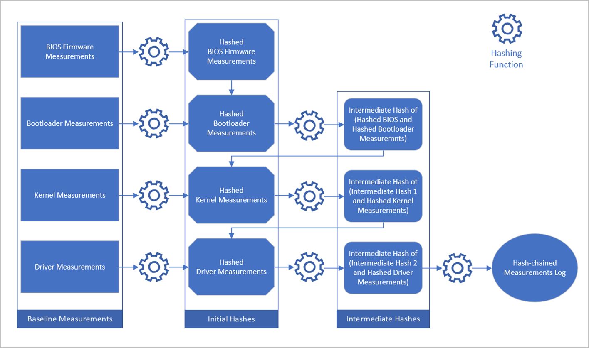
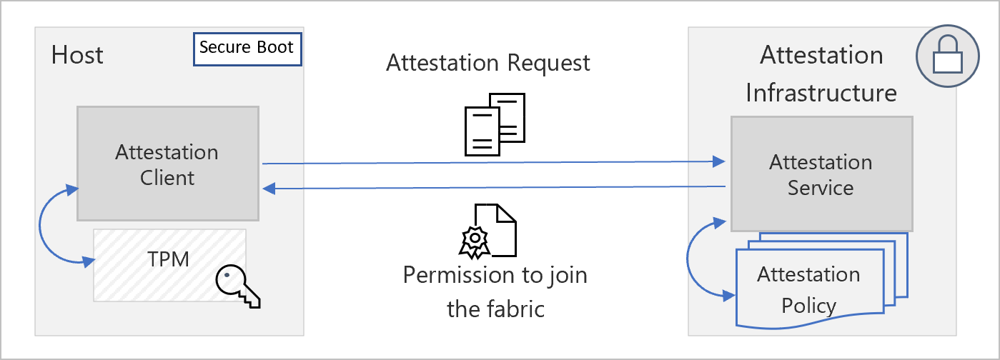

# Measured boot and host attestation
This article describes how Microsoft ensures integrity and security of hosts through measured boot and host attestation.

## Measured boot

The [Trusted Platform Module](/windows/security/information-protection/tpm/trusted-platform-module-top-node) (TPM) is a tamper-proof, cryptographically secure auditing component with firmware supplied by a trusted third party. The boot configuration log contains hash-chained measurements recorded in its Platform Configuration Registers (PCR) when the host last underwent the bootstrapping sequence. The following figure shows this recording process. Incrementally adding a previously hashed measurement to the next measurement’s hash and running the hashing algorithm on the union accomplishes hash-chaining.

Attestation is accomplished when a host furnishes proof of its configuration state using its boot configuration log (TCGLog). Forgery of a boot log is difficult because the TPM doesn't expose its PCR values other than the read and extend operations. Furthermore, the credentials supplied by the Host Attestation Service are sealed to specific PCR values. The use of hash-chaining makes it computationally infeasible to spoof or unseal the credentials out-of-band.

## Host Attestation Service

Host Attestation Service is a preventative measure that checks if host machines are trustworthy before they're allowed to interact with customer data or workloads. Host Attestation Service checks by validating a compliance statement (verifiable proof of the host’s compliance) sent by each host against an attestation policy (definition of the secure state). The integrity of this system is assured by a [root-of-trust](https://www.uefi.org/sites/default/files/resources/UEFI%20RoT%20white%20paper_Final%208%208%2016%20%28003%29.pdf) provided by a TPM.

Host Attestation Service is present in each Azure cluster within a specialized locked-down environment. The locked down environment includes other gatekeeper services that participate in the host machine bootstrapping protocol. A public key infrastructure (PKI) acts as an intermediary for validating the provenance of attestation requests and as an identity issuer (contingent upon successful host attestation). The post-attestation credentials issued to the attesting host are sealed to its identity. Only the requesting host can unseal the credentials and leverage them for obtaining incremental permissions. This prevents against man-in-the middle and spoofing attacks.

If an Azure host arrives from factory with a security misconfiguration or is tampered with in the datacenter, its TCGLog contains indicators of compromise flagged by the Host Attestation Service upon the next attestation, which causes an attestation failure. Attestation failures prevent the Azure fleet from trusting the offending host. This prevention effectively blocks all communications to and from the host and triggers an incident workflow. Investigation and a detailed post-mortem analysis are conducted to determine root causes and any potential indications of compromise. It's only after the analysis is complete that a host is remediated and has the opportunity to join the Azure fleet and take on customer workloads.

Following is a high-level architecture of the host attestation service:

## Attestation measurements

Following are examples of the many measurements captured today.

### Secure Boot and Secure Boot keys
By validating that the signature database and revoked signatures database digests are correct, the Host Attestation Service assures the client agent considers the right software to be trusted. By validating the signatures of the public key enrollment key database and public platform key, the Host Attestation Service confirms that only trusted parties have permission to modify the definitions of what software is considered trusted. Lastly, by ensuring that secure boot is active the Host Attestation Service validates these definitions are being enforced.

### Debug controls
Debuggers are powerful tools for developers. However, the unfettered access to memory and other debug commands could weaken data protection and system integrity if given to a non-trusted party. Host Attestation Service ensures any kind of debugging is disabled on boot on production machines.

### Code integrity
UEFI [Secure Boot](secure-boot.md) ensures that only trusted low-level software can run during the boot sequence. The same checks, though, must also be applied in the post-boot environment to drivers and other executables with kernel-mode access. To that end, a code integrity (CI) policy is used to define which drivers, binaries, and other executables are considered trusted by specifying valid and invalid signatures. These policies are enforced. Violations of policy generate alerts to the security incident response team for investigation.

## Next steps
To learn more about what we do to drive platform integrity and security, see:

- [Firmware security](firmware.md)
- [Platform code integrity](code-integrity.md)
- [Secure boot](secure-boot.md)
- [Project Cerberus](project-cerberus.md)
- [Encryption at rest](encryption-atrest.md)
- [Hypervisor security](hypervisor.md)
