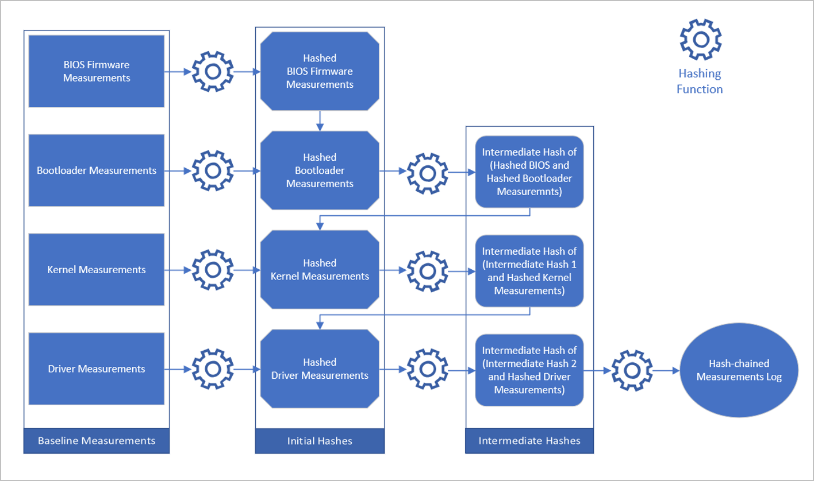
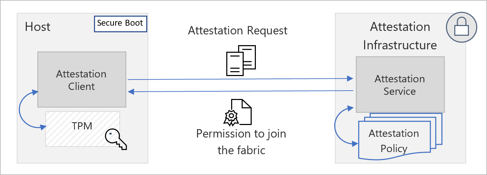

# Firmware measured boot and host attestation

This article describes how Microsoft helps ensure host integrity and security through measured boot and host attestation.

## Measured boot

The [Trusted Platform Module (TPM)](/windows/security/information-protection/tpm/trusted-platform-module-top-node) is a tamper-proof, cryptographically secure auditing component with firmware supplied by a trusted third party. The boot configuration log contains hash-chained measurements recorded in its Platform Configuration Registers (PCR) when the host last underwent the bootstrapping sequence. The following figure shows this recording process. Incrementally adding a previously hashed measurement to the next measurement’s hash and running the hashing algorithm on the union accomplishes hash-chaining.

Attestation occurs when a host provides proof of its configuration state by using its boot configuration log (TCGLog). Forgery of a boot log is difficult because the TPM doesn't expose its PCR values other than the read and extend operations. Furthermore, the credentials from the Host Attestation Service are sealed to specific PCR values. Hash-chaining makes it computationally infeasible to spoof or unseal the credentials out-of-band.

## Host Attestation Service

Host Attestation Service is a preventive measure that checks whether host machines are trustworthy before they're allowed to interact with customer data or workloads. Host Attestation Service validates a compliance statement (verifiable proof of the host’s compliance) sent by each host against an attestation policy (definition of the secure state). A [root-of-trust](https://www.uefi.org/sites/default/files/resources/UEFI%20RoT%20white%20paper_Final%208%208%2016%20%28003%29.pdf) provided by a TPM assures the integrity of this system.

Host Attestation Service is present in each Azure cluster within a specialized locked-down environment. The locked-down environment includes other gatekeeper services that take part in the host machine bootstrapping protocol. A public key infrastructure (PKI) acts as an intermediary for validating the provenance of attestation requests and as an identity issuer after successful host attestation. The post-attestation credentials issued to the attesting host are sealed to its identity. Only the requesting host can unseal the credentials and use them to obtain incremental permissions. This design helps prevent man-in-the-middle and spoofing attacks.

If an Azure host arrives from the factory with a security misconfiguration or someone tampers with it in the datacenter, its TCGLog contains indicators of compromise that the Host Attestation Service flags during the next attestation. This detection causes an attestation failure. Attestation failures prevent the Azure fleet from trusting the offending host. This prevention effectively blocks all communications to and from the host and triggers an incident workflow. Microsoft conducts an investigation and a detailed post-mortem analysis to determine root causes and any potential indications of compromise. Only after the analysis is complete can Microsoft remediate a host and allow it to join the Azure fleet and take on customer workloads.

The following diagram shows a high-level architecture of the host attestation service:

## Attestation measurements

The following sections provide examples of the measurements captured today.

### Secure Boot and Secure Boot keys

By validating the signature database and revoked signatures database digests, the Host Attestation Service ensures the client agent trusts the right software. By validating the signatures of the public key enrollment key database and public platform key, the Host Attestation Service confirms that only trusted parties can modify the definitions of trusted software. Lastly, by ensuring that secure boot is active, the Host Attestation Service validates active enforcement of these definitions.

### Debug controls

Debuggers are powerful tools for developers. However, if a non-trusted party gains access to memory and other debug commands, it can weaken data protection and system integrity. The Host Attestation Service verifies that production machines boot with debugging disabled.

### Code integrity

UEFI [Secure Boot](secure-boot.md) ensures that only trusted low-level software runs during the boot sequence. The same checks must also apply in the post-boot environment to drivers and other executables with kernel-mode access. To that end, a code integrity (CI) policy specifies valid and invalid signatures to identify trusted drivers, binaries, and other executables. The Host Attestation Service enforces these policies. Policy violations generate alerts to the security incident response team for investigation.

## Next steps
To learn more about how Microsoft drives platform integrity and security, see:

- [Firmware security](firmware.md)
- [Platform code integrity](code-integrity.md)
- [Secure boot](secure-boot.md)
- [Project Cerberus](project-cerberus.md)
- [Encryption at rest](encryption-atrest.md)
- [Hypervisor security](hypervisor.md)
