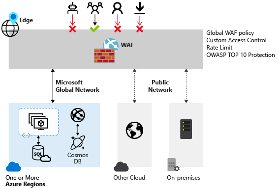

# Introduction to Azure security

## Overview

We know that security is job one in the cloud and how important it is that you find accurate and timely information about Azure security. One of the best reasons to use Azure for your applications and services is to take advantage of its wide array of security tools and capabilities. These tools and capabilities help make it possible to create secure solutions on the secure Azure platform. Microsoft Azure provides confidentiality, integrity, and availability of customer data, while also enabling transparent accountability.

This article provides a comprehensive look at the security available with Azure.

### Azure platform

Azure is a public cloud service platform that supports a broad selection of operating systems, programming languages, frameworks, tools, databases, and devices. It can run Linux containers with Docker integration; build apps with JavaScript, Python, .NET, PHP, Java, and Node.js; build back-ends for iOS, Android, and Windows devices.

Azure public cloud services support the same technologies millions of developers and IT professionals already rely on and trust. When you build on, or migrate IT assets to, a public cloud service provider you are relying on that organization’s abilities to protect your applications and data with the services and the controls they provide to manage the security of your cloud-based assets.

Azure’s infrastructure is designed from facility to applications for hosting millions of customers simultaneously, and it provides a trustworthy foundation upon which businesses can meet their security requirements.

In addition, Azure provides you with a wide array of configurable security options and the ability to control them so that you can customize security to meet the unique requirements of your organization’s deployments. This document helps you understand how Azure security capabilities can help you fulfill these requirements.

> [!Note]
> The primary focus of this document is on customer-facing controls that you can use to customize and increase security for your applications and services.
>
> For information on how Microsoft secures the Azure platform itself, see [Azure infrastructure security](infrastructure.md).

## Summary of Azure security capabilities

Depending on the cloud service model, there is variable responsibility for who is responsible for managing the security of the application or service. There are capabilities available in the Azure Platform to assist you in meeting these responsibilities through built-in features, and through partner solutions that can be deployed into an Azure subscription.

The built-in capabilities are organized in six functional areas: Operations, Applications, Storage, Networking, Compute, and Identity. Additional detail on the features and capabilities available in the Azure Platform in these six areas are provided through summary information.

## Operations

This section provides additional information regarding key features in security operations and summary information about these capabilities.

### Microsoft Sentinel

[Microsoft Sentinel](../../sentinel/overview.md) is a scalable, cloud-native, security information and event management (SIEM) and security orchestration, automation, and response (SOAR) solution. Microsoft Sentinel delivers intelligent security analytics and threat intelligence across the enterprise, providing a single solution for attack detection, threat visibility, proactive hunting, and threat response.

### Microsoft Defender for Cloud

[Microsoft Defender for Cloud](../../security-center/security-center-introduction.md) helps you prevent, detect, and respond to threats with increased visibility into and control over the security of your Azure resources. It provides integrated security monitoring and policy management across your Azure subscriptions, helps detect threats that might otherwise go unnoticed, and works with a broad ecosystem of security solutions.

In addition, Defender for Cloud helps with security operations by providing you a single dashboard that surfaces alerts and recommendations that can be acted upon immediately. Often, you can remediate issues with a single click within the Defender for Cloud console.

### Azure Resource Manager

[Azure Resource Manager](../../azure-resource-manager/management/overview.md) enables you to work with the resources in your solution as a group. You can deploy, update, or delete all the resources for your solution in a single, coordinated operation. You use an [Azure Resource Manager template](../../azure-resource-manager/templates/overview.md) for deployment and that template can work for different environments such as testing, staging, and production. Resource Manager provides security, auditing, and tagging features to help you manage your resources after deployment.

Azure Resource Manager template-based deployments help improve the security of solutions deployed in Azure because standard security control settings and can be integrated into standardized template-based deployments. This reduces the risk of security configuration errors that might take place during manual deployments.

### Application Insights

[Application Insights](../../azure-monitor/app/app-insights-overview.md) is an extensible Application Performance Management (APM) service for web developers. With Application Insights, you can monitor your live web applications and automatically detect performance anomalies. It includes powerful analytics tools to help you diagnose issues and to understand what users actually do with your apps. It monitors your application all the time it's running, both during testing and after you've published or deployed it.

Application Insights creates charts and tables that show you, for example, what times of day you get most users, how responsive the app is, and how well it is served by any external services that it depends on.

If there are crashes, failures or performance issues, you can search through the telemetry data in detail to diagnose the cause. And the service sends you emails if there are any changes in the availability and performance of your app. Application Insight thus becomes a valuable security tool because it helps with the availability in the confidentiality, integrity, and availability security triad.

### Azure Monitor

[Azure Monitor](/azure/monitoring-and-diagnostics/) offers visualization, query, routing, alerting, auto scale, and automation on data both from the Azure subscription ([Activity Log](../../azure-monitor/essentials/platform-logs-overview.md)) and each individual Azure resource ([Resource Logs](../../azure-monitor/essentials/platform-logs-overview.md)). You can use Azure Monitor to alert you on security-related events that are generated in Azure logs.

### Azure Monitor logs

[Azure Monitor logs](../../azure-monitor/logs/log-query-overview.md) – Provides an IT management solution for both on-premises and third-party cloud-based infrastructure (such as AWS) in addition to Azure resources. Data from Azure Monitor can be routed directly to Azure Monitor logs so you can see metrics and logs for your entire environment in one place.

Azure Monitor logs can be a useful tool in forensic and other security analysis, as the tool enables you to quickly search through large amounts of security-related entries with a flexible query approach. In addition, on-premises [firewall and proxy logs can be exported into Azure and made available for analysis using Azure Monitor logs.](../../azure-monitor/agents/agent-windows.md)

### Azure Advisor

[Azure Advisor](../../advisor/advisor-overview.md) is a personalized cloud consultant that helps you to optimize your Azure deployments. It analyzes your resource configuration and usage telemetry. It then recommends solutions to help improve the [performance](../../advisor/advisor-performance-recommendations.md), [security](../../advisor/advisor-security-recommendations.md), and [reliability](../../advisor/advisor-high-availability-recommendations.md) of your resources while looking for opportunities to [reduce your overall Azure spend](../../advisor/advisor-cost-recommendations.md). Azure Advisor provides security recommendations, which can significantly improve your overall security posture for solutions you deploy in Azure. These recommendations are drawn from security analysis performed by [Microsoft Defender for Cloud.](../../security-center/security-center-introduction.md)

## Applications

The section provides additional information regarding key features in application security and summary information about these capabilities.

### Penetration Testing

We don’t perform [penetration testing](./pen-testing.md) of your application for you, but we do understand that you want and need to perform testing on your own applications. That’s a good thing, because when you enhance the security of your applications you help make the entire Azure ecosystem more secure. While notifying Microsoft of pen testing activities is no longer required customers must still comply with the [Microsoft Cloud Penetration Testing Rules of Engagement](https://www.microsoft.com/msrc/pentest-rules-of-engagement).

### Web Application firewall

The web application firewall (WAF) in [Azure Application Gateway](../../application-gateway/features.md#web-application-firewall) helps protect web applications from common web-based attacks like SQL injection, cross-site scripting attacks, and session hijacking. It comes preconfigured with protection from threats identified by the [Open Web Application Security Project (OWASP) as the top 10 common vulnerabilities](https://owasp.org/www-project-top-ten/).

### Authentication and authorization in Azure App Service

[App Service Authentication / Authorization](../../app-service/overview-authentication-authorization.md) is a feature that provides a way for your application to sign in users so that you don't have to change code on the app backend. It provides an easy way to protect your application and work with per-user data.

### Layered Security Architecture

Since [App Service Environments](../../app-service/environment/app-service-app-service-environment-intro.md) provide an isolated runtime environment deployed into an [Azure Virtual Network](../../virtual-network/virtual-networks-overview.md), developers can create a layered security architecture providing differing levels of network access for each application tier. A common desire is to hide API back-ends from general Internet access, and only allow APIs to be called by upstream web apps. [Network Security groups (NSGs)](../../virtual-network/virtual-network-vnet-plan-design-arm.md) can be used on Azure Virtual Network subnets containing App Service Environments to restrict public access to API applications.

### Web server diagnostics and application diagnostics
[App Service web apps](../../app-service/troubleshoot-diagnostic-logs.md) provide diagnostic functionality for logging information from both the web server and the web application. These are logically separated into web server diagnostics and application diagnostics. Web server includes two major advances in diagnosing and troubleshooting sites and applications.

The first new feature is real-time state information about application pools, worker processes, sites, application domains, and running requests. The second new advantages are the detailed trace events that track a request throughout the complete request-and-response process.

To enable the collection of these trace events, IIS 7 can be configured to automatically capture full trace logs, in XML format, for any particular request based on elapsed time or error response codes.

## Storage
The section provides additional information regarding key features in Azure storage security and summary information about these capabilities.

### Azure role-based access control (Azure RBAC)
You can secure your storage account with [Azure role-based access control (Azure RBAC)](../../role-based-access-control/overview.md). Restricting access based on the [need to know](https://en.wikipedia.org/wiki/Need_to_know) and [least privilege](https://en.wikipedia.org/wiki/Principle_of_least_privilege) security principles is imperative for organizations that want to enforce Security policies for data access. These access rights are granted by assigning the appropriate Azure role to groups and applications at a certain scope. You can use [Azure built-in roles](../../role-based-access-control/built-in-roles.md), such as Storage Account Contributor, to assign privileges to users. Access to the storage keys for a storage account using the [Azure Resource Manager](../../storage/blobs/security-recommendations.md#data-protection) model can be controlled through Azure RBAC.

### Shared Access Signature
A [shared access signature (SAS)](../../storage/common/storage-sas-overview.md) provides delegated access to resources in your storage account. The SAS means that you can grant a client limited permissions to objects in your storage account for a specified period and with a specified set of permissions. You can grant these limited permissions without having to share your account access keys.

### Encryption in Transit
Encryption in transit is a mechanism of protecting data when it is transmitted across networks. With Azure Storage, you can secure data using:
- [Transport-level encryption](../../storage/blobs/security-recommendations.md), such as HTTPS when you transfer data into or out of Azure Storage.

- [Wire encryption](../../storage/blobs/security-recommendations.md), such as [SMB 3.0 encryption](../../storage/blobs/security-recommendations.md) for [Azure File shares](../../storage/files/storage-dotnet-how-to-use-files.md).

- Client-side encryption, to encrypt the data before it is transferred into storage and to decrypt the data after it is transferred out of storage.

### Encryption at rest
For many organizations, data encryption at rest is a mandatory step towards data privacy, compliance, and data sovereignty. There are three Azure storage security features that provide encryption of data that is “at rest”:

- [Storage Service Encryption](../../storage/common/storage-service-encryption.md) allows you to request that the storage service automatically encrypt data when writing it to Azure Storage.

- [Client-side Encryption](../../storage/common/storage-client-side-encryption.md) also provides the feature of encryption at rest.

- [Azure Disk Encryption for Linux VMs](../../virtual-machines/linux/disk-encryption-overview.md) and [Azure Disk Encryption for Windows VMs](../../virtual-machines/linux/disk-encryption-overview.md) allows you to encrypt the OS disks and data disks used by an IaaS virtual machine.

### Storage Analytics

[Azure Storage Analytics](/rest/api/storageservices/fileservices/storage-analytics) performs logging and provides metrics data for a storage account. You can use this data to trace requests, analyze usage trends, and diagnose issues with your storage account. Storage Analytics logs detailed information about successful and failed requests to a storage service. This information can be used to monitor individual requests and to diagnose issues with a storage service. Requests are logged on a best-effort basis. The following types of authenticated requests are logged:

- Successful requests.
- Failed requests, including timeout, throttling, network, authorization, and other errors.
- Requests using a Shared Access Signature (SAS), including failed and successful requests.
- Requests to analytics data.

### Enabling Browser-Based Clients Using CORS

[Cross-Origin Resource Sharing (CORS)](/rest/api/storageservices/fileservices/cross-origin-resource-sharing--cors--support-for-the-azure-storage-services) is a mechanism that allows domains to give each other permission for accessing each other’s resources. The User Agent sends extra headers to ensure that the JavaScript code loaded from a certain domain is allowed to access resources located at another domain. The latter domain then replies with extra headers allowing or denying the original domain access to its resources.

Azure storage services now support CORS so that once you set the CORS rules for the service, a properly authenticated request made against the service from a different domain is evaluated to determine whether it is allowed according to the rules you have specified.

## Networking

The section provides additional information regarding key features in Azure network security and summary information about these capabilities.

### Network Layer Controls

Network access control is the act of limiting connectivity to and from specific devices or subnets and represents the core of network security. The goal of network access control is to make sure that your virtual machines and services are accessible to only users and devices to which you want them accessible.

#### Network Security Groups

A [Network Security Group (NSG)](../../virtual-network/virtual-network-vnet-plan-design-arm.md#security) is a basic stateful packet filtering firewall and it enables you to control access based on a 5-tuple. NSGs do not provide application layer inspection or authenticated access controls. They can be used to control traffic moving between subnets within an Azure Virtual Network and traffic between an Azure Virtual Network and the Internet.

#### Azure Firewall

[Azure Firewall](../../firewall/overview.md) is a cloud-native and intelligent network firewall security service that provides threat protection for your cloud workloads running in Azure. It's a fully stateful firewall as a service with built-in high availability and unrestricted cloud scalability. It provides both east-west and north-south traffic inspection.

Azure Firewall is offered in two SKUs: Standard and Premium. [Azure Firewall Standard](../../firewall/features.md) provides L3-L7 filtering and threat intelligence feeds directly from Microsoft Cyber Security. [Azure Firewall Premium](../../firewall/premium-features.md) provides advanced capabilities include signature-based IDPS to allow rapid detection of attacks by looking for specific patterns.

#### Route Control and Forced Tunneling

The ability to control routing behavior on your Azure Virtual Networks is a critical network security and access control capability. For example, if you want to make sure that all traffic to and from your Azure Virtual Network goes through that virtual security appliance, you need to be able to control and customize routing behavior. You can do this by configuring User-Defined Routes in Azure.

[User-Defined Routes](../../virtual-network/virtual-networks-udr-overview.md#custom-routes) allow you to customize inbound and outbound paths for traffic moving into and out of individual virtual machines or subnets to ensure the most secure route possible. [Forced tunneling](../../vpn-gateway/vpn-gateway-forced-tunneling-rm.md) is a mechanism you can use to ensure that your services are not allowed to initiate a connection to devices on the Internet.

This is different from being able to accept incoming connections and then responding to them. Front-end web servers need to respond to requests from Internet hosts, and so Internet-sourced traffic is allowed inbound to these web servers and the web servers can respond.

Forced tunneling is commonly used to force outbound traffic to the Internet to go through on-premises security proxies and firewalls.

#### Virtual Network Security Appliances

While Network Security Groups, User-Defined Routes, and forced tunneling provide you a level of security at the network and transport layers of the [OSI model](https://en.wikipedia.org/wiki/OSI_model), there may be times when you want to enable security at higher levels of the stack. You can access these enhanced network security features by using an Azure partner network security appliance solution. You can find the most current Azure partner network security solutions by visiting the [Azure Marketplace](https://azure.microsoft.com/marketplace/) and searching for “security” and “network security.”

### Azure Virtual Network

An Azure virtual network (VNet) is a representation of your own network in the cloud. It is a logical isolation of the Azure network fabric dedicated to your subscription. You can fully control the IP address blocks, DNS settings, security policies, and route tables within this network. You can segment your VNet into subnets and place Azure IaaS virtual machines (VMs) and/or [Cloud services (PaaS role instances)](../../cloud-services/cloud-services-choose-me.md) on Azure Virtual Networks.

Additionally, you can connect the virtual network to your on-premises network using one of the [connectivity options](../../vpn-gateway/index.yml) available in Azure. In essence, you can expand your network to Azure, with complete control on IP address blocks with the benefit of enterprise scale Azure provides.

Azure networking supports various secure remote access scenarios. Some of these include:

- [Connect individual workstations to an Azure Virtual Network](../../vpn-gateway/vpn-gateway-howto-point-to-site-rm-ps.md)

- [Connect on-premises network to an Azure Virtual Network with a VPN](../../vpn-gateway/vpn-gateway-about-vpngateways.md)

- [Connect on-premises network to an Azure Virtual Network with a dedicated WAN link](../../expressroute/expressroute-introduction.md)

- [Connect Azure Virtual Networks to each other](../../vpn-gateway/vpn-gateway-vnet-vnet-rm-ps.md)

### Azure Private Link

[Azure Private Link](https://azure.microsoft.com/services/private-link/) enables you to access Azure PaaS Services (for example, Azure Storage and SQL Database) and Azure hosted customer-owned/partner services privately in your virtual network over a [private endpoint](../../private-link/private-endpoint-overview.md). Setup and consumption using Azure Private Link is consistent across Azure PaaS, customer-owned, and shared partner services. Traffic from your virtual network to the Azure service always remains on the Microsoft Azure backbone network.

[Private Endpoints](../../private-link/private-endpoint-overview.md) allow you to secure your critical Azure service resources to only your virtual networks. Azure Private Endpoint uses a private IP address from your VNet to connect you privately and securely to a service powered by Azure Private Link, effectively bringing the service into your VNet. Exposing your virtual network to the public internet is no longer necessary to consume services on Azure. 

You can also create your own private link service in your virtual network. [Azure Private Link service](../../private-link/private-link-service-overview.md) is the reference to your own service that is powered by Azure Private Link. Your service that is running behind Azure Standard Load Balancer can be enabled for Private Link access so that consumers to your service can access it privately from their own virtual networks. Your customers can create a private endpoint inside their virtual network and map it to this service. Exposing your service to the public internet is no longer necessary to render services on Azure. 

### VPN Gateway

To send network traffic between your Azure Virtual Network and your on-premises site, you must create a VPN gateway for your Azure Virtual Network. A [VPN gateway](../../vpn-gateway/vpn-gateway-about-vpngateways.md) is a type of virtual network gateway that sends encrypted traffic across a public connection. You can also use VPN gateways to send traffic between Azure Virtual Networks over the Azure network fabric.

### Express Route

Microsoft Azure [ExpressRoute](../../expressroute/expressroute-introduction.md) is a dedicated WAN link that lets you extend your on-premises networks into the Microsoft cloud over a dedicated private connection facilitated by a connectivity provider.

With ExpressRoute, you can establish connections to Microsoft cloud services, such as Microsoft Azure, Microsoft 365, and CRM Online. Connectivity can be from an any-to-any (IP VPN) network, a point-to-point Ethernet network, or a virtual cross-connection through a connectivity provider at a co-location facility.

ExpressRoute connections do not go over the public Internet and thus can be considered more secure than VPN-based solutions. This allows ExpressRoute connections to offer more reliability, faster speeds, lower latencies, and higher security than typical connections over the Internet.

### Application Gateway

Microsoft [Azure Application Gateway](../../application-gateway/overview.md) provides an [Application Delivery Controller (ADC)](https://en.wikipedia.org/wiki/Application_delivery_controller) as a service, offering various layer 7 load balancing capabilities for your application.

It allows you to optimize web farm productivity by offloading CPU intensive TLS termination to the Application Gateway (also known as “TLS offload” or “TLS bridging”). It also provides other Layer 7 routing capabilities including round-robin distribution of incoming traffic, cookie-based session affinity, URL path-based routing, and the ability to host multiple websites behind a single Application Gateway. Azure Application Gateway is a layer-7 load balancer.

It provides failover, performance-routing HTTP requests between different servers, whether they are on the cloud or on-premises.

Application provides many Application Delivery Controller (ADC) features including HTTP load balancing, cookie-based session affinity, [TLS offload](../../web-application-firewall/ag/tutorial-restrict-web-traffic-powershell.md), custom health probes, support for multi-site, and many others.

### Web Application Firewall

Web Application Firewall is a feature of [Azure Application Gateway](../../application-gateway/overview.md) that provides protection to web applications that use application gateway for standard Application Delivery Control (ADC) functions. Web application firewall does this by protecting them against most of the OWASP top 10 common web vulnerabilities.

- SQL injection protection

- Common Web Attacks Protection such as command injection, HTTP request smuggling, HTTP response splitting, and remote file inclusion attack

- Protection against HTTP protocol violations

- Protection against HTTP protocol anomalies such as missing host user-agent and accept headers

- Prevention against bots, crawlers, and scanners

- Detection of common application misconfigurations (that is, Apache, IIS, etc.)

A centralized web application firewall to protect against web attacks makes security management much simpler and gives better assurance to the application against the threats of intrusions. A WAF solution can also react to a security threat faster by patching a known vulnerability at a central location versus securing each of individual web applications. Existing application gateways can be converted to an application gateway with web application firewall easily.

### Traffic Manager

Microsoft [Azure Traffic Manager](../../traffic-manager/traffic-manager-overview.md) allows you to control the distribution of user traffic for service endpoints in different data centers. Service endpoints supported by Traffic Manager include Azure VMs, Web Apps, and Cloud services. You can also use Traffic Manager with external, non-Azure endpoints. Traffic Manager uses the Domain Name System (DNS) to direct client requests to the most appropriate endpoint based on a [traffic-routing method](../../traffic-manager/traffic-manager-routing-methods.md) and the health of the endpoints.

Traffic Manager provides a range of traffic-routing methods to suit different application needs, endpoint health [monitoring](../../traffic-manager/traffic-manager-monitoring.md), and automatic failover. Traffic Manager is resilient to failure, including the failure of an entire Azure region.

### Azure Load Balancer

[Azure Load Balancer](../../load-balancer/load-balancer-overview.md) delivers high availability and network performance to your applications. It is a Layer 4 (TCP, UDP) load balancer that distributes incoming traffic among healthy instances of services defined in a load-balanced set. Azure Load Balancer can be configured to:

- Load balance incoming Internet traffic to virtual machines. This configuration is known as [public load balancing](../../load-balancer/components.md#frontend-ip-configurations).

- Load balance traffic between virtual machines in a virtual network, between virtual machines in cloud services, or between on-premises computers and virtual machines in a cross-premises virtual network. This configuration is known as [internal load balancing](../../load-balancer/components.md#frontend-ip-configurations).

- Forward external traffic to a specific virtual machine

### Internal DNS

You can manage the list of DNS servers used in a VNet in the Management Portal, or in the network configuration file. Customer can add up to 12 DNS servers for each VNet. When specifying DNS servers, it's important to verify that you list customer’s DNS servers in the correct order for customer’s environment. DNS server lists do not work round-robin. They are used in the order that they are specified. If the first DNS server on the list is able to be reached, the client uses that DNS server regardless of whether the DNS server is functioning properly or not. To change the DNS server order for customer’s virtual network, remove the DNS servers from the list and add them back in the order that customer wants. DNS supports the availability aspect of the “CIA” security triad.

### Azure DNS

The Domain Name System, or DNS, is responsible for translating (or resolving) a website or service name to its IP address. [Azure DNS](../../dns/dns-overview.md) is a hosting service for DNS domains, providing name resolution using Microsoft Azure infrastructure. By hosting your domains in Azure, you can manage your DNS records using the same credentials, APIs, tools, and billing as your other Azure services. DNS supports the availability aspect of the “CIA” security triad.

### Azure Monitor logs NSGs

You can enable the following diagnostic log categories for NSGs:

- Event: Contains entries for which NSG rules are applied to VMs and instance roles based on MAC address. The status for these rules is collected every 60 seconds.

- Rules counter: Contains entries for how many times each NSG rule is applied to deny or allow traffic.

### Microsoft Defender for Cloud

[Microsoft Defender for Cloud](../../security-center/security-center-introduction.md) continuously analyzes the security state of your Azure resources for network security best practices. When Defender for Cloud identifies potential security vulnerabilities, it creates [recommendations](../../security-center/security-center-recommendations.md) that guide you through the process of configuring the needed controls to harden and protect your resources.

## Compute
The section provides additional information regarding key features in this area and summary information about these capabilities.

### Azure confidential computing
[Azure confidential computing](../../confidential-computing/TOC.yml) provides the final, missing piece, of the data protection protection puzzle. It allows you to keep your data encrypted at all times.  While at rest, when in motion through the network, and now, even while loaded in memory and in use. Additionally, by making [Remote Attestion](../../attestation/overview.md) possible, it allows you to cryptographically verify that the VM you provision has booted securely and is configured correctly, prior to unlocking your data.

The spectrum of option ranges from enabling "lift and shift" scenarios of existing applications, to a full control of security features. For Infrastructure as a Service (IaaS), you can use [confidential virtual machines powered by AMD SEV-SNP](../../confidential-computing/confidential-vm-overview.md) or confidential application enclaves for virtual machines that run [Intel Software Guard Extensions (SGX)](../../confidential-computing/application-development.md). For Platform as a Service, we have multiple [container based](../../confidential-computing/choose-confidential-containers-offerings.md) options, including integrations with [Azure Kubernetes Service (AKS)](../../confidential-computing/confidential-nodes-aks-overview.md).

### Antimalware & Antivirus
With Azure IaaS, you can use antimalware software from security vendors such as Microsoft, Symantec, Trend Micro, McAfee, and Kaspersky to protect your virtual machines from malicious files, adware, and other threats. [Microsoft Antimalware](antimalware.md) for Azure Cloud Services and Virtual Machines is a protection capability that helps identify and remove viruses, spyware, and other malicious software. Microsoft Antimalware provides configurable alerts when known malicious or unwanted software attempts to install itself or run on your Azure systems. Microsoft Antimalware can also be deployed using Microsoft Defender for Cloud

### Hardware Security Module
Encryption and authentication do not improve security unless the keys themselves are protected. You can simplify the management and security of your critical secrets and keys by storing them in [Azure Key Vault](../../key-vault/general/overview.md). Key Vault provides the option to store your keys in hardware Security modules (HSMs) certified to FIPS 140-2 Level 2 standards. Your SQL Server encryption keys for backup or [transparent data encryption](/sql/relational-databases/security/encryption/transparent-data-encryption) can all be stored in Key Vault with any keys or secrets from your applications. Permissions and access to these protected items are managed through [Azure Active Directory](../../active-directory/index.yml).

### Virtual machine backup
[Azure Backup](../../backup/backup-overview.md) is a solution that protects your application data with zero capital investment and minimal operating costs. Application errors can corrupt your data, and human errors can introduce bugs into your applications that can lead to security issues. With Azure Backup, your virtual machines running Windows and Linux are protected.

### Azure Site Recovery
An important part of your organization's [business continuity/disaster recovery (BCDR)](../../availability-zones/cross-region-replication-azure.md) strategy is figuring out how to keep corporate workloads and apps up and running when planned and unplanned outages occur. [Azure Site Recovery](../../site-recovery/site-recovery-overview.md) helps orchestrate replication, failover, and recovery of workloads and apps so that they are available from a secondary location if your primary location goes down.

### SQL VM TDE
Transparent data encryption (TDE) and column level encryption (CLE) are SQL server encryption features. This form of encryption requires customers to manage and store the cryptographic keys you use for encryption.

The Azure Key Vault (AKV) service is designed to improve the security and management of these keys in a secure and highly available location. The SQL Server Connector enables SQL Server to use these keys from Azure Key Vault.

If you are running SQL Server with on-premises machines, there are steps you can follow to access Azure Key Vault from your on-premises SQL Server instance. But for SQL Server in Azure VMs, you can save time by using the Azure Key Vault Integration feature. With a few Azure PowerShell cmdlets to enable this feature, you can automate the configuration necessary for a SQL VM to access your key vault.

### VM Disk Encryption
[Azure Disk Encryption for Linux VMs](../../virtual-machines/linux/disk-encryption-overview.md) and [Azure Disk Encryption for Windows VMs](../../virtual-machines/linux/disk-encryption-overview.md) helps you encrypt your IaaS virtual machine disks. It applies the industry standard BitLocker feature of Windows and the DM-Crypt feature of Linux to provide volume encryption for the OS and the data disks. The solution is integrated with Azure Key Vault to help you control and manage the disk-encryption keys and secrets in your Key Vault subscription. The solution also ensures that all data on the virtual machine disks are encrypted at rest in your Azure storage.

### Virtual networking
Virtual machines need network connectivity. To support that requirement, Azure requires virtual machines to be connected to an Azure Virtual Network. An Azure Virtual Network is a logical construct built on top of the physical Azure network fabric. Each logical [Azure Virtual Network](../../virtual-network/virtual-networks-overview.md) is isolated from all other Azure Virtual Networks. This isolation helps ensure that network traffic in your deployments is not accessible to other Microsoft Azure customers.

### Patch Updates
Patch Updates provide the basis for finding and fixing potential problems and simplify the software update management process, both by reducing the number of software updates you must deploy in your enterprise and by increasing your ability to monitor compliance.

### Security policy management and reporting
[Defender for Cloud](../../security-center/security-center-introduction.md) helps you prevent, detect, and respond to threats, and provides you increased visibility into, and control over, the security of your Azure resources. It provides integrated Security monitoring and policy management across your Azure subscriptions, helps detect threats that might otherwise go unnoticed, and works with a broad ecosystem of security solutions.

## Identity and access management
Securing systems, applications, and data begins with identity-based access controls. The identity and access management features that are built into Microsoft business products and services help protect your organizational and personal information from unauthorized access while making it available to legitimate users whenever and wherever they need it.

### Secure Identity
Microsoft uses multiple security practices and technologies across its products and services to manage identity and access.

- [Multi-Factor Authentication](https://azure.microsoft.com/services/multi-factor-authentication/) requires users to use multiple methods for access, on-premises and in the cloud. It provides strong authentication with a range of easy verification options, while accommodating users with a simple sign-in process.

- [Microsoft Authenticator](https://aka.ms/authenticator) provides a user-friendly Multi-Factor Authentication experience that works with both Microsoft Azure Active Directory and Microsoft accounts, and includes support for wearables and fingerprint-based approvals.

- [Password policy enforcement](../../active-directory/authentication/concept-sspr-policy.md) increases the security of traditional passwords by imposing length and complexity requirements, forced periodic rotation, and account lockout after failed authentication attempts.

- [Token-based authentication](../../active-directory/develop/authentication-vs-authorization.md) enables authentication via Azure Active Directory.

- [Azure role-based access control (Azure RBAC)](../../role-based-access-control/built-in-roles.md) enables you to grant access based on the user’s assigned role, making it easy to give users only the amount of access they need to perform their job duties. You can customize Azure RBAC per your organization’s business model and risk tolerance.

- [Integrated identity management (hybrid identity)](../../active-directory/hybrid/plan-hybrid-identity-design-considerations-overview.md) enables you to maintain control of users’ access across internal datacenters and cloud platforms, creating a single user identity for authentication and authorization to all resources.

### Secure Apps and data
[Azure Active Directory](https://azure.microsoft.com/services/active-directory/), a comprehensive identity and access management cloud solution, helps secure access to data in applications on site and in the cloud, and simplifies the management of users and groups. It combines core directory services, advanced identity governance, security, and application access management, and makes it easy for developers to build policy-based identity management into their apps. To enhance your Azure Active Directory, you can add paid capabilities using the Azure Active Directory Basic, Premium P1, and Premium P2 editions.

| Free / Common Features     | Basic Features    |Premium P1 Features |Premium P2 Features | Azure Active Directory Join – Windows 10 only related features|
| :------------- | :------------- |:------------- |:------------- |:------------- |
| 	[Directory Objects](../../active-directory/fundamentals/active-directory-whatis.md), [User/Group Management (add/update/delete)/ User-based provisioning, Device registration](../../active-directory/fundamentals/active-directory-whatis.md), [single sign-on (SSO)](../../active-directory/fundamentals/active-directory-whatis.md), [Self-Service Password Change for cloud users](../../active-directory/fundamentals/active-directory-whatis.md), [Connect (Sync engine that extends on-premises directories to Azure Active Directory)](../../active-directory/fundamentals/active-directory-whatis.md), [Security / Usage Reports](../../active-directory/fundamentals/active-directory-whatis.md) | [Group-based access management / provisioning](../../active-directory/fundamentals/active-directory-whatis.md), [Self-Service Password Reset for cloud users](../../active-directory/fundamentals/active-directory-whatis.md), [Company Branding (Logon Pages/Access Panel customization)](../../active-directory/fundamentals/active-directory-whatis.md), [Application Proxy](../../active-directory/fundamentals/active-directory-whatis.md), [SLA 99.9%](../../active-directory/fundamentals/active-directory-whatis.md) |  [Self-Service Group and app Management/Self-Service application additions/Dynamic Groups](../../active-directory/fundamentals/active-directory-whatis.md), [Self-Service Password Reset/Change/Unlock with on-premises write-back](../../active-directory/fundamentals/active-directory-whatis.md), [Multi-Factor Authentication (Cloud and On-premises (MFA Server))](../../active-directory/fundamentals/active-directory-whatis.md), [MIM CAL + MIM Server](../../active-directory/fundamentals/active-directory-whatis.md), [Cloud App Discovery](../../active-directory/fundamentals/active-directory-whatis.md), [Connect Health](../../active-directory/fundamentals/active-directory-whatis.md), [Automatic password rollover for group accounts](../../active-directory/fundamentals/active-directory-whatis.md)| [Identity Protection](../../active-directory/identity-protection/overview-identity-protection.md), [Privileged Identity Management](../../active-directory/privileged-identity-management/pim-configure.md)| [Join a device to Azure AD, Desktop SSO, Microsoft Passport for Azure AD, Administrator BitLocker recovery](../../active-directory/fundamentals/active-directory-whatis.md), [MDM auto-enrollment, Self-Service BitLocker recovery, Additional local administrators to Windows 10 devices via Azure AD Join](../../active-directory/fundamentals/active-directory-whatis.md)|

- [Cloud App Discovery](/cloud-app-security/set-up-cloud-discovery) is a premium feature of Azure Active Directory that enables you to identify cloud applications that are used by the employees in your organization.

- [Azure Active Directory Identity Protection](../../active-directory/identity-protection/overview-identity-protection.md) is a security service that uses Azure Active Directory anomaly detection capabilities to provide a consolidated view into risk detections and potential vulnerabilities that could affect your organization’s identities.

- [Azure Active Directory Domain Services](https://azure.microsoft.com/services/active-directory-ds/) enables you to join Azure VMs to a domain without the need to deploy domain controllers. Users sign in to these VMs by using their corporate Active Directory credentials, and can seamlessly access resources.

- [Azure Active Directory B2C](https://azure.microsoft.com/services/active-directory-b2c/) is a highly available, global identity management service for consumer-facing apps that can scale to hundreds of millions of identities and integrate across mobile and web platforms. Your customers can sign in to all your apps through customizable experiences that use existing social media accounts, or you can create new standalone credentials.

- [Azure Active Directory B2B Collaboration](../../active-directory/external-identities/what-is-b2b.md) is a secure partner integration solution that supports your cross-company relationships by enabling partners to access your corporate applications and data selectively by using their self-managed identities.

- [Azure Active Directory joined](../../active-directory/devices/overview.md) enables you to extend cloud capabilities to Windows 10 devices for centralized management. It makes it possible for users to connect to the corporate or organizational cloud through Azure Active Directory and simplifies access to apps and resources.

- [Azure Active Directory Application Proxy](../../active-directory/app-proxy/application-proxy.md) provides SSO and secure remote access for web applications hosted on-premises.

## Next Steps

- Understand your [shared responsibility in the cloud](shared-responsibility.md).

- Learn how [Microsoft Defender for Cloud](../../security-center/security-center-introduction.md) can help you prevent, detect, and respond to threats with increased visibility and control over the security of your Azure resources.