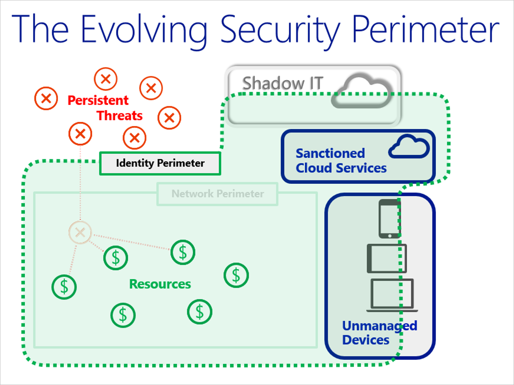

# Securing PaaS deployments

This article provides information that helps you:

- Understand the security advantages of hosting applications in the cloud
- Evaluate the security advantages of platform as a service (PaaS) versus other cloud service models
- Change your security focus from a network-centric to an identity-centric perimeter security approach
- Implement general PaaS security best practices recommendations

[Developing secure applications on Azure](abstract-develop-secure-apps.md) is a general guide to the security questions and controls you should consider at each phase of the software development lifecycle when developing applications for the cloud.

## Cloud security advantages
It’s important to understand the [division of responsibility](shared-responsibility.md) between you and Microsoft. On-premises, you own the whole stack but as you move to the cloud some responsibilities transfer to Microsoft.

There are [security advantages to being in the cloud](shared-responsibility.md#cloud-security-advantages). In an on-premises environment, organizations likely have unmet responsibilities and limited resources available to invest in security, which creates an environment where attackers are able to exploit vulnerabilities at all layers.

Organizations are able to improve their threat detection and response times by using a provider’s cloud-based security capabilities and cloud intelligence.  By shifting responsibilities to the cloud provider, organizations can get more security coverage, which enables them to reallocate security resources and budget to other business priorities.

## Security advantages of a PaaS cloud service model
Let’s look at the security advantages of an Azure PaaS deployment versus on-premises.

Starting at the bottom of the stack, the physical infrastructure, Microsoft mitigates common risks and responsibilities. Because the Microsoft cloud is continually monitored by Microsoft, it is hard to attack. It doesn’t make sense for an attacker to pursue the Microsoft cloud as a target. Unless the attacker has lots of money and resources, the attacker is likely to move on to another target.  

In the middle of the stack, there is no difference between a PaaS deployment and on-premises. At the application layer and the account and access management layer, you have similar risks. In the next steps section of this article, we will guide you to best practices for eliminating or minimizing these risks.

At the top of the stack, data governance and rights management, you take on one risk that can be mitigated by key management. (Key management is covered in best practices.) While key management is an additional responsibility, you have areas in a PaaS deployment that you no longer have to manage so you can shift resources to key management.

The Azure platform also provides you strong DDoS protection by using various network-based technologies. However, all types of network-based DDoS protection methods have their limits on a per-link and per-datacenter basis. To help avoid the impact of large DDoS attacks, you can take advantage of Azure’s core cloud capability of enabling you to quickly and automatically scale out to defend against DDoS attacks. We'll go into more detail on how you can do this in the recommended practices articles.

## Modernizing the defender’s mindset
With PaaS deployments come a shift in your overall approach to security. You shift from needing to control everything yourself to sharing responsibility with Microsoft.

Another significant difference between PaaS and traditional on-premises deployments, is a new view of what defines the primary security perimeter. Historically, the primary on-premises security perimeter was your network and most on-premises security designs use the network as its primary security pivot. For PaaS deployments, you are better served by considering identity to be the primary security perimeter.

## Adopt a policy of identity as the primary security perimeter
One of the five essential characteristics of cloud computing is broad network access, which makes network-centric thinking less relevant. The goal of much of cloud computing is to allow users to access resources regardless of location. For most users, their location is going to be somewhere on the Internet.

The following figure shows how the security perimeter has evolved from a network perimeter to an identity perimeter. Security becomes less about defending your network and more about defending your data, as well as managing the security of your apps and users. The key difference is that you want to push security closer to what’s important to your company.

Initially, Azure PaaS services (for example, web roles and Azure SQL) provided little or no traditional network perimeter defenses. It was understood that the element’s purpose was to be exposed to the Internet (web role) and that authentication provides the new perimeter (for example, BLOB or Azure SQL).

Modern security practices assume that the adversary has breached the network perimeter. Therefore, modern defense practices have moved to identity. Organizations must establish an identity-based security perimeter with strong authentication and authorization hygiene (best practices).

Principles and patterns for the network perimeter have been available for decades. In contrast, the industry has relatively less experience with using identity as the primary security perimeter. With that said, we have accumulated enough experience to provide some general recommendations that are proven in the field and apply to almost all PaaS services.

The following are best practices for managing the identity perimeter.

**Best practice**: Secure your keys and credentials to secure your PaaS deployment.   
**Detail**: Losing keys and credentials is a common problem. You can use a centralized solution where keys and secrets can be stored in hardware security modules (HSMs). [Azure Key Vault](../../key-vault/general/overview.md) safeguards your keys and secrets by encrypting authentication keys, storage account keys, data encryption keys, .pfx files, and passwords using keys that are protected by HSMs.

**Best practice**: Don’t put credentials and other secrets in source code or GitHub.   
**Detail**: The only thing worse than losing your keys and credentials is having an unauthorized party gain access to them. Attackers can take advantage of bot technologies to find keys and secrets stored in code repositories such as GitHub. Do not put key and secrets in these public code repositories.

**Best practice**: Protect your VM management interfaces on hybrid PaaS and IaaS services by using a management interface that enables you to remote manage these VMs directly.   
**Detail**: Remote management protocols such as [SSH](https://en.wikipedia.org/wiki/Secure_Shell), [RDP](https://support.microsoft.com/kb/186607), and [PowerShell remoting](https://msdn.microsoft.com/powershell/reference/5.1/microsoft.powershell.core/enable-psremoting) can be used. In general, we recommend that you do not enable direct remote access to VMs from the internet.

If possible, use alternate approaches like using virtual private networks in an Azure virtual network. If alternative approaches are not available, ensure that you use complex passphrases and two-factor authentication (such as [Azure Multi-Factor Authentication](/azure/active-directory/authentication/multi-factor-authentication)).

**Best practice**: Use strong authentication and authorization platforms.   
**Detail**: Use federated identities in Azure AD instead of custom user stores. When you use federated identities, you take advantage of a platform-based approach and you delegate the management of authorized identities to your partners. A federated identity approach is especially important when employees are terminated and that information needs to be reflected through multiple identity and authorization systems.

Use platform-supplied authentication and authorization mechanisms instead of custom code. The reason is that developing custom authentication code can be error prone. Most of your developers are not security experts and are unlikely to be aware of the subtleties and the latest developments in authentication and authorization. Commercial code (for example, from Microsoft) is often extensively security reviewed.

Use two-factor authentication. Two-factor authentication is the current standard for authentication and authorization because it avoids the security weaknesses inherent in username and password types of authentication. Access to both the Azure management (portal/remote PowerShell) interfaces and customer-facing services should be designed and configured to use [Azure Multi-Factor Authentication](/azure/active-directory/authentication/multi-factor-authentication).

Use standard authentication protocols, such as OAuth2 and Kerberos. These protocols have been extensively peer reviewed and are likely implemented as part of your platform libraries for authentication and authorization.

## Use threat modeling during application design
The Microsoft [Security Development Lifecycle](https://www.microsoft.com/en-us/sdl) specifies that teams should engage in a process called threat modeling during the design phase. To help facilitate this process, Microsoft has created the [SDL Threat Modeling Tool](/azure/security/azure-security-threat-modeling-tool). Modeling the application design and enumerating [STRIDE](https://docs.google.com/viewer?a=v&pid=sites&srcid=ZGVmYXVsdGRvbWFpbnxzZWN1cmVwcm9ncmFtbWluZ3xneDo0MTY1MmM0ZDI0ZjQ4ZDMy) threats across all trust boundaries can catch design errors early on.

The following table lists the STRIDE threats and gives some example mitigations that use Azure features. These mitigations won’t work in every situation.

| Threat | Security property | Potential Azure platform mitigations |
| --- | --- | --- |
| Spoofing | Authentication | Require HTTPS connections. |
| Tampering | Integrity | Validate TLS/SSL certificates. |
| Repudiation | Non-repudiation | Enable Azure [monitoring and diagnostics](/azure/architecture/best-practices/monitoring). |
| Information disclosure | Confidentiality | Encrypt sensitive data at rest by using [service certificates](/rest/api/appservice/certificates). |
| Denial of service | Availability | Monitor performance metrics for potential denial-of-service conditions. Implement connection filters. |
| Elevation of privilege | Authorization | Use [Privileged Identity Management](/azure/active-directory/privileged-identity-management/subscription-requirements). |

## Develop on Azure App Service
[Azure App Service](/azure/app-service/overview) is a PaaS offering that lets you create web and mobile apps for any platform or device and connect to data anywhere, in the cloud or on-premises. App Service includes the web and mobile capabilities that were previously delivered separately as Azure Websites and Azure Mobile Services. It also includes new capabilities for automating business processes and hosting cloud APIs. As a single integrated service, App Service brings a rich set of capabilities to web, mobile, and integration scenarios.

Following are best practices for using App Service.

**Best practice**: [Authenticate through Azure Active Directory](/azure/app-service/overview-authentication-authorization).   
**Detail**: App Service provides an OAuth 2.0 service for your identity provider. OAuth 2.0 focuses on client developer simplicity while providing specific authorization flows for web applications, desktop applications, and mobile phones. Azure AD uses OAuth 2.0 to enable you to authorize access to mobile and web applications.

**Best practice**: Restrict access based on the need to know and least privilege security principles.   
**Detail**: Restricting access is imperative for organizations that want to enforce security policies for data access. You can use RBAC to assign permissions to users, groups, and applications at a certain scope. To learn more about granting users access to applications, see [Get started with access management](/azure/role-based-access-control/overview).

**Best practice**: Protect your keys.   
**Detail**: Azure Key Vault helps safeguard cryptographic keys and secrets that cloud applications and services use. With Key Vault, you can encrypt keys and secrets (such as authentication keys, storage account keys, data encryption keys, .PFX files, and passwords) by using keys that are protected by hardware security modules (HSMs). For added assurance, you can import or generate keys in HSMs. See [Azure Key Vault](/azure/key-vault/key-vault-overview) to learn more. You can also use Key Vault to manage your TLS certificates with auto-renewal.

**Best practice**: Restrict incoming source IP addresses.   
**Detail**: [App Service Environment](/azure/app-service/environment/intro) has a virtual network integration feature that helps you restrict incoming source IP addresses through network security groups. Virtual networks enable you to place Azure resources in a non-internet, routable network that you control access to. To learn more, see [Integrate your app with an Azure virtual network](/azure/app-service/web-sites-integrate-with-vnet).

**Best practice**: Monitor the security state of your App Service environments.   
**Detail**: Use Azure Security Center to monitor your App Service environments. When Security Center identifies potential security vulnerabilities, it creates [recommendations](../../security-center/security-center-virtual-machine-protection.md) that guide you through the process of configuring the needed controls.

> [!NOTE]
> Monitoring App Service is in preview and available only on the [Standard tier](/azure/security-center/security-center-pricing) of Security Center.
>
>

## Install a web application firewall
Web applications are increasingly targets of malicious attacks that exploit common known vulnerabilities. Common among these exploits are SQL injection attacks, cross site scripting attacks to name a few. Preventing such attacks in application code can be challenging and may require rigorous maintenance, patching and monitoring at many layers of the application topology. A centralized web application firewall helps make security management much simpler and gives better assurance to application administrators against threats or intrusions. A WAF solution can also react to a security threat faster by patching a known vulnerability at a central location versus securing each of individual web applications. Existing application gateways can be converted to a web application firewall enabled application gateway easily.

[Web application firewall (WAF)](/azure/frontdoor/waf-overview) is a feature of Application Gateway that provides centralized protection of your web applications from common exploits and vulnerabilities. WAF is based on rules from the [Open Web Application Security Project (OWASP) core rule sets](https://www.owasp.org/index.php/Category:OWASP_ModSecurity_Core_Rule_Set_Project) 3.0 or 2.2.9.

## Monitor the performance of your applications
Monitoring is the act of collecting and analyzing data to determine the performance, health, and availability of your application. An effective monitoring strategy helps you understand the detailed operation of the components of your application. It helps you increase your uptime by notifying you of critical issues so that you can resolve them before they become problems. It also helps you detect anomalies that might be security related.

Use [Azure Application Insights](https://azure.microsoft.com/documentation/services/application-insights) to monitor availability, performance, and usage of your application, whether it's hosted in the cloud or on-premises. By using Application Insights, you can quickly identify and diagnose errors in your application without waiting for a user to report them. With the information that you collect, you can make informed choices on your application's maintenance and improvements.

Application Insights has extensive tools for interacting with the data that it collects. Application Insights stores its data in a common repository. It can take advantage of shared functionality such as alerts, dashboards, and deep analysis with the Kusto query language.

## Perform security penetration testing
Validating security defenses is as important as testing any other functionality. Make [penetration testing](pen-testing.md) a standard part of your build and deployment process. Schedule regular security tests and vulnerability scanning on deployed applications, and monitor for open ports, endpoints, and attacks.

Fuzz testing is a method for finding program failures (code errors) by supplying malformed input data to program interfaces (entry points) that parse and consume this data. [Microsoft Security Risk Detection](https://www.microsoft.com/en-us/security-risk-detection/) is a cloud-based tool that you can use to look for bugs and other security vulnerabilities in your software before you deploy it to Azure. The tool is designed to catch vulnerabilities before you deploy software so you don’t have to patch a bug, deal with crashes, or respond to an attack after the software is released.

## Next steps
In this article, we focused on security advantages of an Azure PaaS deployment and security best practices for cloud applications. Next, learn recommended practices for securing your PaaS web and mobile solutions using specific Azure services. We’ll start with Azure App Service, Azure SQL Database and Azure SQL Data Warehouse, and Azure Storage. As articles on recommended practices for other Azure services become available, links will be provided in the following list:

- [Azure App Service](paas-applications-using-app-services.md)
- [Azure SQL Database and Azure SQL Data Warehouse](paas-applications-using-sql.md)
- [Azure Storage](paas-applications-using-storage.md)
- Azure Cache for Redis
- Azure Service Bus
- Web Application Firewalls

See [Developing secure applications on Azure](abstract-develop-secure-apps.md) for security questions and controls you should consider at each phase of the software development lifecycle when developing applications for the cloud.

See [Azure security best practices and patterns](best-practices-and-patterns.md) for more security best practices to use when you’re designing, deploying, and managing your cloud solutions by using Azure.

The following resources are available to provide more general information about Azure security and related Microsoft services:
* [Azure Security Team Blog](https://blogs.msdn.microsoft.com/azuresecurity/) - for up to date information on the latest in Azure Security
* [Microsoft Security Response Center](https://technet.microsoft.com/library/dn440717.aspx) - where Microsoft security vulnerabilities, including issues with Azure, can be reported or via email to secure@microsoft.com
