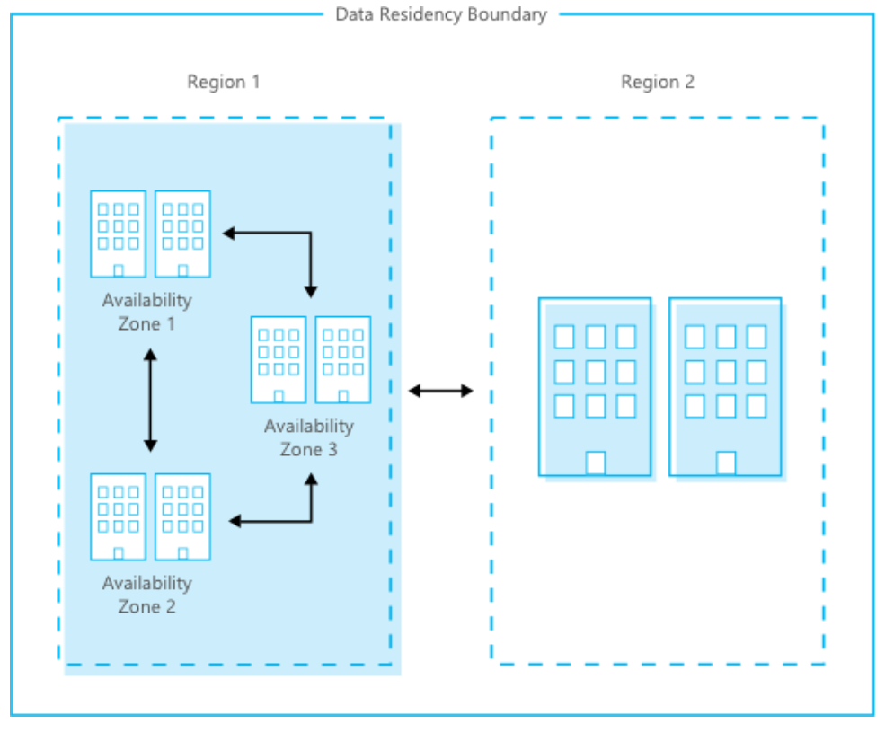

# Azure facilities, premises, and physical security
This article describes what Microsoft does to secure the Azure infrastructure.

## Datacenter infrastructure
Azure is composed of a [globally distributed datacenter infrastructure](https://datacenters.microsoft.com/globe/explore/), supporting thousands of online services and spanning more than 400 highly secure facilities worldwide.

The infrastructure is designed to bring applications closer to users around the world, preserve data residency, and offer comprehensive compliance and resiliency options for customers. Azure has more than 70 regions worldwide, and is available in 140 countries/regions.

A region is a set of datacenters that interconnects through a massive and resilient network. The network includes content distribution, load balancing, redundancy, and [data-link layer encryption by default](encryption-overview.md#encryption-in-transit) for all Azure traffic within a region or traveling between regions. With more global regions than any other cloud provider, Azure gives you the flexibility to deploy applications where you need them.

Azure regions are organized into geographies. An Azure geography ensures that data residency, sovereignty, compliance, and resiliency requirements are honored within geographical boundaries.

Geographies allow customers with specific data-residency and compliance needs to keep their data and applications close. Geographies are fault-tolerant to withstand complete region failure because they connect to the dedicated, high-capacity networking infrastructure.

Availability zones are physically separate locations within an Azure region. Each availability zone is made up of one or more datacenters equipped with independent power, cooling, and networking. Availability zones allow you to run mission-critical applications with high availability and low-latency replication.

The following figure shows how the Azure global infrastructure pairs region and availability zones within the same data residency boundary for high availability, disaster recovery, and backup.

Geographically distributed datacenters enable Microsoft to be close to customers, reduce network latency, and allow for geo-redundant backup and failover.

## Physical security
Microsoft designs, builds, and operates datacenters in a way that strictly controls physical access to the areas where your data is stored. Microsoft understands the importance of protecting your data and is committed to helping secure the datacenters that contain your data. Microsoft has an entire division devoted to designing, building, and operating the physical facilities supporting Azure. This team is invested in maintaining state-of-the-art physical security.

Microsoft takes a layered approach to physical security to reduce the risk of unauthorized users gaining physical access to data and the datacenter resources. Datacenters managed by Microsoft have extensive layers of protection: access approval at the facility’s perimeter, at the building’s perimeter, inside the building, and on the datacenter floor. Layers of physical security are:

- **Access request and approval.** You must request access prior to arriving at the datacenter. You must provide a valid business justification for your visit, such as compliance or auditing purposes. Microsoft employees approve all requests on a need-to-access basis. A need-to-access basis helps keep the number of individuals needed to complete a task in the datacenters to the bare minimum. After Microsoft grants permission, an individual has access only to the discrete area of the datacenter required, based on the approved business justification. Permissions are limited to a certain period of time, and then expire.

- **Visitor access.** The access-controlled SOC stores and inventories temporary access badges at the beginning and end of each shift. All visitors with approved access to the datacenter are designated as *Escort Only* on their badges and must always remain with their escorts. Escorted visitors don't have any access levels granted to them and can travel only by using the access of their escorts. The escort is responsible for reviewing the actions and access of their visitor during their visit to the datacenter. Microsoft requires visitors to surrender badges upon departure from any Microsoft facility. Microsoft removes all visitor badge access levels before the badges are reused for future visits.

- **Facility's perimeter.** When you arrive at a datacenter, you must go through a well-defined access point. Typically, tall fences made of steel and concrete encompass every inch of the perimeter. Cameras around the datacenters record activity, and a security team monitors their videos at all times. Security guard patrols ensure entry and exit are restricted to designated areas. Bollards and other measures protect the datacenter exterior from potential threats, including unauthorized access.

- **Building entrance.** The datacenter entrance is staffed with professional security officers who have undergone rigorous training and background checks. These security officers also routinely patrol the datacenter, and monitor the videos of cameras inside the datacenter at all times.

- **Inside the building.** After you enter the building, you must pass two-factor authentication with biometrics to continue moving through the datacenter. If your identity is validated, you can enter only the portion of the datacenter that you're approved to access. You can stay there only for the duration of the time approved.

- **Datacenter floor.** You can enter only the floor that you're approved to enter. You must pass a full body metal detection screening. To reduce the risk of unauthorized data entering or leaving the datacenter without Microsoft's knowledge, only approved devices can enter the datacenter floor. Video cameras also monitor the front and back of every server rack. When you exit the datacenter floor, you must again pass through full body metal detection screening. To leave the datacenter, you must pass through another security scan.

## Physical security reviews
Microsoft periodically conducts physical security reviews of the facilities to ensure the datacenters properly address Azure security requirements. The datacenter hosting provider personnel don't provide Azure service management. Personnel can't sign in to Azure systems and don't have physical access to the Azure collocation room and cages.

## Equipment disposal
When a system reaches end of life, Microsoft operational personnel follow rigorous data handling and hardware disposal procedures to ensure that untrusted parties can't access hardware that contains your data. Microsoft uses best practices and a wiping solution that complies with [NIST 800-88](https://csrc.nist.gov/publications/detail/sp/800-88/rev-1/final). Microsoft uses a secure erase approach for hard drives that support it. If Microsoft can't wipe a hard drive, Microsoft uses a destruction process that destroys the drive and renders the recovery of information impossible. This destruction process can disintegrate, shred, pulverize, or incinerate the drive. Microsoft determines the means of disposal according to the asset type and keeps records of the destruction. All Azure services use approved media storage and disposal management services.

## Compliance
Microsoft designs and manages the Azure infrastructure to meet a broad set of international and industry-specific compliance standards, such as ISO 27001, HIPAA, FedRAMP, SOC 1, and SOC 2. Microsoft also meets country/region-specific standards, including Australia IRAP, UK G-Cloud, and Singapore MTCS. Rigorous third-party audits, such as those done by the British Standards Institute, verify adherence to the strict security controls these standards mandate.

For a full list of compliance standards that Azure adheres to, see the [Compliance offerings](../../compliance/index.yml).

## Next steps
To learn more about what Microsoft does to help secure the Azure infrastructure, see:

- [Azure infrastructure availability](infrastructure-availability.md)
- [Azure information system components and boundaries](infrastructure-components.md)
- [Azure network architecture](infrastructure-network.md)
- [Azure production network](production-network.md)
- [Azure SQL Database security features](infrastructure-sql.md)
- [Azure production operations and management](infrastructure-operations.md)
- [Azure infrastructure monitoring](infrastructure-monitoring.md)
- [Azure infrastructure integrity](infrastructure-integrity.md)
- [Azure customer data protection](protection-customer-data.md)