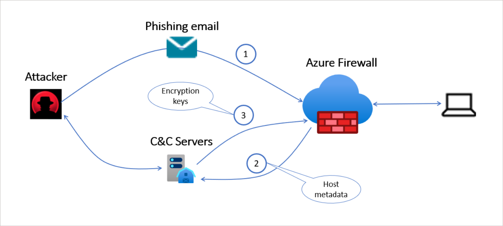

# Improve your security defenses for ransomware attacks with Azure Firewall Premium
In this article, you learn how Azure Firewall Premium can help you protect against ransomware.

## What is ransomware?
Ransomware is a type of malicious software designed to block access to your computer system until a sum of money is paid. The attacker usually exploits an existing vulnerability in your system to penetrate your network and execute the malicious software on the target host.

Ransomware is often spread through phishing emails that contain malicious attachments or through drive-by downloading. Drive-by downloading occurs when a user unknowingly visits an infected website and then malware is downloaded and installed without the user’s knowledge.

## Protect from network malicious activity
A network intrusion detection and prevention system (IDPS) allows you to monitor your network for malicious activity, log information about this activity, report it, and optionally attempt to block it.

[Azure Firewall Premium](../../firewall/premium-features.md#idps) provides signature-based IDPS where every packet is inspected thoroughly, including all its headers and payload, to identify a malicious activity and to prevent it from penetrating into your network.

The IDPS signatures are applicable for both application and network level traffic (Layers 4-7), fully managed, and contain more than 65,000 signatures in over 50 different categories. To keep them (the IDPS signatures?) up to date with the dynamic ever-changing attack landscape:

- Azure Firewall has early access to vulnerability information from [Microsoft Active Protections Program](https://www.microsoft.com/msrc/mapp) (MAPP) and [Microsoft Security Response Center](https://www.microsoft.com/msrc/) (MSRC).
- Azure Firewall releases 30 to 50 new signatures each day.

Today, modern encryption (SSL/TLS) is used globally to secure Internet traffic. Attackers use encryption to carry their malicious software into the victim’s network. Therefore, customers must inspect their encrypted traffic just like any other traffic.

Azure Firewall Premium IDPS allows you to detect attacks in all ports and protocols for non-encrypted traffic. However, when HTTPS traffic needs to be inspected, Azure Firewall can use its TLS inspection capability to decrypt the traffic and accurately detect malicious activities.

After the ransomware is installed on the target machine, it may try to encrypt the machine’s data. The ransomware requires an encryption key and may use the Command and Control (C&C) to get the encryption key from the C&C server hosted by the attacker. CryptoLocker, WannaCry, TeslaCrypt, Cerber, and Locky are some of the ransomwares using C&C to fetch the required encryption keys.

Azure Firewall Premium has hundreds of signatures that are designed to detect C&C connectivity and block it to prevent the attacker from encrypting your data. The following diagram shows Azure Firewall protection against a ransomware attack using the C&C channel.

## Fend off ransomware attacks
A holistic approach to fend off ransomware attacks is recommended. Azure Firewall operates in a default deny mode and blocks access unless explicitly allowed by the administrator. Enabling the Threat Intelligence (TI) feature in alert/deny mode blocks access to known malicious IPs and domains. Microsoft Threat Intel feed is updated continuously based on new and emerging threats.

Firewall Policy can be used for centralized configuration of firewalls. This helps with responding to threats rapidly. Customers can enable Threat Intel and IDPS across multiple firewalls with just a few clicks. Web categories lets administrators allow or deny user access to web categories such as gambling websites, social media websites, and others. URL filtering provides scoped access to external sites and can cut down risk even further. In other words, Azure Firewall has everything necessary for companies to defend comprehensively against malware and ransomware.

Detection is equally important as prevention. Azure Firewall solution for Azure Sentinel gets you both detection and prevention in the form of an easy-to-deploy solution. Combining prevention and detection allows you to ensure that you both prevent sophisticated threats when you can, while also maintaining an “assume breach mentality” to detect and quickly respond to cyberattacks.

## Next steps
See [Ransomware protection in Azure](ransomware-protection.md) to learn more about defenses for ransomware attacks in Azure and for guidance on how to proactively protect your assets.

To learn more about Azure Firewall Premium, see:

- [Azure Firewall Premium features](../../firewall/premium-features.md)
- [Optimize security with Azure Firewall solution for Azure Sentinel](https://www.microsoft.com/security/blog/2021/06/08/optimize-security-with-azure-firewall-solution-for-azure-sentinel/)