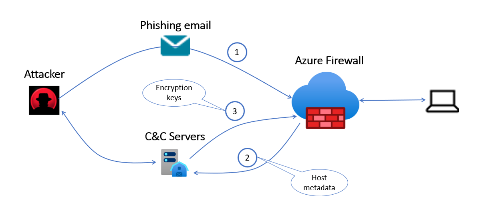

# Improve ransomware defenses with Azure Firewall Premium

In this article, you learn how Azure Firewall Premium can help you protect against ransomware.

> [!TIP]
> For comprehensive ransomware protection guidance across all Microsoft platforms and services, see [Protect your organization against ransomware and extortion](/security/ransomware/protect-against-ransomware). This article focuses specifically on Azure Firewall Premium capabilities for ransomware protection.

## What is ransomware?

Ransomware is a type of malicious software that blocks access to your computer system until someone pays money. The attacker usually exploits an existing vulnerability in your system to penetrate your network and execute the malicious software on the target host.

Ransomware is often spread through phishing emails that contain malicious attachments or through drive-by downloading. Drive-by downloading occurs when a user unknowingly visits an infected website and then the website downloads and installs malware without the user’s knowledge.

## Protect from network malicious activity

A network intrusion detection and prevention system (IDPS) allows you to monitor your network for malicious activity, log information about this activity, report it, and optionally attempt to block it.

[Azure Firewall Premium](../../firewall/premium-features.md#idps) provides signature-based IDPS that thoroughly inspects every packet, including all its headers and payload, to identify malicious activity and prevent it from penetrating your network.

The IDPS signatures apply to both application and network-level traffic (Layers 4-7), are fully managed, and contain more than 65,000 signatures in more than 50 different categories. To keep the IDPS signatures up to date with the dynamic attack landscape:

- Azure Firewall has early access to vulnerability information from [Microsoft Active Protections Program (MAPP)](https://www.microsoft.com/msrc/mapp) and [Microsoft Security Response Center (MSRC)](https://www.microsoft.com/msrc/).
- Azure Firewall releases 30 to 50 new signatures each day.

Today, organizations use modern encryption (SSL/TLS) globally to secure internet traffic. Attackers use encryption to carry their malicious software into the victim’s network. Inspect encrypted traffic like any other traffic.

Azure Firewall Premium IDPS helps you detect attacks in all ports and protocols for non-encrypted traffic. However, when Azure Firewall needs to inspect HTTPS traffic, it can use its TLS inspection capability to decrypt the traffic and accurately detect malicious activities.

After attackers install ransomware on the target machine, it might try to encrypt the machine’s data. The ransomware requires an encryption key and might use command and control (C&C) to get the encryption key from the C&C server hosted by the attacker. CryptoLocker, WannaCry, TeslaCrypt, Cerber, and Locky are some of the ransomware variants that use C&C to fetch the required encryption keys.

Azure Firewall Premium has hundreds of signatures designed to detect C&C connectivity and block it to prevent the attacker from encrypting your data. The following diagram shows Azure Firewall protection against a ransomware attack by using the C&C channel.

## Fend off ransomware attacks

Use a holistic approach to fend off ransomware attacks. Azure Firewall operates in a default deny mode and blocks access unless explicitly allowed by the administrator. Enabling the Threat Intelligence (TI) feature in alert/deny mode blocks access to known malicious IPs and domains. Microsoft updates the Threat Intel feed continuously based on new and emerging threats.

Use Firewall Policy for centralized firewall configuration. This configuration helps you respond to threats rapidly. You can enable Threat Intelligence and IDPS across multiple firewalls with a few selections. Web categories let administrators allow or deny user access to web categories such as gambling websites, social media websites, and others. URL filtering provides scoped access to external sites and can reduce risk even further. Azure Firewall provides capabilities that help companies defend comprehensively against malware and ransomware.

Detection is equally important as prevention. The Azure Firewall solution for Microsoft Sentinel gives you both detection and prevention in an easy-to-deploy solution. Combining prevention and detection helps ensure that you prevent sophisticated threats when you can while maintaining an **assume breach** mentality to detect and quickly respond to cyberattacks.

## Next steps

For comprehensive ransomware protection guidance across all Microsoft platforms and services, see [Protect your organization against ransomware and extortion](/security/ransomware/protect-against-ransomware).

See [Ransomware protection in Azure](ransomware-protection.md) to learn more about defenses for ransomware attacks in Azure and for guidance on how to proactively protect your assets.

Other Azure ransomware articles:

- [Prepare for a ransomware attack](ransomware-prepare.md)
- [Detect and respond to ransomware attacks](ransomware-detect-respond.md)
- [Azure features and resources that help you protect, detect, and respond](ransomware-features-resources.md)

To learn more about Azure Firewall Premium, see:

- [Azure Firewall Premium features](../../firewall/premium-features.md)
- [Optimize security with Azure Firewall solution for Microsoft Sentinel](https://www.microsoft.com/security/blog/2021/06/08/optimize-security-with-azure-firewall-solution-for-azure-sentinel/)
