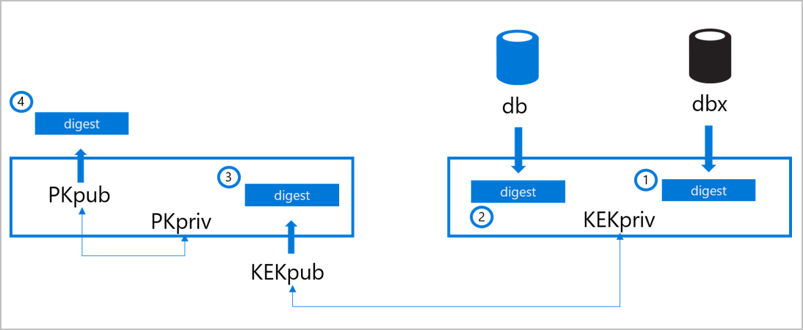

# Secure Boot

Secure Boot is a feature of the [Unified Extensible Firmware Interface](https://en.wikipedia.org/wiki/Unified_Extensible_Firmware_Interface) (UEFI) that requires all low-level firmware and software components to be verified prior to loading. During boot, UEFI Secure Boot checks the signature of each piece of boot software, including UEFI firmware drivers (also known as option ROMs), Extensible Firmware Interface (EFI) applications, and the operating system drivers and binaries. If the signatures are valid or trusted by the Original Equipment Manufacturer (OEM), the machine boots and the firmware gives control to the operating system.

## Components and process

Secure Boot relies on these critical components:

- Platform key (PK) - Establishes trust between the platform owner (Microsoft) and the firmware. The public half is PKpub and the private half is PKpriv.
- Key enrollment key database (KEK) - Establishes trust between the OS and the platform firmware. The public half is KEKpub and the private half is KEKpriv.
- Signature database (db) - Holds the digests for trusted signers (public keys and certificates) of the firmware and software code modules authorized to interact with platform firmware.
- Revoked signatures database (dbx) – Holds revoked digests of code modules that have been identified to be malicious, vulnerable, compromised, or untrusted. If a hash is in the signature db and the revoked signatures db, the revoked signatures database takes precedent.

The following figure and process explains how these components are updated:

The OEM stores the Secure Boot digests on the machine’s nonvolatile RAM (NV-RAM) at the time of manufacturing.

1. The signature database (db) is populated with the signers or image hashes of UEFI applications, operating system loaders (such as the Microsoft Operating System Loader or Boot Manager), and UEFI drivers that are trusted.
2. The revoked signatures database (dbx) is populated with digests of modules that are no longer trusted.
3. The key enrollment key (KEK) database is populated with signing keys that can be used to update the signature database and revoked signatures database. The databases can be edited via updates that are signed with the correct key or via updates by a physically present authorized user using firmware menus.
4. After the db, dbx, and KEK databases have been added and final firmware validation and testing is complete, the OEM locks the firmware from editing and generates a platform key (PK). The PK can be used to sign updates to the KEK or to turn off Secure Boot.

During each stage in the boot process, the digests of the firmware, bootloader, operating system, kernel drivers, and other boot chain artifacts are calculated and compared to acceptable values. Firmware and software that are discovered to be untrusted are not allowed to load. Thus, low-level malware injection or pre-boot malware attacks can be blocked.

## Secure Boot on the Azure fleet
Today, every machine that is onboarded and deployed to the Azure compute fleet to host customer workloads comes from factory floors with Secure Boot enabled. Targeted tooling and processes are in place at every stage in the hardware buildout and integration pipeline to ensure that Secure Boot enablement is not reverted either by accident or by malicious intent.

Validating that the db and dbx digests are correct ensures:

- Bootloader is present in one of the db entries
- Bootloader’s signature is valid
- Host boots with trusted software

 By validating the signatures of KEKpub and PKpub, we can confirm that only trusted parties have permission to modify the definitions of what software is considered trusted. Lastly, by ensuring that secure boot is active, we can validate that these definitions are being enforced.

## Next steps
To learn more about what we do to drive platform integrity and security, see:

- [Firmware security](firmware.md)
- [Platform code integrity](code-integrity.md)
- [Measured boot and host attestation](measured-boot-host-attestation.md)
- [Project Cerberus](project-cerberus.md)
- [Encryption at rest](encryption-atrest.md)
- [Hypervisor security](hypervisor.md)