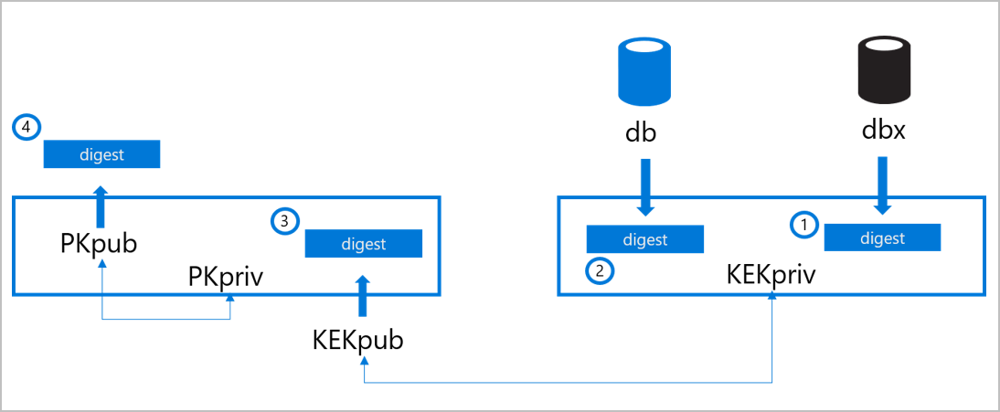

# Secure Boot

Secure Boot is a feature of the [Unified Extensible Firmware Interface (UEFI)](https://en.wikipedia.org/wiki/Unified_Extensible_Firmware_Interface) that verifies all low-level firmware and software components before loading. During boot, UEFI Secure Boot checks the signature of each piece of boot software, including UEFI firmware drivers (also known as option ROMs), Extensible Firmware Interface (EFI) applications, and the operating system drivers and binaries. If the signatures are valid or trusted by the original equipment manufacturer (OEM), the machine boots and the firmware gives control to the operating system.

## Components and process

Secure Boot relies on these critical components:

- Platform key (PK) - Establishes trust between the platform owner (Microsoft) and the firmware. The public half is PKpub and the private half is PKpriv.
- Key enrollment key database (KEK) - Establishes trust between the OS and the platform firmware. The public half is KEKpub and the private half is KEKpriv.
- Signature database (db) - Holds the digests for trusted signers (public keys and certificates) of the firmware and software code modules authorized to interact with platform firmware.
- Revoked signatures database (dbx) - Holds revoked digests of code modules that the OEM identifies as malicious, vulnerable, compromised, or untrusted. If a hash is in the signature db and the revoked signatures db, the revoked signatures database takes precedence.

The following figure and process explain how the OEM updates these components:

The OEM stores the Secure Boot digests on the machine's nonvolatile RAM (NV-RAM) at the time of manufacturing.

1. The OEM populates the signature db with the signers or image hashes of UEFI applications, operating system loaders (such as the Microsoft Operating System Loader or Boot Manager), and UEFI drivers that are trusted.
1. The OEM populates the revoked signatures dbx with digests of modules that are no longer trusted.
1. The OEM populates the key enrollment key (KEK) database with signing keys that can update the signature database and revoked signatures database. A physically present authorized user can edit the databases through updates signed with the correct key or by using firmware menus.
1. After the OEM adds the db, dbx, and KEK databases and completes final firmware validation and testing, the OEM locks the firmware from editing and generates a platform key (PK). The OEM can use the PK to sign updates to the KEK or to turn off Secure Boot.

During each stage in the boot process, the system calculates the digests of the firmware, bootloader, operating system, kernel drivers, and other boot chain artifacts and compares them to acceptable values. The system doesn't allow firmware and software discovered to be untrusted to load. Secure Boot can block low-level malware injection or preboot malware attacks.

## Secure Boot on the Azure fleet

Today, every machine deployed to the Azure compute fleet to host customer workloads comes from factory floors with Secure Boot enabled. Targeted tooling and processes are in place at every stage in the hardware buildout and integration pipeline to ensure that processes don't revert Secure Boot enablement by accident or by malicious intent.

Validating that the db and dbx digests are correct ensures:

- Bootloader is present in one of the db entries.
- Bootloader's signature is valid.
- Host boots with trusted software.

Validating the signatures of KEKpub and PKpub confirms that only trusted parties have permission to modify the definitions of trusted software. Lastly, ensuring that Secure Boot is active validates that the system enforces these definitions.

## Next steps

To learn more about how Microsoft drives platform integrity and security, see:

- [Firmware security](firmware.md)
- [Platform code integrity](code-integrity.md)
- [Measured boot and host attestation](measured-boot-host-attestation.md)
- [Project Cerberus](project-cerberus.md)
- [Encryption at rest](encryption-atrest.md)
- [Hypervisor security](hypervisor.md)
