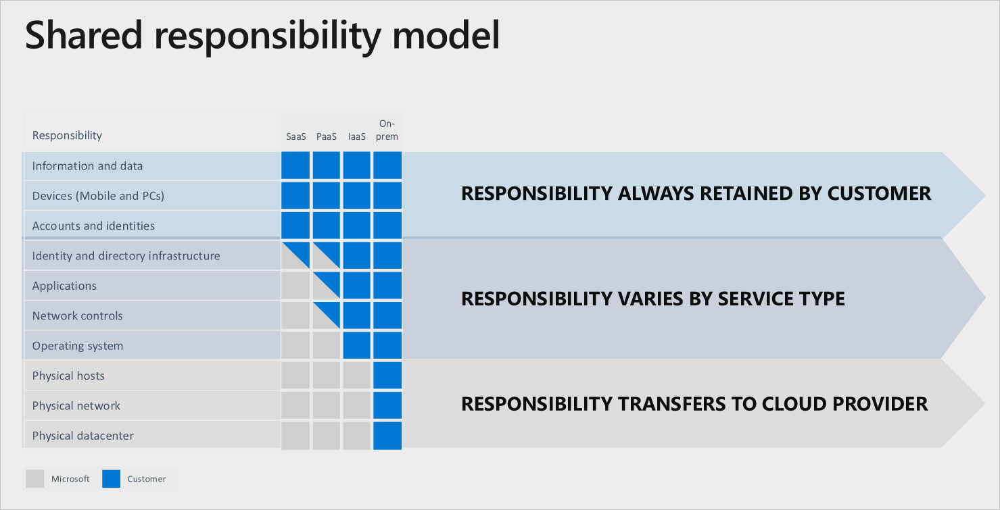
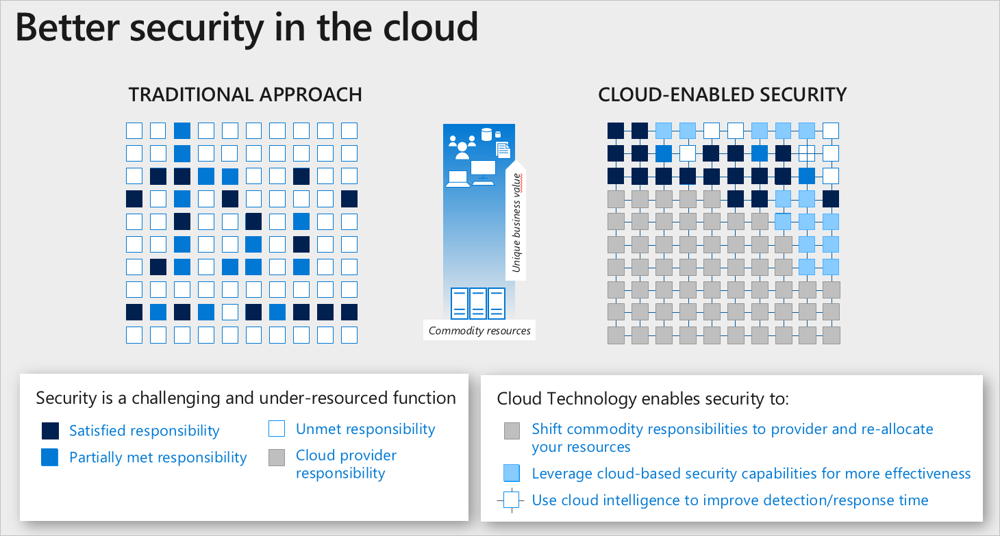

# Shared responsibility in the cloud

As you consider and evaluate public cloud services, it’s critical to understand the shared responsibility model and which security tasks are handled by the cloud provider and which tasks are handled by you. The workload responsibilities vary depending on whether the workload is hosted on Software as a Service (SaaS), Platform as a Service (PaaS), Infrastructure as a Service (IaaS), or in an on-premises datacenter

## Division of responsibility
In an on-premises datacenter, you own the whole stack. As you move to the cloud some responsibilities transfer to Microsoft. The following diagram illustrates the areas of responsibility between you and Microsoft, according to the type of deployment of your stack.

For all cloud deployment types, you own your data and identities. You are responsible for protecting the security of your data and identities, on-premises resources, and the cloud components you control (which varies by service type).

Regardless of the type of deployment, the following responsibilities are always retained by you:

- Data
- Endpoints
- Account
- Access management

## Cloud security advantages
The cloud offers significant advantages for solving long standing information security challenges. In an on-premises environment, organizations likely have unmet responsibilities and limited resources available to invest in security, which creates an environment where attackers are able to exploit vulnerabilities at all layers.

The following diagram shows a traditional approach where many security responsibilities are unmet due to limited resources. In the cloud-enabled approach, you are able to shift day to day security responsibilities to your cloud provider and reallocate your resources.

In the cloud-enabled approach, you are also able to leverage cloud-based security capabilities for more effectiveness and use cloud intelligence to improve your threat detection and response time. By shifting responsibilities to the cloud provider, organizations can get more security coverage, which enables them to reallocate security resources and budget to other business priorities.

## Next steps
For more information on the division of responsibility between you and Microsoft in a SaaS, PaaS, and IaaS deployment, see [Shared responsibilities for cloud computing](https://azure.microsoft.com/resources/shared-responsibility-for-cloud-computing/).
