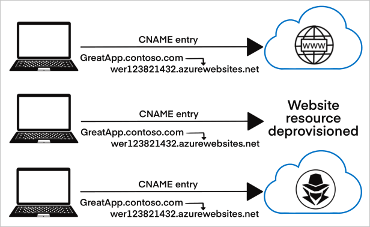

---

title: Prevent subdomain takeovers with Azure DNS alias records and Azure App Service's custom domain verification
description: Learn how to avoid the common high-severity threat of subdomain takeover
services: security
author: terrylanfear
manager: rkarlin

ms.assetid: 
ms.service: security
ms.subservice: security-fundamentals
ms.topic: article
ms.tgt_pltfrm: na
ms.workload: na
ms.date: 01/19/2023
ms.author: terrylan

---
# Prevent dangling DNS entries and avoid subdomain takeover

This article describes the common security threat of subdomain takeover and the steps you can take to mitigate against it.

## What is a subdomain takeover?

Subdomain takeovers are a common, high-severity threat for organizations that regularly create, and delete many resources. A subdomain takeover can occur when you have a [DNS record](../../dns/dns-zones-records.md#dns-records) that points to a deprovisioned Azure resource. Such DNS records are also known as "dangling DNS" entries. CNAME records are especially vulnerable to this threat. Subdomain takeovers enable malicious actors to redirect traffic intended for an organization's domain to a site performing malicious activity.

A common scenario for a subdomain takeover:

1. **CREATION:**

    1. You provision an Azure resource with a fully qualified domain name (FQDN) of `app-contogreat-dev-001.azurewebsites.net`.

    1. You assign a CNAME record in your DNS zone with the subdomain `greatapp.contoso.com` that routes traffic to your Azure resource.

1. **DEPROVISIONING:**

    1. The Azure resource is deprovisioned or deleted after it is no longer needed.

        At this point, the CNAME record `greatapp.contoso.com` *should* be removed from your DNS zone. If the CNAME record isn't removed, it's advertised as an active domain but doesn't route traffic to an active Azure resource. This is the definition of a "dangling" DNS record.

    1. The dangling subdomain, `greatapp.contoso.com`, is now vulnerable and can be taken over by being assigned to another Azure subscription's resource.

1. **TAKEOVER:**

    1. Using commonly available methods and tools, a threat actor discovers the dangling subdomain.  

    1. The threat actor provisions an Azure resource with the same FQDN of the resource you previously controlled. In this example, `app-contogreat-dev-001.azurewebsites.net`.

    1. Traffic being sent to the subdomain `greatapp.contoso.com` is now routed to the malicious actor's resource where they control the content.

## The risks of subdomain takeover

When a DNS record points to a resource that isn't available, the record itself should have been removed from your DNS zone. If it hasn't been deleted, it's a "dangling DNS" record and creates the possibility for subdomain takeover.

Dangling DNS entries make it possible for threat actors to take control of the associated DNS name to host a malicious website or service. Malicious pages and services on an organization's subdomain might result in:

- **Loss of control over the content of the subdomain** - Negative press about your organization's inability to secure its content, as well as the brand damage and loss of trust.

- **Cookie harvesting from unsuspecting visitors** - It's common for web apps to expose session cookies to subdomains (*.contoso.com), consequently any subdomain can access them. Threat actors can use subdomain takeover to build an authentic looking page, trick unsuspecting users to visit it, and harvest their cookies (even secure cookies). A common misconception is that using SSL certificates protects your site, and your users' cookies, from a takeover. However, a threat actor can use the hijacked subdomain to apply for and receive a valid SSL certificate. Valid SSL certificates grant them access to secure cookies and can further increase the perceived legitimacy of the malicious site.

- **Phishing campaigns** - Authentic-looking subdomains might be used in phishing campaigns. This is true for malicious sites and for MX records that would allow the threat actor to receive emails addressed to a legitimate subdomain of a known-safe brand.

- **Further risks** - Malicious sites might be used to escalate into other classic attacks such as XSS, CSRF, CORS bypass, and more.

## Identify dangling DNS entries

To identify DNS entries within your organization that might be dangling, use Microsoft's GitHub-hosted PowerShell tools ["Get-DanglingDnsRecords"](https://aka.ms/DanglingDNSDomains).

This tool helps Azure customers list all domains with a CNAME associated to an existing Azure resource that was created on their subscriptions or tenants.

If your CNAMEs are in other DNS services and point to Azure resources, provide the CNAMEs in an input file to the tool.

The tool supports the Azure resources listed in the following table. The tool extracts, or takes as inputs, all the tenant's CNAMEs.

| Service                   | Type                                        | FQDNproperty                               | Example                         |
|---------------------------|---------------------------------------------|--------------------------------------------|---------------------------------|
| Azure Front Door          | microsoft.network/frontdoors                | properties.cName                           | `abc.azurefd.net`               |
| Azure Blob Storage        | microsoft.storage/storageaccounts           | properties.primaryEndpoints.blob           | `abc.blob.core.windows.net`    |
| Azure CDN                 | microsoft.cdn/profiles/endpoints            | properties.hostName                        | `abc.azureedge.net`             |
| Public IP addresses       | microsoft.network/publicipaddresses         | properties.dnsSettings.fqdn                | `abc.EastUs.cloudapp.azure.com` |
| Azure Traffic Manager     | microsoft.network/trafficmanagerprofiles    | properties.dnsConfig.fqdn                  | `abc.trafficmanager.net`        |
| Azure Container Instance  | microsoft.containerinstance/containergroups | properties.ipAddress.fqdn                  | `abc.EastUs.azurecontainer.io`  |
| Azure API Management      | microsoft.apimanagement/service             | properties.hostnameConfigurations.hostName | `abc.azure-api.net`             |
| Azure App Service         | microsoft.web/sites                         | properties.defaultHostName                 | `abc.azurewebsites.net`         |
| Azure App Service - Slots | microsoft.web/sites/slots                   | properties.defaultHostName                 | `abc-def.azurewebsites.net`     |

### Prerequisites

Run the query as a user who has:

- at least reader level access to the Azure subscriptions
- read access to Azure resource graph

If you're a global administrator of your organization's tenant, elevate your account to have access to all of your organization's subscription using the guidance in [Elevate access to manage all Azure subscriptions and management groups](../../role-based-access-control/elevate-access-global-admin.md).

> [!TIP]
> Azure Resource Graph has throttling and paging limits that you should consider if you have a large Azure environment.
> 
> [Learn more about working with large Azure resource data sets](../../governance/resource-graph/concepts/work-with-data.md).
> 
> The tool uses subscription batching to avoid these limitations.

### Run the script

Learn more about the PowerShell script, **Get-DanglingDnsRecords.ps1**, and download it from GitHub: https://aka.ms/Get-DanglingDnsRecords.

## Remediate dangling DNS entries

Review your DNS zones and identify CNAME records that are dangling or have been taken over. If subdomains are found to be dangling or have been taken over, remove the vulnerable subdomains and mitigate the risks with the following steps:

1. From your DNS zone, remove all CNAME records that point to FQDNs of resources no longer provisioned.

1. To enable traffic to be routed to resources in your control, provision additional resources with the FQDNs specified in the CNAME records of the dangling subdomains.

1. Review your application code for references to specific subdomains and update any incorrect or outdated subdomain references.

1. Investigate whether any compromise has occurred and take action per your organization's incident response procedures. Tips and best practices for investigating this issue can be found below.

    If your application logic is such that secrets such as OAuth credentials were sent to the dangling subdomain, or privacy-sensitive information was sent to the dangling subdomains, that data might have been exposed to third-parties.

1. Understand why the CNAME record was not removed from your DNS zone when the resource was deprovisioned and take steps to ensure that DNS records are updated appropriately when Azure resources are  deprovisioned in the future.

## Prevent dangling DNS entries

Ensuring that your organization has implemented processes to prevent dangling DNS entries and the resulting subdomain takeovers is a crucial part of your security program.

Some Azure services offer features to aid in creating preventative measures and are detailed below. Other methods to prevent this issue must be established through your organization's best practices or standard operating procedures.

### Enable Microsoft Defender for App Service

Microsoft Defender for Cloud's integrated cloud workload protection platform (CWPP) offers a range of plans to protect your Azure, hybrid, and multicloud resources and workloads.

The **Microsoft Defender for App Service** plan includes dangling DNS detection. With this plan enabled, you'll get security alerts if you decommission an App Service website but don't remove its custom domain from your DNS registrar.

Microsoft Defender for Cloud's dangling DNS protection is available whether your domains are managed with Azure DNS or an external domain registrar and applies to App Service on both Windows and Linux.

Learn more about this and other benefits of this Microsoft Defender plans in [Introduction to Microsoft Defender for App Service](../../defender-for-cloud/defender-for-app-service-introduction.md).

### Use Azure DNS alias records

Azure DNS's [alias records](../../dns/dns-alias.md#scenarios) can prevent dangling references by coupling the lifecycle of a DNS record with an Azure resource. For example, consider a DNS record that's qualified as an alias record to point to a public IP address or a Traffic Manager profile. If you delete those underlying resources, the DNS alias record becomes an empty record set. It no longer references the deleted resource. It's important to note that there are limits to what you can protect with alias records. Today, the list is limited to:

- Azure Front Door
- Traffic Manager profiles
- Azure Content Delivery Network (CDN) endpoints
- Public IPs

Despite the limited service offerings today, we recommend using alias records to defend against subdomain takeover whenever possible.

[Learn more about the capabilities of Azure DNS's alias records](../../dns/dns-alias.md#capabilities).

### Use Azure App Service's custom domain verification

When creating DNS entries for Azure App Service, create an asuid.{subdomain} TXT record with the Domain Verification ID. When such a TXT record exists, no other Azure Subscription can validate the Custom Domain that is, take it over.

These records don't prevent someone from creating the Azure App Service with the same name that's in your CNAME entry. Without the ability to prove ownership of the domain name, threat actors can't receive traffic or control the content.

[Learn more about how to map an existing custom DNS name to Azure App Service](../../app-service/app-service-web-tutorial-custom-domain.md).

### Build and automate processes to mitigate the threat

It's often up to developers and operations teams to run cleanup processes to avoid dangling DNS threats. The practices below will help ensure your organization avoids suffering from this threat. 

- **Create procedures for prevention:**

    - Educate your application developers to reroute addresses whenever they delete resources.

    - Put "Remove DNS entry" on the list of required checks when decommissioning a service.

    - Put [delete locks](../../azure-resource-manager/management/lock-resources.md) on any resources that have a custom DNS entry. A delete lock serves as an indicator that the mapping must be removed before the resource is deprovisioned. Measures like this can only work when combined with internal education programs.

- **Create procedures for discovery:**

    - Review your DNS records regularly to ensure that your subdomains are all mapped to Azure resources that:

        - Exist - Query your DNS zones for resources pointing to Azure subdomains such as *.azurewebsites.net or *.cloudapp.azure.com (see the [Reference list of Azure domains](azure-domains.md)).
        - You own - Confirm that you own all resources that your DNS subdomains are targeting.

    - Maintain a service catalog of your Azure fully qualified domain name (FQDN) endpoints and the application owners. To build your service catalog, run the following Azure Resource Graph query script. This script projects the FQDN endpoint information of the resources you have access to and outputs them in a CSV file. If you have access to all the subscriptions for your tenant, the script considers all those subscriptions as shown in the following sample script. To limit the results to a specific set of subscriptions, edit the script as shown.

- **Create procedures for remediation:**
    - When dangling DNS entries are found, your team needs to investigate whether any compromise has occurred.
    - Investigate why the address wasn't rerouted when the resource was decommissioned.
    - Delete the DNS record if it's no longer in use, or point it to the correct Azure resource (FQDN) owned by your organization.
 
### Clean up DNS pointers or Re-claim the DNS

Upon deletion of the classic cloud service resource, the corresponding DNS is reserved as per Azure DNS policies. During the reservation period, re-use of the DNS will be forbidden EXCEPT for subscriptions belonging to the Azure AD tenant of the subscription originally owning the DNS. After the reservation expires, the DNS is free to be claimed by any subscription. By taking DNS reservations, the customer is afforded some time to either 1) clean up any associations/pointers to said DNS or 2) re-claim the DNS in Azure. The recommendation would be to delete unwanted DNS entries at the earliest. The DNS name being reserved can be derived by appending the cloud service name to the DNS zone for that cloud.
 
- Public - cloudapp.net
- Mooncake - chinacloudapp.cn
- Fairfax - usgovcloudapp.net
- BlackForest - azurecloudapp.de
                
For example, a hosted service in Public named "test" would have DNS "test.cloudapp.net"

Example:
Subscription 'A' and subscription 'B' are the only subscriptions belonging to Azure AD tenant 'AB'. Subscription 'A' contains a classic cloud service 'test' with DNS name 'test.cloudapp.net'. Upon deletion of the cloud service, a reservation is taken on DNS name 'test.cloudapp.net'. During the reservation period, only subscription 'A' or subscription 'B' will be able to claim the DNS name 'test.cloudapp.net' by creating a classic cloud service named 'test'. No other subscriptions will be allowed to claim it. After the reservation period, any subscription in Azure can now claim 'test.cloudapp.net'.

## Next steps

To learn more about related services and Azure features you can use to defend against subdomain takeover, see the following pages.

- [Enable Microsoft Defender for App Service](../../defender-for-cloud/enable-enhanced-security.md) - to receive alerts when dangling DNS entries are detected

- [Prevent dangling DNS records with Azure DNS](../../dns/dns-alias.md#prevent-dangling-dns-records)

- [Use a domain verification ID when adding custom domains in Azure App Service](../../app-service/app-service-web-tutorial-custom-domain.md#1-configure-a-custom-domain)

- [Quickstart: Run your first Resource Graph query using Azure PowerShell](../../governance/resource-graph/first-query-powershell.md)
