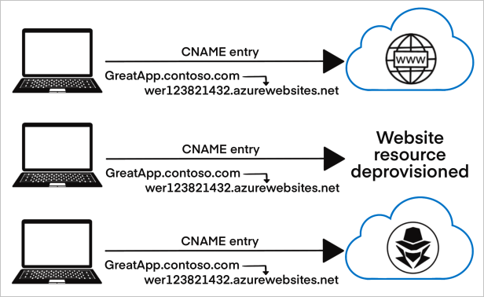

# Prevent dangling DNS entries and avoid subdomain takeover

This article describes the common security threat of subdomain takeover and the steps you can take to mitigate it.

## What is a subdomain takeover?

Subdomain takeovers are a common, high-severity threat for organizations that regularly create and delete many resources. A subdomain takeover can occur when you have a [DNS record](../../dns/dns-zones-records.md#dns-records) that points to a deprovisioned Azure resource. Such DNS records are also known as "dangling DNS" entries. CNAME records are especially vulnerable to this threat. Subdomain takeovers enable malicious actors to redirect traffic intended for an organization's domain to a site performing malicious activity.

A common scenario for a subdomain takeover:

1. **CREATION:**

    1. You provision an Azure resource with a fully qualified domain name (FQDN) of `app-contogreat-dev-001.azurewebsites.net`.

    1. You assign a CNAME record in your DNS zone with the subdomain `greatapp.contoso.com` that routes traffic to your Azure resource.

1. **DEPROVISIONING:**

    1. The Azure resource is deprovisioned or deleted after it's no longer needed.

        At this point, the CNAME record `greatapp.contoso.com` *should* be removed from your DNS zone. If the CNAME record isn't removed, it's advertised as an active domain but doesn't route traffic to an active Azure resource. You now have a "dangling" DNS record.

    1. The dangling subdomain, `greatapp.contoso.com`, is now vulnerable and can be taken over by being assigned to another Azure subscription's resource.

1. **TAKEOVER:**

    1. Using commonly available methods and tools, a threat actor discovers the dangling subdomain.

    1. The threat actor provisions an Azure resource with the same FQDN of the resource you previously controlled. In this example, `app-contogreat-dev-001.azurewebsites.net`.

    1. Traffic sent to the subdomain `greatapp.contoso.com` is now routed to the malicious actor's resource where they control the content.

## The risks of subdomain takeover

When a DNS record points to a resource that isn't available, the record itself should be removed from your DNS zone. If it isn't deleted, it's a "dangling DNS" record and creates the possibility for subdomain takeover.

Dangling DNS entries make it possible for threat actors to take control of the associated DNS name to host a malicious website or service. Malicious pages and services on an organization's subdomain might result in:

- **Loss of control over the content of the subdomain**: Negative press about your organization's inability to secure its content, brand damage, and loss of trust.

- **Cookie harvesting from unsuspecting visitors**: It's common for web apps to expose session cookies to subdomains (*.contoso.com). Any subdomain can access them. Threat actors can use subdomain takeover to build an authentic-looking page, trick unsuspecting users to visit it, and harvest their cookies (even secure cookies). A common misconception is that SSL certificates protect your site and your users' cookies from a takeover. However, a threat actor can use the hijacked subdomain to apply for and receive a valid SSL certificate. Valid SSL certificates grant them access to secure cookies and can further increase the perceived legitimacy of the malicious site.

- **Phishing campaigns**: Malicious actors often exploit authentic-looking subdomains in phishing campaigns. The risk extends to both malicious websites and MX records. MX records could enable threat actors to receive emails directed to legitimate subdomains associated with trusted brands.

- **Further risks**: Malicious sites might escalate into other classic attacks such as XSS, CSRF, CORS bypass, and more.

## Identify dangling DNS entries

To identify DNS entries within your organization that might be dangling, use Microsoft's GitHub-hosted PowerShell tools ["Get-DanglingDnsRecords"](https://aka.ms/DanglingDNSDomains).

This tool helps you list all domains with a CNAME associated with an existing Azure resource that you created on your subscriptions or tenants.

If your CNAMEs are in other DNS services and point to Azure resources, provide the CNAMEs in an input file to the tool.

The tool supports the Azure resources listed in the following table. The tool extracts, or takes as inputs, all the tenant's CNAMEs.

| Service                   | Type                                        | FQDN property                               | Example                         |
|---------------------------|---------------------------------------------|--------------------------------------------|---------------------------------|
| Azure Front Door          | microsoft.network/frontdoors                | properties.cName                           | `abc.azurefd.net`               |
| Azure Blob Storage        | microsoft.storage/storageaccounts           | properties.primaryEndpoints.blob           | `abc.blob.core.windows.net`    |
| Azure CDN                 | microsoft.cdn/profiles/endpoints            | properties.hostName                        | `abc.azureedge.net`             |
| Public IP addresses       | microsoft.network/publicipaddresses         | properties.dnsSettings.fqdn                | `abc.EastUs.cloudapp.azure.com` |
| Azure Traffic Manager     | microsoft.network/trafficmanagerprofiles    | properties.dnsConfig.fqdn                  | `abc.trafficmanager.net`        |
| Azure Container Instance  | microsoft.containerinstance/containergroups | properties.ipAddress.fqdn                  | `abc.EastUs.azurecontainer.io`  |
| Azure API Management      | microsoft.apimanagement/service             | properties.hostnameConfigurations.hostName | `abc.azure-api.net`             |
| Azure App Service         | microsoft.web/sites                         | properties.defaultHostName                 | `abc.azurewebsites.net`         |
| Azure App Service - Slots | microsoft.web/sites/slots                   | properties.defaultHostName                 | `abc-def.azurewebsites.net`     |

### Prerequisites

Run the query as a user who has:

- At least the `Reader` role access to the Azure subscriptions.
- Read access to Azure Resource Graph.

If you're a Global Administrator of your organization's tenant, follow the guidance in [Elevate access to manage all Azure subscriptions and management groups](../../role-based-access-control/elevate-access-global-admin.md) to gain access to all your organization's subscriptions.

> [!TIP]
> Consider Azure Resource Graph throttling and paging limits if you have a large Azure environment.
>
> [Learn more about working with large Azure resource data sets](../../governance/resource-graph/concepts/work-with-data.md).
>
> The tool uses subscription batching to avoid these limitations.

### Run the script

For more information about the PowerShell script, see [Get-DanglingDnsRecords.ps1](https://aka.ms/Get-DanglingDnsRecords).

## Remediate dangling DNS entries

Review your DNS zones and identify CNAME records that are dangling or taken over. If you find dangling or taken-over subdomains, remove the vulnerable subdomains and mitigate the risks by using the following steps:

1. From your DNS zone, remove all CNAME records that point to FQDNs of resources no longer provisioned.

1. To route traffic to resources you control, provision more resources with the FQDNs specified in the CNAME records of the dangling subdomains.

1. Review your application code for references to specific subdomains and update any incorrect or outdated subdomain references.

1. Investigate whether any compromise occurred and take action according to your organization's incident response procedures. For tips and best practices for investigating:

    If your application logic results in secrets, such as OAuth credentials, being sent to dangling subdomains or if privacy-sensitive information is transmitted to those subdomains, this data might be exposed to third parties.

1. Understand why the CNAME record wasn't removed from your DNS zone when you deprovisioned the resource and take steps to ensure that DNS records are updated appropriately when Azure resources are deprovisioned in the future.

## Prevent dangling DNS entries

Make processes that prevent dangling DNS entries and the resulting subdomain takeovers a crucial part of your security program.

The following sections describe Azure service features that can help create preventive measures. Establish other methods to prevent this problem through your organization's best practices or standard operating procedures.

### Enable Microsoft Defender for App Service

Microsoft Defender for Cloud's integrated cloud workload protection platform (CWPP) offers a range of plans to protect your Azure, hybrid, and multicloud resources and workloads.

The **Microsoft Defender for App Service** plan includes dangling DNS detection. When you enable this plan, you get security alerts if you decommission an App Service website but don't remove its custom domain from your DNS registrar.

Microsoft Defender for Cloud's dangling DNS protection is available whether you manage your domains with Azure DNS or an external domain registrar and applies to App Service on both Windows and Linux.

For more information about this feature and other benefits of these Microsoft Defender plans, see [Introduction to Microsoft Defender for App Service](/azure/defender-for-cloud/defender-for-app-service-introduction).

### Use Azure DNS alias records

Azure DNS [alias records](../../dns/dns-alias.md#scenarios) can prevent dangling references by coupling the lifecycle of a DNS record with an Azure resource. For example, consider a DNS record that's qualified as an alias record to point to a public IP address or a Traffic Manager profile. If you delete those underlying resources, the DNS alias record becomes an empty record set. The DNS alias record no longer references the deleted resource. Alias records have limits for what they can protect. The list is currently limited to:

- Azure Front Door
- Traffic Manager profiles
- Azure Content Delivery Network (CDN) endpoints
- Public IPs

Despite the limited service offerings today, use alias records to defend against subdomain takeover whenever possible.

For more information, see [Azure DNS alias records capabilities](../../dns/dns-alias.md#capabilities).

### Use Azure App Service's custom domain verification

When you create DNS entries for Azure App Service, create an `asuid.{subdomain}` TXT record with the domain verification ID. When such a TXT record exists, no other Azure subscription can validate the custom domain or take it over.

These records don't prevent someone from creating an Azure App Service instance with the same name that's in your CNAME entry. Without the ability to prove ownership of the domain name, bad actors can't receive traffic or control the content.

For more information, see [Map an existing custom DNS name to Azure App Service](../../app-service/app-service-web-tutorial-custom-domain.md).

### Build and automate processes to mitigate the threat

Developers and operations teams should run cleanup processes to avoid dangling DNS threats. The following practices help your organization avoid this threat.

- **Create procedures for prevention:**

    - Educate your application developers to reroute addresses whenever they delete resources.

    - Put "Remove DNS entry" on the list of required checks when decommissioning a service.

        - Add [delete locks](../../azure-resource-manager/management/lock-resources.md) to any resources that have a custom DNS entry. A delete lock serves as an indicator that the mapping must be removed before the resource is deprovisioned. Measures like this work only when combined with internal education programs.

- **Create procedures for discovery:**

    - Review your DNS records regularly to ensure that your subdomains are all mapped to Azure resources that:

        - **Exist**: Query your DNS zones for resources pointing to Azure subdomains such as *.azurewebsites.net or *.cloudapp.azure.com (see the [Reference list of Azure domains](azure-domains.md)).
        - **You own**: Confirm that you own all resources that your DNS subdomains are targeting.

    - Maintain a service catalog of your Azure fully qualified domain name (FQDN) endpoints and the application owners. Use Azure Resource Graph, the Azure portal, or another asset inventory process to regularly export the FQDN endpoint information for resources you can access. If you have access to all subscriptions in your tenant, include all subscriptions in the inventory. If you don't, document which subscriptions the inventory covers.

- **Create procedures for remediation:**
    - When your team finds dangling DNS entries, investigate whether any compromise occurred.
    - Investigate why the address wasn't rerouted when the resource was decommissioned.
    - Delete the DNS record if it's no longer in use, or point it to the correct Azure resource (FQDN) owned by your organization.

### Clean up DNS pointers or reclaim the DNS

When you delete a classic cloud service resource, Azure reserves the corresponding DNS name according to Azure DNS policies. During the reservation period, only subscriptions that belong to the Microsoft Entra tenant of the subscription that originally owned the DNS name can reuse it. After the reservation expires, any Azure subscription can claim the DNS name. DNS reservations give you time to clean up associations or pointers to the DNS name, or to reclaim the DNS name in Azure. Delete unwanted DNS entries as soon as possible. You can derive the reserved DNS name by appending the cloud service name to the DNS zone for that cloud.

- Public: `cloudapp.net`
- Mooncake: `chinacloudapp.cn`
- Fairfax: `usgovcloudapp.net`
- BlackForest: `azurecloudapp.de`

For example, a hosted service in Public named `test` has the DNS name `test.cloudapp.net`.

Example:
Subscriptions `A` and `B` are the only subscriptions that belong to Microsoft Entra tenant `AB`. Subscription `A` contains a classic cloud service named `test` with the DNS name `test.cloudapp.net`. When you delete the cloud service, Azure reserves the DNS name `test.cloudapp.net`. During the reservation period, only subscription `A` or subscription `B` can claim the DNS name `test.cloudapp.net` by creating a classic cloud service named `test`. No other subscriptions can claim it. After the reservation period, any Azure subscription can claim `test.cloudapp.net`.

## Next steps

To learn more about related services and Azure features you can use to defend against subdomain takeover, see the following pages.

- [Enable Microsoft Defender for App Service](/azure/defender-for-cloud/enable-enhanced-security) - Receive alerts when dangling DNS entries are detected.

- [Prevent dangling DNS records with Azure DNS](../../dns/dns-alias.md#prevent-dangling-dns-records)

- [Use a domain verification ID when adding custom domains in Azure App Service](../../app-service/app-service-web-tutorial-custom-domain.md#configure-a-custom-domain)

- [Quickstart: Run your first Resource Graph query using Azure PowerShell](../../governance/resource-graph/first-query-powershell.md)
