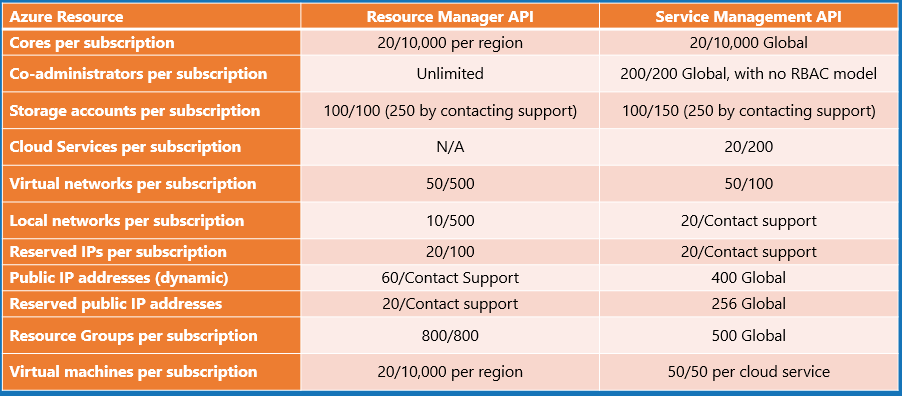
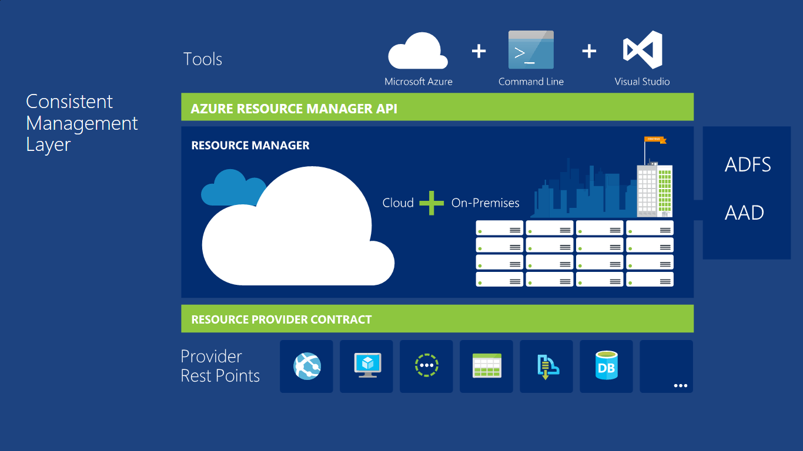
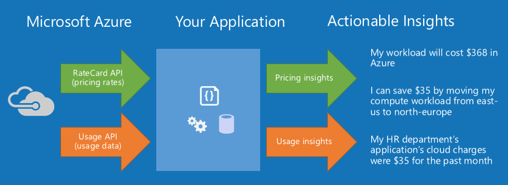
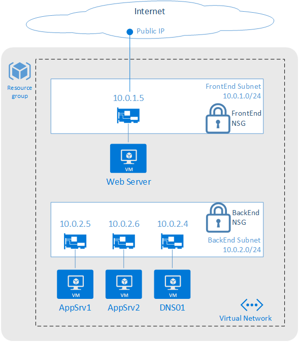
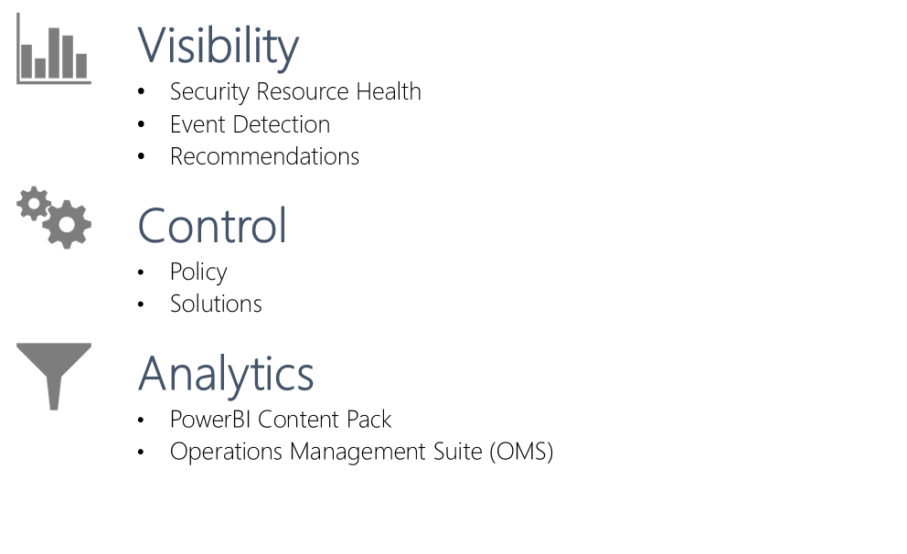
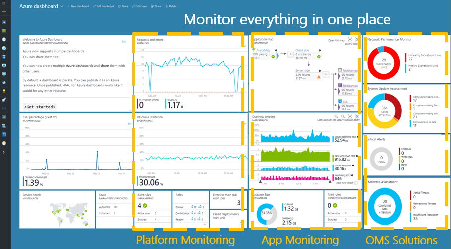
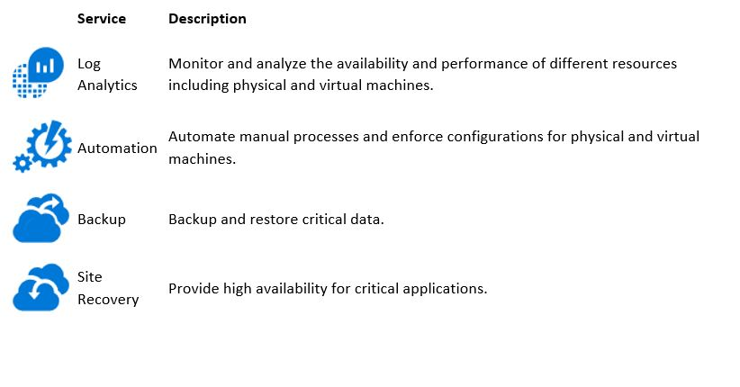

---

title: Governance in Azure | Microsoft Docs
description: Learn about cloud-based computing services that include a wide selection of compute instances & services that can scale up and down automatically to meet the needs of your application or enterprise.
services: security
documentationcenter: na
author: UnifyCloud
manager: swadhwa
editor: TomSh

ms.assetid:
ms.service: security
ms.devlang: na
ms.topic: article
ms.tgt_pltfrm: na
ms.workload: na
ms.date: 06/01/2017
ms.author: TomSh

---

# Governance in Azure

We know that security is job one in the cloud and how important it is that you find accurate and timely information about Azure security. One of the best reasons to use Azure for your applications and services is to take advantage of its wide array of security tools and capabilities. These tools and capabilities help make it possible to create secure solutions on the secure Azure platform.

To help you better understand the array of Governance controls implemented within Microsoft Azure from both the customer's and Microsoft operations' perspectives, this article, "Governance in Azure", is written that provides a comprehensive look at the Governance features available with Microsoft Azure.

## Azure platform

Azure is a public cloud service platform that supports a broad selection of operating systems, programming languages, frameworks, tools, databases and devices. It can run Linux containers with Dockers integration; build apps with JavaScript, Python, .NET, PHP, Java and Node.js; build back-ends for iOS, Android and Windows devices. Azure public cloud services support the same technologies millions of developers and IT professionals already rely on and trust.

When you build on, or migrate IT assets to, a public cloud service provider you are relying on that organization's abilities to protect your applications and data with the services and the controls they provide to manage the security of your cloud-based assets.

Azure's infrastructure is designed from the facility to applications for hosting millions of customers simultaneously, and it provides a trustworthy foundation upon which businesses can meet their security requirements. In addition, Azure provides you many security options and the ability to control them so that you can customize security to meet the unique requirements of your organization's deployments.

This document will help you understand how Azure Governance capabilities can help you fulfill these requirements.

## Abstract

Microsoft Azure cloud governance provides an integrated audit and consulting approach for reviewing and advising organizations on their usage of the Azure platform. Microsoft Azure cloud governance refers to the decision-making processes, criteria and policies involved in the planning, architecture, acquisition, deployment, operation and management of a Cloud computing.

To create a plan for Microsoft Azure cloud governance, you need to take an in-depth look at the people, processes, and technologies currently in place, and then build frameworks that make it easy for IT to consistently support business needs while providing end users with the flexibility to use the powerful features of Microsoft Azure.

This paper describes how you can achieve an elevated level of governance of your IT resources in Microsoft Azure. This paper can help you understand the security and governance features built in to Microsoft Azure.

The following are main the governance issues discussed in this paper:

- Implementation of policies, processes and procedures as per organization goals.

- Security and continuous compliance with organization standards

- Alerting and Monitoring

## Implementation of policies, processes and procedures 

Management has established roles and responsibilities to oversee implementation of the information security policy and operational continuity across Azure. Microsoft Azure management is responsible for overseeing security and continuity practices within their respective teams (including third parties), and facilitating compliance with security policies, processes and standards.

Here are the factors evolved:

- Account Provisioning

- Subscription Controls

- Role Based access controls

- Resource Management

- Resource tracking

- Critical Resource Control

- API Access to Billing Information

- Networking Controls

## Account provisioning

Defining account hierarchy is a major step to use and structure Azure services within a company and is the core governance structure. In case of customers with the enterprise agreement, customers can further subdivide the environment into departments, accounts, and finally, subscriptions.

If you do not have an enterprise agreement, consider using [Azure tags](https://docs.microsoft.com/azure/azure-resource-manager/resource-group-using-tags) at subscription level to define hierarchy. An Azure subscription is the basic unit where all resources are contained. It also defines several limits within Azure, such as number of cores, resources, etc. Subscriptions can contain [Resource Groups](https://docs.microsoft.com/azure/azure-resource-manager/resource-group-overview), which can contain Resources. [RBAC](https://docs.microsoft.com/azure/api-management/api-management-role-based-access-control) principles apply on those three levels.

Every enterprise is different and the hierarchy using Azure Tags in case of non-enterprise customers allows for significant flexibility in how Azure is organized within the company. Before deploying resources in Microsoft Azure, you should model hierarchy and understand the impact on billing, resource access, and complexity.

## Subscription controls

Subscription controls how resources usage is reported and billed. Subscriptions can be setup for separate billing and payment. As mentioned earlier under one Azure account we can have multiple subscriptions. Subscriptions can be used to determine the Azure resource usage of multiple departments in a company.

For example, if a company has IT, HR and Marketing departments and these departments have different projects running. Based on the usage of Azure resources like virtual machines by each department, they can be billed accordingly. By this we can control the finances of each department.

Azure subscriptions establish three parameters:

- a unique subscriber ID

- a billing location

- Set of available resources

For an individual, that would include one Microsoft account ID, a credit card number and the full suite of Azure services -- although, Microsoft enforces consumption limits, depending on the subscription type.

Azure enrollment hierarchies define how services are structured within an Enterprise Agreement. The Enterprise Portal allows customers to divide access to Azure resources associated with an Enterprise Agreement based on flexible hierarchies customizable to an organization's unique needs. The hierarchy pattern should match an organization's management and geographic structure so that the associated billing and resource access can be accurately accounted for.

The three high-level patterns are functional, business unit, and geographic, using departments as an administrative construct for account groupings. Within each department, accounts can be assigned subscriptions, which create silos for billing and several key limits in Azure (e.g., number of VMs, storage accounts, etc.).

For organizations with an Enterprise Agreement, Azure subscriptions follow a four-level hierarchy:

- enterprise enrolment administrator

- department administrator

- account owner

- Service administrator

This hierarchy governs the following:

- Billing relationship

- Account administration

- Role Based Access Control (RBAC) to artifacts

- Boundaries/Limits

- Boundaries

  - Usage and billing (rate card based on offer numbers)

  - Limits

  - Virtual Network

- Attached to 1 AAD (1 AAD be associated with many subscriptions)

- Associated to an enterprise enrollment account

## Role-based access controls

When Azure was initially released, access controls to a subscription were basic: Administrator or Co-Administrator. Access to a subscription in the Classic model implied access to all the resources in the portal. This lack of fine-grained control led to the proliferation of subscriptions to provide a level of reasonable access control for an Azure Enrollment.

This proliferation of subscriptions is no longer needed. With role-based access control, you can assign users to standard roles (such as common "reader" and "writer" types of roles). You can also define custom roles.

[Azure Role-Based Access Control (RBAC)](https://docs.microsoft.com/azure/active-directory/role-based-access-built-in-roles) enables fine-grained access management for Azure. Using RBAC, you can grant only the amount of access that users need to perform their jobs. Security-oriented companies should focus on giving employees the exact permissions they need. Too many permissions expose an account to attackers. Too few permissions mean that employees can't get their work done efficiently. Azure Role-Based Access Control (RBAC) helps address this problem by offering fine-grained access management for Azure. RBAC helps you to segregate duties within your team and grant only the amount of access to users that they need to perform their jobs. Instead of giving everybody unrestricted permissions in your Azure subscription or resources, you can allow only certain actions.

For example, use RBAC to let one employee manage virtual machines in a subscription, while another can manage SQL databases within the same subscription.

Azure RBAC has three basic roles that apply to all resource types:

- **Owner** has full access to all resources including the right to delegate access to others.

- **Contributor** can create and manage all types of Azure resources but can't grant access to others.

- **Reader** can view existing Azure resources.

The rest of the RBAC roles in Azure allow management of specific Azure resources. For example, the Virtual Machine Contributor role allows the user to create and manage virtual machines. It does not give them access to the virtual network or the subnet that the virtual machine connects to.

[RBAC built-in roles](https://docs.microsoft.com/azure/active-directory/role-based-access-built-in-roles) lists the roles available in Azure. It specifies the operations and scope that each built-in role grants to users.

Grant access by assigning the appropriate RBAC role to users, groups, and applications at a certain scope. The scope of a role assignment can be a subscription, a resource group, or a single resource. A role assigned at a parent scope also grants access to the children contained within it.

For example, a user with access to a resource group can manage all the resources it contains, like websites, virtual machines, and subnets.

Azure RBAC only supports management operations of the Azure resources in the Azure portal and Azure Resource Manager APIs. It cannot authorize all data level operations for Azure resources. For example, you can authorize someone to manage Storage Accounts, but not to the blobs or tables within a Storage Account cannot. Similarly, a SQL database can be managed, but not the tables within it.

If you want more details about how RBAC helps you manage access, see [What is Role-Based Access Control](https://docs.microsoft.com/azure/active-directory/role-based-access-control-what-is).

You can also [create a custom role](https://docs.microsoft.com/azure/active-directory/role-based-access-control-custom-roles) in Azure Role-Based Access Control (RBAC) if none of the built-in roles meet your specific access needs. Custom roles can be created using [Azure PowerShell](https://docs.microsoft.com/azure/active-directory/role-based-access-control-manage-access-powershell), [Azure Command-Line Interface (CLI)](https://docs.microsoft.com/azure/active-directory/role-based-access-control-manage-access-azure-cli), and the [REST API](https://docs.microsoft.com/azure/active-directory/role-based-access-control-manage-access-rest). Just like built-in roles, custom roles can be assigned to users, groups, and applications at subscription, resource group, and resource scopes.

Within each subscription, you can grant up to 2000 role assignments.

## Resource management

Azure originally provided only the classic deployment model. In this model, each resource existed independently; there was no way to group related resources together. Instead, you had to manually track which resources made up your solution or application, and remember to manage them in a coordinated approach.

To deploy a solution, you had to either create each resource individually through the classic portal or create a script that deployed all the resources in the correct order. To delete a solution, you had to delete each resource individually. You could not easily apply and update access control policies for related resources. Finally, you could not apply tags to resources to label them with terms that help you monitor your resources and manage billing.

In 2014, Azure introduced Resource Manager, which added the concept of a resource group. A resource group is a container for resources that share a common lifecycle. The Resource Manager deployment model provides several benefits:

- You can deploy, manage, and monitor all the services for your solution as a group, rather than handling these services individually.

- You can repeatedly deploy your solution throughout its lifecycle and have confidence your resources are deployed in a consistent state.

- You can apply access control to all resources in your resource group, and those policies are automatically applied when new resources are added to the resource group.

- You can apply tags to resources to logically organize all the resources in your subscription.

- You can use JavaScript Object Notation (JSON) to define the infrastructure for your solution. The JSON file is known as a Resource Manager template.

- You can define the dependencies between resources so they are deployed in the correct order.

Resource Manager enables you to put resources into meaningful groups for management, billing, or natural affinity. As mentioned earlier, Azure has two deployment models. In the earlier [Classic model](https://docs.microsoft.com/azure/azure-resource-manager/resource-manager-deployment-model), the basic unit of management was the subscription. It was difficult to break down resources within a subscription, which led to the creation of large numbers of subscriptions. With the Resource Manager model, we saw the introduction of resource groups.

A resource group is a container that holds related resources for an Azure solution. [The resource group](https://docs.microsoft.com/azure/azure-resource-manager/resource-group-overview) can include all the resources for the solution, or only those resources that you want to manage as a group. You decide how you want to allocate resources to resource groups based on what makes the most sense for your organization.

For recommendations about templates, see [Best practices for creating Azure Resource Manager templates](https://docs.microsoft.com/azure/azure-resource-manager/resource-manager-template-best-practices).

Azure Resource Manager analyzes dependencies to ensure resources are created in the correct order. If one resource relies on a value from another resource (such as a virtual machine needing a storage account for disks), you set a dependency.

>[!Note]
>For more information, see [Defining dependencies in Azure Resource Manager templates](https://docs.microsoft.com/azure/azure-resource-manager/resource-group-define-dependencies).

You can also use the template for updates to the infrastructure. For example, you can add a resource to your solution and add configuration rules for the resources that are already deployed. If the template specifies creating a resource but that resource already exists, Azure Resource Manager performs an update instead of creating a new asset. Azure Resource Manager updates the existing asset to the same state as it would be as new.

Resource Manager provides extensions for scenarios when you need additional operations such as installing software that is not included in the setup.

## Resource tracking

As users in your organization add resources to the subscription, it becomes increasingly important to associate resources with the appropriate department, customer, and environment. You can attach metadata to resources through tags. You use [tags](https://docs.microsoft.com/azure/azure-resource-manager/resource-group-using-tags) to provide information about the resource or the owner. Tags enable you to not only aggregate and group resources in several ways, but use that data for the purposes of chargeback.

Use tags when you have a complex collection of resource groups and resources, and need to visualize those assets in the way that makes the most sense to you. For example, you could tag resources that serve a similar role in your organization or belong to the same department.

Without tags, users in your organization can create multiple resources that may be difficult to later identify and manage. For example, you may wish to delete all the resources for a project. If those resources are not tagged for the project, you must manually find them. Tagging can be an important way for you to reduce unnecessary costs in your subscription.

Resources do not need to reside in the same resource group to share a tag. You can create your own tag taxonomy to ensure that all users in your organization use common tags rather than users inadvertently applying slightly different tags (such as "dept" instead of "department").

Resource policies enable you to create standard rules for your organization. You can create policies that ensure resources are tagged with the appropriate values.

> [!Note]
> For more information, see [Apply resource policies for tags](https://docs.microsoft.com/azure/azure-resource-manager/resource-manager-policy-tags).

You can also view tagged resources through the Azure portal.

The [usage report](https://docs.microsoft.com/azure/billing/billing-understand-your-bill) for your subscription includes tag names and values, which enables you to break out costs by tags.

> [!Note]
> For more information about tags, see [Using tags to organize your Azure resources](https://docs.microsoft.com/azure/azure-resource-manager/resource-group-using-tags).

The following limitations apply to tags:

- Each resource or resource group can have a maximum of 15 tag key/value pairs. This limitation only applies to tags directly applied to the resource group or resource. A resource group can contain many resources that each have 15 tag key/value pairs.

- The tag name is limited to 512 characters.

- The tag value is limited to 256 characters.

- Tags applied to the resource group are not inherited by the resources in that resource group.

If you have more than 15 values that you need to associate with a resource, use a JSON string for the tag value. The JSON string can contain many values that are applied to a single tag key.

### Tags and billing

Tags enable you to group your billing data. For example, if you are running multiple VMs for different organizations, use the tags to group usage by cost center. You can also use tags to categorize costs by runtime environment; such as, the billing usage for VMs running in production environment.

You can retrieve information about tags through the [Azure Resource Usage and RateCard APIs](https://docs.microsoft.com/azure/billing/billing-usage-rate-card-overview) or the usage comma-separated values (CSV) file. You download the usage file from the [Azure accounts portal](https://account.windowsazure.com/) or [EA portal](https://ea.azure.com/).

>[!Note]
> For more information about programmatic access to billing information, see [Gain insights into your Microsoft Azure resource consumption](https://docs.microsoft.com/azure/billing/billing-usage-rate-card-overview). For REST API operations, see [Azure Billing REST API Reference](https://msdn.microsoft.com/library/azure/1ea5b323-54bb-423d-916f-190de96c6a3c).

When you download the usage CSV for services that support tags with billing, the tags appear in the Tags column.

## Critical resource controls

As your organization adds core services to the subscription, it becomes increasingly important to ensure that those services are available to avoid business disruption. [Resource locks](https://docs.microsoft.com/azure/azure-resource-manager/resource-group-lock-resources) enable you to restrict operations on high-value resources where modifying or deleting them would have a significant impact on your applications or cloud infrastructure. You can apply locks to a subscription, resource group, or resource. Typically, you apply locks to foundational resources such as virtual networks, gateways, and storage accounts.

Resource locks currently support two values: CanNotDelete and ReadOnly. CanNotDelete means that users (with the appropriate rights) can still read or modify a resource but cannot delete it. ReadOnly means that authorized users can't delete or modify a resource.

Resource Manager Locks apply only to operations that happen in the management plane, which consists of operations sent to <https://management.azure.com>. The locks do not restrict how resources perform their own functions. Resource changes are restricted, but resource operations are not restricted. For example, a ReadOnly lock on a SQL Database prevents you from deleting or modifying the database, but it does not prevent you from creating, updating, or deleting data in the database.

Applying **ReadOnly** can lead to unexpected results because some operations that seem like read operations require additional actions. For example, placing a **ReadOnly** lock on a storage account prevents all users from listing the keys. The list keys operation is handled through a POST request because the returned keys are available for write operations.

For another example, placing a ReadOnly lock on an App Service resource prevents Visual Studio Server Explorer from displaying files for the resource because that interaction requires write access.

Unlike role-based access control, you use management locks to apply a restriction across all users and roles. To learn about setting permissions for users and roles, see [Azure Role-based Access Control](https://docs.microsoft.com/azure/active-directory/role-based-access-control-configure).

When you apply a lock at a parent scope, all resources within that scope inherit the same lock. Even resources you add later inherit the lock from the parent. The most restrictive lock in the inheritance takes precedence.

To create or delete management locks, you must have access to Microsoft.Authorization/ _or Microsoft.Authorization/locks/_ actions. Of the built-in roles, only **Owner** and **User Access Administrator** are granted those actions.

## API access to billing information

Use Azure Billing APIs to pull usage and resource data into your preferred data analysis tools. The Azure Resource Usage and RateCard APIs can help you accurately predict and manage your costs. The APIs are implemented as a Resource Provider and part of the family of APIs exposed by the Azure Resource Manager.

### Azure resource usage API (Preview)

Use the Azure [Resource Usage API](https://msdn.microsoft.com/library/azure/mt219003) to get your estimated Azure consumption data. The API includes:

- **Azure Role-based Access Control** - Configure access policies on the [Azure portal](https://portal.azure.com/) or through [Azure PowerShell cmdlets](https://docs.microsoft.com/powershell/azure/overview) to specify which users or applications can get access to the subscription's usage data. Callers must use standard Azure Active Directory tokens for authentication. Add the caller to either the Billing Reader, Reader, Owner, or Contributor role to get access to the usage data for a specific Azure subscription.

- **Hourly or Daily Aggregations** - Callers can specify whether they want their Azure usage data in hourly buckets or daily buckets. The default is daily.

- **Instance metadata (includes resource tags)** – Get instance-level detail like the fully qualified resource uri (/subscriptions/{subscription-id} /..), the resource group information, and resource tags. This metadata helps you deterministically and programmatically allocate usage by the tags, for use-cases like cross-charging.

- **Resource metadata** - Resource details such as the meter name, meter category, meter sub category, unit, and region give the caller a better understanding of what was consumed. We're also working to align resource metadata terminology across the Azure portal, Azure usage CSV, EA billing CSV, and other public-facing experiences, to let you correlate data across experiences.

- **Usage for all offer types** – Usage data is available for all offer types like Pay-as-you-go, MSDN, Monetary commitment, Monetary credit, and EA.

**Azure resource RateCard API (Preview)**

Use the Azure Resource RateCard API to get the list of available Azure resources and estimated pricing information for each. The API includes:

- **Azure Role-based Access Control** - Configure your access policies on the Azure portal or through Azure PowerShell cmdlets to specify which users or applications can get access to the RateCard data. Callers must use standard Azure Active Directory tokens for authentication. Add the caller to either the Reader, Owner, or Contributor role to get access to the usage data for a particular Azure subscription.

- **Support for Pay-as-you-go, MSDN, Monetary commitment, and Monetary credit offers (EA not supported)** - This API provides Azure offer-level rate information. The caller of this API must pass in the offer information to get resource details and rates. We're currently unable to provide EA rates because EA offers have customized rates per enrollment. Here are some of the scenarios that are made possible with the combination of the Usage and the RateCard APIs:

- **Azure spend during the month** - Use the combination of the Usage and RateCard APIs to get better insights into your cloud spend during the month. You can analyze the hourly and daily buckets of usage and charge estimates.

- **Set up alerts** – Use the Usage and the RateCard APIs to get estimated cloud consumption and charges, and set up resource-based or monetary-based alerts.

- **Predict bill** – Get your estimated consumption and cloud spend, and apply machine learning algorithms to predict what the bill would be at the end of the billing cycle.

- **Pre-consumption cost analysis** – Use the RateCard API to predict how much your bill would be for your expected usage when you move your workloads to Azure. If you have existing workloads in other clouds or private clouds, you can also map your usage with the Azure rates to get a better estimate of Azure spend. This estimate gives you the ability to pivot on offer, and compare between the different offer types beyond Pay-As-You-Go, like monetary commitment and monetary credit. The API also gives you the ability to see cost differences by region and allows you to do a what-if cost analysis to help you make deployment decisions.

- **What-if analysis** - You can determine whether it is more cost-effective to run workloads in another region, or on another configuration of the Azure resource. Azure resource costs may differ based on the Azure region you're using.

- You can also determine if another Azure offer type gives a better rate on an Azure resource.

## Networking controls

Access to resources can be either internal (within the corporation's network) or external (through the internet). It is easy for users in your organization to inadvertently put resources in the wrong spot, and potentially open them to malicious access. As with on premises/ devices, enterprises must add appropriate controls to ensure that Azure users make the right decisions.

For subscription governance, we identify core resources that provide basic control of access. The core resources consist of:

### Network connectivity

[Virtual Networks](https://docs.microsoft.com/azure/virtual-network/virtual-networks-overview) are container objects for subnets. Though not strictly necessary, it is often used when connecting applications to internal corporate resources. The Azure Virtual Network service enables you to securely connect Azure resources to each other with virtual networks (VNets).

A VNet is a representation of your own network in the cloud. A VNet is a logical isolation of the Azure cloud dedicated to your subscription. You can also connect VNets to your on-premises network.

Following are capabilities for Azure Virtual Networks:

- **Isolation**: VNets are isolated from one another. You can create separate VNets for development, testing, and production that use the same CIDR address blocks. Conversely, you can create multiple VNets that use different CIDR address blocks and connect networks together. You can segment a VNet into multiple subnets. Azure provides internal name resolution for VMs and Cloud Services role instances connected to a VNet. You can optionally configure a VNet to use your own DNS servers, instead of using Azure internal name resolution.

- **Internet connectivity**: All Azure Virtual Machines (VM) and Cloud Services role instances connected to a VNet have access to the Internet, by default. You can also enable inbound access to specific resources, as needed.

- **Azure resource connectivity**: Azure resources such as Cloud Services and VMs can be connected to the same VNet. The resources can connect to each other using private IP addresses, even if they are in different subnets. Azure provides default routing between subnets, VNets, and on-premises networks, so you don't have to configure and manage routes.

- **VNet connectivity**: VNets can be connected to each other, enabling resources connected to any VNet to communicate with any resource on any other VNet.

- **On-premises connectivity**: VNets can be connected to on-premises networks through private network connections between your network and Azure, or through a site-to-site VPN connection over the Internet.

- **Traffic filtering**: VM and Cloud Services role instances network traffic can be filtered inbound and outbound by source IP address and port, destination IP address and port, and protocol.

- **Routing**: You can optionally override Azure's default routing by configuring your own routes, or using BGP routes through a network gateway.

## Network access controls

[Network security groups](https://docs.microsoft.com/azure/virtual-network/virtual-networks-nsg) are like a firewall and provide rules for how a resource can "talk" over the network. They provide granular control over how/if a subnet (or virtual machine) can connect to the Internet or other subnets in the same virtual network.

A network security group (NSG) contains a list of security rules that allow or deny network traffic to resources connected to Azure Virtual Networks (VNet). NSGs can be associated to subnets, individual VMs (classic), or individual network interfaces (NIC) attached to VMs (Resource Manager).

When an NSG is associated to a subnet, the rules apply to all resources connected to the subnet. Traffic can further be restricted by also associating an NSG to a VM or NIC.

## Security and continuous compliance with organizational standards

Every business has different needs, and every business will reap distinct benefits from cloud solutions. Still, customers of all kinds have the same basic concerns about moving to the cloud. They want to retain control of their data, and they want that data to be kept secure and private, all while maintaining transparency and compliance.

What customers want from cloud providers is:

- **Secure our data** while acknowledging that the cloud can provide increased data security and administrative control, IT leaders are still concerned that migrating to the cloud will leave them more vulnerable to hackers than their current in-house solutions.

- **Keep our data** private Cloud services raise unique privacy challenges for businesses. As companies look to the cloud to save on infrastructure costs and improve their flexibility, they also worry about losing control of where their data is stored, who is accessing it, and how it gets used.

- **Give us control** Even as they take advantage of the cloud to deploy more innovative solutions, companies are very concerned about losing control of their data. The recent disclosures of government agencies accessing customer data, through both legal and extra-legal means, make some CIOs wary of storing their data in the cloud.

- **Promote transparency** While security, privacy, and control are important to business decision-makers, they also want the ability to independently verify how their data is being stored, accessed, and secured.

- **Maintain compliance** as companies expand their use of cloud technologies, the complexity and scope of standards and regulations continue to evolve. Companies need to know that their compliance standards will be met, and that compliance will evolve as regulations change over time.

## Security configuration, monitoring and alerting

Azure subscribers may manage their cloud environments from multiple devices, including management workstations, developer PCs, and even privileged end-user devices that have task-specific permissions. In some cases, administrative functions are performed through web-based consoles such as the Azure portal. In other cases, there may be direct connections to Azure from on-premises systems over Virtual Private Networks (VPNs), Terminal Services, client application protocols, or (programmatically) the Azure Service Management API (SMAPI). Additionally, client endpoints can be either domain joined or isolated and unmanaged, such as tablets or smartphones.

Although multiple access and management capabilities provide a rich set of options, this variability can add significant risk to a cloud deployment. It can be difficult to manage, track, and audit administrative actions. This variability may also introduce security threats through unregulated access to client endpoints that are used for managing cloud services. Using general or personal workstations for developing and managing infrastructure opens unpredictable threat vectors such as web browsing (for example, watering hole attacks) or email (for example, social engineering and phishing).

Monitoring, logging, and auditing provide a basis for tracking and understanding administrative activities, but it may not always be feasible to audit all actions in complete detail due to the amount of data generated. Auditing the effectiveness of the management policies is a best practice, however.

Azure security Governance from AD DS GPOs to control all the administrators' Windows interfaces, such as file sharing. Include management workstations in auditing, monitoring, and logging processes. Track all administrator and developer access and usage.

### Azure security center

The [Azure Security Center](https://docs.microsoft.com/azure/security-center/security-center-intro) provides a central view of the security status of resources in the subscriptions, and provides recommendations that help prevent compromised resources. It can enable more granular policies (for example, applying policies to specific resource groups that allow the enterprise to tailor their posture to the risk they are addressing).

Security Center provides integrated security monitoring and policy management across your Azure subscriptions, helps detect threats that might otherwise go unnoticed, and works with a broad ecosystem of security solutions. After you enable [security policies](https://docs.microsoft.com/azure/security-center/security-center-policies) for a subscription's resources, Security Center analyzes the security of your resources to identify potential vulnerabilities. Information about your network configuration is available instantly.

Azure Security Center represents a combination of best practice analysis and security policy management for all resources within an Azure subscription. This powerful and easy to use tool allows security teams and risk officers to prevent, detect, and respond to security threats as it automatically collects and analyzes security data from your Azure resources, the network, and partner solutions like anti-malware programs and firewalls.

In addition, Azure Security Center applies advanced analytics, including machine learning and behavioral analysis while leveraging global threat intelligence from Microsoft products and services, the Microsoft Digital Crimes Unit (DCU), the Microsoft Security Response Center (MSRC), and external feeds. [Security governance](https://www.credera.com/blog/credera-site/azure-governance-part-4-other-tools-in-the-toolbox/) can be applied broadly at the subscription level or narrowed down to specific, granular requirements applied to individual resources through policy definition.

Finally, Azure Security Center analyzes resource security health based on those policies and uses this to provide insightful dashboards and alerting for events such as malware detection or malicious IP connection attempts.

>[!Note]
> For more information about how to apply recommendations, read [Implementing security recommendations in Azure Security Center](https://docs.microsoft.com/azure/security-center/security-center-recommendations).

Security Center collects data from your virtual machines to assess their security state, provide security recommendations, and alert you to threats. When you first access Security Center, data collection is enabled on all virtual machines in your subscription. Data collection is recommended but you can opt-out by [disabling data collection](https://docs.microsoft.com/azure/security-center/security-center-faq) in the Security Center policy.

Finally, Azure Security Center is an open platform that enables Microsoft partners and independent software vendors to create software that plugs into Azure Security Center to enhance its capabilities.

Azure Security Center monitors the following Azure resources:

- Virtual machines (VMs) (including Cloud Services)

- Azure Virtual Networks

- Azure SQL service

- Partner solutions integrated with your Azure subscription such as a web application firewall on VMs and on [App Service Environment](https://docs.microsoft.com/azure/app-service/app-service-app-service-environments-readme).

### Operations Management Suite

The OMS software development and service team's information security and [governance program](https://github.com/Microsoft/azure-docs/blob/master/articles/log-analytics/log-analytics-security.md) supports its business requirements and adheres to laws and regulations as described at [Microsoft Azure Trust Center](https://azure.microsoft.com/support/trust-center/) and [Microsoft Trust Center Compliance](https://www.microsoft.com/TrustCenter/Compliance/default.aspx). How OMS establish security requirements, identifies security controls, manages, and monitors risks are also described there. Annually, we review polices, standards, procedures, and guidelines.

Each OMS development team member receives formal application security training. Internally, we use a version control system for software development. Each software project is protected by the version control system.

Microsoft has a security and compliance team that oversees and assesses all services in Microsoft. Information security officers make up the team and they are not associated with the engineering departments that develop OMS. The security officers have their own management chain and conduct independent assessments of products and services to ensure security and compliance.

Operations Management Suite (also known as OMS) is a collection of management services that were designed in the cloud from the start. Rather than deploying and managing on premises resources, OMS components are entirely hosted in Azure. Configuration is minimal, and you can be up and running literally in a matter of minutes.

Just because OMS services run in the cloud doesn't mean that they can't effectively manage your on-premises environment.

Put an agent on any Windows or Linux computer in your data center, and it will send data to Log Analytics where it can be analyzed along with all other data collected from cloud or on premises services. Use Azure Backup and Azure Site Recovery to leverage the cloud for backup and high availability for on premises resources.

Runbooks in the cloud can't typically access your on-premises resources, but you can install an agent on one or more computers too that will host runbooks in your data center. When you start a runbook, you simply specify whether you want it to run in the cloud or on a local worker.

The core functionality of OMS is provided by a set of services that run in Azure. Each service provides a specific management function, and you can combine services to achieve different management scenarios.

Azure operation manager extends its functionalities by providing management solutions. [Management Solutions](https://docs.microsoft.com/azure/operations-management-suite/operations-management-suite-solutions) are prepackaged sets of logic that implement a management scenario leveraging one or more OMS services.

Different solutions are available from Microsoft and from partners that you can easily add to your Azure subscription to increase the value of your investment in OMS.

As a partner, you can create your own solutions to support your applications and services and provide them to users through the Azure Marketplace or Quick Start Templates.

## Performance alerting and monitoring

### Alerting

Alerts are a method of monitoring Azure resource metrics, events, or logs and being notified when a condition you specify is met.

**Alerts in different Azure services**

Alerts are available across different services, including:

- Application Insights: Enables web test and metric alerts.

>[!Note]
> See [Set alerts in Application Insights](https://docs.microsoft.com/azure/application-insights/app-insights-alerts) and [Monitor availability and responsiveness of any website](https://docs.microsoft.com/azure/application-insights/app-insights-monitor-web-app-availability).

- Log Analytics (Operations Management Suite): Enables the routing of Activity and Diagnostic Logs to Log Analytics. Operations Management Suite allows metric, log, and other alert types.

>[!Note]
> For more information, see Alerts in [Log Analytics](https://docs.microsoft.com/azure/log-analytics/log-analytics-alerts).

- Azure Monitor: Enables alerts based on both metric values and activity log events. You can use the [Azure Monitor REST API](https://msdn.microsoft.com/library/dn931943.aspx) to manage alerts.

>[!Note]
> For more information, see [Using the Azure portal, PowerShell, or the command-line interface to create alerts](https://docs.microsoft.com/azure/monitoring-and-diagnostics/insights-alerts-portal).

### Monitoring

Performance issues in your cloud app can impact your business. With multiple interconnected components and frequent releases, degradations can happen at any time. And if you're developing an app, your users usually discover issues that you didn't find in testing. You should know about these issues immediately, and have tools for diagnosing and fixing the problems. Microsoft Azure has a range of tools for identifying these problems.

**How do I monitor my Azure cloud apps?**

There is a range of tools for monitoring Azure applications and services. Some of their features overlap. This is partly for historical reasons and partly due to the blurring between development and operation of an application.

Here are the principal tools:

- **Azure Monitor** is basic tool for monitoring services running on Azure. It gives you infrastructure-level data about the throughput of a service and the surrounding environment. If you are managing your apps all in Azure, deciding whether to scale up or down resources, then Azure Monitor gives you what you use to start.

- **Application Insights** can be used for development and as a production monitoring solution. It works by installing a package into your app, and so gives you a more internal view of what's going on. Its data includes response times of dependencies, exception traces, debugging snapshots, execution profiles. It provides powerful smart tools for analyzing all this telemetry both to help you debug an app and to help you understand what users are doing with it. You can tell whether a spike in response times is due to something in an app, or some external resourcing issue. If you use Visual Studio and the app is at fault, you can be taken right to the problem line(s) of code so you can fix it.

- **Log Analytics** is for those who need to tune performance and plan maintenance on applications running in production. It is based in Azure. It collects and aggregates data from many sources, though with a delay of 10 to 15 minutes. It provides a holistic IT management solution for Azure, on-premises, and third-party cloud-based infrastructure (such as Amazon Web Services). It provides richer tools to analyze data across more sources, allows complex queries across all logs, and can proactively alert on specified conditions. You can even collect custom data into its central repository so can query and visualize it.

- **System Center Operations Manager (SCOM)** is for managing and monitoring large cloud installations. You might be already familiar with it as a management tool for on-premises Windows Sever and Hyper-V based-clouds, but it can also integrate with and manage Azure apps. Among other things, it can install Application Insights on existing live apps. If an app goes down, it tells you in seconds.

## Next steps

- [Best practices for creating Azure Resource Manager templates](https://docs.microsoft.com/azure/azure-resource-manager/resource-manager-template-best-practices).

- [Examples of implementing Azure subscription governance](https://docs.microsoft.com/en-us/azure/azure-resource-manager/resource-manager-subscription-examples).

- [Microsoft Azure Government](https://docs.microsoft.com/azure/azure-government/).
