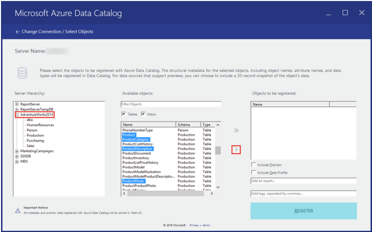
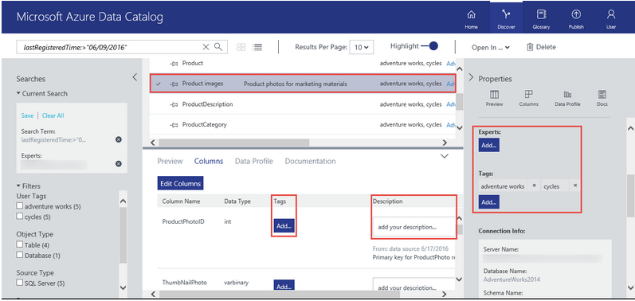
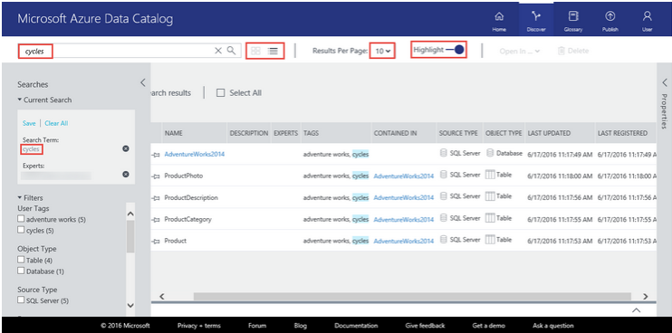
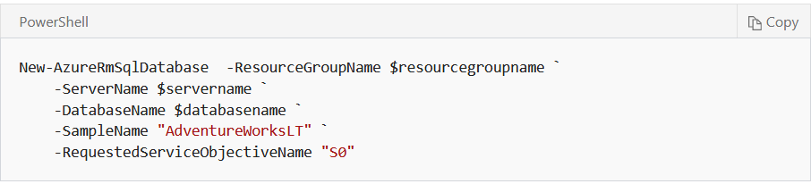

---
title: Discover, identify, and classify personal data in Microsoft Azure | Microsoft Docs
description: Learn about searching, classifying, discovering and identifying data
services: security
documentationcenter: na
author: barclayn
manager: MBaldwin
editor: TShinder

ms.assetid: 
ms.service: security
ms.devlang: na
ms.topic: article
ms.tgt_pltfrm: na
ms.workload: na
ms.date: 08/20/2017
ms.author: barclayn
ms.custom: 

---
# Discover, identify, and classify personal data in Microsoft Azure

Personal data discovery, identification, and classification are essential to a successful security, governance, and compliance strategy. Azure customers who collect data from their users must be able to identify sensitive data and understand where it’s located in order to keep it secure.

Azure provides a rich diversity of data storage possibilities and multiple tools that can help customers identify, classify, and search for personal data in their Azure environments, hosted applications, and external sources.

This article provides guidance on how to discover, identify, and classify personal data in several Azure tools and services, including using Azure Data Catalog, Azure Active Directory, SQL Database, Power Query for Hadoop clusters in Azure HDInsight, Azure Information Protection, Azure Search, and SQL queries for Azure Cosmos DB.

## Scenario, problem statement and goal:

A U.S.-based sports company collects a variety of personal and other data from their customers and employees, maintains it in multiple databases, and stores it in several different locations in their Azure environment. In addition to selling sports equipment, they also host and manage registration for elite athletic events around the world, including in the EU, and in some cases the customer data they collect includes medical information.

Since the company hosts many international bicycling tours every year and has contingent staff in locations around the globe, a couple of the data sets are quite large. The company also has developer-built applications that are used by both customers and employees.

The company wants to address the following problems:

- Customer and employee personal data must be classified/distinguished from the other data the company collects in order to ensure proper access and security.
- The data admin needs to easily discover the location of customer personal data across various areas of the Azure environment.
- Customer and employee personal data that appears in shared documents and email communications must be classified and labelled to help ensure that it’s kept secure.
- The company’s app developers need a way to easily search for customer and employee personal data in their web and mobile apps.
- Developers also need to query their document database for personal data.

## Company goals

- Data sources and assets that include personal data must be registered so they can be tagged/annotated and searched in Azure Data Catalog.

- All customer and employee personal data must be tagged/annotated in Azure Data Catalog so it can be found easily. Ideally customer and employee personal data are tagged/annotated separately.
- Personal data from customer and employee user profiles and work information residing in Azure Active Directory must be easily located.
- Personal data residing in multiple SQL databases must be easily queried. 
- Some of the company’s large data sets are managed through Azure HDInsight and stored in Hadoop. They must be imported into Excel so they can be queried for personal data.
- Personal data shared in documents and email communications must be classified, labelled, and kept secure with Azure Information Protection.
- The company’s app developers must be able to discover customer and employee personal data in the apps they’ve built, which they can do with Azure Search.
- Developers must be able to find personal data in their document database.

### Azure Data Catalog: data classification, annotation, and discovery

[Azure Data Catalog](https://azure.microsoft.com/services/data-catalog/) is a metadata catalog that helps enterprise organizations manage and track data sources/assets. The first step is to register them. The next step is to classify all personal data and tag or annotate it so it’s easier to find. Finally, you can discover personal data through searching and filtering. Once you’ve located
your data, you can use its location to connect to it with the application or tool of your choice, such as Excel or SQL Server Management Studio.

In order to use the catalog, you must be the owner or co-owner of an [Azure subscription](https://azure.microsoft.com/free/) and you must be signed in with an Azure Active Directory user account.

>[!NOTE]
You can only have one data catalog per organization/Azure Active Directory
domain.

Data can be classified, annotated and discovered in Azure Data Catalog either manually or through a REST API.

### How do I manually register, tag/annotate, and discover/search personal data sources, assets and objects? 

The following steps are an overview of how to register, annotate, and discover/search for data in Azure Data Catalog. The links in these steps take you to an Azure Data Catalog tutorial with exercises that provide more specific guidance. The exercises focus on a fictional company called AdventureWorks. Instructions earlier in the tutorial show you how to load the actual AdventureWorks database and provide detailed background information.

You can do the exercises or just use the information as a guideline for working with your own data.

1. **Register data sources/assets**

    In order to search for and identify personal data with Azure Data Catalog, you need to register your data source/assets first. Once you sign in, you’ll launch the registration tool, choose a data source to register and register specific data objects. You can also add tags to help enable search.  
      
    Once registered, the data source or asset remains in its existing location, but a copy of the metadata is added to Azure Data Catalog, which allows the user to more easily discover personal data. You can categorize data assets that contain personal information during registration with a tag that distinguishes them as such. You can tag customer and employee personal data separately, too. For example, tag “name,” “Social Security number,” “ID number,” and any others as “customer personal data,” “employee personal information,” or “sensitive customer data.” Then they’ll be discoverable with a Data Catalog search. Tags are not preset. You can use any tag name you want.  
    To learn how to register your data assets, follow the instructions in the [Register data assets](../data-catalog/data-catalog-get-started-register-data-assets.md) section of the tutorial.
    There is also a how-to page that provides more information about registering, discovering, annotating and searching data in Azure Data Catalog. For more information, visit [Register data sources in Azure Data Catalog](../data-catalog/data-catalog-how-to-register.md), which is part of a larger documentation site for the service (the full tutorial can be found under [Get Started with Azure Data Catalog](../data-catalog/data-catalog-get-started) on this same site).
    Once you’ve registered your data sources/assets/objects, you can further tag (annotate) them and discover/search for them.

2. **Annotate data sources/assets**
    When registering your data source/assets in step 1, you have a chance to add tags to help categorize and identify data objects. The annotate data steps show you how to do this after your data source/assets are registered. The tutorial shows you how to tag data assets, but doesn’t specifically discuss personal data. You can use a data tag like “customer personal data,” “employee personal information,” or “sensitive customer data” to identify all fields that contain personal data, such as “name”, “Social Security     number,” “ID number” and others. You can also add tags for experts, users, or glossary items, or add tags or descriptions at the column level. 
    In addition, you can add information that shows users how to request access to the data source/asset and documentation for your assets. 
    
    >[!NOTE]
To learn how to annotate/tag your data assets, follow the instructions in the [Annotate data assets](../data-catalog/data-catalog-get-started-annotate-data-assets.md) section of the tutorial. For more information, visit [How to nnotate data sources](../data-catalog/data-catalog-how-to-annotate.md).

3. **Discover/search for data sources/assets**
Personal data assets can be discovered in Azure Data Catalog through searching and filtering. Basic search will match terms and annotations (tags), and filtering allows you to choose tags, source type, and other specific identifiers to complement the basic search.

    

    To learn how to discover data, follow the instructions in the [Discover data assets](../data-catalog/data-catalog-get-started-discover-data-assets.md) section of the tutorial. You can find personal data by doing a search for the specific tag(s) you set up to identify it, for example “customer personal data,” “employee personal information,” or “sensitive customer data.”
    For more information, visit [How to discover data sources in Azure Data Catalog](../data-catalog/data-catalog-how-to-discover.md).

    Azure Data Catalog doesn’t allow you to access your data, it just helps you track and locate it. Once you’ve located your data, you can connect to it by using the application or tool of your choice, such as Excel or SQL Server Management Studio. For more information, visit the [Connect to data assets](../data-catalog/data-catalog-get-started#connect-to-data-assets) section of the tutorial.

#### Related topics**

[Azure Data Catalog](https://azure.microsoft.com/services/data-catalog/)

[What is Azure Data Catalog](https://docs.microsoft.com/azure/data-catalog/data-catalog-what-is-data-catalog)

[Azure Data Catalog documentation](https://docs.microsoft.com/azure/data-catalog/)

[Get started with Azure Data Catalog](https://docs.microsoft.com/azure/data-catalog/data-catalog-get-started)

[Supported data sources in Azure Data Catalog](../data-catalog/data-catalog-dsr#list-of-supported-data-sources.md)

**How do I register, tag (annotate), and discover/search personal data sources,
assets, and objects using the Azure Data Catalog REST API?**

To learn how to do this, visit the [Azure Data Catalog REST
API](https://docs.microsoft.com/rest/api/datacatalog/) documentation, which includes sections on [registering](https://docs.microsoft.com/rest/api/datacatalog/data-catalog-data-asset#register-or-update),[annotating](https://docs.microsoft.com/rest/api/datacatalog/data-catalog-data-asset#annotate),
and [searching](https://docs.microsoft.com/rest/api/datacatalog/data-catalog-data-asset#search).

## Azure Active Directory: data discovery

[Azure Active
Directory](https://azure.microsoft.com/en-us/services/active-directory/) is
Microsoft’s cloud-based, multi-tenant directory and identity management service. You can locate customer and employee user profiles and user work information that contain personal data in your [Azure Active Directory] https://azure.microsoft.com/en-us/services/active-directory/) (AAD) environment by using the [Azure portal](https://portal.azure.com/).

This is particularly helpful if you want to find or change personal data for a specific user. You can also add or change user profile and work information. You must sign in with an account that’s a global admin for the directory.

### How do I locate or view user profile and work information?

1. Sign in to the [Azure portal](https://portal.azure.com) with an account that's a global admin for the directory.

2.Select **More services**, enter **Users and groups** in the text box, and then select **Enter**.

   

3. On the **Users and groups** blade, select **Users**.

  

4. On the **Users and groups - Users** blade, select a user from the list, and then, on the blade for the selected user, select **Profile** to view user profile information that might contain personal data.

  

5. If you need to add or change user profile information, you can do so, and then, in the command bar, select **Save.**
6. On the blade for the selected user, select **Work Info** to view user work information that may contain personal data.

 

7. If you need to add or change user work information, you can do so, and then, in the command bar, select **Save.**

## Azure SQL Database: data discovery

[Azure SQL Database](https://azure.microsoft.com/services/sql-database/?v=16.50) is a cloud database that helps developers build and maintain applications. Personal data can be found in [Azure SQL Database](https://azure.microsoft.com/services/sql-database/?v=16.50)
using standard SQL queries. Azure SQL elastic query (preview) enables users to perform cross-database queries.

A detailed [SQL database](../sql-database/sql-database-technical-overview.md) tutorial explains many aspects of using a SQL database, including how to build one and how to run data queries. The following is a summary of the information available in the tutorial with links to specific sections.

### How do I build a SQL database?

There are three ways to do it:

-  An Azure SQL database can be created in the [Azure portal](https://portal.azure.com/). In the tutorial, you’ll use a specific
    set of compute and storage resources within a resource group and logical server. You’ll use sample data from a fictitious company called AdventureWorks. You’ll also create a server-level firewall rule. To learn how to do this, visit the [Create an Azure SQL database in the Azure portal](../sql-database/sql-database-get-started-portal.md)
    tutorial.

  
-   A SQL database can also be created in the [Azure Cloud Shell](https://azure.microsoft.com/features/cloud-shell/) CLI, a     browser-based command line tool. The tool is available in the Azure portal and can be run directly from there. In this tutorial, you’ll launch the tool, define script variables, create a resource group and logical server, and configure a server firewall rule. Then you’ll create a database with sample data. To learn how to create your database this way, visit the [Create a single Azure SQL database using the Azure CLI](../sql-database/sql-database-get-started-cli.md) tutorial.

  

>[!NOTE]
Azure CLI is commonly used by Linux admins and developers. Some users find it easier and more intuitive than PowerShell, which is your third option.

- Finally, you can create a SQL database using PowerShell, which is a command line/script tool used to create and manage Azure and other resources. In this tutorial, you’ll launch the tool, define script variables, create a resource group and logical server, and configure a server firewall rule. Then you’ll create a database with sample data.

The tutorial requires the Azure PowerShell module version 4.0 or later. Run  Get-Module -ListAvailable AzureRM to find your version. If you need to install or upgrade, see Install Azure PowerShell module.

  

To learn how to create your database this way, visit the [Create a single Azure SQL database using Powershell](../sql-database/sql-database-get-started-powershell.md) tutorial.

>[!Note]
Windows admins tend to use PowerShell, but some of them prefer Azure CLI.

### How do I search for personal data in SQL database in the Azure portal?**

You can use the built-in query editor tool inside the Azure portal to search for
personal data. You’ll log in to the tool using your SQL server admin login and
password, and then enter a query.

  

Step 5 of the tutorial shows an example query in the query editor pane, but it  doesn’t focus on personal or sensitive information(it also combines data from two tables and creates aliases for the source column in the data set being returned). The following screenshot shows the query from Step 5 as well as the results pane that’s returned:

  

If your database was called MyTable, a sample query for personal information might include name, Social Security number and ID number and would look like this:

“SELECT Name, SSN, ID number FROM MyTable”

You’d run the query and then see the results in the **Results** pane.

For more information on how to query a SQL database in the Azure portal, visit
the [Query the SQL database](../sql-database/sql-database-get-started-portal-query-the-sql-database.md) section of the tutorial.

### How do I search for data in SQL database with tools such as SQL Server Management Studio, Visual Studio Code, .NET, Python or others?

You can search for data with your preferred tool using the Azure portal, Azure CLI, or Azure PowerShell. For more information, visit the [Next steps](../sql-database/sql-database-get-started-portal-next-steps.md) section of the tutorial, choose your preferred tool, and then choose the Azure resource management tool you’d like to use.

### How do I search for data across multiple databases?

SQL elastic query (preview) enables you to perform cross-database and multiple database queries and return a single result. The [tutorial overview](../sql-database/sql-database-elastic-query-overview-why-use-elastic-queries.md) includes a detailed description of scenarios and explains the difference between vertical and horizontal database partitioning. Horizontal partitioning is called “sharding.”

  

  

The [Next steps](../sql-database/sql-database-elastic-query-overview#next-steps.md) section includes links to more detailed tutorials that explain how to get started, syntax, and sample queries for both types of elastic queries.

To get started, visit the [Azure SQL Database elastic query overview (preview)](../sql-database/sql-database-elastic-query-overview-why-use-elastic-queries.md) page.

For more detailed tutorials and additional information, visit the tutorial’s [Next
steps](../sql-database/sql-database-elastic-query-overview-next-steps.md) section.

Learn more: [Azure SQL Database](https://azure.microsoft.com/services/sql-database/?v=16.50) (marketing page)

[What is SQL Database?](../sql-database/sql-database-technical-overview.md)

[SQL Database Query Editor available in Azure portal] (https://azure.microsoft.com/blog/t-sql-query-editor-in-browser-azure-portal/)

Query editor was in preview as of January 2017. This is a blog post written by PM Ninar Nuemah.

#### Power Query (for importing Azure HDInsight Hadoop clusters): data discovery for large data sets

Hadoop is an open source Apache storage and processing service for large data sets, which are analyzed and stored in Hadoop clusters. [Azure HDInsight](https://azure.microsoft.com/services/hdinsight/) allows users to work with Hadoop clusters in Azure. Power Query is an Excel add-in that, among other things, helps users discover data from different sources.

Personal data associated with Hadoop clusters in Azure HDInsight can be imported to Excel with Power Query. Once the data is in Excel you can use a query to identify it.

#### How do I use Excel Power Query to import Hadoop clusters in Azure HDInsight into Excel?

An HDInsight tutorial will walk you through this entire process. It explains prerequisites, and includes a link to a [Get started with Azure HDInsight](../hdinsight/hdinsight-hadoop-linux-tutorial-get-started.md) tutorial. Instructions cover Excel 2016 as well as 2013 and 2010 (steps are slightly different for the older versions of Excel). If you don’t have the Excel Power Query add-in, the tutorial shows you how to get it. You’ll start the tutorial in Excel and will need to have an Azure Blob storage account associated
with your cluster.

  

To learn how to do this, visit the [Connect Excel to Hadoop by using Power Query](../hdinsight/hdinsight-connect-excel-power-query.md) tutorial.

Source: [Connect Excel to Hadoop by using Power Query](../hdinsight/hdinsight-connect-excel-power-query.md)

## Azure Information Protection: personal data classification for documents and
email

[Azure Information Protection](https://www.microsoft.com/en-us/cloud-platform/azure-information-protection) can help Azure customers apply labels to classify and ensure the protection of internally or externally shared documents and email communications that contain customer or employee personal information. Rules and conditions can be defined automatically or manually, by administrators or by users. For example, if a user is saving a document that includes credit card information, he or she would see a label recommendation that was configured by the administrator.

### How do I try it?

If you’d like to give Azure Information Protection a try to see if it might be a fit for your organization, visit the [Quickstart tutorial](https://docs.microsoft.com/information-protection/get-started/infoprotect-quick-start-tutorial). It walks you through five basic steps—from installation to configuring policy to seeing classification, labelling, and sharing in action—and should take less than a half hour.

### How do I deploy it?

If you’d like to deploy Azure Information Protection for your organization, visit the [deployment roadmap for classification, labelling, and protection](https://docs.microsoft.com/information-protection/plan-design/deployment-roadmap).

### Is there anything else I should know?

For complementary information that will help you think through how to set it up, visit the [Ready, set, protect!](https://blogs.technet.microsoft.com/enterprisemobility/2017/02/21/azure-information-protection-ready-set-protect/)
blog post. And check the Learn more links listed below for more on Azure Information Protection.

### Learn more
Azure Information Protection

An introduction to the service [marketing page]

[What is Azure Information Protection?](https://docs.microsoft.com/en-us/information-protection/understand-explore/what-is-information-protection)

A thorough explanation of the service that includes links to all of the how-to
documentation

[What is Azure Rights Management?](https://docs.microsoft.com/en-us/information-protection/understand-explore/what-is-azure-rms)

An explanation of the protection technology that Azure Information Protection
uses

[Azure Information Protection: Ready, set, protect!](https://blogs.technet.microsoft.com/enterprisemobility/2017/02/21/azure-information-protection-ready-set-protect/)

A friendly blog post that complements the how-to information and might help you think through how to approach setting it up

[Azure Information Protection Deployment roadmap](https://docs.microsoft.com/information-protection/plan-design/deployment-roadmap)

A step-by-step guide for those who are ready to deploy the service

[Quickstart tutorial for Azure Information Protection](https://docs.microsoft.com/information-protection/get-started/infoprotect-quick-start-tutorial)

A 20-minute tutorial for those who want to give the service a try

[Azure Information Protection Documentation homepage](https://docs.microsoft.com/information-protection/)

Documentation homepage

[Requirements for Azure Information Protection](https://docs.microsoft.com/information-protection/get-started/requirements)

## Azure Search: data discovery for developer apps

[Azure Search](https://azure.microsoft.com/services/search/) is a cloud search solution for developers, and provides a rich data search experience for your applications. Azure Search allows you to locate data across user-defined indexes, sourced from Azure Cosmo DB, Azure SQL Database, Azure Blob Storage, Azure Table storage, or custom customer JSON data. You can also structure Lucene
queries using the Azure Search REST API to search for personal data types or the personal data of specific individuals. Features include full text search, simple query syntax, and Lucene query syntax. Visit the following links for more information:

[Azure Search](https://azure.microsoft.com/services/search/)

An introduction to the service

### Azure Search documentation links:

[What is Azure Search?](../search/search-what-is-azure-search.md)

[How full text search works in Azure Search](../search/search-lucene-query-architecture.md)

[Simple query syntax in Azure Search](https://docs.microsoft.com/en-us/rest/api/searchservice/simple-query-syntax-in-azure-search)

[Lucene query syntax in Azure Search](https://docs.microsoft.com/en-us/rest/api/searchservice/lucene-query-syntax-in-azure-search)

Search query overview: [Query your Azure Searchindex](../search/search-query-overview.md)

**Query Azure Cosmos DB data with SQL: data discovery**

[Azure Cosmos DB](https://azure.microsoft.com/en-us/services/cosmos-db/) is a
scalable, globally distributed database service. You can query your Azure Cosmos
DB and data with SQL to find customer and employee personal information.

## How do I use SQL to query data?

To begin with the basics, visit the [Azure CosmosD DB: How to query using SQL](../cosmos-db/tutorial-query-documentdb.md)
tutorial. The tutorial provides a sample document and two sample SQL queries and results.

For more in-depth guidance on building SQL queries, visit [SQL queries for Azure Cosmos DB Document DB
API.](../cosmos-db/documentdb-sql-query.md)

If you’re new to Azure Cosmos DB and would like to learn how to create a database, add a collection, and add data, visit the [Azure Cosmos DB: Build a DocumentDB API web app](../cosmos-db/create-documentdb-dotnet.md)
Quickstart tutorial. If you’d like to do this in a language other than .NET, such as Java or Python, just choose your preferred language once you get to the site.
