---
title: Discover, identify, and classify personal data in Microsoft Azure | Microsoft Docs
description: Learn about searching, classifying, discovering, and identifying data
services: security
documentationcenter: na
author: barclayn
manager: MBaldwin
editor: TShinder

ms.assetid: 
ms.service: security
ms.devlang: na
ms.topic: article
ms.tgt_pltfrm: na
ms.workload: na
ms.date: 08/24/2017
ms.author: barclayn
ms.custom: 

---
# Discover, identify, and classify personal data in Microsoft Azure

This article provides guidance on how to discover, identify, and classify personal data in several Azure tools and services, including using Azure Data Catalog, Azure Active Directory, SQL Database, Power Query for Hadoop clusters in Azure HDInsight, Azure Information Protection, Azure Search, and SQL queries for Azure Cosmos DB.

## Scenario, problem statement, and goal

A U.S.-based sports company collects a variety of personal and other data. This includes customers and employee data. The company keeps it in multiple databases, and stores it in several different locations in their Azure environment. In addition to selling sports equipment, they also host and manage registration for elite athletic events around the world, including in the EU, and in some cases the customer data they collect includes medical information.

Since the company hosts many international bicycling tours every year and has contingent staff in locations around the globe, a couple of the data sets are quite large. The company also has developer-built applications that are used by both customers and employees.

The company wants to address the following problems:

- Customer and employee personal data must be classified/distinguished from the other data the company collects in order to ensure proper access and security.
- The data admin needs to easily discover the location of customer personal data across various areas of the Azure environment.
- Customer and employee personal data that appears in shared documents and email communications must be labeled to help ensure that it’s kept secure.
- The company’s app developers need a way to easily search for customer and employee personal data in their web and mobile apps.
- Developers also need to query their document database for personal data.

### Company goals

- All customer and employee personal data must be tagged/annotated in Azure Data Catalog so it can be found easily. Ideally customer and employee personal data are tagged/annotated separately.
- Personal data from customer and employee user profiles and work information residing in Azure Active Directory must be easily located.
- Personal data residing in multiple SQL databases must be easily queried. 
- Some of the company’s large data sets are managed through Azure HDInsight and stored in Hadoop. They must be imported into Excel so they can be queried for personal data.
- Personal data shared in documents and email communications must be classified, labeled, and kept secure with Azure Information Protection.
- The company’s app developers must be able to discover customer and employee personal data in the apps they’ve built, which they can do with Azure Search.
- Developers must be able to find personal data in their document database.

## Azure Active Directory: Data discovery

[Azure Active Directory](https://azure.microsoft.com/services/active-directory/) is Microsoft’s cloud-based, multi-tenant directory and identity management service. You can locate customer and employee user profiles and user work information that contain personal data in your [Azure Active Directory](https://azure.microsoft.com/services/active-directory/) (AAD) environment by using the [Azure portal](https://portal.azure.com/).

This is particularly helpful if you want to find or change personal data for a specific user. You can also add or change user profile and work information. You must sign in with an account that’s a global admin for the directory.

### How do I locate or view user profile and work information?

1. Sign in to the [Azure portal](https://portal.azure.com) with an account that's a global admin for the directory.

2. Select **More services**, enter **Users and groups** in the text box, and then select **Enter**.

   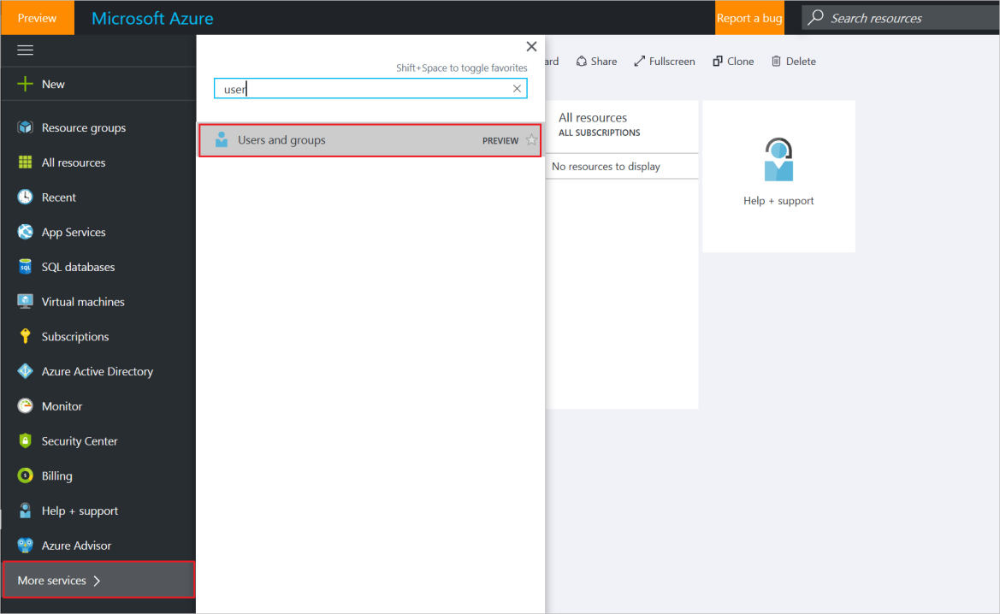

3. On the **Users and groups** blade, select **Users**.

  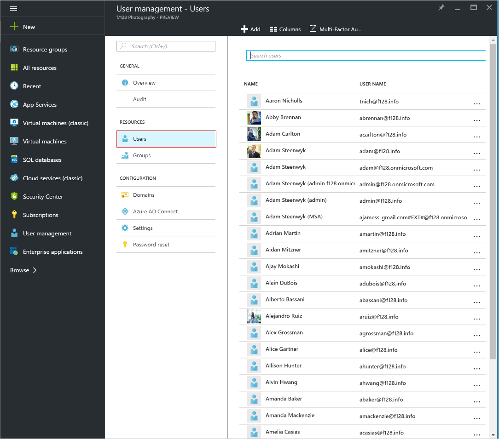

4. On the **Users and groups - Users** blade, select a user from the list, and then, on the blade for the selected user, select **Profile** to view user profile information that might contain personal data.

  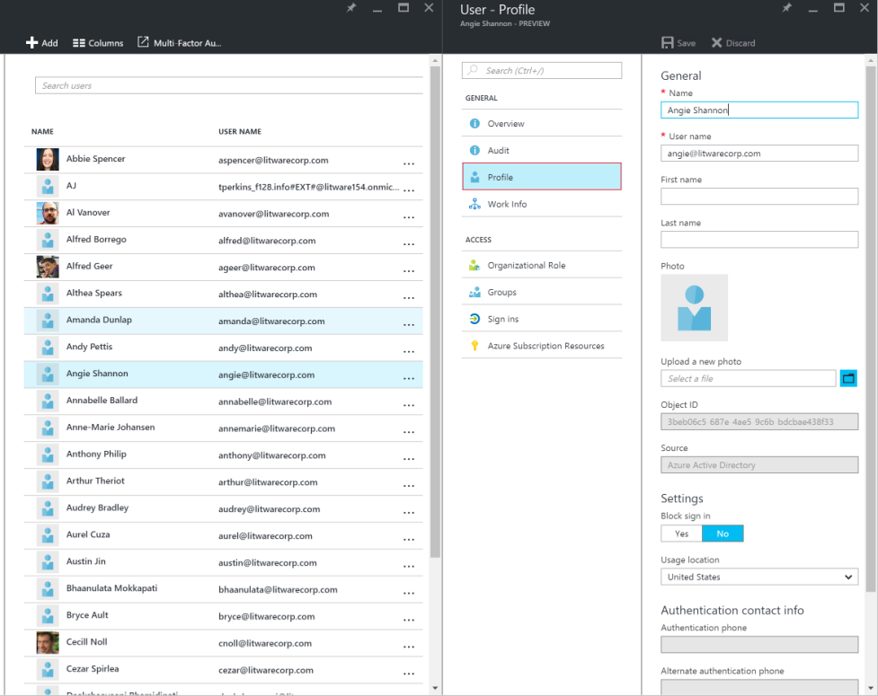

5. If you need to add or change user profile information, you can do so, and then, in the command bar, select **Save.**
6. On the blade for the selected user, select **Work Info** to view user work information that may contain personal data.

 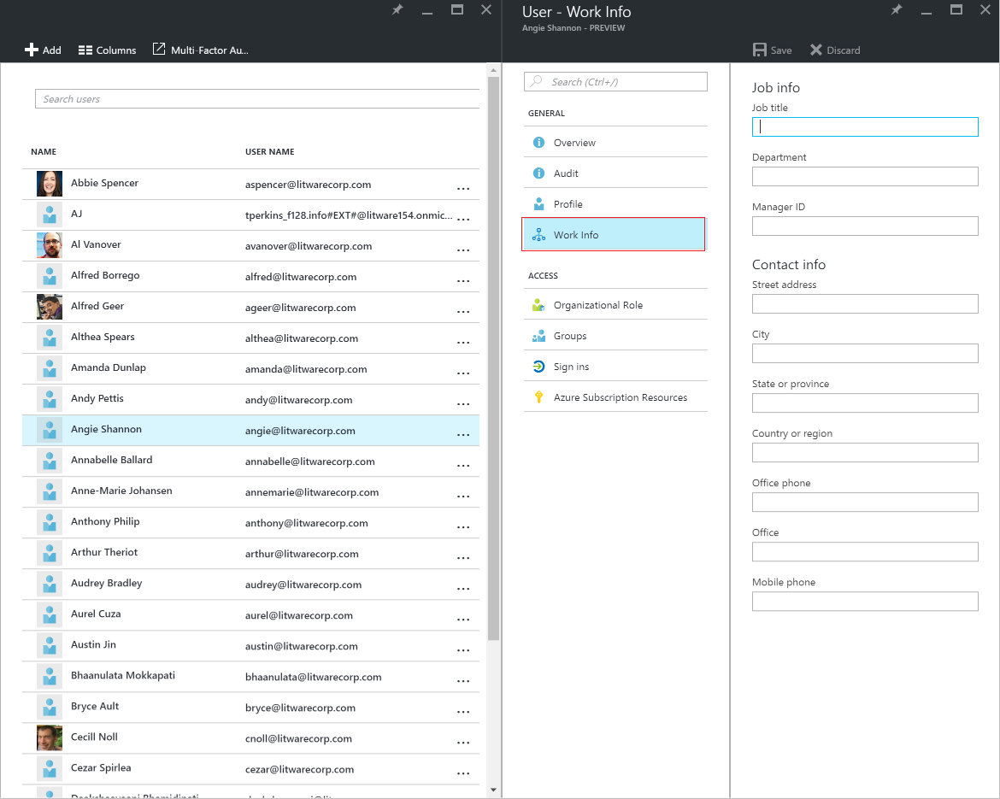

7. If you need to add or change user work information, you can do so, and then, in the command bar, select **Save.**

## Azure SQL Database: Data discovery

[Azure SQL Database](https://azure.microsoft.com/services/sql-database/?v=16.50) is a cloud database that helps developers build and maintain applications. Personal data can be found in [Azure SQL Database](https://azure.microsoft.com/services/sql-database/?v=16.50) using standard SQL queries. Azure SQL elastic query (preview) enables users to perform cross-database queries.

A detailed [SQL database](../sql-database/sql-database-technical-overview.md) tutorial explains many aspects of using a SQL database, including how to build one and how to run data queries. The following is a summary of the information available in the tutorial with links to specific sections.

### How do I build a SQL database?

There are three ways to do it:

- An Azure SQL database can be created in the [Azure portal](https://portal.azure.com/). In the tutorial, you’ll use a specific
    set of compute and storage resources within a resource group and logical server. You’ll use sample data from a fictitious company called AdventureWorks. You’ll also create a server-level firewall rule. To learn how to do this, visit the [Create an Azure SQL database in the Azure portal](../sql-database/sql-database-get-started-portal.md)
    tutorial.

  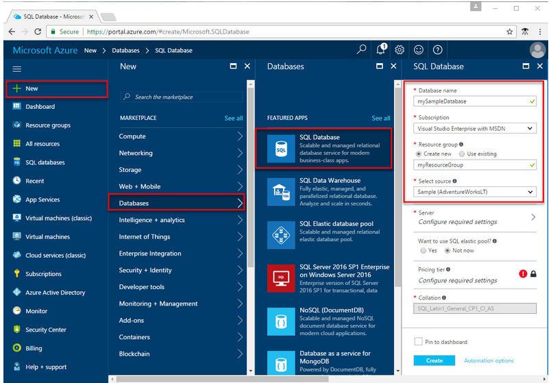
- A SQL database can also be created in the [Azure Cloud Shell](https://azure.microsoft.com/features/cloud-shell/) CLI, a browser-based command-line tool. The tool is available in the Azure portal and can be run directly from there. In this tutorial, you launch the tool, define script variables, create a resource group and logical server, and configure a server firewall rule. Then you create a database with sample data. To learn how to create your database this way, visit the [Create a single Azure SQL database using the Azure CLI](../sql-database/sql-database-get-started-cli.md) tutorial.

  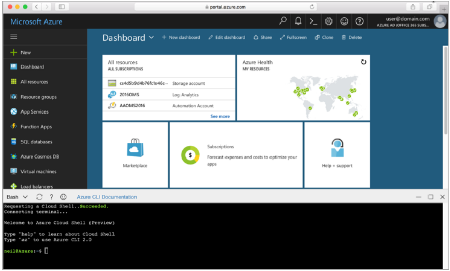

>[!NOTE]
Azure CLI is commonly used by Linux admins and developers. Some users find it easier and more intuitive than PowerShell, which is your third option.

- Finally, you can create a SQL database using PowerShell, which is a command line/script tool used to create and manage Azure and other resources. In this tutorial, you launch the tool, define script variables, create a resource group and logical server, and configure a server firewall rule. Then you’ll create a database with sample data.

The tutorial requires the Azure PowerShell module version 4.0 or later. Run  Get-Module -ListAvailable AzureRM to find your version. If you need to install or upgrade, see Install Azure PowerShell module.

```PowerShell
New-AzureRmSQLDatabase -ResourceGroupName $resourcegroupname `
-ServerName $servername `
-DatabaseName $databasename `
-RequestedServiceObjectiveName "s0"
```

To learn how to create your database this way, visit the [Create a single Azure SQL database using Powershell](../sql-database/sql-database-get-started-powershell.md) tutorial.

>[!Note]
Windows admins tend to use PowerShell, but some of them prefer Azure CLI.

### How do I search for personal data in SQL database in the Azure portal?**

You can use the built-in query editor tool inside the Azure portal to search for personal data. You’ll log in to the tool using your SQL server admin login and password, and then enter a query.

  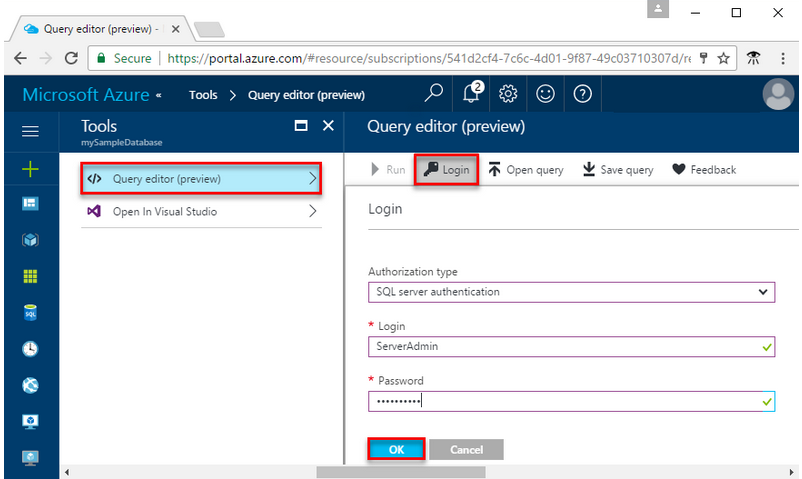

Step 5 of the tutorial shows an example query in the query editor pane, but it  doesn’t focus on personal or sensitive information(it also combines data from two tables and creates aliases for the source column in the data set being returned). The following screenshot shows the query from Step 5 as well as the results pane that’s returned:

  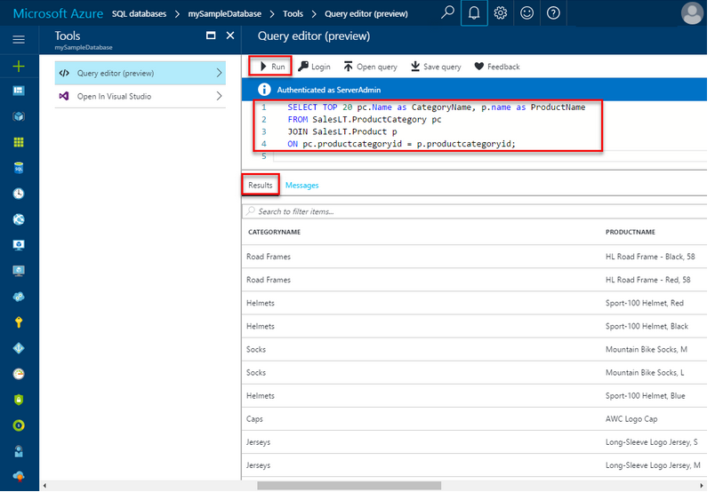

If your database was called MyTable, a sample query for personal information might include name, Social Security number and ID number and would look like this:

“SELECT Name, SSN, ID number FROM MyTable”

You’d run the query and then see the results in the **Results** pane.

For more information on how to query a SQL database in the Azure portal, visit the [Query the SQL database](../sql-database/sql-database-get-started-portal.md) section of the tutorial.

### How do I search for data across multiple databases?

SQL elastic query (preview) enables you to perform cross-database and multiple database queries and return a single result. The [tutorial overview](../sql-database/sql-database-elastic-query-overview.md) includes a detailed description of scenarios and explains the difference between vertical and horizontal database partitioning. Horizontal partitioning is called “sharding.”

  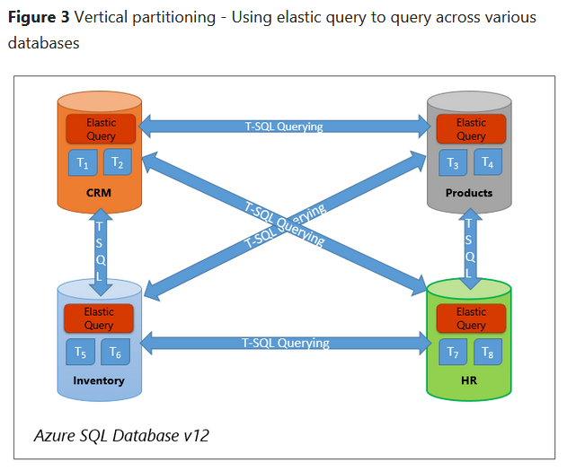

  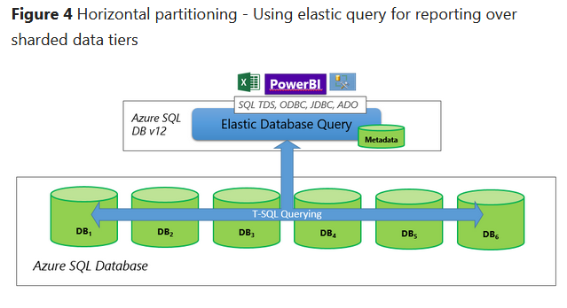

To get started, visit the [Azure SQL Database elastic query overview (preview)](../sql-database/sql-database-elastic-query-overview.md) page.

#### Power Query (for importing Azure HDInsight Hadoop clusters): data discovery for large data sets

Hadoop is an open source Apache storage and processing service for large data sets, which are analyzed and stored in Hadoop clusters. [Azure HDInsight](https://azure.microsoft.com/services/hdinsight/) allows users to work with Hadoop clusters in Azure. Power Query is an Excel add-in that, among other things, helps users discover data from different sources.

Personal data associated with Hadoop clusters in Azure HDInsight can be imported to Excel with Power Query. Once the data is in Excel you can use a query to identify it.

#### How do I use Excel Power Query to import Hadoop clusters in Azure HDInsight into Excel?

An HDInsight tutorial will walk you through this entire process. It explains prerequisites, and includes a link to a [Get started with Azure HDInsight](../hdinsight/hdinsight-hadoop-linux-tutorial-get-started.md) tutorial. Instructions cover Excel 2016 as well as 2013 and 2010 (steps are slightly different for the older versions of Excel). If you don’t have the Excel Power Query add-in, the tutorial shows you how to get it. You’ll start the tutorial in Excel and will need to have an Azure Blob storage account associated with your cluster.

  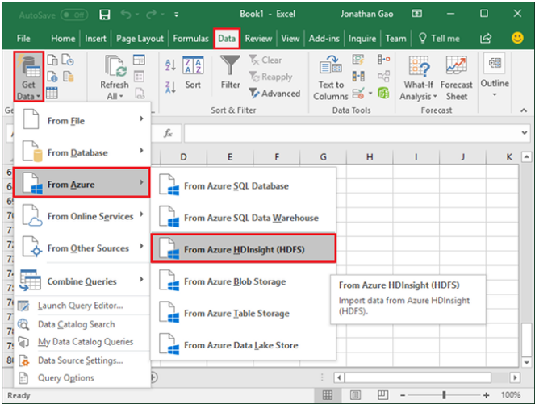

To learn how to do this, visit the [Connect Excel to Hadoop by using Power Query](../hdinsight/hdinsight-connect-excel-power-query.md) tutorial.

Source: [Connect Excel to Hadoop by using Power Query](../hdinsight/hdinsight-connect-excel-power-query.md)

## Azure Information Protection: personal data classification for documents and email

[Azure Information Protection](https://www.microsoft.com/cloud-platform/azure-information-protection) can help Azure customers apply labels to classify and protect internally or externally shared documents and email communications. Some of these items may contain customer or employee personal information. Rules and conditions can be defined automatically or manually, by administrators or by users. For example, if a user is saving a document that includes credit card information, he or she would see a label recommendation that was configured by the administrator.

### How do I try it?

If you’d like to give Azure Information Protection a try to see if it might be a fit for your organization, visit the [Quickstart tutorial](https://docs.microsoft.com/information-protection/get-started/infoprotect-quick-start-tutorial). It walks you through five basic steps—from installation to configuring policy to seeing classification, labeling, and sharing in action—and should take less than a half hour.

### How do I deploy it?

If you’d like to deploy Azure Information Protection for your organization, visit the [deployment roadmap for classification, labeling, and protection](https://docs.microsoft.com/information-protection/plan-design/deployment-roadmap).

### Is there anything else I should know?

For complementary information that will help you think through how to set it up, visit the [Ready, set, protect!](https://blogs.technet.microsoft.com/enterprisemobility/2017/02/21/azure-information-protection-ready-set-protect/)
blog post. And check the Learn more links listed below for more on Azure Information Protection.

## Azure Search: data discovery for developer apps

[Azure Search](https://azure.microsoft.com/services/search/) is a cloud search solution for developers, and provides a rich data search experience for your applications. Azure Search allows you to locate data across user-defined indexes, sourced from Azure Cosmo DB, Azure SQL Database, Azure Blob Storage, Azure Table storage, or custom customer JSON data. You can also structure Lucene queries using the Azure Search REST API to search for personal data types or the personal data of specific individuals. Features include full text search, simple query syntax, and Lucene query syntax. 

## How do I use SQL to query data?

To begin with the basics, visit the [Azure CosmosD DB: How to query using SQL](../cosmos-db/tutorial-query-documentdb.md)
tutorial. The tutorial provides a sample document and two sample SQL queries and results.

For more in-depth guidance on building SQL queries, visit [SQL queries for Azure Cosmos DB Document DB API.](../cosmos-db/documentdb-sql-query.md)

If you’re new to Azure Cosmos DB and would like to learn how to create a database, add a collection, and add data, visit the [Azure Cosmos DB: Build a DocumentDB API web app](../cosmos-db/create-documentdb-dotnet.md)
Quickstart tutorial. If you’d like to do this in a language other than .NET, such as Java or Python, just choose your preferred language once you get to the site.

## Next steps

[Azure SQL Database](https://azure.microsoft.com/services/sql-database/?v=16.50)

[What is SQL Database?](../sql-database/sql-database-technical-overview.md)

[SQL Database Query Editor available in Azure portal] (https://azure.microsoft.com/blog/t-sql-query-editor-in-browser-azure-portal/)

[What is Azure Information Protection?](https://docs.microsoft.com/information-protection/understand-explore/what-is-information-protection)

[What is Azure Rights Management?](https://docs.microsoft.com/information-protection/understand-explore/what-is-azure-rms)

[Azure Information Protection: Ready, set, protect!](https://blogs.technet.microsoft.com/enterprisemobility/2017/02/21/azure-information-protection-ready-set-protect/)
