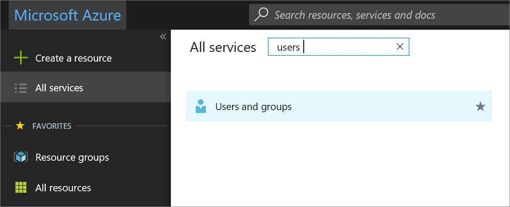
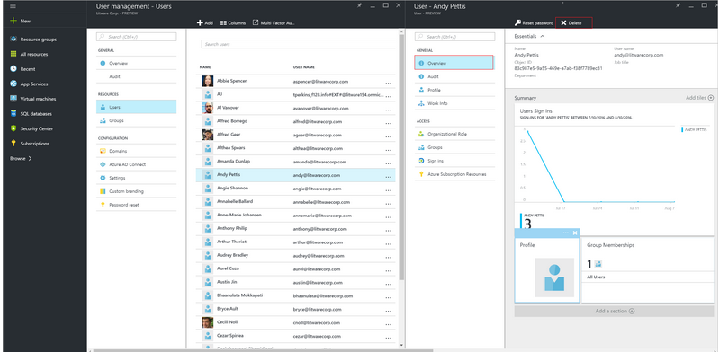

# Manage personal data in Microsoft Azure

This article provides guidance on how to correct, update, delete, and export personal data in Azure Active Directory and Azure SQL Database.

## Scenario

A Dublin-based company provides one-stop shopping for high end destination weddings in Ireland and around the world for both a local and international customer base. They have offices, customers, employees, and vendors located around the world to fully service the venues they offer.

Among many other items, the company keeps track of RSVPs that include food allergies and dietary preferences. Wedding guests can register for various activities such as horseback riding, surfing, boat rides, etc., and even interact with one another on a central web page during the months leading up to the event. The company collects personal information from employees, vendors, customers, and wedding guests. Because of the international nature of the business the company must comply with multiple levels of regulation.

## Problem statement

- Data admins must be able to correct inaccurate personal information and update incomplete or changing personal information.

- Data admins must be able to delete personal information upon the request of a data subject.

- Data admins need to export data and provide it to a data subject in a common, structured format upon his or her request.

## Company goals

- Inaccurate or incomplete customer, wedding guest, employee, and vendor personal information must be corrected or updated in Azure Active Directory and Azure SQL Database.

- Personal information must be deleted in Azure Active Directory and Azure SQL Database upon the request of a data subject.

- Personal data must be exported in a common, structured format upon the request of a data subject.

## Solutions

### Azure Active Directory: rectify/correct inaccurate or incomplete personal data and erase/delete personal data/user profiles

[Azure Active Directory](https://azure.microsoft.com/services/active-directory/) is Microsoft’s cloud-based, multi-tenant directory and identity management service.
You can correct, update, or delete customer and employee user profiles and user work information that contain personal data, such as a user’s name, work title, address, or phone number, in your [Azure Active Directory](https://azure.microsoft.com/services/active-directory/) (AAD) environment by using the [Azure portal](https://portal.azure.com/).

You must sign in with an account that’s a global admin for the directory.

#### How do I correct or update user profile and work information in Azure Active Directory?

1. Sign in to the [Azure portal](https://portal.azure.com) with an account that's a global admin for the directory.

2. Select **More services**, enter **Users and groups** in the text box, and then select **Enter**.

    

3. On the **Users and groups** blade, select **Users**.

    

4. On the **Users and groups - Users** blade, select a user from the list, and then, on the blade for the selected user, select **Profile** to view the user profile information that needs to be corrected or updated.

    

5. Correct or update the information, and then, in the command bar, select **Save.**

6.  On the blade for the selected user, select **Work Info** to view user work information that needs to be corrected or updated.

    

7. Correct or update the user work information, and then, in the command bar, select **Save.**

#### How do I delete a user profile in Azure Active Directory?

1. Sign in to the [Azure portal](https://portal.azure.com) with an account that's a global admin for the directory.

2. Select **More services**, enter **Users and groups** in the text box, and then select **Enter**.

    

3. On the **Users and groups** blade, select **Users**.

    

4. On the **Users and groups - Users** blade, select a user from the list.

    

5. On the blade for the selected user, select **Overview**, and then in the command bar, select **Delete**.

    

### SQL Database: rectify/correct inaccurate or incomplete personal data; erase/delete personal data; export personal data 

[Azure SQL Database](https://azure.microsoft.com/services/sql-database/?v=16.50) is a cloud database that helps developers build and maintain applications.

Personal data can be updated in [Azure SQL Database](https://azure.microsoft.com/services/sql-database/?v=16.50) using standard SQL queries, and it can also be deleted. Additionally, personal data can be exported from SQL Database using a variety of methods, including the Azure SQL Server import and export wizard, and in a variety of formats, including a BACPAC file.

#### How do I correct, update, or erase personal data in SQL Database?

To learn how to correct or update personal data in SQL Database, visit the [Update (Transact-SQL)](https://docs.microsoft.com/sql/t-sql/queries/update-transact-sql),
[Update Text](https://docs.microsoft.com/sql/t-sql/queries/updatetext-transact-sql), [Update with Common Table Expression](https://docs.microsoft.com/sql/t-sql/queries/with-common-table-expression-transact-sql), or [Update Write Text](https://docs.microsoft.com/sql/t-sql/queries/writetext-transact-sql) documentation.

To learn how to delete personal data in SQL Database, visit the [Delete (Transact-SQL)](https://docs.microsoft.com/sql/t-sql/statements/delete-transact-sql) documentation.

#### How do I export personal data to a BACPAC file in SQL Database?

A BACPAC file includes the SQL Database data and metadata and is a zip file with a BACPAC extension. This can be done using the [Azure portal](https://portal.azure.com/), the SQLPackage command-line utility, SQL Server Management Studio (SSMS), or PowerShell.

To learn how to export data to a BACPAC file, visit the [Export an Azure SQL database to a BACPAC file](https://docs.microsoft.com/azure/sql-database/sql-database-export) page, which includes detailed instructions for each method listed above.

How do I export personal data from SQL Database with the SQL Server Import and Export Wizard?

This wizard helps you copy data from a source to a destination. For an introduction to the wizard, including how to get it, permissions information, and how to get help with the tool, visit the [Import and Export Data with the SQL Server Import and Export Wizard](https://docs.microsoft.com/sql/integration-services/import-export-data/import-and-export-data-with-the-sql-server-import-and-export-wizard) web page.

For an overview of steps for the wizard, visit the [Steps in the SQL Server Import and Export Wizard](https://docs.microsoft.com/sql/integration-services/import-export-data/steps-in-the-sql-server-import-and-export-wizard) web page.

## Next Steps:

[Azure SQL Database](https://azure.microsoft.com/services/sql-database/?v=16.50) 

[Azure Active Directory](https://azure.microsoft.com/services/active-directory/)

