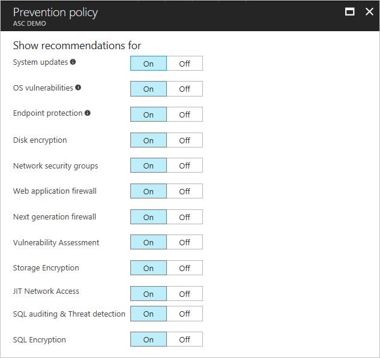
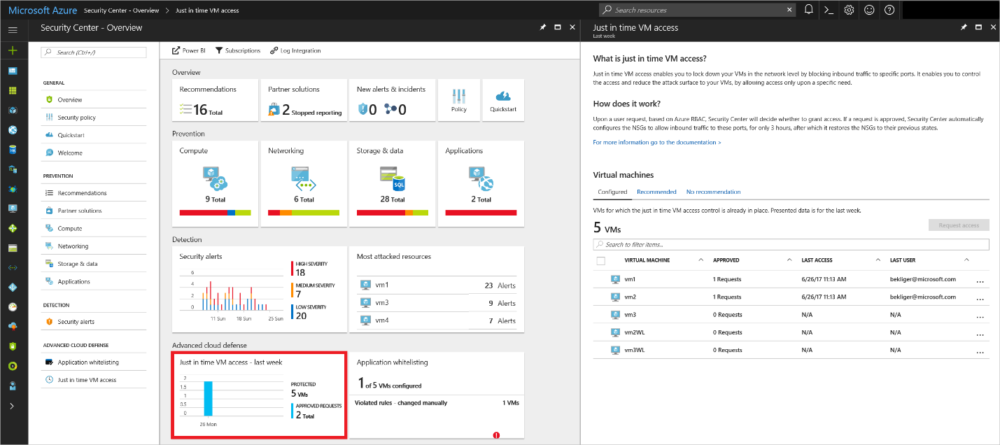
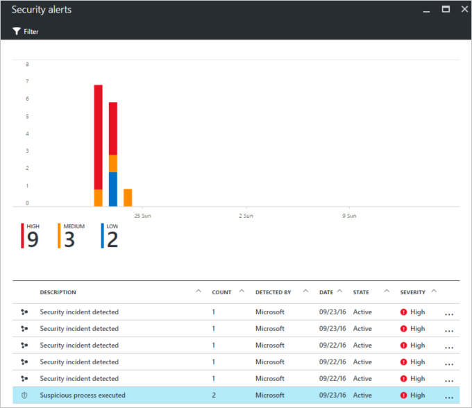

---
title: Protect personal data with Azure Security Center | Microsoft Docs
description: protect personal data using Azure security center
services: security
documentationcenter: na
author: Barclayn
manager: MBaldwin
editor: TomSh

ms.assetid: 
ms.service: security
ms.devlang: na
ms.topic: article
ms.tgt_pltfrm: na
ms.workload: na
ms.date: 08/24/2017
ms.author: barclayn
ms.custom: 

---
# Protect personal data from breaches and attacks: Azure Security Center

This article will help you understand how to use Azure Security Center to protect personal data from breaches and attacks.

## Scenario 

A large cruise company, headquartered in the United States, is expanding its operations to offer itineraries in the Mediterranean, and Baltic seas, as well as the British Isles. To help in those efforts, it has acquired several
smaller cruise lines based in Italy, Germany, Denmark, and the U.K.

The company uses Microsoft Azure to store corporate data in the cloud. This includes personal identifiable information such as names, addresses, phone
numbers, and credit card information. It also includes Human Resources information such as:

- Addresses
- Phone numbers
- Tax identification numbers
- Medical information

The cruise line also maintains a large database of reward and loyalty program members. Corporate employees access the network from the company’s remote offices and travel agents located around the world have access to some company resources.
Personal data travels across the network between these locations and the Microsoft data center.

## Problem statement

The company is concerned about the threat of attacks on their Azure resources. They want to prevent exposure of customers’ and employees’ personal data to unauthorized
persons. They want guidance on both prevention and response/remediation, as well as an effective way to monitor the ongoing security of their cloud resources.
They need a strong line of defense against today’s sophisticated and organized attackers.

## Company goal

One of the company’s goals is to ensure the privacy of customers’ and employees’ personal data by protecting it from threats. One of their goals is to respond immediately to signs
of breach to mitigate the impact. It requires a way to assess the current state of security, identify vulnerable configurations, and remediate them.

## Solutions

Microsoft Azure Security Center (ASC) provides an integrated security monitoring and policy management solution. It delivers easy-to-use and effective threat
prevention, detection, and response capabilities.

### Prevention

ASC helps you prevent breaches by enabling you to set security policies, provide just-in-time access, and implement security recommendations.

A security policy defines the set of controls recommended for resources within the specified subscription. Just in time access can be used to lock down inbound
traffic to your Azure VMs, reducing exposure to attacks. Security recommendations are created by ASC after analyzing the security state of your Azure resources.

#### How do I set security policies in ASC?

You can configure security policies for each subscription. To modify a security policy, you must be an owner or contributor of that subscription. In the Azure
portal, do the following:

1. Select **Policy** in the ASC dashboard.

2. Select the subscription on which you want to enable the policy.

3. Choose **Prevention policy** to configure policies per subscription. **Collect data from virtual machines** should be set to **On.**

4. In the **Prevention policy** options, select **On** to enable the security recommendations that are relevant for the subscription.

For more detailed instructions and an explanation of each of the policy recommendations that can be enabled, see [Set security policies in Azure Security Center](https://docs.microsoft.com/azure/security-center/security-center-policies#set-security-policies).

#### How do I configure Just in Time Access (JIT)?

When JIT is enabled, Security Center locks down inbound traffic to your Azure VMs by creating an NSG rule. You select the ports on the VM to which inbound traffic will be locked down. To use JIT access, do the following:

1. Select the **Just in time VM access tile** on the ASC blade.

2. Select the **Recommended** tab.

3. Under **VMs**, select the VMs that you want to enable. This puts a checkmark next to a VM. 
4. Select **Enable JIT** on VMs.
5. Select **Save**.

Then you can see the default ports that ASC recommends being enabled for JIT. You can also add and configure a new port on which you want to enable the just in time solution. The **Just in time VM access** tile in the Security Center shows the number of VMs configured for JIT access. It also shows the number of approved access requests made in the last week.

For instructions on how to do this, and additional information about Just in Time access, see [Manage virtual machine access using just in time.](https://docs.microsoft.com/azure/security-center/security-center-just-in-time)

#### How do I implement ASC security recommendations?

When Security Center identifies potential security vulnerabilities, it creates recommendations. The recommendations guide you through the process of
configuring the needed controls. 
1. Select the **Recommendations** tile on the ASC dashboard.

2. View the recommendations, which are shown in a table format where each line represents one recommendation.

3. To filter recommendations, select **Filter** and select the severity and state values you wish to see.

4. To dismiss a recommendation that is not applicable, you can right click and select **Dismiss.**

5. Evaluate which recommendation should be applied first.

6. Apply the recommendations in order of priority.

For a list of possible recommendations and walk-throughs on how to apply each, see [Managing security recommendations in Azure Security Center.](https://docs.microsoft.com/azure/security-center/security-center-recommendations)

### Detection and Response

Detection and response go together, as you want to respond as quickly as possible after a threat is detected.
ASC threat detection works by automatically collecting security information from your Azure resources, the network, and connected partner solutions. ASC can rapidly update its detection algorithms as attackers release new and increasingly sophisticated exploits. For more detailed information on how ASC’s threat detection works, see [Azure Security Center detection capabilities](https://docs.microsoft.com/azure/security-center/security-center-detection-capabilities).

#### How do I manage and respond to security alerts?

A list of prioritized security alerts is shown in Security Center along with the information you need to quickly investigate the problem. Security Center also includes recommendations for how to remediate an attack. To manage your security alerts, do the following:

1. Select the **Security alerts** tile in the ASC dashboard. This shows details for each alert.

2. To filter alerts based on date, state, and severity, select **Filter** and then select the values you want to see.

3. To respond to an alert, select it and review the information, then select the resource that was attacked.

4. In the **Description** field, you’ll see details, including recommended remediation.

For more detailed instructions on responding to security alerts, see [Managing and responding to security alerts in Azure Security Center.](https://docs.microsoft.com/azure/security-center/security-center-managing-and-responding-alerts)

For further help in investigating security alerts, the company can integrate ASC alerts with its own SIEM solution, using [Azure Log Integration](https://aka.ms/AzLog).

#### How do I manage security incidents?

In ASC, a security incident is an aggregation of all alerts for a resource that align with kill chain patterns. An Incident will reveal the list of related alerts, which enables you to obtain more information about each occurrence. Incidents appear in the Security Alerts tile and blade.

To review and manage security incidents, do the following:

1. Select the **Security alerts** tile. if a security incident is detected, it will appear under the security alerts graph. It will have an icon that’s
   different from other alerts.

2. Select the incident to see more details about this security incident. Additional details include its full description, its severity, its current state, the attacked resource, the remediation steps for the incident, and the alerts that were included in this incident.

You can filter to see **incidents only**, **alerts only**, or **both**.

#### How do I access the Threat Intelligence Report?

ASC analyzes information from multiple sources to identify threats. To assist incident response teams investigate and remediate threats, Security Center
includes a threat intelligence report that contains information about the threat that was detected.

Security Center has three types of threat reports, which can vary per attack.
The reports available are:

- Activity Group Report: provides deep dives into attackers, their objectives and tactics.

- Campaign Report: focuses on details of specific attack campaigns.

- Threat Summary Report: covers all items in the previous two reports.

This type of information is very useful during the incident response process, where there is an ongoing investigation to understand the source of the attack, the attacker’s motivations, and what to do to mitigate this issue moving forward.

1. To access the threat intelligence report, do the following:

2. Select the **Security alerts** tile on the ASC dashboard.

3. Select the security alert for which you want to obtain more information.

4. In the **Reports** field, click the link to the threat intelligence report.

5. This will open the PDF file, which you can download.

For additional information about the ASC threat intelligence report, see [Azure Security Center Threat Intelligence Report.](https://docs.microsoft.com/azure/security-center/security-center-threat-report)

### Assessment

To help with testing, assessment and evaluation of your security posture, ASC provides for integrated vulnerability assessment with Qualys cloud agents, as a part of its virtual machine recommendations component.

The Qualys agent reports vulnerability data to the Qualys management platform, which then sends vulnerability and health monitoring data back to ASC. The recommendation to add a vulnerability assessment solution is displayed in the **Recommendations** blade on the ASC dashboard.

After the vulnerability assessment solution is installed on the target VM, Security Center scans the VM to detect and identify system and application
vulnerabilities. Detected issues are shown under the **Virtual Machines Recommendations** option.

#### How do I implement a vulnerability assessment solution? 

If a Virtual Machine does not have an integrated vulnerability assessment solution already deployed, Security Center recommends that it be installed.

1. In the ASC dashboard, on the **Recommendations** blade, select **Add a vulnerability assessment solution.**

2. Select the VMs where you want to install the vulnerability assessment solution.

3. Click on **Install on [number of] VMs.**

4. Select a partner solution in the Azure Marketplace, or under **Use existing solution,** select **Qualys.**

5. You can turn the auto update settings on or off in the **Partner Solutions** blade.

For further instructions on how to implement a vulnerability assessment solution, see [Vulnerability Assessment in Azure Security Center.](https://docs.microsoft.com/azure/security-center/security-center-vulnerability-assessment-recommendations)

## Next steps

- [Azure Security Center quick start guide](https://docs.microsoft.com/azure/security-center/security-center-get-started)

- [Introduction to Azure Security Center](https://docs.microsoft.com/azure/security-center/security-center-intro)

- [Integrating Azure Security Center alerts with Azure log integration](https://docs.microsoft.com/azure/security-center/security-center-integrating-alerts-with-log-integration)

- [Boost Azure Security Center with Integrated Vulnerability Assessment](https://blogs.msdn.microsoft.com/azuresecurity/2016/12/16/boost-azure-security-center-with-integrated-vulnerability-assessment/)
