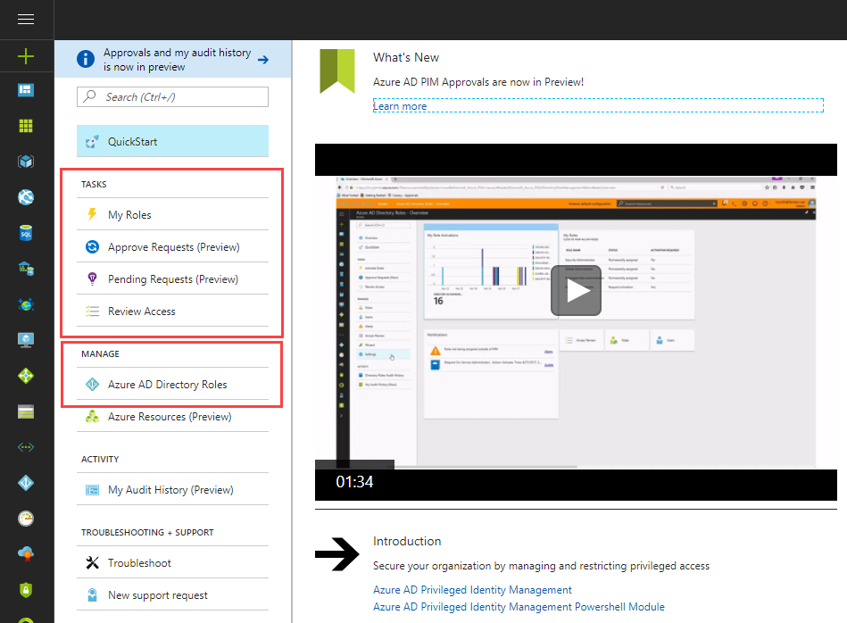

---
title: Protect personal data with Azure identity and access controls | Microsoft Docs
description: Using Azure identity and access controls to help you protect your personal data
services: security
documentationcenter: na
author: Barclayn
manager: MBaldwin
editor: TomSh

ms.assetid: 
ms.service: security
ms.devlang: na
ms.topic: article
ms.tgt_pltfrm: na
ms.workload: na
ms.date: 08/22/2017
ms.author: barclayn
ms.custom: 

---
# Azure Active Directory and Multi-Factor Authentication: Protect personal data with identity and access controls

This article provides information and procedures you can use to protect personal data using Azure Active Directory and Multi-factor authentication security features and services.

## Scenario

A large cruise company, headquartered in the United States, is expanding its operations to offer itineraries in the Mediterranean, Adriatic, and Baltic seas, as well as the British Isles. To support those efforts, it has acquired several smaller cruise lines based in Italy, Germany, Denmark and the U.K. 

The company uses Microsoft Azure to store corporate data in the cloud. This includes personal identifiable information such as names, addresses, phone numbers, and credit card information of its global customer base. It also includes traditional Human Resources information such as addresses, phone numbers, tax identification numbers and other information about company employees in all locations. The cruise line also maintains a large database of reward and loyalty program members that includes personal information to track relationships with current and past customers.

Corporate employees access the network from the company’s remote offices and travel agents located around the world have access to some company resources.

## Problem statement

The company must protect the privacy of customers’ and employees’ personal data
from attackers seeking to use compromised identities to gain access. They also
must ensure that access to personal data by legitimate users is restricted to
only those who need it to do their jobs.

## Company goal

The company’s goal is to ensure that access to personal data is strictly controlled. It is essential that identities of users with access to personal data be protected by strong authentication. A policy of [least privilege] (https://en.wikipedia.org/wiki/Principle_of_least_privilege) must be enforced so that legitimate users have only the level of  access they need, and no more.

## Solutions

Microsoft Azure provides identity and access management tools to help companies
control who has access to resources that contain personal data.

### Azure Active Directory

[Azure Active Directory](https://docs.microsoft.com/azure/active-directory/) (AAD) manages identities and controls access to Azure as well as other on-premises and other cloud resources, data, and applications. [Azure Active Directory Privileged Identity Management](https://docs.microsoft.com/azure/active-directory/privileged-identity-management/active-directory-securing-privileged-access)
helps Azure administrators to minimize the number of people who have access to certain information such as personal data. It enables them to discover, restrict, and monitor privileged identities and their access to resources, and to assign temporary, Just-In-Time (JIT) administrative rights to eligible users. It also provides insight into those who have AAD administrative privileges.

The activities involved in using AAD PIM include:

- Enabling Privileged Identity Management for your directory

- Using Privileged Identity Management admin dashboard to see important information at a glance

- Managing the privileged identities (administrators) by adding or removing permanent or eligible administrators to each role

- Configuring the role activation settings

- Activating roles

- Reviewing role activity

#### How do I enable AAD PIM?

To start using PIM for your directory, do the following:

1. Sign in to the Azure portal as a global administrator of your directory.

2. If your organization has more than one directory, select your username in the upper right-hand corner of the Azure portal. Select the directory where you will use Azure AD Privileged Identity Management.

3. Select **More services** and use the **Filter** textbox to search for Azure AD Privileged Identity Management.

4. Check **Pin to dashboard** and then click **Create**. The Privileged Identity Management application opens.

Once Azure AD Privileged Identity Management is set up, you see the navigation blade whenever you open the application.

For more information and instructions on getting started with AAD PIM, see [Start Using Azure AD Privileged Identity Management.](https://docs.microsoft.com/active-directory/active-directory-privileged-identity-management-getting-started)

### Azure Role-based Access Control

[Azure Role-Based Access Control](https://docs.microsoft.com/azure/active-directory/role-based-access-control-configure)
(RBAC) helps Azure administrators manage access to Azure resources by enabling the granting of access based on the user’s assigned role. You can segregate duties within a team and grant only the amount of access to users, groups and applications that they need to perform their jobs.

Role-based access can be granted to users using the Azure portal, Azure Command-Line tools or Azure Management APIs.

For more information about Azure RBAC basics, see [Get started with Role-Based Access Control in the Azure Portal.](https://docs.microsoft.com/active-directory/role-based-access-control-what-is)

#### How do I manage Azure RBAC with PowerShell?

You can use PowerShell cmdlets to manage Azure RBAC, including the following management tasks:

- List roles

- See who has access

- Grant access

- Remove access

- Create a custom role

- Get Actions for a Resource Provider

- Modify a custom role

- Delete a custom role

- List custom roles

For instructions on how to manage Azure RBAC with PowerShell, see [Manage Role-based Access with Azure PowerShell](https://docs.microsoft.com/azure/active-directory/role-based-access-control-manage-access-powershell).

### Azure Multi-Factor Authentication

[Azure Multi-Factor Authentication](https://docs.microsoft.com/azure/multi-factor-authentication/)
(MFA) is a two-step verification solution that helps safeguard access to data and applications, while meeting user demand for a simple sign-in process. It delivers strong authentication via a range of verification methods, including phone call, text message, or mobile app verification.

To deploy MFA in the Azure cloud, you need to first enable it and then turn on two-step verification for users.

#### How do I enable Azure to use MFA?

If your users have licenses that include Azure Multi-Factor Authentication, there's nothing that you need to do to turn on Azure MFA. If not, you need to create a Multi-Factor Auth provider in your directory. To do this, follow these
steps:

1. Select **Active Directory** in the Azure classic portal (logged on as an administrator).

2. Select **Multi-Factor Authentication Providers.**

3. Select **New,** and then under **App Services,** select **Multi-Factor Auth Provider.**

4. Select **Quick Create.**

5. Fill in the name field and select a usage model (per authentication or per enabled user).

6. Designate a directory with which the MFA Provider is associated.

7. Click the **Create** button.

For more instructions on how to manage your Multi-Factor Auth Provider, see [Getting Started with an Azure Multi-Factor Auth
Provider.](https://docs.microsoft.com/azure/multi-factor-authentication/multi-factor-authentication-get-started-auth-provider)

#### How do I turn on two-step verification for users?

You can enforce two-step verification for all sign-ins, or you can create conditional access policies to require two-step verification only when specific conditions apply.

Enabling Azure MFA by changing user states is the traditional approach for requiring two-step verification. All the users that you enable will have the same requirement to perform two-step verification every time they sign in. Enabling a user overrides any conditional access policies that may affect that user.

Enabling Azure MFA with a conditional access policy is a more flexible approach for requiring two-step verification. You can create conditional access policies that apply to groups as well as individual users. High-risk groups can be given more restrictions than low-risk groups, or two-step verification can be required only for high-risk cloud apps and skipped for low-risk ones. However, conditional access is a paid feature of Azure Active Directory.

To enable MFA by changing user state, do the following:

1. Sign in to the Azure portal as an administrator.
2. Go to **Azure Active Directory \> Users and groups \> All users**.
3. Select **Multi-Factor Authentication**.
4. Find the user that you want to enable for Azure MFA. You may need to change the view at the top.
5. Check the box next to the user’s name.
6. On the right, under quick steps, choose **Enable**.

   

7. Confirm your selection in the pop-up window that opens.  Users for whom MFA has been enabled will be asked to register the next time they sign in.

To enable Azure MFA with a conditional access policy, do the following:

1. Sign in to the Azure portal as an administrator.

2. Go to **Azure Active Directory \> Conditional access**.

3. Select **New policy**.

4. Under **Assignments**, select **Users and groups**. Use the **Include** and     **Exclude** tabs to specify which users and groups will be managed by the policy.

5. Under **Assignments**, select **Cloud apps.** Choose to **include All cloud apps**.
6.  Under **Access controls**, select **Grant**. Choose **Require multi-factor authentication**.
7.  Turn **Enable policy** to **On** and then select **Save**.

For information on how to configure Azure MFA settings to set up fraud alerts, create a one-time bypass, use custom voice messages, configure caching, specify trusted IPs, create app passwords, enable remembering MFA for devices that users trust, and select verification methods, see [Configure Azure Multi-Factor Authentication Settings.](https://docs.microsoft.com/azure/multi-factor-authentication/multi-factor-authentication-whats-next)

## Next steps

- [Securing privileged access in Azure AD](https://docs.microsoft.com/azure/active-directory/privileged-identity-management/active-directory-securing-privileged-access)

- [Frequently asked questions about Azure Multi-Factor Authentication](https://docs.microsoft.com/azure/multi-factor-authentication/multi-factor-authentication-faq)

- [Role-based Access Control troubleshooting](https://docs.microsoft.com/azure/active-directory/role-based-access-control-troubleshooting)

- [Azure Active Directory Identity Protection](https://docs.microsoft.com/azure/active-directory/active-directory-identityprotection)
