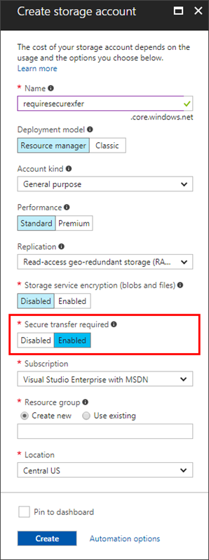
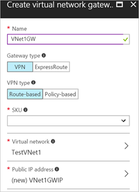
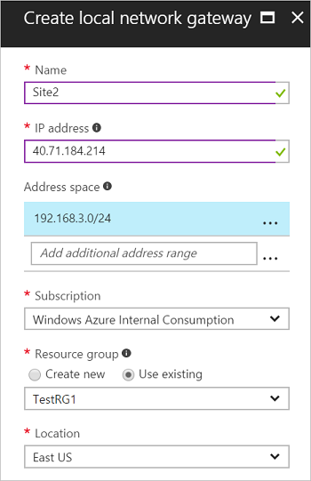

---
title: Protect personal data in transit with encryption in Azure | Microsoft Docs
description: Using encryption in Azure to protect personal data
services: security
documentationcenter: na
author: Barclayn
manager: MBaldwin
editor: TomSh

ms.assetid: 
ms.service: security
ms.devlang: na
ms.topic: article
ms.tgt_pltfrm: na
ms.workload: na
ms.date: 08/22/2017
ms.author: barclayn
ms.custom: 

---
# Azure encryption technologies: Protect personal data in transit with encryption

This article will help you understand and use Azure encryption technologies to secure data in transit. 

Protecting the privacy of personal data as it travels across the network is an essential part of a multi-layered defense-in-depth security strategy. Encryption in transit is designed to prevent an attacker who intercepts transmissions from being able to view or use the data.

## Scenario

A large cruise company, headquartered in the United States, is expanding its operations to offer itineraries in the Mediterranean, Adriatic, and Baltic seas, as well as the British Isles. To support those efforts, it has acquired several smaller cruise lines based in Italy, Germany, Denmark and the U.K. 

The company uses Microsoft Azure to store corporate data in the cloud. This includes personal identifiable information such as names, addresses, phone numbers, and credit card information of its global customer base. It also includes traditional Human Resource information such as addresses, phone numbers, tax identification numbers and other information about company employees in all locations. The cruise line also maintains a large database of reward and loyalty program members that includes personal information to track relationships with current and past customers.

Personal data of customers is entered in the database from the company’s remote offices and from travel agents located around the world. Documents containing customer information are transferred across the network to Azure storage.

## Problem statement

The company must protect the privacy of customers’ and employees’ personal data while it is in transit to and from Azure services.

## Company goal

The company goal to ensure that personal data is encrypted when off disk. If unauthorized persons intercept the off-disk personal data, it must be in a form that will render it unreadable. Applying encryption should be easy, or completely transparent, for users and administrators.

## Solutions

Azure services provide multiple tools and technologies to help you protect personal data in transit.

### Azure Storage

Data that is stored in the cloud must travel from the client, which can be physically located anywhere in the world, to the Azure data center. When that data is retrieved by users, it travels again, in the opposite direction. Data that is in transit over the public Internet is always at risk of interception by attackers. It is important to protect the privacy of personal data by using transport-level encryption to secure it as it moves between locations.

The HTTPS protocol provides a secure, encrypted communications channel over the Internet. HTTPS should be used to access objects in Azure Storage and when calling REST APIs. You enforce use of the HTTPS protocol when using [Shared Access Signatures](https://docs.microsoft.com/azure/storage/storage-dotnet-shared-access-signature-part-1) (SAS) to delegate access to Azure Storage objects. There are two types of SAS: Service SAS and Account SAS.

#### How do I construct a Service SAS?

A Service SAS delegates access to a resource in just one of the storage services (blob, queue, table or file service). To construct a Service SAS, do the following:

1. Specify the Signed Version Field

2. Specify the Signed Resource (Blob and File Service Only)

3. Specify Query Parameters to Override Response Headers (Blob Service and File Service Only)

4. Specify the Table Name (Table Service Only)

5. Specify the Access Policy

6. Specify the Signature Validity Interval

8. Specify Permissions

9. Specify IP Address or IP Range

10. Specify the HTTP Protocol

11. Specify Table Access Ranges

12. Specify the Signed Identifier

13. Specify the Signature

For more detailed instructions, see [Constructing a Service SAS](https://docs.microsoft.com/rest/api/storageservices/Constructing-a-Service-SAS?redirectedfrom=MSDN).

#### How do I construct an Account SAS?

An Account SAS delegates access to resources in one or more of the storage services. You can also delegate access to read, write, and delete operations on blob containers, tables, queues, and file shares that are not permitted with a service SAS. Construction of an Account SAS is similar to that of a Service SAS. For detailed instructions, see [Constructing an Account SAS.](https://docs.microsoft.com/rest/api/storageservices/Constructing-an-Account-SAS?redirectedfrom=MSDN)

#### How do I enforce HTTPS when calling REST APIs?

To enforce the use of HTTPS when calling REST APIs to access objects in storage accounts, you can enable Secure Transfer Required for the storage account. 

1. In the Azure portal, select **Create Storage Account**, or for an existing storage account, select **Settings** and then **Configuration**.

2. Under **Secure Transfer Required**, select **Enabled**.

For more detailed instructions, including how to enable Secure Transfer Required programmatically, see [Require Secure Transfer](https://docs.microsoft.com/azure/storage/storage-require-secure-transfer).

#### How do I encrypt data in Azure File Storage?

To encrypt data in transit with [Azure File Storage](https://docs.microsoft.com/azure/storage/storage-file-how-to-use-files-portal), you can use SMB 3.x with Windows 8, 8.1, and 10 and with Windows Server 2012 R2 and Windows Server 2016. When you are using the Azure Files service, any connection without encryption fails when "Secure transfer required" is enabled. This includes scenarios using SMB 2.1, SMB 3.0 without encryption, and some flavors of the Linux SMB client.

#### Azure Client-Side Encryption

Another option for protecting personal data while it’s being transferred between a client application and Azure Storage is [Client-side Encryption](https://docs.microsoft.com/azure/storage/storage-client-side-encryption). The data is encrypted before being transferred into Azure Storage and when you retrieve the data from Azure Storage, the data is decrypted after it is received
on the client side.

### Azure Site-to-Site VPN

An effective way to protect personal data in transit between a corporate network or user and the Azure virtual network is to use a [site-to-site](https://docs.microsoft.com/azure/vpn-gateway/vpn-gateway-howto-site-to-site-resource-manager-portal) or [point-to-site](https://docs.microsoft.com/azure/vpn-gateway/vpn-gateway-howto-point-to-site-resource-manager-portal) Virtual Private Network (VPN). A VPN connection creates a secure encrypted tunnel across the Internet.

#### How do I create a site-to-site VPN connection?

A site-to-site VPN connects multiple users on the corporate network to Azure. To create a site-to-site connection in the Azure portal, do the following:

1. Create a virtual network.

2. Specify a DNS server.

3. Create the gateway subnet.

4. Create the VPN gateway. 

    

5. Create the local network gateway.

    

6. Configure your VPN device.

7. Create the VPN connection.

    

8. Verify the VPN connection.

For more detailed instructions on how to create a site-to-site connection in the Azure portal, see [Create a Site-to-Site  connection in the Azure Portal.] (https://docs.microsoft.com/azure/vpn-gateway/vpn-gateway-howto-site-to-site-resource-manager-portal)

#### How do I create a point-to-site VPN connection?

A Point-to-Site VPN creates a secure connection from an individual client computer to a virtual network. This is useful when you  want to connect to Azure from a remote location, such as from home or a hotel or conference center. To create a point-to-site  connection in the Azure portal,

1. Create a virtual network.

2. Add a gateway subnet.

3. Specify a DNS server. (optional)

4. Create a virtual network gateway.

5. Generate certificates.

6. Add the client address pool.

7. Upload the root certificate public certificate data.

8. Generate and install the VPN client configuration package.

9. Install an exported client certificate.

10. Connect to Azure.

11. Verify your connection.

For more detailed instructions, see [Configure a Point-to-Site connection to a VNet using certificate authentication: Azure Portal.](https://docs.microsoft.com/azure/vpn-gateway/vpn-gateway-howto-point-to-site-resource-manager-portal)

### SSL/TLS

Microsoft recommends that you always use SSL/TLS protocols to exchange data across different locations. Organizations that choose to use [ExpressRoute](https://docs.microsoft.com/azure/expressroute/) to move large data sets over a dedicated high-speed WAN link can also encrypt the data at the application-level using SSL/TLS or other protocols for added protection.

### Encryption by default

Microsoft uses encryption to protect data in transit between customers and Azure cloud services. If you are interacting with Azure Storage through the Azure Portal, all transactions occur via HTTPS.

[Transport Layer Security](https://en.wikipedia.org/wiki/Transport_Layer_Security) (TLS) is the protocol that Microsoft data centers will attempt to negotiate with client systems that connect to Microsoft cloud services. TLS provides strong authentication, message privacy, and integrity (enables detection of message tampering, interception, and forgery), interoperability, algorithm flexibility, ease of deployment and use.

[Perfect Forward Secrecy](https://en.wikipedia.org/wiki/Forward_secrecy) (PFS) is also employed so that each connection between customers’ client systems and Microsoft’s cloud services use unique keys. Connections to Microsoft cloud services also take advantage of RSA based 2,048-bit encryption key lengths. The combination of TLS, RSA 2,048-bit key lengths, and PFS makes it much  more difficult for someone to intercept and access data that is in transit between Microsoft cloud services and customers.

Data in transit is always encrypted in [Data Lake Store] (https://docs.microsoft.com/azure/data-lake-store/data-lake-store-security-overview). In addition to encrypting data prior to storing to persistent media, the data is also always secured in transit by using HTTPS. HTTPS is the only protocol that
is supported for the Data Lake Store REST interfaces.

## Summary

The company can accomplish its goal of protecting personal data and the privacy of such data by enforcing HTTPS connections to Azure Storage, using Shared Access Signatures and enabling Secure Transfer Required on the storage accounts. They can also protect personal data by using SMB 3.0 connections and implementing client-side encryption. Site-to-site VPN connections from the corporate network to the Azure virtual network and point-to-site VPN connections from individual users will create a secure tunnel through which personal data can securely travel. Microsoft’s default encryption practices will further protect the privacy of personal data.

## Next steps

- [Azure Data Security and Encryption Best Practices](https://docs.microsoft.com/azure/security/azure-security-data-encryption-best-practices)

- [Planning and design for VPN Gateway](https://docs.microsoft.com/azure/vpn-gateway/vpn-gateway-plan-design)

- [VPN Gateway FAQ](https://docs.microsoft.com/azure/vpn-gateway/vpn-gateway-vpn-faq)

- [Buy and configure an SSL Certificate for your Azure App Service](https://docs.microsoft.com/azure/app-service-web/web-sites-purchase-ssl-web-site)
