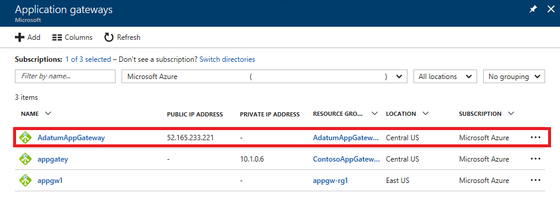

---
title: Protect personal data with Azure network security features | Microsoft Docs
description: Protect personal data using Azure network security features
services: security
documentationcenter: na
author: Barclayn
manager: MBaldwin
editor: TomSh

ms.assetid: 
ms.service: security
ms.devlang: na
ms.topic: article
ms.tgt_pltfrm: na
ms.workload: na
ms.date: 08/22/2017
ms.author: barclayn
ms.custom: 

---
# Protect personal data with network security features: Azure Application Gateway and Network Security Groups

This article provides information and procedures that will help you use Azure Application Gateway and Network Security Groups to protect personal data.

An important element in a multi-layered security strategy to protect the privacy of personal data is a defense against common vulnerability exploits such as SQL injection or cross-site scripting. Keeping unwanted network traffic out of your Azure virtual network helps protect against potential compromise of sensitive data, and Microsoft Azure gives you tools to help protect your data against attackers.

## Scenario

A large cruise company, headquartered in the United States, is expanding its operations to offer itineraries in the Mediterranean, Adriatic, and Baltic seas, as well as the British Isles. In furtherance of those efforts, it has acquired several smaller cruise lines based in Italy, Germany, Denmark and the U.K.

The company uses Microsoft Azure to store corporate data in the cloud and run applications on virtual machines that process and access this data. This data includes personal identifiable information such as names, addresses, phone numbers, and credit card information of its global customer base. It also includes traditional Human Resources information such as addresses, phone numbers, tax identification numbers and other information about company
employees in all locations. The cruise line also maintains a large database of reward and loyalty program members that includes personal information to track relationships with current and past customers.

Corporate employees access the network from the company’s remote offices and travel agents located around the world have access to some company resources and use web-based applications hosted in Azure VMs to interact with it.

## Problem statement

The company must protect the privacy of customers’ and employees’ personal data
from attackers who exploit software vulnerabilities to run malicious code that
could expose personal data stored or used by the company’s cloud-based
applications.

## Company goal

The company’s goal to ensure that unauthorized persons cannot access corporate Azure Virtual Networks and the applications and data that reside there by
exploiting common vulnerabilities. 

## Solutions

Microsoft Azure provides security mechanisms to help prevent unwanted traffic from entering Azure Virtual Networks. Control of inbound and outbound traffic is traditionally performed by firewalls. In Azure, you can use the Application Gateway with the Web Application Firewall and Network Security Groups (NSG), which act as a simple distributed firewall. These tools enable you to detect and block unwanted network traffic.

### Application Gateway/Web Application Firewall

The [Web Application Firewall](https://docs.microsoft.com/azure/application-gateway/application-gateway-web-application-firewall-overview)
(WAF) component of the [Azure Application Gateway](https://docs.microsoft.com/azure/application-gateway/application-gateway-introduction)
protects web applications, which are increasingly targets of malicious attacks that exploit common known vulnerabilities. A centralized WAF both protects against web attacks and simplifies security management without requiring any application changes.

Azure WAF addresses various attack categories including SQL injection, cross site scripting, HTTP protocol violations and anomalies, bots, crawlers,
scanners, common application misconfigurations, HTTP Denial of Service, and other common attacks such as command injection, HTTP request smuggling, HTTP
response splitting, and remote file inclusion attacks. 

You can create an application gateway with WAF, or add WAF to an existing application gateway. In either case, Azure Application Gateway requires its own subnet.

#### How do I create an application gateway with WAF? 

To create a new application gateway with WAF enabled, do the following:

1. Log in to the Azure portal and in the **Favorites** pane of the portal, click **New**

2. In the **New** blade, click **Networking**.

3. Click **Application Gateway**.

4. Navigate to the Azure portal, **click New \> Networking \> Application Gateway.**

   

5. In the **Basics** blade that appears, enter the values for the following fields: Name, Tier (Standard or WAF), SKU size (Small, Medium, or Large),
    Instance count (2 for high availability), Subscription, Resource group, and Location.

6. In the **Settings** blade that appears under **Virtual network**, click **Choose a virtual network**. This step opens enter the Choose virtual
    network blade.

7. Click **Create new** to open the **Create virtual network** blade.

8. Enter the following values: Name, Address space, Subnet name, Subnet address range. Click **OK**.

9. On the **Settings** blade under **Frontend IP configuration**, choose the IP address type.

10. Click **Choose a public IP address,** then **Create new.**

11. Accept the default value, and click **OK.**

12. On the **Settings** blade under **Listener configuration**, select to use HTTP or HTTPS under **Protocol**. To use HTTPS, a certificate is required.

13. Configure the WAF specific settings: **Firewall status** (**Enabled**) and **Firewall mode** (**Prevention**). If you choose **Detection** as the mode, traffic is only logged.

14. Review the **Summary** page and click **OK**. Now the application gateway is queued up and created.

After the application gateway has been created, you can navigate to it in the portal and continue configuration of the application gateway.

#### How do I add WAF to an existing application?

To update an existing application gateway to support WAF in prevention mode, do the following:

1. In the Azure portal **Favorites** pane, click **All resources**.

2. Click the existing Application Gateway in the **All resources** blade. 
>[!NOTE]
Note: If the subscription you selected already has several resources in it, you can enter the name in the Filter by name… box to easily access the DNS zone.
3. Click **Web application firewall** and update the application gateway settings: **Upgrade to WAF Tier** (checked), **Firewall status** (enabled),     **Firewall mode** (Prevention). You also need to configure the rule set, and configure disabled rules.

For more detailed information on how to create a new application gateway with WAF and how to add WAF to an existing application gateway, see [Create an application gateway with web application firewall by using the portal.](https://docs.microsoft.com/azure/application-gateway/application-gateway-web-application-firewall-portal)

### Network Security Groups

A [network security group](https://docs.microsoft.com/azure/virtual-network/virtual-networks-nsg) (NSG) contains a list of security rules that allow or deny network traffic to resources connected to [Azure Virtual Networks](https://docs.microsoft.com/azure/virtual-network/) (VNet). NSGs can be associated to subnets or individual VMs. When an NSG is associated to a subnet, the rules apply to all resources connected to the subnet. Traffic can further be restricted by also associating an NSG to a VM or NIC.

NSGs contain four properties: Name, Region, Resource group, and Rules.
>[!Note]
Although an NSG exists in a resource group, it can be associated to resources in any resource group, as long as the resource is part of the same Azure region as the NSG.

NSG rules contain nine properties: Name, Protocol (TCP, UDP, or \*, which includes ICMP as well as UDP and TCP), Source port range, Destination port
range, Source address prefix, Destination address prefix, Direction (inbound or outbound), Priority (between 100 and 4096) and Access type (allow or deny). All NSGs contain a set of default rules that can be deleted, or overridden by the rules you create.

#### How do I implement NSGs?

Implementing NSGs requires planning, and there are several design considerations you need to take into account. These include limits on the number of NSGs per subscription and rules per NSG; VNet and subnet design, special rules, ICMP traffic, isolation of tiers with subnets, load balancers, and more.

For more guidance in planning and implementing NSGs, and a sample deployment scenario, see [Filter network traffic with network security groups.](https://docs.microsoft.com/azure/virtual-network/virtual-networks-nsg)

#### How do I create rules in an NSG?

To create inbound rules in an existing NSG, do the following:

1. Click **Browse**, and then **Network security groups**.

2. In the list of NSGs, click **NSG-FrontEnd**, and then **Inbound security rules.**

3. In the list of Inbound security rules, click **Add.**

4. Enter the values in the following fields: Name, Priority, Source, Protocol, Source range, Destination, Destination port range, and Action.

The new rule will appear in the NSG after a few seconds.

For more instructions on how to create NSGs in subnets, create rules, and associate an NSG with a front-end and back-end subnet, see [Create network
security groups using the Azure portal.](https://docs.microsoft.com/azure/virtual-network/virtual-networks-create-nsg-arm-pportal)

## Next steps

[Azure Network Security](https://azure.microsoft.com/blog/azure-network-security/)

[Azure Network Security Best Practices](https://docs.microsoft.com/azure/security/azure-security-network-security-best-practices)

[Get information about a network security group](https://docs.microsoft.com/rest/api/network/virtualnetwork/get-information-about-a-network-security-group)

[Web application firewall (WAF)](https://docs.microsoft.com/azure/application-gateway/application-gateway-web-application-firewall-overview)
