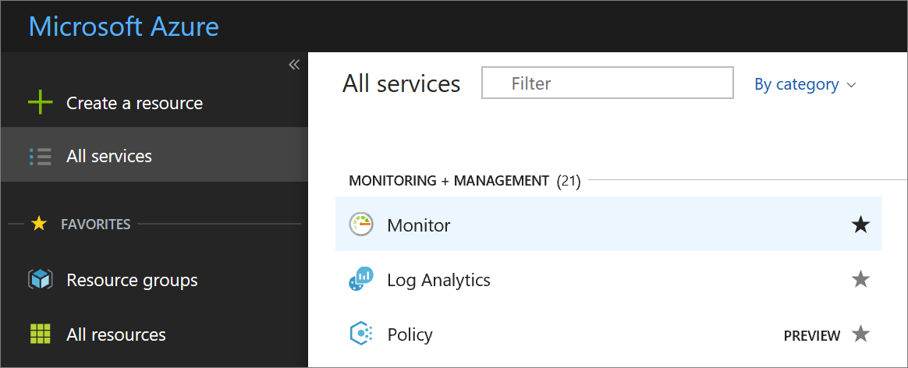
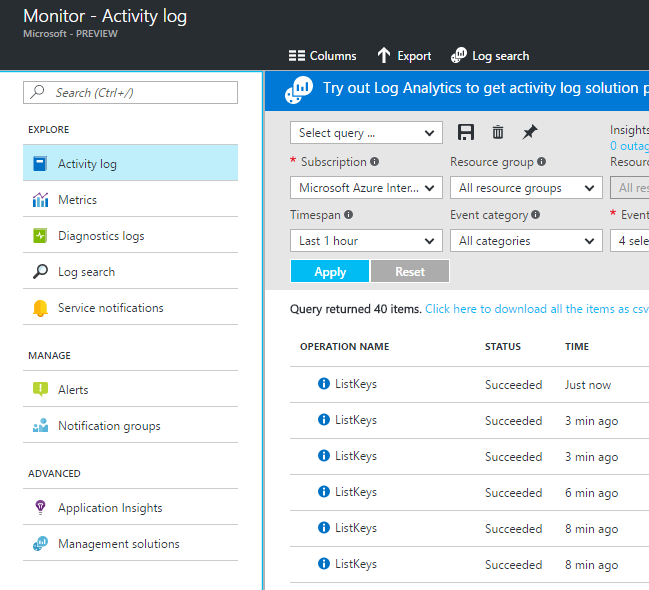
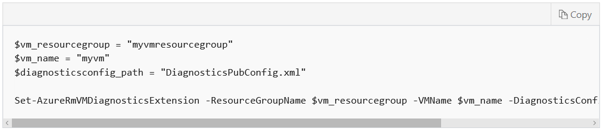
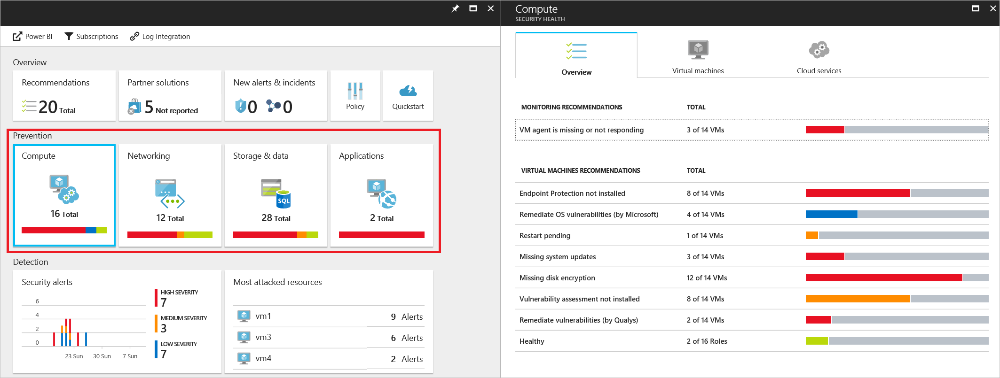

# Document protection of personal data with Azure reporting tools

This article will discuss how to use Azure reporting services and technologies to help protect privacy of personal data.

## Scenario

A large cruise company, headquartered in the United States, is expanding its operations to offer itineraries in the Mediterranean, Adriatic, and Baltic seas, as well as the British Isles. To help these efforts, it has acquired several smaller cruise lines based in Italy, Germany, Denmark and the U.K.

The company uses Microsoft Azure for processing and storage of corporate data. This includes personal identifiable information such as names, addresses, phone numbers, and credit card information of its global customer base. It also includes traditional Human Resources information such as addresses, phone numbers, tax identification numbers and other information about company employees in all locations. The cruise line also maintains a large database of reward and loyalty program members that includes personal information to track relationships with current and past customers.

Corporate employees access the network from the company’s remote offices and travel agents located around the world have access to some company resources.

## Problem statement

The company must protect the privacy of customers' and employees’ and personal data through a multi-layered security strategy that uses Azure management and security features to impose strict controls on access to and processing of personal data, and must be able to demonstrate its protective measures to internal and external auditors.

## Company goal

As part of its defense-in-depth security strategy, it is a company goal to track all access to and processing of personal data, and ensure that documentation of adequate privacy protections for personal data are in place and working.

## Solutions

Microsoft Azure provides comprehensive monitoring, logging, and diagnostics tools to help track and record activities and events associated with accessing and processing personal data, geographic flow of data, and third-party access to personal data. Because security of personal data in the cloud is a shared responsibility, Microsoft also provides customers with:

- Detailed information about its own processing of customers’ data

- Security measures administered by Microsoft

- Where and how it sends customers’ data

- Details of Microsoft’s own privacy reviews process

### Azure Active Directory

[Azure Active Directory](https://azure.microsoft.com/services/active-directory/) is Microsoft’s cloud-based, multi-tenant directory and identity management service. The service’s sign-in and audit reporting capabilities provide you with detailed sign-in and application usage activity information to help you monitor and ensure proper access to customers’ and employees’ personal data.

There are two types of activity reports:

- The [audit activity reports/logs](https://docs.microsoft.com/azure/active-directory/active-directory-reporting-activity-audit-logs) provide a detailed record of system activities/tasks

- The [sign-ins activity report/log](https://docs.microsoft.com/azure/active-directory/active-directory-reporting-activity-sign-ins) shows you who has performed each activity listed in the audit report

Using the two together, you can track the history of every task performed and who performed each. Both types of reports are customizable and can be filtered.

#### How do I access the audit and security logs?

The audit and security logs can be accessed from the Active Directory portal in three different ways: through the **Activity** section (select either **Audit logs** or **Sign-ins**), or from **Users and groups** or **Enterprise applications** under **Manage** in Active Directory. Reports can also be accessed through the Azure Active Directory reporting API. 

1. In the Azure portal, select **Azure Active Directory.**

2. In the **Activity** section, select **Audit logs.**

    

3. Customize the list view by clicking **Columns** in the toolbar.

4.  Select an item in the list view to see all available details about it.

    

Azure Active Directory reporting also includes two types of security reports, **users flagged for risk** and **risky sign-ins**, which can help you monitor potential risks in your Azure environment.

For more information about the reporting service, see [Azure Active Directory reporting](https://docs.microsoft.com/azure/active-directory/active-directory-reporting-azure-portal)

Visit [Azure Active Directory activity reports](https://docs.microsoft.com/azure/active-directory/active-directory-reporting-azure-portal#activity-reports) for more specifics about the reports available in Azure Active Directory. This site includes more details about how to access and use [audit logs activity reports](https://docs.microsoft.com/azure/active-directory/active-directory-reporting-activity-audit-logs) and [sign-in activity reports](https://docs.microsoft.com/azure/active-directory/active-directory-reporting-activity-sign-ins) in the portal. It also includes information about [users flagged for risk](https://docs.microsoft.com/azure/active-directory/active-directory-reporting-security-user-at-risk)
and [risky sign-in](https://docs.microsoft.com/azure/active-directory/active-directory-reporting-security-risky-sign-ins) security reports.

Visit the [Azure Active Directory audit API reference](https://docs.microsoft.com/azure/active-directory/active-directory-reporting-api-audit-reference) site for more information on how to connect to Azure Directory reporting programmatically.

### Log Analytics

[Log Analytics](https://azure.microsoft.com/services/log-analytics/) can [collect data from Azure Monitor](https://docs.microsoft.com/en-us/azure/log-analytics/log-analytics-azure-storage)
to correlate it with other data and provide additional analysis. Azure Monitor collects and analyzes monitoring data for your Azure environment. 

Analysis tools in Log Analytics such as log searches, views, and solutions work against all collected data, providing you with centralized analysis of your entire environment. Log Analytics can aggregate and analyze Windows Event logs, IIS logs, and Syslogs, which can help detect potential personal data breaches that could expose personal data to unauthorized users.

#### How do I use Log Analytics?

You can access Log Analytics through the OMS portal or the Azure portal, from any web browser. Log Analytics includes a query language to quickly retrieve and consolidate data in the repository. You can create and save Log Searches to directly analyze data in the portal.

To create a Log Analytics workspace in the Azure portal, do the following:

1. Select **Log Analytics** from the list of services in the Marketplace.

2. Select **Create,** then specify the name of your OMS workspace, select your subscription, resource group, location, and pricing tier.

3. Click **OK** to display a list of your workspaces.

4. Select a workspace to see its details.

    

Visit the [Log Analytics documentation](https://docs.microsoft.com/azure/log-analytics/log-analytics-overview) to learn more about the service.

Visit the [Get started with a Log Analytics workspace](https://docs.microsoft.com/azure/log-analytics/log-analytics-get-started) tutorial to create an evaluation workspace and learn the basics of how to use the service.

Visit the following web pages for more specific information on how to connect to use Log Analytics with the logs described above:

[Windows event logs data sources in Log Analytics](https://docs.microsoft.com/azure/log-analytics/log-analytics-data-sources-windows-events)

[IIS logs in Log Analytics](https://docs.microsoft.com/azure/log-analytics/log-analytics-data-sources-iis-logs)

[Syslog data sources in Log Analytics](https://docs.microsoft.com/azure/log-analytics/log-analytics-data-sources-syslog)

### Azure Monitor/Azure Activity Log 

[Azure Monitor](https://azure.microsoft.com/services/monitor/) provides base level infrastructure metrics and logs for most services in Microsoft Azure.
Monitoring can help you to gain deep insights about your Azure applications. Azure Monitor relies on the Azure diagnostics extension (Windows or Linux) to
collect most application level metrics and logs. [The Azure Activity Log](https://docs.microsoft.com/azure/monitoring-and-diagnostics/monitoring-overview-activity-logs) is one of the resources you can view with Azure Monitor. It tracks every API call, and provides a wealth of information about activities that occur in [Azure Resource Manager](https://docs.microsoft.com/azure/azure-resource-manager/resource-group-overview).
You can search the Activity Log (previously called Operational or Audit Logs) for information about your resource as seen by the Azure infrastructure. 

Although much of the information recorded in the Activity log pertains to performance and service health, there is also information that is related to protection of data. Using the Activity Log, you can determine the “what, who, and when” for any write operations (PUT, POST, DELETE) taken on the resources in your Azure subscription.

For example, it provides a record when an administrator deletes a network security group, which could impact the protection of personal data. Activity log entries are stored in Azure Monitor for 90 days.

#### How do I use the data collected by Azure Monitor?

There are a number of ways to use the data in the Activity log and other Azure Monitor resources.

- You can stream the data to other locations in real line.

- You can store the data for longer time periods than the defaults, using an [Azure storage account](https://docs.microsoft.com/azure/storage/common/storage-introduction) and setting a retention policy.

- You can visual the data in graphics and charts, using the [Azure portal](https://azure.microsoft.com/features/azure-portal/), [Azure Application Insights](https://azure.microsoft.com/services/application-insights/), [Microsoft PowerBI](https://powerbi.microsoft.com/), or third-party visualization tools.

- You can query the data using the Azure Monitor REST API, CLI commands, [PowerShell](https://docs.microsoft.com/powershell/) cmdlets, or the .NET SDK.

To get started with Azure Monitor, select **More Services** in the Azure portal.

1. Scroll down to **Monitor** in the **Monitoring and Managing** section.

    

2.  Monitor opens in the **Activity Log** view.

    

You can create and save queries for common filters, then pin the most important queries to a portal dashboard so you'll always know if events that meet your
criteria have occurred.

1. You can filter the view by resource group, timespan, and event category.

    

2. You can then pin queries to a portal dashboard by clicking the **Pin** button. This helps you create a single source of information for operational  data on your services. The query name and number of results will be displayed on the dashboard.

You can also use the Monitor to view metrics for all Azure resources, configure diagnostics settings and alerts, and search the log. For more information on how to use the Azure Monitor and Activity Log, see [Get Started with Azure Monitor](https://docs.microsoft.com/azure/monitoring-and-diagnostics/monitoring-get-started).

### Azure Diagnostics 

The diagnostics capability in Azure enables collection of data from several sources. The Windows Event logs, which include the Security log, can be especially useful in tracking and documenting protection of personal data. The security log tracks logon success and failure events, as well as permissions changes, detection of patterns indicating certain types of attacks, changes to
security-related policies, security group membership changes, and much more.

For example, Event ID 4695 alerts you to the attempted unprotection of auditable protected data. This pertains to the Data Protection API (DPAPI), which helps to protect data such as private keys, stored credentials, and other confidential information.

#### How do I enable the diagnostics extension for Windows VMs?

You can use PowerShell to enable the diagnostics extension for a Windows VM, so as to collect log data. The steps for doing so depend on which deployment model you use (Resource Manager or Classic). To enable the diagnostics extension on an existing VM that was created through the Resource Manager deployment model, you can use the [Set-AzureRMVMDiagnosticsExtension PowerShell cmdlet](https://docs.microsoft.com/powershell/module/azurerm.compute/set-azurermvmdiagnosticsextension?view=azurermps-4.3.1).

   

*\$diagnosticsconfig_path* is the path to the file that contains the diagnostics configuration in XML. For more detailed instructions on enabling Azure Diagnostics on a VM, see [Use PowerShell to enable Azure Diagnostics in a virtual machine running Windows.](https://docs.microsoft.com/azure/virtual-machines/windows/ps-extensions-diagnostics)

The Azure diagnostics extension can transfer the collected data to an Azure storage account or send it to services such as Application Insights. You can then use the data for auditing.

#### How do I store and view diagnostic data?

It’s important to remember that diagnostic data is not permanently stored unless you transfer it to the Microsoft Azure storage emulator or to Azure storage. To store and view diagnostic data in Azure Storage, follow these steps:

1. Specify a storage account in the ServiceConfiguration.cscfg file. Azure Diagnostics can use either the Blob service or the Table service, depending on the type of data. Windows Event logs are stored in Table format.

2. Transfer the data. You can request to transfer the diagnostic data through the configuration file. For SDK 2.4 and previous, you can also make the request programmatically.

3. View the data, using [Azure Storage Explorer](https://docs.microsoft.com/azure/vs-azure-tools-storage-manage-with-storage-explorer),
    [Server Explorer](https://docs.microsoft.com/azure/vs-azure-tools-storage-resources-server-explorer-browse-manage) in Visual Studio, or [Azure Diagnostics Manager](https://www.cerebrata.com/products/azure-diagnostics-manager) in Azure Management Studio.

For more information on how to perform each of these steps, see [Store and view diagnostic data in Azure Storage.](https://docs.microsoft.com/azure/cloud-services/cloud-services-dotnet-diagnostics-storage)

### Azure Storage Analytics 

Storage Analytics logs detailed information about successful and failed requests to a storage service. This information can be used to monitor individual requests, which can help in documenting access to personal data stored in the service. However, Storage Analytics logging is not enabled by default for your storage account. You can enable it in the Azure portal.

#### How do I configure monitoring for a storage account?

To configure monitoring for a storage account, do the following:

1. Select **Storage accounts** in the Azure portal, then select the name of the account you want to monitor.

    

2. In the **Monitoring** section, select **Diagnostics.**

3.  Select the **type** of metrics data you want to monitor for each service (Blob, Table, File). To instruct Azure Storage to save diagnostics logs for read, write, and delete requests for the blob, table, and queue services, select **Blob logs, Table logs** and **Queue logs.**

    

4. Using the slider at the bottom, set the **retention** policy in days (value of 1 – 365). Seven days is the default.

5. Select **Save** to apply the configuration settings.

Storage Logging log entries contain the following information about individual requests:

- Timing information such as start time, end-to-end latency, and server latency.

- Details of the storage operation such as the operation type, the key of the storage object the client is accessing, success or failure, and the HTTP
    status code returned to the client.

- Authentication details such as the type of authentication the client used.

- Concurrency information such as the ETag value and last modified timestamp.

- The sizes of the request and response messages.

For more detailed instructions on how to enable Storage Analytics logging, see [Monitor a storage account in the Azure portal.](https://docs.microsoft.com/azure/storage/common/storage-monitor-storage-account)

### Azure Security Center 

[Azure Security Center](https://azure.microsoft.com/services/security-center/) monitors the security state of your Azure resources in order to prevent and detect threats, and provide recommendations for responding. It provides several ways to help document your security measures that protect the privacy of personal data.

Security health monitoring helps you ensure compliance with your security policies. Security monitoring is a proactive strategy that audits your resources
to identify systems that do not meet organizational standards or best practices. You can monitor the security state of the following resources:

- Compute (virtual machines and cloud services)

- Networking (virtual networks)

- Storage and data (server and database auditing and threat detection, TDE, storage encryption)

- Applications (potential security issues)

Security issues in any of these categories could pose a threat to the privacy of personal data.

#### How do I view the security state of my Azure resources?

Security Center periodically analyzes the security state of your Azure resources. You can view any potential security vulnerabilities it identifies in the **Prevention** section of the dashboard.

   

1. In the **Prevention** section, select the **Compute** tile. You’ll see here an **Overview,** along with the **Virtual machines** listing of all VMs and their security states, and the **Cloud services** list of web and worker roles monitored by Security Center.

2. On the **Overview** tab, second a recommendation to view more information.

3. On the **Virtual machines** tab, select a VM to view additional details.

When data collection is enabled in Azure Security Center, the Microsoft Monitoring Agent is automatically provisioned on all existing and any new supported virtual machines that are deployed. Data collected from this agent is stored in either an existing [Log Analytics](https://azure.microsoft.com/services/log-analytics/) workspace associated with your subscription or a new workspace.

[Threat Intelligence Reports](https://docs.microsoft.com/azure/security-center/security-center-threat-report) are provided by Security Center. These give you useful information to help discern the attacker’s identity, objectives, current and historical attack campaigns, and tactics, tools and procedures used. Mitigation and remediation information is also included.

The primary purpose of these threat reports is to help you to respond effectively to the immediate threat and help take measures afterward to mitigate the issue. The information in the reports can also be useful when you document your incident response for reporting and auditing purposes.

The Threat Intelligence Reports are presented in .PDF format, accessed via a link in the **Reports** field of the **Suspicious process executed** blade for each security alert in Azure Security Center.

For more information on how to view and use the Threat Intelligence Report, see [Azure Security Center Threat Intelligence Report.](https://docs.microsoft.com/azure/security-center/security-center-threat-report)

## Next Steps:

[Getting Started with the Azure Active Directory reporting API](https://docs.microsoft.com/azure/active-directory/active-directory-reporting-api-getting-started-azure-portal)

[What is Log Analytics?](https://docs.microsoft.com/azure/log-analytics/log-analytics-overview)

[Overview of Monitoring in Microsoft Azure](https://docs.microsoft.com/azure/monitoring-and-diagnostics/monitoring-overview)

[Introduction to the Azure Activity Log (video)](https://azure.microsoft.com/resources/videos/intro-activity-log/)
