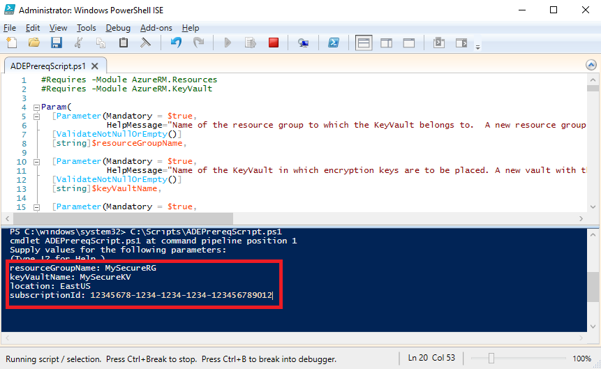
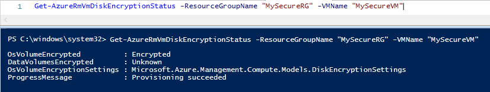

# Quickstart: Encrypt a Windows IaaS VM with Azure PowerShell

Azure Disk Encryption helps you encrypt your Windows and Linux IaaS virtual machine disks. The solution is integrated with Azure Key Vault to help you control and manage the disk-encryption keys and secrets. By using Azure Disk encryption, you can ensure that your VMs are secured at rest using industry-standard encryption technology. In this quickstart, you'll create a Windows Server 2016 VM and encrypt the OS disk. 

If you don't have an Azure subscription, create a [free account](https://azure.microsoft.com/free/?WT.mc_id=A261C142F) before you begin.

## Prerequisites

- Windows PowerShell ISE
- Install or update to the [latest version of Azure PowerShell](/powershell/azure/install-azurerm-ps)
    - The AzureRM module version needs to be 6.0.0 or higher. `Get-Module AzureRM -ListAvailable | Select-Object -Property Name,Version,Path`
- A copy of the [Azure Disk Encryption prerequisites script](https://raw.githubusercontent.com/Azure/azure-powershell/master/src/ResourceManager/Compute/Commands.Compute/Extension/AzureDiskEncryption/Scripts/AzureDiskEncryptionPreRequisiteSetup.ps1).
    - If you have this script already, download a new copy as it has recently changed. 
    - Use **CTRL-A** to select all the text then use **CTRL-C** to copy all the text into Notepad.
    - Save the file as **ADEPrereqScript.ps1**


## Sign in to Azure

1. Right-click **Windows PowerShell ISE** and click **Run as administrator**.
1. In the **Administrator: Windows PowerShell ISE** window, click **View** and then click **Show Script Pane**.
1. In the script pane, type the following cmdlet: 

     ```azurepowershell
      Connect-AzureRMAccount
     ```

1. Click on the green arrow for **Run Script**, or use F5. 
2. Use the interactive sign-in to finish connecting to your Azure account.
3. Copy your **subscription ID** that is returned for use in running the next PowerShell script. 

## <a name="bkmk_PrereqScript"></a> Run the Azure Disk Encryption prerequisites script
 **ADEPrereqScript.ps1** will create a resource group, a key vault, and set the key vault access policy. The script also creates a resource lock on the key vault to help protect it from accidental deletion.  

1. In the **Administrator: Windows PowerShell ISE** window, click **File** and then click **Open**. Navigate to the **ADEPrereqScript.ps1** file and double-click on it. The script will open in the script pane.
2. Click on the green arrow for **Run Script**, or use F5 to run the script. 
3. Type in names for a new **resource group** and a new **key vault**. Don't use an existing resource group or key vault for this quickstart since we'll delete the resource group later. 
4. Type in the location where you want to create the resources, such as **EastUS**. Get a location list with `Get-AzureRMLocation`.
5. Copy in your **subscription ID**. You can get your Subscription ID with `Get-AzureRMSubscription`.  
6. Click on the green arrow for **Run Script**. 
7. Copy the returned **DiskEncryptionKeyVaultUrl** and **DiskEncryptionKeyVaultId** to be used later.




## Create a virtual machine 
You now need to create a virtual machine so you can encrypt its disk. The script you'll use creates a Windows Server 2016 VM with 8-GB RAM and a 30-GB OS disk. 

1. Copy the script into the **Administrator: Windows PowerShell ISE** script pane and change the top three variables. The resource group and location need to be the same as you used for the [prerequisites script](#bkmk_PrereqScript).  

   ```azurepowershell
    # Variables for common values
    $resourceGroup = "MySecureRG"
    $location = "EastUS"
    $vmName = "MySecureVM"
    
    # Create user object
    $cred = Get-Credential -Message "Enter a username and password for the virtual machine."
    
    # Create a resource group
    #New-AzureRmResourceGroup -Name $resourceGroup -Location $location
    
    # Create a subnet configuration
    $subnetConfig = New-AzureRmVirtualNetworkSubnetConfig -Name mySubnet -AddressPrefix 192.168.1.0/24
    
    # Create a virtual network
    $vnet = New-AzureRmVirtualNetwork -ResourceGroupName $resourceGroup -Location $location `
      -Name MYvNET -AddressPrefix 192.168.0.0/16 -Subnet $subnetConfig
    
    # Create a public IP address and specify a DNS name
    $pip = New-AzureRmPublicIpAddress -ResourceGroupName $resourceGroup -Location $location `
      -Name "mypublicdns$(Get-Random)" -AllocationMethod Static -IdleTimeoutInMinutes 4
    
    # Create an inbound network security group rule for port 3389
    $nsgRuleRDP = New-AzureRmNetworkSecurityRuleConfig -Name myNetworkSecurityGroupRuleRDP  -Protocol Tcp `
      -Direction Inbound -Priority 1000 -SourceAddressPrefix * -SourcePortRange * -DestinationAddressPrefix * `
      -DestinationPortRange 3389 -Access Allow
    
    # Create a network security group
    $nsg = New-AzureRmNetworkSecurityGroup -ResourceGroupName $resourceGroup -Location $location `
      -Name myNetworkSecurityGroup -SecurityRules $nsgRuleRDP
    
    # Create a virtual network card and associate with public IP address and NSG
    $nic = New-AzureRmNetworkInterface -Name myNic -ResourceGroupName $resourceGroup -Location $location `
      -SubnetId $vnet.Subnets[0].Id -PublicIpAddressId $pip.Id -NetworkSecurityGroupId $nsg.Id
    
    # Create a virtual machine configuration
    $vmConfig = New-AzureRmVMConfig -VMName $vmName -VMSize Standard_D2_v3 | `
    Set-AzureRmVMOperatingSystem -Windows -ComputerName $vmName -Credential $cred | `
    Set-AzureRmVMSourceImage -PublisherName MicrosoftWindowsServer -Offer WindowsServer -Skus 2016-Datacenter-smalldisk -Version latest | `
    Add-AzureRmVMNetworkInterface -Id $nic.Id
    
    # Create a virtual machine
    New-AzureRmVM -ResourceGroupName $resourceGroup -Location $location -VM $vmConfig
   ```

2. Click on the green arrow for **Run Script** to build the VM.  


## Encrypt the disk of the VM
Now that you've created and configured a key vault and a VM, you can encrypt the disk with the **Set-AzureRmVmDiskEncryptionExtension** cmdlet. 
 
1. Run the following cmdlet to encrypt the VM's disk:

    ```azurepowershell
     Set-AzureRmVmDiskEncryptionExtension -ResourceGroupName "MySecureRG" -VMName "MySecureVM" `
     -DiskEncryptionKeyVaultId "<Returned by the prerequisites script>" -DiskEncryptionKeyVaultUrl "<Returned by the prerequisites script>"
     ```


1. When the encryption finishes, you can verify that the disk is encrypted with the following cmdlet: 

     ```azurepowershell
     Get-AzureRmVmDiskEncryptionStatus -ResourceGroupName "MySecureRG" -VMName "MySecureVM"
     ```
    
    
## Clean up resources
 **ADEPrereqScript.ps1** creates a resource lock on the key vault. To clean up the resources from this quickstart, you need to remove the resource lock first then delete the resource group. 

1. Remove the resource lock from the key vault

     ```azurepowershell
     $LockId =(Get-AzureRMResourceLock -ResourceGroupName "MySecureRG" -ResourceName "MySecureVault" -ResourceType "Microsoft.KeyVault/vaults").LockID 
     Remove-AzureRmResourceLock -LockID $LockId
      ```
    
2. Remove the resource group. This will delete all resources in the group too. 
     ```azurepowershell
      Remove-AzureRmResourceGroup -Name "MySecureRG"
      ```

## Next steps
Advance to the next article to learn more about Azure Disk Encryption prerequisites for IaaS VMs.

> [!div class="nextstepaction"]
> [Azure Disk Encryption Prerequisites](azure-security-disk-encryption-prerequisites.md)