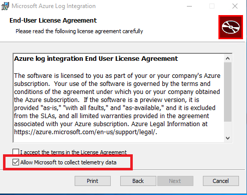
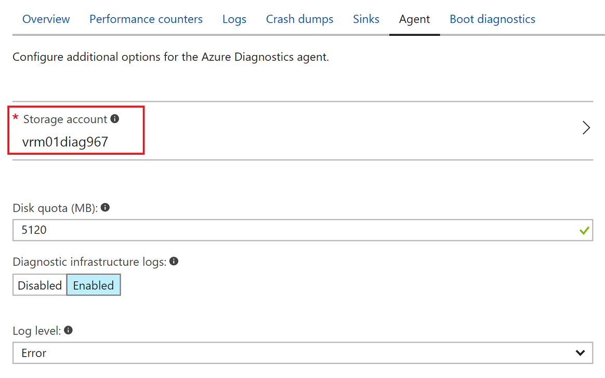
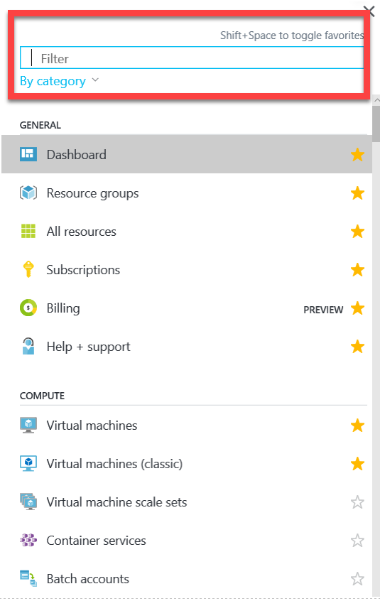

# Azure Log Integration with Azure Diagnostics logging and Windows event forwarding


>[!IMPORTANT]
> The Azure Log integration feature will be deprecated by 06/15/2019. AzLog downloads were disabled on Jun 27, 2018. For guidance on what to do moving forward review the post [Use Azure monitor to integrate with SIEM tools](https://azure.microsoft.com/blog/use-azure-monitor-to-integrate-with-siem-tools/) 

You should only use Azure log integration if an [Azure Monitor](../monitoring-and-diagnostics/monitoring-get-started.md) connector isn't available from your Security Incident and Event Management (SIEM) vendor.

Azure Log Integration makes Azure logs available to your SIEM so you can create a unified security dashboard for all your assets.
For more information about the status of an Azure Monitor connector, contact your SIEM vendor.

> [!IMPORTANT]
> If your primary interest is collecting virtual machine logs, most SIEM vendors include this option in their solution. Using the SIEM vendor's connector is always the preferred alternative.

This article helps you get started with Azure Log Integration. It focuses on installing the Azure Log Integration service and integrating the service with Azure Diagnostics. The Azure Log Integration service then collects Windows Event Log information from the Windows Security Event channel from virtual machines deployed in an Azure infrastructure as a service. This is similar to *event forwarding* that you might use in an on-premises system.

> [!NOTE]
> Integrating the output of Azure Log Integration with an SIEM is done by the SIEM itself. For more information, see [Integrate Azure Log Integration with your on-premises SIEM](https://blogs.msdn.microsoft.com/azuresecurity/2016/08/23/azure-log-siem-configuration-steps/).

The Azure Log Integration service runs on either a physical or a virtual computer running Windows Server 2008 R2 or later (Windows Server 2016 or Windows Server 2012 R2 is preferred).

A physical computer can run on-premises or on a hosting site. If you choose to run the Azure Log Integration service on a virtual machine, the virtual machine can be located on-premises or in a public cloud, such as in Microsoft Azure.

The physical or virtual machine running the Azure Log Integration service requires network connectivity to the Azure public cloud. This article provides details about the required configuration.

## Prerequisites

At a minimum, installing Azure Log Integration requires the following items:

* An **Azure subscription**. If you don't have one, you can sign up for a [free account](https://azure.microsoft.com/free/).
* A **storage account** that can be used for Windows Azure Diagnostics (WAD) logging. You can use a preconfigured storage account or create a new storage account. Later in this article, we describe how to configure the storage account.

  > [!NOTE]
  > Depending on your scenario, a storage account might not be required. For the Azure Diagnostics scenario covered in this article, a storage account is required.

* **Two systems**: 
  * A machine that runs the Azure Log Integration service. This machine collects all the log information that later is imported into your SIEM. This system:
    * Can be on-premises or hosted in Microsoft Azure.  
    * Must be running an x64 version of Windows Server 2008 R2 SP1 or later, and have Microsoft .NET 4.5.1 installed. To determine the .NET version installed, see [Determine which .NET Framework versions are installed](https://msdn.microsoft.com/library/hh925568).  
    * Must have connectivity to the Azure Storage account that's used for Azure Diagnostics logging. Later in this article, we describe how to confirm connectivity.
  * A machine that you want to monitor. This is a VM running as an [Azure virtual machine](../virtual-machines/virtual-machines-windows-overview.md). The logging information from this machine is sent to the Azure Log Integration service machine.

For a quick demonstration of how to create a virtual machine by using the Azure portal, take a look at the following video:<br /><br />


> [!VIDEO https://channel9.msdn.com/Blogs/Azure-Security-Videos/Azure-Log-Integration-Videos-Create-a-Virtual-Machine/player]

## Deployment considerations

During testing, you can use any system that meets the minimum operating system requirements. For a production environment, the load might require you to plan for scaling up or scaling out.

You can run multiple instances of the Azure Log Integration service. However, you can run only one instance of the service per physical or virtual machine. In addition, you can load-balance Azure Diagnostics storage accounts for WAD. The number of subscriptions to provide to the instances is based on your capacity.

> [!NOTE]
> Currently, we don't have specific recommendations about when to scale out instances of Azure Log Integration machines (that is, machines running the Azure Log Integration service), or for storage accounts or subscriptions. Make scaling decisions based on your performance observations in each of these areas.

To help improve performance, you also have the option to scale up the Azure Log Integration service. The following performance metrics can help you size the machines that you choose to run the Azure Log Integration service:

* On an 8-processor (core) machine, a single instance of Azure Log Integration can process about 24 million events per day (approximately 1 million events per hour).
* On a 4-processor (core) machine, a single instance of Azure Log Integration can process about 1.5 million events per day (approximately 62,500 events per hour).

## Install Azure Log Integration

Run through the set up routine. Choose whether to provide telemetry information to Microsoft.

The Azure Log Integration service collects telemetry data from the machine on which it's installed.  

Telemetry data that's collected includes the following:

* Exceptions that occur during execution of Azure Log Integration.
* Metrics about the number of queries and events processed.
* Statistics about which Azlog.exe command-line options are used. 

> [!NOTE]
> We recommend that you allow Microsoft to collect telemetry data. You can turn off the collection of telemetry data by clearing the **Allow Microsoft to collect telemetry data** check box.
>




The installation process is covered in the following video:<br /><br />

> [!VIDEO https://channel9.msdn.com/Blogs/Azure-Security-Videos/Azure-Log-Integration-Videos-Install-Azure-Log-Integration/player]

## Post-installation and validation steps

After you complete basic setup, you're ready to perform post-installation and validation steps:

1. Open PowerShell as an administrator. Then, go to C:\Program Files\Microsoft Azure Log Integration.
2. Import the Azure Log Integration cmdlets. To import the cmdlets, run the script `LoadAzlogModule.ps1`. Enter `.\LoadAzlogModule.ps1`, and then press Enter (note the use of **.\\** in this command). You should see something like what appears in the following figure:

   
3. Next, configure Azure Log Integration to use a specific Azure environment. An *Azure environment* is the type of Azure cloud datacenter that you want to work with. Although there are several Azure environments, currently, the relevant options are either **AzureCloud** or **AzureUSGovernment**. Running PowerShell as an administrator, make sure that you are in C:\Program Files\Microsoft Azure Log Integration\. Then, run this command:

   `Set-AzlogAzureEnvironment -Name AzureCloud` (for **AzureCloud**)
  
   If you want to use the US Government Azure cloud, use **AzureUSGovernment** for the **-Name** variable. Currently, other Azure clouds aren't supported.  

   > [!NOTE]
   > You don't receive feedback when the command succeeds. 

4. Before you can monitor a system, you need the name of the storage account that's used for Azure Diagnostics. In the Azure portal, go to **Virtual machines**. Look for a Windows virtual machine that you will monitor. In the **Properties** section, select **Diagnostic Settings**.  Then, select **Agent**. Make note of the storage account name that's specified. You need this account name for a later step.

    

   

   > [!NOTE]
   > If monitoring wasn't enabled when the virtual machine was created, you can enable it as shown in the preceding image.

5. Now, go back to the Azure Log Integration machine. Verify that you have connectivity to the storage account from the system where you installed Azure Log Integration. The computer running the Azure Log Integration service needs access to the storage account to retrieve information that's logged by Azure Diagnostics on each of the monitored systems. To verify connectivity: 
   1. [Download Azure Storage Explorer](https://storageexplorer.com/).
   2. Complete setup.
   3. When installation is finished, select **Next**. Leave the **Launch Microsoft Azure Storage Explorer** check box selected.  
   4. Sign in to Azure.
   5. Verify that you can see the storage account that you configured for Azure Diagnostics: 

   

   1. A few options appear under storage accounts. Under **Tables**, you should see a table called **WADWindowsEventLogsTable**.

   If monitoring wasn't enabled when the virtual machine was created, you can enable it, as described earlier.


## Integrate Windows VM Logs

In this step, you configure the machine running the Azure Log Integration service to connect to the storage account that contains the log files.

To complete this step, you need a few things:  
* **FriendlyNameForSource**: A friendly name that you can apply to the storage account that you've configured for the virtual machine to store information from Azure Diagnostics.
* **StorageAccountName**: The name of the storage account that you specified when you configured Azure Diagnostics.  
* **StorageKey**: The storage key for the storage account where the Azure Diagnostics information is stored for this virtual machine.  

To obtain the storage key, complete the following steps:
1. Go to the [Azure portal](https://portal.azure.com).
2. In the navigation pane, select **All services**.
3. In the **Filter** box, enter **Storage**. Then, select **Storage accounts**.

   

4. A list of storage accounts appears. Double-click the account that you assigned to log storage.

   

5. Under **Settings**, select **Access keys**.

   

6. Copy **key1**, and then save it in a secure location that you can access for the following step.
7. On the server where you installed Azure Log Integration, open a Command Prompt window as an administrator. (Be sure to open a Command Prompt window as an administrator, and not PowerShell).
8. Go to C:\Program Files\Microsoft Azure Log Integration.
9. Run this command:
   `Azlog source add <FriendlyNameForTheSource> WAD <StorageAccountName> <StorageKey>`.
 
   Example:
  
   `Azlog source add Azlogtest WAD Azlog9414 fxxxFxxxxxxxxywoEJK2xxxxxxxxxixxxJ+xVJx6m/X5SQDYc4Wpjpli9S9Mm+vXS2RVYtp1mes0t9H5cuqXEw==`

   If you want the subscription ID to show up in the event XML, append the subscription ID to the friendly name:

   `Azlog source add <FriendlyNameForTheSource>.<SubscriptionID> WAD <StorageAccountName> <StorageKey>`
  
   Example:
  
   `Azlog source add Azlogtest.YourSubscriptionID WAD Azlog9414 fxxxFxxxxxxxxywoEJK2xxxxxxxxxixxxJ+xVJx6m/X5SQDYc4Wpjpli9S9Mm+vXS2RVYtp1mes0t9H5cuqXEw==`

> [!NOTE]
> Wait up to 60 minutes, and then view the events that are pulled from the storage account. To view the events, in Azure Log Integration, select **Event Viewer** > **Windows Logs** > **Forwarded Events**.

The following video covers the preceding steps:<br /><br />

> [!VIDEO https://channel9.msdn.com/Blogs/Azure-Security-Videos/Azure-Log-Integration-Videos-Enable-Diagnostics-and-Storage/player]


## If data isn't showing up in the Forwarded Events folder
If data isn't showing up in the Forwarded Events folder after an hour, complete these steps:

1. Check the machine that's running the Azure Log Integration service. Confirm that it can access Azure. To test connectivity, in a browser, try to go to the [Azure portal](https://portal.azure.com).
2. Make sure that the user account Azlog has write permission for the folder users\Azlog.
   1. Open File Explorer.
   2. Go to C:\users.
   3. Right-click C:\users\Azlog.
   4. Select **Security**.
   5. Select **NT Service\Azlog**. Check the permissions for the account. If the account is missing from this tab, or if the appropriate permissions aren't showing, you can grant the account permissions on this tab.
3. When you run the command `Azlog source list`, make sure that the storage account that was added in the command `Azlog source add` is listed in the output.
4. To see if any errors are reported from the Azure Log Integration service, go to **Event Viewer** > **Windows Logs** > **Application**.

If you run into any issues during installation and configuration, you can create a [support request](../azure-supportability/how-to-create-azure-support-request.md). For the service, select **Log Integration**.

Another support option is the [Azure Log Integration MSDN forum](https://social.msdn.microsoft.com/Forums/home?forum=AzureLogIntegration). In the MSDN forum, the community can provide support by answering questions and sharing tips and tricks about how to get the most out of Azure Log Integration. The Azure Log Integration team also monitors this forum. They help whenever they can.

## Integrate Azure activity logs

The Azure Activity Log is a subscription log that provides insight into subscription-level events that have occurred in Azure. This includes a range of data, from Azure Resource Manager operational data to updates on Service Health events. The Azure Security Center Alerts are also included in this Log.
> [!NOTE]
> Before you attempt the steps in this article, you must review the [Get started](security-azure-log-integration-get-started.md) article and complete the steps there.

### Steps to integrate Azure Activity logs

1. Open the command prompt and run this command:
    ```cd c:\Program Files\Microsoft Azure Log Integration```
2. Run this command:
    ```azlog createazureid```

    This command prompts you for your Azure login. The command then creates an Azure Active Directory service principal in the Azure AD tenants that host the Azure subscriptions in which the logged-in user is an administrator, a co-administrator, or an owner. The command will fail if the logged-in user is only a guest user in the Azure AD tenant. Authentication to Azure is done through Azure AD. Creating a service principal for Azure Log Integration creates the Azure AD identity that is given access to read from Azure subscriptions.
3. Run the following command to authorize the Azure Log Integration service principal created in the previous step access to the read the Activity Log for the subscription. You need to be an Owner on the subscription to run the command.

   ```Azlog.exe authorize subscriptionId```
   Example:

   ```AZLOG.exe authorize ba2c2367-d24b-4a32-17b5-4443234859```

4. Check the following folders to confirm that the Azure Active Directory audit log JSON files are created in them:
   - C:\Users\azlog\AzureResourceManagerJson
   - C:\Users\azlog\AzureResourceManagerJsonLD

> [!NOTE]
> For specific instructions on bringing the information in the JSON files into your security information and event management (SIEM) system, contact your SIEM vendor.

Community assistance is available through the [Azure Log Integration MSDN Forum](https://social.msdn.microsoft.com/Forums/office/home?forum=AzureLogIntegration). This forum enables people in the Azure Log Integration community to support each other with questions, answers, tips, and tricks. In addition, the Azure Log Integration team monitors this forum and helps whenever it can.

You can also open a [support request](../azure-supportability/how-to-create-azure-support-request.md). Select Log Integration as the service for which you are requesting support.

## Next steps

To learn more about Azure Log Integration, see the following articles:
Before you attempt the steps in this article, you must review the Get started article and complete the steps there.

* [Introduction to Azure Log Integration](security-azure-log-integration-overview.md). This article introduces you to Azure Log Integration, its key capabilities, and how it works.
* [Partner configuration steps](https://blogs.msdn.microsoft.com/azuresecurity/2016/08/23/azure-log-siem-configuration-steps/). This blog post shows you how to configure Azure Log Integration to work with partner solutions Splunk, HP ArcSight, and IBM QRadar. It describes our current guidance about how to configure the SIEM components. Check with your SIEM vendor for additional details.
* [Azure Log Integration frequently asked questions (FAQ)](security-azure-log-integration-faq.md). This FAQ answers common questions about Azure Log Integration.
* [Integrating Azure Security Center alerts with Azure Log Integration](../security-center/security-center-integrating-alerts-with-log-integration.md). This article shows you how to sync Security Center alerts and virtual machine security events that are collected by Azure Diagnostics and Azure activity logs. You sync the logs by using your Azure Monitor logs or SIEM solution.
* [New features for Azure Diagnostics and Azure audit logs](https://azure.microsoft.com/blog/new-features-for-azure-diagnostics-and-azure-audit-logs/). This blog post introduces you to Azure audit logs and other features that can help you gain insight into the operations of your Azure resources.
