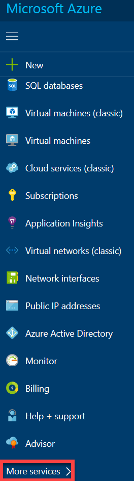

# Azure log integration with Azure Diagnostics Logging and Windows Event Forwarding
Azure Log Integration (AzLog) enables you to integrate raw logs from your Azure resources into your on-premises Security Information and Event Management (SIEM) systems. This integration makes it possible to have a unified security dashboard for all your assets, on-premises or in the cloud, so that you can aggregate, correlate, analyze, and alert for security events associated with your applications.
>[!NOTE]
For more information on Azure Log Integration, you can review the [Azure Log Integration overview](https://docs.microsoft.com/azure/security/security-azure-log-integration-overview).

This article will help you get started with Azure Log Integration by focusing on the installation of the Azlog service and integrating the service with Azure Diagnostics. The Azure Log Integration service will then be able to collect Windows Event Log information from the Windows Security Event Channel from virtual machines deployed in Azure IaaS. This is very similar to “Event Forwarding” that you may have used on-premises.

>[!NOTE]
>The ability to bring the output of Azure log integration in to the SIEM is provided by the SIEM itself. Please see the article [Integrating Azure Log Integration with your On-premises SIEM](https://blogs.msdn.microsoft.com/azuresecurity/2016/08/23/azure-log-siem-configuration-steps/) for more information.

To be very clear - the Azure Log Integration service runs on a physical or virtual computer that is using the Windows Server 2008 R2 or above operating system (Windows Server 2012 R2 or Windows Server 2016 are preferred). 

The physical computer can run on-premises (or on a hoster site). If you choose to run the Azure Log Integration service on a virtual machine, that virtual machine can be located on-premises or in a public cloud, such as Microsoft Azure. 

The physical or virtual machine running the Azure Log Integration service requires network connectivity to the Azure public cloud. Steps in this article provide details on the configuration.

## Prerequisites
At a minimum, the installation of AzLog requires the following items:
* An **Azure subscription**. If you do not have one, you can sign up for a [free account](https://azure.microsoft.com/free/).
* A **storage account** that can be used for Windows Azure diagnostic logging (you can use a pre-configured storage account, or create a new one – will we demonstrate how to configure the storage account later in this article)
* **Two systems**: a machine that will run the Azure Log Integration service, and a machine that will be monitored and have its logging information sent to the Azlog service machine.
   * A machine you want to monitor – this is a VM running as an [Azure Virtual Machine](../virtual-machines/virtual-machines-windows-overview.md)
   * A machine that will run the Azure log integration service; this machine will collect all the log information that will later be imported into your SIEM.
    * This system can be on-premises or in Microsoft Azure.  
    * It needs to be running an x64 version of Windows server 2008 R2 SP1 or higher and have .NET 4.5.1 installed. You can determine the .NET version installed by following the article titled [How to: Determine Which .NET Framework Versions Are Installed](https://msdn.microsoft.com/library/hh925568)  
    It must have connectivity to the Azure storage account used for Azure diagnostic logging. We will provide instructions later in this article on how you can confirm this connectivity

## Deployment considerations
While you are testing Azure Log Integration, you can use any system that meets the minimum operating system requirements. However, for a production environment the load may require you to plan for scaling up or out.

You can run multiple instances of the Azure Log Integration service (one instance per physical or virtual machine) if event volume is high. In addition, you can load balance Azure Diagnostics storage accounts for Windows (WAD) and the number of subscriptions to provide to the instances should be based on your capacity.
>[!NOTE]
At this time we do not have specific recommendations for when to scale out instances of Azure log integration machines (i.e., machines that are running the Azure log integration service), or for storage accounts or subscriptions. Scaling decisions should be based on your performance observations in each of these areas.

You also have the option to scale up the Azure Log Integration service to help improve performance. The following performance metrics can help you in sizing the machines that you choose to run the Azure log integration service:
* On an 8-processor (core) machine, a single instance of Azlog Integrator can process about 24 million events per day (~1M/hour).

* On a 4-processor (core) machine, a single instance of Azlog Integrator can process about 1.5 million events per day (~62.5K/hour).

## Install Azure log integration
To install Azure Log Integration, you need to download the [Azure log integration](https://www.microsoft.com/download/details.aspx?id=53324) installation file. Run through the setup routine and decide if you want to provide telemetry information to Microsoft.  

*
> [!NOTE]
> We recommend that you allow Microsoft to collect telemetry data. You can turn off collection of telemetry data by unchecking this option.
>

The Azure Log Integration service collects telemetry data from the machine on which it is installed.  

Telemetry data collected is:

* Exceptions that occur during execution of Azure log integration
* Metrics about the number of queries and events processed
* Statistics about which Azlog.exe command-line options are being used

## Post installation and validation steps
After completing the basic setup routine, you're ready step to perform post installation and validation steps:
1. Open an elevated PowerShell window and navigate to **c:\Program Files\Microsoft Azure Log Integration**
2. The first step you need to take is to get the AzLog Cmdlets imported. You can do that by running the script **LoadAzlogModule.ps1** (notice the “.\” in the following command). Type **.\LoadAzlogModule.ps1** and press **ENTER**.  
You should see something like what appears in the figure below.   
   
3. Now you need to configure AzLog to use a specific Azure environment. An “Azure environment” is the “type” of Azure cloud data center you want to work with. While there are several Azure environments at this time, the currently relevant options are either **AzureCloud** or **AzureUSGovernment**.   In your elevated PowerShell environment, make sure that you are in **c:\program files\Microsoft Azure Log Integration\**   
    Once there, run the command:  
    ``Set-AzlogAzureEnvironment -Name AzureCloud`` (for Azure commercial)

      >[!NOTE]
      When the command succeeds, you will not receive any feedback.  If you want to use the US Government Azure cloud, you would use **AzureUSGovernment** (for the -Name variable) for the USA government cloud. Other Azure clouds are not supported at this time.  
4. Before you can monitor a system you will need the name of the storage account in use for Azure Diagnostics.  In the Azure portal navigate to **Virtual machines** and look for the virtual machine that you will monitor. In the **Properties** section, choose **Diagnostic Settings**.  Click on **Agent** and make note of the storage account name specified. You will need this account name for a later step.
   

      
      >[!NOTE]
      If Monitoring was not enabled during virtual machine creation you will be given the option to enable it as shown above. 
5. Now we’ll switch our attention back to the Azure log integration machine. We need to verify that you have connectivity to the Storage Account from the system where you installed Azure Log Integration. The physical computer or virtual machine running the Azure Log Integration service needs access to the storage account to retrieve information logged by Azure Diagnostics as configured on each of the monitored systems.  
  1. You can download Azure Storage Explorer [here](http://storageexplorer.com/).
  2. Run through the setup routine
  3. Once the installation completes click **Next** and leave the check box **Launch Microsoft Azure Storage Explorer** checked.  
  4. Log in to Azure.
  5. Verify that you can see the storage account that you configured for Azure Diagnostics.  
   
   6. Notice that there are a few options under storage accounts. One of them is **Tables**. Under **Tables** you should see one called **WADWindowsEventLogsTable**.   
     

## Integrate Azure Diagnostic logging
In this step, you will configure the machine running the Azure Log Integration service to connect to the storage account that contains the log files.
To complete this step we will need a few things up front.  
* **FriendlyNameForSource:** This is a friendly name that you can apply to the storage account that you've configured the virtual machine to store information from Azure Diagnostics
* **StorageAccountName:** This is the name of the storage account that you specified when you configured Azure diagnotics.  
* **StorageKey:** This is the storage key for the storage account where the Azure Diagnostics information is stored for this virtual machine.  

Perform the following steps to obtain the storage key:
 1. Browse to the [Azure portal](http://portal.azure.com).
 2. In the navigation pane of the Azure console, scroll to the bottom and click **More services.**

 
 3. Enter **Storage** in the **Filter** text box. Click **Storage accounts** (this will appear after you enter **Storage**)

  
 4. A list of storage accounts will appear, double click on the account that you assigned to Log storage.

   
 5. Click on **Access keys** in the **Settings** section.

  
 6. Copy **key1** and put it in a secure location that you can access for the next step.

   
 7. On the server that you installed Azure Log Integration, open an elevated Command Prompt (note that we’re using an elevated Command Prompt window here, not an elevated PowerShell console).
 8. Navigate to **c:\Program Files\Microsoft Azure Log Integration**
 9. Run ``Azlog source add <FriendlyNameForTheSource> WAD <StorageAccountName> <StorageKey> ``   For example ``Azlog source add Azlogtest WAD Azlog9414 fxxxFxxxxxxxxywoEJK2xxxxxxxxxixxxJ+xVJx6m/X5SQDYc4Wpjpli9S9Mm+vXS2RVYtp1mes0t9H5cuqXEw==``
If you would like the subscription ID to show up in the event XML, append the subscription ID to the friendly name:
``Azlog source add <FriendlyNameForTheSource>.<SubscriptionID> WAD <StorageAccountName> <StorageKey>`` or for example, ``Azlog source add Azlogtest.YourSubscriptionID WAD Azlog9414 fxxxFxxxxxxxxywoEJK2xxxxxxxxxixxxJ+xVJx6m/X5SQDYc4Wpjpli9S9Mm+vXS2RVYtp1mes0t9H5cuqXEw==``

>[!NOTE]  
Wait up to 60 minutes, then view the events that are pulled from the storage account. To view, open **Event Viewer > Windows Logs > Forwarded Events** on the Azlog Integrator.

## What if data is not showing up in the Forwarded Events folder?
If after an hour data is not showing up in the **Forwarded Events** folder, then:

1. Check the machine running the Azure Log Integration service and confirm that it can access Azure. To test connectivity, try to open the [Azure portal](http://portal.azure.com) from the browser.
2. Make sure the user account **Azlog** has write permission on the folder **users\Azlog**.
  <ol type="a">
   <li>Open **Windows Explorer** </li>
  <li> Navigate to **c:\users** </li>
  <li> Right click on **c:\users\Azlog** </li>
  <li> Click on **Security**  </li>
  <li> Click on **NT Service\Azlog** and check the permissions for the account. If the account is missing from this tab or if the appropriate permissions are not currently showing you can grant the account rights in this tab.</li>
  </ol>
3. Make sure the storage account added in the command **Azlog source add** is listed when you run the command **Azlog source list**.
4. Go to **Event Viewer > Windows Logs > Application** to see if there are any errors reported from the Azure log integration.

If you run into any issues during the installation and configuration, please open a [support request](../azure-supportability/how-to-create-azure-support-request.md), select **Log Integration** as the service for which you are requesting support.

Another support option is the [Azure Log Integration MSDN Forum](https://social.msdn.microsoft.com/Forums/home?forum=AzureLogIntegration). Here the community can support each other with questions, answers, tips, and tricks on how to get the most out of Azure Log Integration. In addition, the Azure Log Integration team monitors this forum and will help whenever we can.

## Next steps
To learn more about Azure Log Integration, see the following documents:

* [Microsoft Azure Log Integration for Azure logs](https://www.microsoft.com/download/details.aspx?id=53324) – Download Center for details, system requirements, and install instructions on Azure log integration.
* [Introduction to Azure log integration](security-azure-log-integration-overview.md) – This document introduces you to Azure log integration, its key capabilities, and how it works.
* [Partner configuration steps](https://blogs.msdn.microsoft.com/azuresecurity/2016/08/23/azure-log-siem-configuration-steps/) – This blog post shows you how to configure Azure log integration to work with partner solutions Splunk, HP ArcSight, and IBM QRadar.
* [Azure log Integration frequently asked questions (FAQ)](security-azure-log-integration-faq.md) - This FAQ answers questions about Azure log integration.
* [Integrating Security Center alerts with Azure log Integration](../security-center/security-center-integrating-alerts-with-log-integration.md) – This document shows you how to sync Security Center alerts, along with virtual machine security events collected by Azure Diagnostics and Azure Audit Logs, with your log analytics or SIEM solution.
* [New features for Azure diagnostics and Azure Audit Logs](https://azure.microsoft.com/blog/new-features-for-azure-diagnostics-and-azure-audit-logs/) – This blog post introduces you to Azure Audit Logs and other features that help you gain insights into the operations of your Azure resources.
