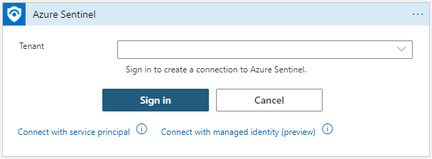
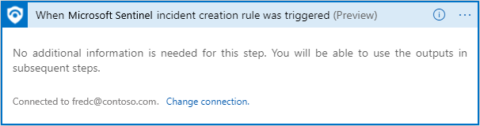
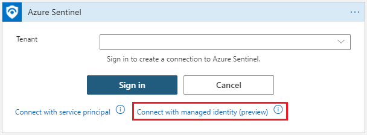
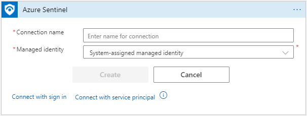
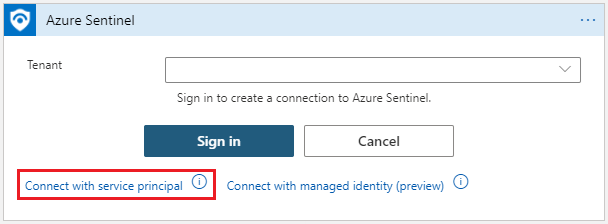
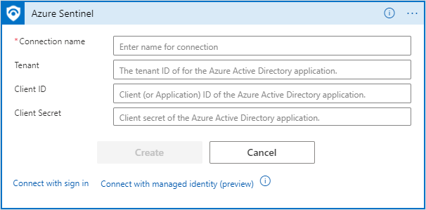

# Authenticate playbooks to Microsoft Sentinel

The way Logic Apps works, it has to connect separately and authenticate independently to every resource of every type that it interacts with, including to Microsoft Sentinel itself. Logic Apps uses [specialized connectors](/connectors/connector-reference/) for this purpose, with each resource type having its own connector. This document explains the types of connection and authentication in the [Logic Apps Microsoft Sentinel connector](/connectors/azuresentinel/), that playbooks can use to interact with Microsoft Sentinel in order to have access to the information in your workspace's tables.

This document, along with our guide to [using triggers and actions in playbooks](playbook-triggers-actions.md), is a companion to our other playbook documentation - [Tutorial: Use playbooks with automation rules in Microsoft Sentinel](tutorial-respond-threats-playbook.md).

For an introduction to playbooks, see [Automate threat response with playbooks in Microsoft Sentinel](automate-responses-with-playbooks.md).

For the complete specification of the Microsoft Sentinel connector, see the [Logic Apps connector documentation](/connectors/azuresentinel/).

## Authentication

The Microsoft Sentinel connector in Logic Apps, and its component triggers and actions, can operate on behalf of any identity that has the necessary permissions (read and/or write) on the relevant workspace. The connector supports multiple identity types:

- [Managed identity (Preview)](#authenticate-with-managed-identity)
- [Azure AD user](#authenticate-as-an-azure-ad-user)
- [Service principal (Azure AD application)](#authenticate-as-a-service-principal-azure-ad-application)

    

### Permissions required

| Roles / Connector components | Triggers | "Get" actions | Update incident, add a comment |
| ------------- | :-----------: | :------------: | :-----------: |
| **[Microsoft Sentinel Reader](../role-based-access-control/built-in-roles.md#microsoft-sentinel-reader)** | &#10003; | &#10003; | &#10007; |
| **Microsoft Sentinel [Responder](../role-based-access-control/built-in-roles.md#microsoft-sentinel-responder)/[Contributor](../role-based-access-control/built-in-roles.md#microsoft-sentinel-contributor)** | &#10003; | &#10003; | &#10003; |
| 

[Learn more about permissions in Microsoft Sentinel](./roles.md).

### Authenticate with managed identity

This authentication method allows you to give permissions directly to the playbook (a Logic App workflow resource), so that Microsoft Sentinel connector actions taken by the playbook will operate on the playbook's behalf, as if it were an independent object with its own permissions on Microsoft Sentinel. Using this method lowers the number of identities you have to manage. 

> [!NOTE]
> To give a managed identity access to other resources (like your Microsoft Sentinel workspace), your signed-in user must have a role with permissions to write role assignments, such as Owner or User Access Administrator of the Microsoft Sentinel workspace.

To authenticate with managed identity:

1. [Enable managed identity](../logic-apps/create-managed-service-identity.md#enable-system-assigned-identity-in-azure-portal) on the Logic Apps workflow resource. To summarize:

    - On the logic app menu, under **Settings**, select **Identity**. Select **System assigned > On > Save**. When Azure prompts you to confirm, select **Yes**.

    - Your logic app can now use the system-assigned identity, which is registered with Azure AD and is represented by an object ID.

1. [Give that identity access](../logic-apps/create-managed-service-identity.md#give-identity-access-to-resources) to the Microsoft Sentinel workspace:
    1. From the Microsoft Sentinel menu, select **Settings**.
    1. Select the **Workspace settings** tab. From the workspace menu, select **Access control (IAM)**.
    1. From the button bar at the top, select **Add** and choose **Add role assignment**. If the **Add role assignment** option is disabled, you don't have permissions to assign roles.
    1. In the new panel that appears, assign the appropriate role:

        | Role | Situation |
        | --- | --- |
        | [**Microsoft Sentinel Responder**](../role-based-access-control/built-in-roles.md#microsoft-sentinel-responder) | Playbook has steps which update incidents or watchlists |
        | [**Microsoft Sentinel Reader**](../role-based-access-control/built-in-roles.md#microsoft-sentinel-reader) | Playbook only receives incidents |
        |

        Learn more about the available [roles in Microsoft Sentinel](./roles.md).
    1. Under **Assign access to**, choose **Logic App**.
    1. Choose the subscription the playbook belongs to, and select the playbook name.
    1. Select **Save**.

1. Enable the managed identity authentication method in the Microsoft Sentinel Logic Apps connector:

    1. In the Logic Apps designer, add a Microsoft Sentinel Logic Apps connector step. If the connector is already enabled for an existing connection, click the **Change connection** link.

        

    1. In the resulting list of connections, select **Add new** at the bottom. 

    1. Create a new connection by selecting **Connect with managed identity (preview)**.

        

    1. Fill in a name for this connection, select **System-assigned managed identity** and select **Create**.

        

### Authenticate as an Azure AD user

To make a connection, select **Sign in**. You will be prompted to provide your account information. Once you have done so, follow the remaining instructions on the screen to create a connection.

### Authenticate as a service principal (Azure AD application)

Service principals can be created by registering an Azure AD application. It is **preferable** to use a registered application as the connector's identity, instead of using a user account, as you will be better able to control permissions, manage credentials, and enable certain limitations on the use of the connector.

To use your own application with the Microsoft Sentinel connector, perform the following steps:

1. Register the application with Azure AD and create a service principal. [Learn how](../active-directory/develop/howto-create-service-principal-portal.md#register-an-application-with-azure-ad-and-create-a-service-principal).

1. Get credentials (for future authentication).

    In the registered application blade, get the application credentials for signing in:

    - **Client ID**: under **Overview**
    - **Client secret**: under **Certificates & secrets**.

1. Grant permissions to the Microsoft Sentinel workspace.

    In this step, the app will get permission to work with Microsoft Sentinel workspace.

    1. In the Microsoft Sentinel workspace, go to **Settings** -> **Workspace Settings** -> **Access control (IAM)**

    1. Select **Add role assignment**.

    1. Select the role you wish to assign to the application. For example, to allow the application to perform actions that will make changes in the Sentinel workspace, like updating an incident, select the **Microsoft Sentinel Contributor** role. For actions which only read data, the **Microsoft Sentinel Reader** role is sufficient. [Learn more about the available roles in Microsoft Sentinel](./roles.md).

    1. Find the required application and save. By default, Azure AD applications aren't displayed in the available options. To find your application, search for the name and select it.

1. Authenticate

    In this step we use the app credentials to authenticate to the Sentinel connector in Logic Apps.

    - Select **Connect with Service Principal**.

        

    - Fill in the required parameters (can be found in the registered application blade)
        - **Tenant**: under **Overview**
        - **Client ID**: under **Overview**
        - **Client Secret**: under **Certificates & secrets**
        
        

### Manage your API connections

Every time an authentication is created for the first time, a new Azure resource of type API Connection is created. The same API connection can be used in all the Microsoft Sentinel actions and triggers in the same Resource Group.

All the API connections can be found in the **API connections** blade (search for *API connections* in the Azure portal).

You can also find them by going to the **Resources** blade and filtering the display by type *API Connection*. This way allows you to select multiple connections for bulk operations.

In order to change the authorization of an existing connection, enter the connection resource, and select **Edit API connection**.

## Next steps

In this article, you learned about the different methods of authenticating a Logic Apps-based playbook to Microsoft Sentinel.

- Learn more about how to [use triggers and actions in playbooks](playbook-triggers-actions.md).
