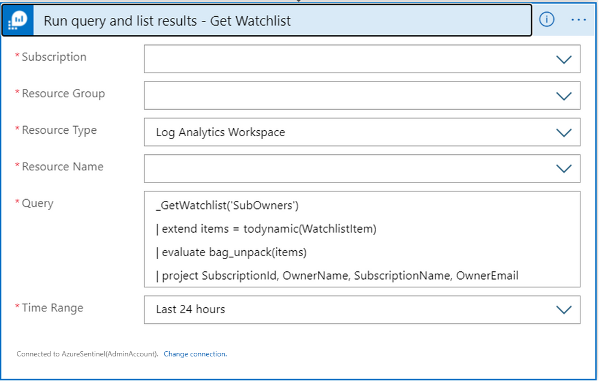
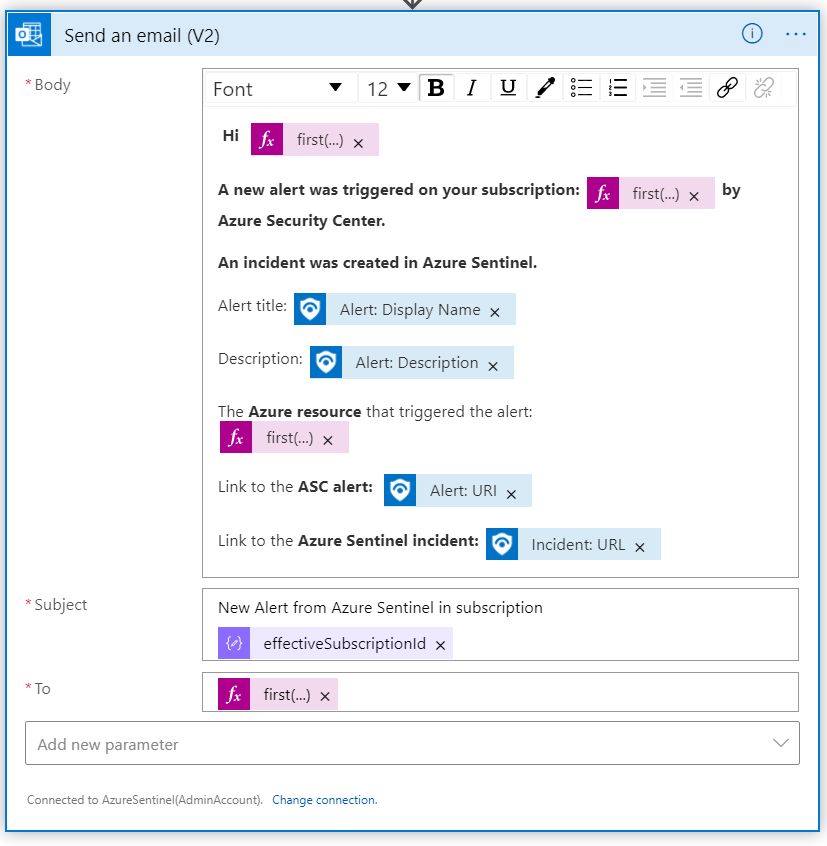
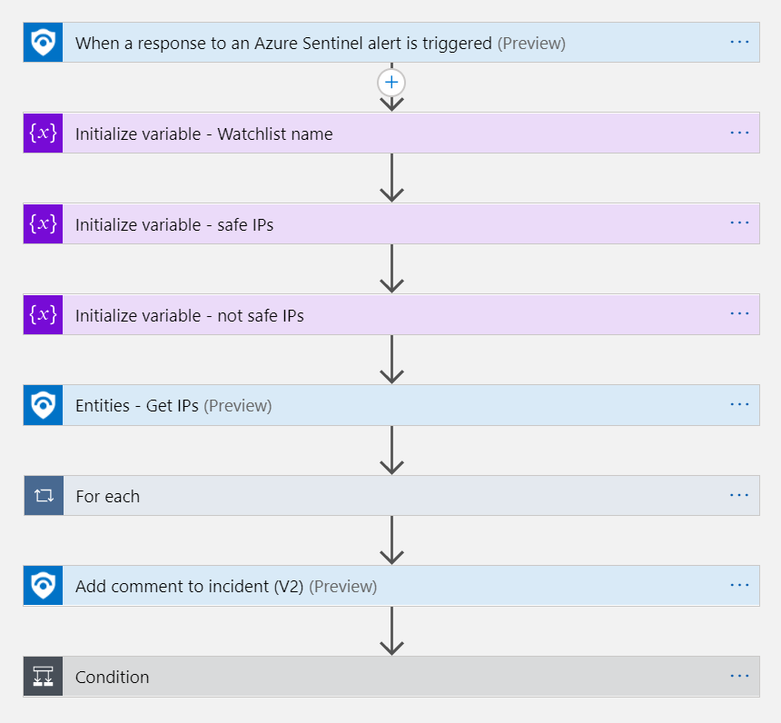

# Use Microsoft Sentinel watchlists and playbooks together to automate activity

This article describes two common situations where using watchlists and playbooks together are helpful in automating activity in your systems: informing resource owners about alerts and responding to incidents with allowlists.

> [!TIP]
> Use these sample playbooks as examples or templates for how you can create automation in your own system, modifying the values as needed.
>
## Automatically inform owners of alerts

[Microsoft Defender for Cloud alerts](/azure/defender-for-cloud/defender-for-cloud-introduction) inform the Security Operations Center (SOC) about possible security attacks on Azure resources.

If the SOC doesn't have access permissions to a potentially compromised resource, they need to contact the resource owner during alert investigation to find out whether they're familiar with the detected activity in their resource and ask them to take mitigation steps on their resource.

Rather than manually finding the relevant contact and reaching out to them each time a new alert occurs, this article shows how you can use Microsoft Sentinel watchlists and a playbook to make that contact automatically. For the sake of simplicity, this article uses the subscription owner level, but you can implement this solution for any specified resource owner.

> [!NOTE]
> The playbook described in this article uses the [Microsoft Sentinel incident trigger](/connectors/azuresentinel/#triggers). You can implement a similar solution by creating scheduled alerts with Microsoft Defender for Cloud, and then using the alert trigger.
>

### Prerequisites

To use the process described in this section, you must have the following prerequisites:

- A user or registered application with [Microsoft Sentinel Contributor](../role-based-access-control/built-in-roles.md#microsoft-sentinel-contributor) role to use with the Microsoft Sentinel connector to Azure Logic Apps

- The [Defender for Cloud data connector](connect-azure-security-center.md) and [incident creation rule](automate-incident-handling-with-automation-rules.md#creating-and-managing-automation-rules) enabled

- A user to authenticate to Microsoft Teams, and a user to authenticate to Office 365 Outlook

### Process summary and playbook steps

The process described in this section includes the following steps:

1. A Microsoft Sentinel watchlist maps each subscription in the organization to its owner and their contact email address.

1. The **Watchlists-InformSubowner-IncidentTrigger** playbook is attached to a Defender for Cloud incident creation rule.

   Every new instance of the Defender for Cloud alert that flows to Microsoft Sentinel creates a Microsoft Sentinel incident.

1. The playbook then triggers, receiving the incident with the contained alert as input.

1. The playbook queries the watchlist and finds the relevant resource's subscription owner details.

1. The playbook sends the subscription owner a Teams message and email with details about the potential resource compromise.


The following image shows the **Watchlists-InformSubowner-IncidentTrigger** playbook in the Logic App designer.


The playbook runs the following steps:

1. **When Microsoft Sentinel incident creation rule was triggered**, the playbook receives the created incident as input.

1. **For each alert** in the incident, typically one alert, the playbook runs the following steps:

   1. **Filter array to get AzureResource identifier**. A Microsoft Defender for Cloud alert might have two kinds of identifiers: `AzureResource` or a resource ID shown in Log Analytics, and Log Analytics information about the workspace that stores the alerts. This action returns an array of just the `AzureResource` identifiers for later use.

   1. **Parse Json to get subscriptionId**. This step gets the Subscription ID from the *SecAdditional Data* of the Defender for Cloud alert.

   1. **Run query and list results - Get Watchlist**. The Azure Monitor Log Analytics connector gets the watchlist items, including the **Subscription**, **Resource Group**, and **Resource Name** for the Microsoft Sentinel workspace details where the watchlist is located. Use the `project` argument to specify which fields are relevant for your use.

      

   1. **Filter array to get relevant subscription owners**. This step keeps the watchlist results only for the subscription you're looking for. The Logic Apps expression argument on the right is:

      `string(body('Parse_JSON_to_get_subscriptionId')?['properties']?['effectiveSubscriptionId'])`

      

   1. **Post a message as the flow bot to a user**. This step sends a message to the subscription owner in Microsoft Teams with any details you want to share about the new alert.

      

   1. **Send an Email**. This step sends a message to the subscription owner in Outlook with any details you want to share about the new alert.

      

### Set up your watchlist and deploy the playbook

Use the following steps to create and upload the watchlist, deploy the playbook, and then confirm your API connections.

**To create and upload the watchlist:**

1. Create an input comma-separated value (CSV) file with the following columns: **SubscriptionId**, **SubscriptionName**, **OwnerName**, **OwnerEmail**, where each row represents a subscription in an Azure tenant. For example:

   ```csv
   SubscriptionId,SubscriptionName,OwnerName,OwnerEmail
   00000000-0000-0000-0000-000000000001,DemoSubscription1,Megan Bowen,mbowen@contoso.com
   00000000-0000-0000-0000-000000000002,DemoSubscription2,MOD Admin,MODadmin@contoso.com
   ```

1. Upload the table to the Microsoft Sentinel **Watchlist** area. Make a note of the value you use as the **Watchlist Alias**, as you'll use it to query this watchlist from the playbook.

   For more information, see [Use Microsoft Sentinel watchlists](watchlists.md).

**To deploy the playbook**:

1. In the Microsoft Sentinel **Automation** page, on the **Playbook templates (Preview)** tab, search for and locate the **Watchlists-InformSubowner-IncidentTrigger** playbook.

1. On the bottom right, select **Create playbook**, and then use the wizard to deploy the playbook in your workspace.

    Make sure to enter a meaningful name for your playbook, and a **User name** to determine the names of the API connection resources.

1. After the deployment is complete, select your new playbook to open it in the Logic Apps Designer.

1. In your logic app, on the left under **Development Tools**, select **API connections**, and select the connection for each product in the playbook.

    For any unconnected products, select **Authorize**, sign in, and then save the logic app.

## Automate incident response with an allowlist

Allow-listing is a helpful strategy for allowing certain identities or sources to access sensitive resources or exclude them from security protections. For example, if a specific IP address on an allowlist triggers a new alert, your system can use an allowlist to recognize it as known to the SOC as an approved source. If an alert includes only approved IP addresses in its entities, you can save time by automatically closing the incident.

This section describes how to use a watchlist and a playbook to automatically close incidents for approved IP addresses, as an example of how this strategy works.

> [!TIP]
> You can add more steps to the playbook described in this section, or modify it for similar steps in deny list scenarios.

### Prerequisites

To use the process described in this section, you must have a user or registered application with [Microsoft Sentinel Contributor](../role-based-access-control/built-in-roles.md#microsoft-sentinel-contributor) role to use with the Microsoft Sentinel connector to Azure Logic Apps.

### Process summary and playbook steps

The process described in this article includes the following steps:

1. A Microsoft Sentinel watchlist lists all approved IP addresses.

1. The **Watchlist-CloseIncidentKnownIPs** playbook is attached to an analytics rule that attaches IP addresses to the outcome alerts.

   1. Each time a new alert for the analytics rule is created, the playbook is triggered and obtains the alert details.

   1.  For each IP address in the collected alert, the playbook queries the watchlist to verify whether they are approved.

   1.  Any IP address found in the watchlist is added to the *Safe IPs* array. IP addresses not found in the watchlist are added to the *Not Safe IPs* array.

   1. An informative comment is added to the incident that contains the alert, adding details about the IP addresses in each category (*Safe*/*Not Safe*).

1. If all listed IP addresses are safe, the incident is closed with a **Benign Positive** classification reason.


The following image shows the **Watchlists-CloseIncidentKnownIPs** playbook in the Logic App designer.



The playbook runs the following steps:

1. **When a response to a Microsoft Sentinel alert is triggered**, the playbook receives the alert as input.

1. **Initialize variables** to store the values that will be used in the playbook, including:

    - **Watchlist name**: Variable string, used for the Log Analytics query
    - **Safe / not safe IPs**: Variable arrays, used to store the IP addresses found

1. **Entities - Get IPs** takes all entities found in the alert and parses only the IP addresses,  getting them ready to be used as dynamic values for later actions.

1. **For each IP**, the playbook iterates on each IP address found in the alert, checking to see if the IP address is found in one of the watchlists, and taking the relevant action.

   In this step, the playbook gets the items in the watchlist from Log Analytics. You'll need to enter the subscription, resource group, and resource name for the Microsoft Sentinel workspace where the watchlist is located.

   :::image type="content" source="media/automate-playbook-watchlist/known-ip-run-query.png" alt-text="Screenshot of the run query and list results step.":::

   If the playbook finds an IP address in the watchlist, the IP address is added to the *Safe* array. If it's not found in the allowlist watchlist, the IP address is added to the *Not safe* array.

1. **A comment is added to the incident**, listing any safe IP addresses found in the watchlist.

1. **Conditions**. The playbook checks for whether there are any IP addresses in the *Not safe* list. If the *Not safe* list is empty, the playbook closes the incident, with a classification reason of *Benign Positive*.

### Set up your watchlist and deploy the playbook

Use the following steps to create and upload the watchlist and deploy the playbook.

**To create and upload the watchlist:**

1. Create an input comma-separated (CSV) file, where each row represents an IP address.

1. Upload the table to the Microsoft Sentinel **Watchlist** area. Make a note of the value you use as the **Watchlist Alias**, as you'll use it to query this watchlist from the playbook.

   For more information, see [Use Microsoft Sentinel watchlists](watchlists.md).

**To deploy the playbook**:

1. In the Microsoft Sentinel **Automation** page, on the **Playbook templates (Preview)** tab, search for and locate the **Watchlists-CloseIncidentKnownIPs** playbook.

1. On the bottom right, select **Create playbook**, and then use the wizard to deploy the playbook in your workspace.

    Make sure to enter a meaningful name for your playbook, and a **User name** to determine the names of the API connection resources.

1. After the deployment is complete, select your new playbook to open it in the Logic Apps Designer.

1. In your logic app, on the left under **Development Tools**, select **API connections**, and select the connection for each product in the playbook. In this case, the only connection to verify is to Microsoft Sentinel.

   For any unconnected products, select **Authorize**, sign in, and then save the logic app.

## Next steps

- [Microsoft Sentinel Logic Apps connector](/connectors/azuresentinel)
- [Microsoft Teams Logic Apps connector](/connectors/teams/)
- [Office 365 Outlook Logic Apps connector](/connectors/office365)
- [Create incidents from alerts in Microsoft Sentinel](create-incidents-from-alerts.md)

