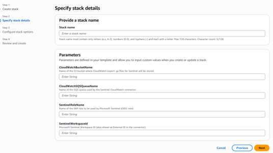
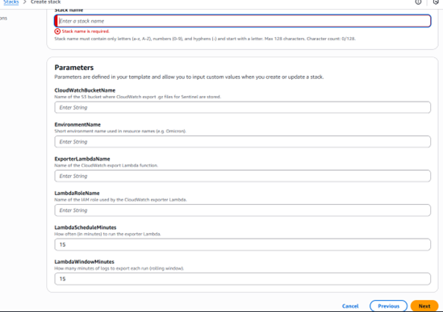
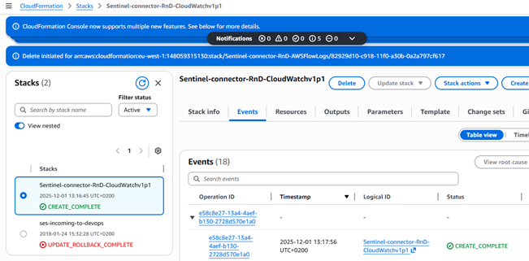
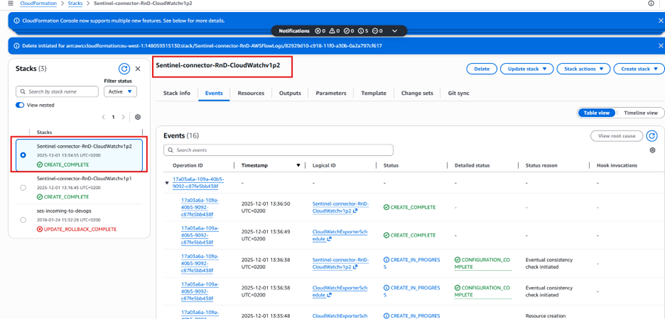

### 1. Microsoft Sentinel configuration

1. Sign in to the **Azure portal**.
2. Navigate to **Microsoft Sentinel** and then to **Content Hub**.
3. Install the connector **Amazon Web Services S3**.

4. Navigate to **Data connectors** and open the **Amazon Web Services S3** connector page.

---

### 2. Create the CloudFormation stack

1. Sign in to the **AWS Management Console**.
2. In the search bar, search for **CloudFormation** and open the **CloudFormation** service.

3. Select **Create stack** → **With new resources (standard)**.

---

#### 2.1 Step 1 – Specify template

1. Under **Prepare template**, select **Choose an existing template**.
2. Under **Template source**, select **Upload a template file**, then choose and upload the provided template file.
3. Click **Next**.

---

#### 2.2 Step 2 – Specify stack details

##### 2.2.1 Template 2

Fill in the following parameters:

- **Stack name**: Enter a name for the stack.  
- **SentinelRoleName**: Enter the IAM role name (the name must start with `OIDC_XXXXX`).  
- **CloudWatchBucketName**: Enter the name of the S3 bucket to be used.  
  - If you already have a generic S3 bucket or wish to use another existing bucket, enter its name here.  
- **CloudWatchSQSQueueName**: Enter the name of the Amazon SQS queue.  
- **SentinelWorkspaceId**: Enter the **Workspace ID** from the Azure Log Analytics workspace page:  
  - In the Azure portal, go to **Log Analytics workspace → Overview** and copy the **Workspace ID**.

After filling all required fields, click **Next**.

##### 2.2.2 Template 3

Fill in the following parameters:

- **Stack name**: Enter a name for the stack.  
- **EnvironmentName**: Enter the environment name used in resource names.  
- **LambdaRoleName**: Enter the name of the IAM role used by the CloudWatch exporter Lambda.  
- **ExporterLambdaName**: Enter the name of the CloudWatch export Lambda function.  
- **LamdaScheduleMinutes**: How often (in minutes) to run the exporter Lambda (leave the default **15** minutes).  
- **LambdaWindowMinutes**: How many minutes of logs to export each run (rolling window) (leave the default **15** minutes).

---

#### 2.3 Step 3 – Configure stack options

1. Leave the default options unchanged.
2. Acknowledge that AWS CloudFormation might create IAM resources with custom names by selecting the required checkbox.

3. Click **Next**.

---

#### 2.4 Step 4 – Review

1. Review all settings and confirm that all required fields are correctly populated.

2. Click **Submit** to create the stack.

Monitor the stack creation:

1. In **CloudFormation → Stacks → Events**, monitor the progress status.

2. When the status indicates completion, verify in the left panel that the stack has been successfully created.

