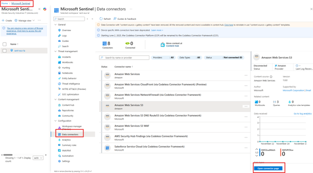
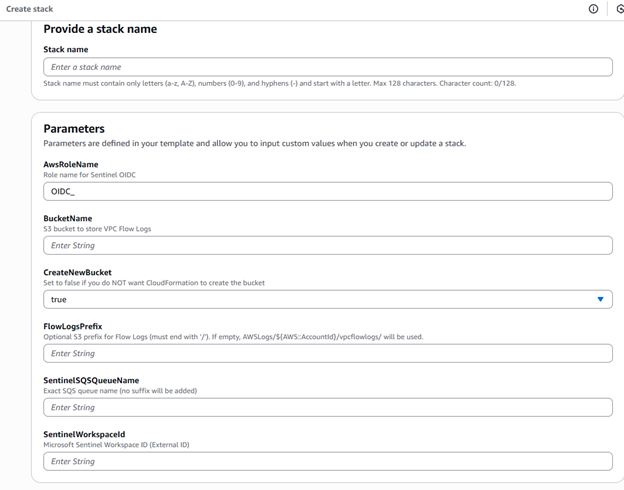
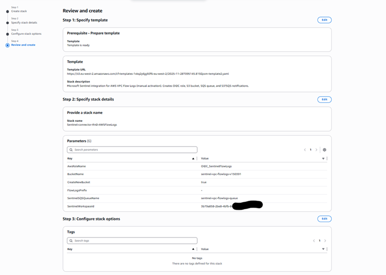
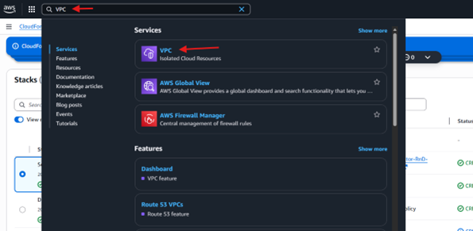
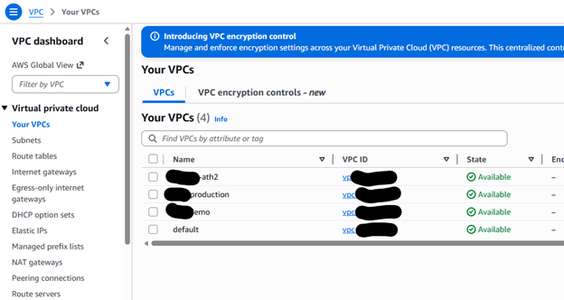
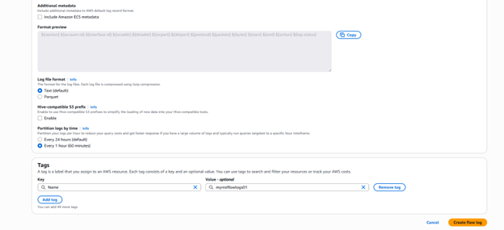

### 1. Create the CloudFormation stack

1. Sign in to the **AWS Management Console**.
2. In the search bar, search for **CloudFormation** and open the **CloudFormation** service.

3. Select **Create stack** → **With new resources (standard)**.

---

#### 1.1 Step 1 – Specify template

1. Under **Prepare template**, select **Choose an existing template**.
2. Under **Template source**, select **Upload a template file**, then choose and upload the provided template file.
3. Click **Next**.

---

#### 1.2 Step 2 – Specify stack details

Fill in the following parameters:

- **Stack name**: Enter a name for the stack.  
- **AWSRoleName**: Enter the IAM role name (the name must start with `OIDC_XXXXX`).  
- **BucketName**: Enter the name of the S3 bucket to be used.  
  - If you already have a generic S3 bucket or wish to use another existing bucket, enter its name here.  
- **CreateNewBucket**: Set to `false` if you are using an existing S3 bucket (leave as `true` if a new bucket should be created).  
- **FlowLogsPrefix (Optional)**: Optionally specify an S3 prefix for Flow Logs (must end with `/`).  
  - If left empty, the default `AWSLogs/${AWS::AccountId}/vpcflowlogs/` will be used.  
- **SentinelSQSQueueName**: Enter the name of the Amazon SQS queue.  
- **SentinelWorkspaceId**: Enter the **External ID** from the Azure connector page:  
  - In the Azure portal, go to **Microsoft Sentinel → Data connectors → open the relevant connector → expand _Setup with PowerShell script_** and copy the **External ID**.

  

After filling all required fields, click **Next**.

---

#### 1.3 Step 3 – Configure stack options

1. Leave the default options unchanged.
2. Acknowledge that AWS CloudFormation might create IAM resources with custom names by selecting the required checkbox.

3. Click **Next**.

---

#### 1.4 Step 4 – Review

1. Review all settings and confirm that all required fields are correctly populated.

  

2. Click **Submit** to create the stack.

Monitor the stack creation:

1. In **CloudFormation → Stacks → Events**, monitor the progress status.

2. When the status indicates completion, verify in the left panel that the stack has been successfully created.

---

### 2. Create VPC Flow Logs

1. In the AWS Management Console, search for and open the **VPC (Virtual Private Cloud)** service.

2. In the left pane, select **Your VPCs**.

3. Select the VPC for which you want to enable Flow Logs and open its details.

4. Navigate to the **Flow logs** tab.

5. Click **Create flow log**.

6. Under **Flow log settings**, configure the following:

   - **Name**: Enter a name for the flow log.  
   - **Filter**: Select one of the following (recommended: **All**):  
     - All  
     - Accept  
     - Reject  
   - **Maximum aggregation interval**: Choose **1 minute** or **10 minutes** (recommended: **1 minute**).  
   - **Destination**: Select **Send to an Amazon S3 bucket**.  
   - **S3 bucket ARN**: Enter the ARN of the S3 bucket created or specified in the previous steps.  
     - To find it: open the **S3** service → select the bucket → **Properties** tab → copy the **ARN**.

   - **Partition logs by time**: Choose **Every 1 hour** or **Every 24 hours** (recommended: **Every 1 hour**).  
   - Leave all other settings at their default values.

  

7. Click **Create flow log**.
